# 赫敏为什么不能嫁给哈利

<h3 align="right">——《哈利波特》中的历史、文化与政治</h2>

原文转载自[人人网](http://blog.renren.com/share/100084742/13872331029)，作者为天津外国语大学的翟文喆老师。

### 1\. 哈利的专业

大家都看过哈利波特，小哈利是学什么专业的呢？

霍格沃茨是所魔法学校，当然是学“魔法”的。问题是，现实生活中“魔法”到底是什么呢？

众所周知，霍格沃茨包括四大学院，哈利三人组所在的学院叫做“格莱芬多”，那么什么是格莱芬多呢？

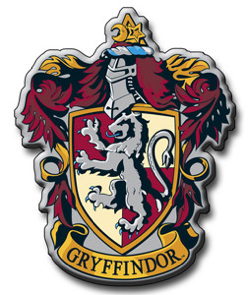

影片里，每个魔法学院的学生，着装上都有自己学院的徽标，格莱芬多学院的学生，衣服上，帽子上都有一个“格莱芬多”，这个词的词根是gryffin，音译为“格里芬”，格里芬是中世纪传说中的神兽，具体形象是一只长翅膀的狮子，因此在很多中世纪文学和游戏中，也翻译成“狮鹫兽”。

大家能从下面的图片中找到格里芬吗？

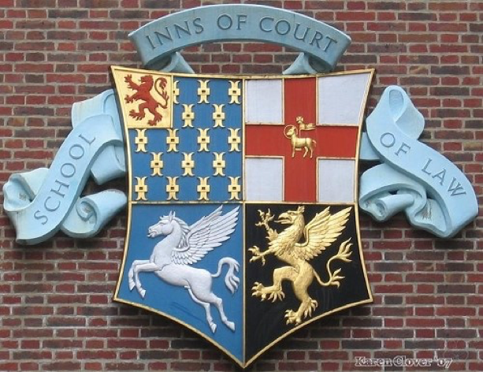

如果你在右下角找到的话，还应该顺便看看上面的几个字：inns of court / school of law，可以简单的翻译成“律师学院”。

凡是英国人都能看懂，霍格沃茨的四个“学院”，原型就是英国法律界著名的“四大律师学院”：林肯、格雷、内殿、中殿律师学院。每个学院都有自己的徽标，如上图所示。其中格雷律师学院的徽标，正是一只“格里芬”。

**没错，哈利波特是学法学的。**

这里的“学院”，英文为inn，其实翻译成“行会”更准确，这四个学院成立的时间都很早，最晚的格雷律师学院也在1569年成立了。因此传统上，这四个学院都是师徒制的，就像以前京剧的“科班”，老师和学生吃住都在一起，共同学习，共同生活，每个学生必须经过若干次“聚餐”才能毕业。这个餐会的场景在电影里也出现了很多次：

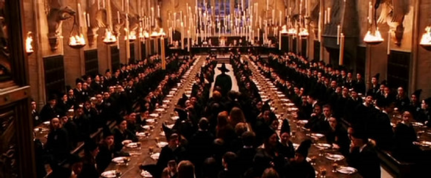

影片中很多情节都发生在这个大厅，而中国观众印象最深刻的可能是大厅餐桌上的美食。

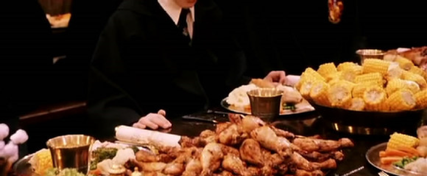

其实律师学院的学生聚餐，是律师学院教学的一部分，**法学不是简单的法律条文，更重要的是人的交流，**也就是霍尔姆斯所谓**“法律的生命不是逻辑，而是经验”**，这种聚餐就是法学院内部交流的一个重要的途径。

片中哈利选了很多课，也是有原型的，比如据说是遭受诅咒的、每集中老师都要出些意外的“黑魔法防御”课，对应什么法学课呢？

这是第四部“火焰杯”中的穆迪教授第一堂课的场景，穆迪是个前“傲罗”，大家很容易看出来“傲罗”的原型是警察，假眼、假腿，证明他是个经验丰富的老警察。什么课由要由老警察（甚至有点“老警痞”）来上呢？

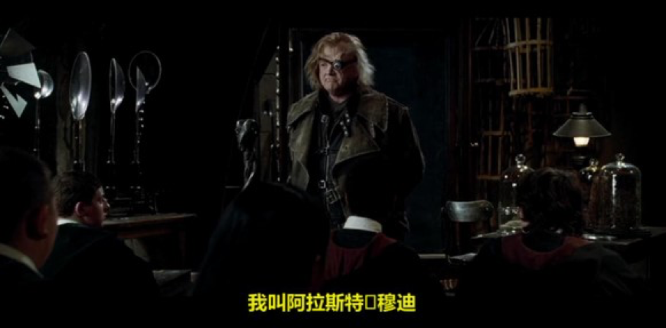

**当然是刑事诉讼法**（不是诅咒刑诉老师）。

片中所谓的“黑魔法”，现实中对应的概念是“犯罪”，也就是刑法学研究的对象。比如穆迪教授一上来就给学生直接讲解的“三种不可饶恕咒”：迷魂咒，钻心咒，阿瓦达死咒，这明显是三种严重犯罪：绑架、酷刑、杀人。称之为“不可饶恕”，有点类似中国古代的“十恶”，或者现代刑法中的“八项重罪”，属于加重打击的范围。课程名叫做“黑魔法防御”，就是“对付犯罪的方法”，自然也就是刑诉（包括刑法）了。

大家可以重新看看穆迪的第一堂课，里面有很丰富的信息。穆迪性格耿直但有些简单，前警察的经历，使得他很清楚学好刑刑法的关键，是要对犯罪有清楚的认识，而这并不是一件好玩的事。学好刑法/刑诉本来就是很残酷的，因为你要天天近距离接触各种暴行。但是，**法学（刑诉）本来就是一门实践性很强的课程，好老师必须带领学生突破这一心理关口，否则就是在专业上糊弄人。**对照一下，第五部凤凰社中，粉红色的乌姆里奇教授的第一堂课，只会念标准教科书和准备“普等巫测”考试（不知道是否借鉴了中国的司法考试），作者认为谁是好老师是很明显的。

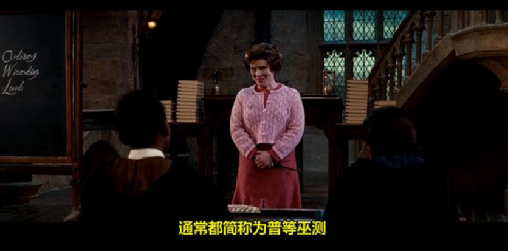

只是这种直接展示犯罪的做法，对年纪还小的学生们来说，确实有点心理压力。（大家不妨设想，现实中刑法老师上课讲到强奸罪、杀人罪，给出一系列照片和技术细节，你会是什么感觉。不过话又说回来了，现在本科生学的刑法，其实都能算不入门，只是游泳池岸上学游泳罢了。）而第一个受不了的，就是赫敏小姐，虽然她又是第一个抢答对了提问。片中隐藏了很多赫敏不配哈利的细节，这是其中一个。

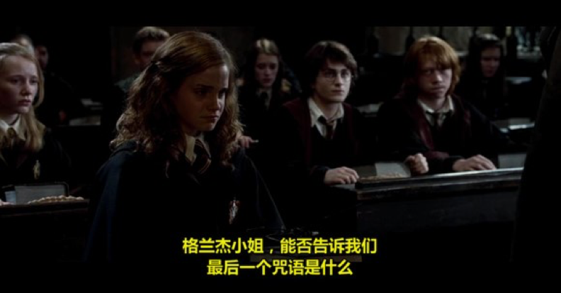

哈利是学法学的，和他的婚姻状况有什么关系呢？因为在英美国家，法学这个“专业”可不一般。

下面这些人大家应该认得，他们有一个共同的专业：

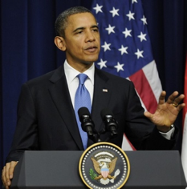

奥巴马

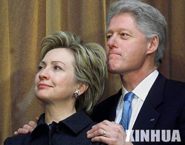

两个克林顿

萨科奇

布莱尔

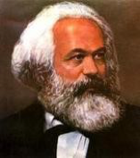

马克思

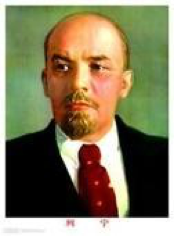

列宁

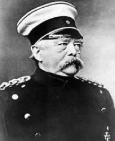

俾斯麦

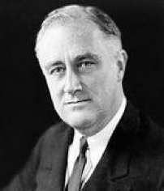

罗斯福

比尔盖茨

没错做后一张是比尔盖茨，他不是传说中的计算机本科，而是法学预科，他父亲是律师，让他去哈佛是为了学习法律，盖茨有计算机才能（这在文理不分科的西方教育体系中很正常），预科没有上完就退学搞电脑去了。盖茨经常自称“程序员”，也会写程序，但他成为世界首富的关键，应该还是靠他的经营头脑。因此成名之后的盖茨，哈佛给了一个名誉法学博士学位。

在西方的学术体系中，法学不是一个和其他职业并列的“专业”，简单的说，法学是帝王之术，是培养领导人（政治的、经济的、文化的）的专业。

连他都是法学博士：

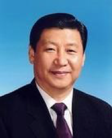

新华网公布的简历，他的学历是“清华大学人文社会学院马克思主义理论与思想政治教育专业”，学位却是“法学博士”。之所以授予法学学位，就是因为在中国的学科分类中，政治学、社会学、民族学都授予法学博士（所谓的“大法学”），这其实是中国从西方继受过来的学科分类而已。只是中国传统上，觉得法学只是打官司和对付犯罪的事情，因此有些不理解罢了。

看来，哈利学了这么一个专业，不是一般的人物。他是统治阶级的一员，他的婚姻必须精挑细选。统治阶级有统治阶级的婚姻标准，因为这决定了下一代小哈利的培养方向。

### 2\. 哈利的民族成份

（翟按：本贴原是和课间几个同学闲聊的话题，放暑假后深夜无事，在线写了一两千字，写到凌晨三点困了，随手就发了出去，没想到会招来这么多围观者。**抱歉各位哈利波特爱好者，本帖是讲英国的历史文化和政治的，哈利波特只是个素材，全文很长，而且不保证能够写完。**）

中国人差不多是对世界上“民族差异”最不敏感的人群了，因为汉族是世界上规模最大的同一文化人群，人口有10亿之多。改革开放之前，大多数中国人一辈子都没有接触过真正意义上的其他民族的人，因此也很不习惯从民族成份方面考虑问题。不过，在国土狭小、民族众多、宗教语言错综复杂的欧美国家来说，“民族成分”是一个很重要的历史、文化问题，也是个很现实的政治问题，当然也是哈利和赫敏婚姻关系的一个很基础的问题。《哈利波特》中有很多不同民族和文化的元素，这里整理一下，尤其是搞清几位主角的民族成份很重要，直接关系到哈利的法学专业的属性，当然也是赫敏婚姻问题的前提。

最基本的问题，哈利、赫敏、金妮、马尔福，都是哪个民族的？

最基本的回答，他们都是英国人。

不过这样等于没说，英国是个多民族国家，他们具体是什么民族呢？

看图，这是哈5的一张海报，里面的人都是什么民族的：

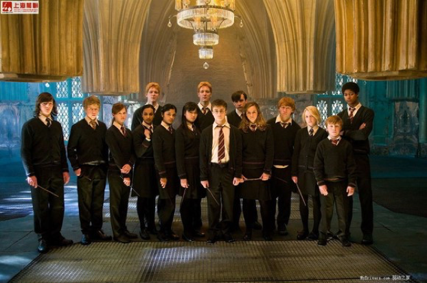

中国观众一般能分辨出黑头发黄皮肤的张秋是中国人，棕色皮肤的佩蒂尔姐妹是印度人，最右边有个没有台词的黑人迪安，剩下的，看着都是白人。

问题是，白人和白人是不一样的。再看的仔细些，尤其是头发（欧美人分辨民族，先看肤色分辨种族，接着就看头发分辨民族）。

发张详细点的图，四个卫斯理：

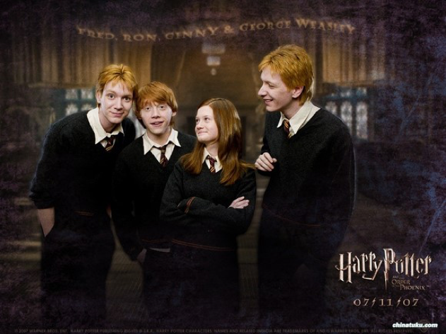

他们的头发是一个颜色的，因为他们是一家人。

三个马尔福：

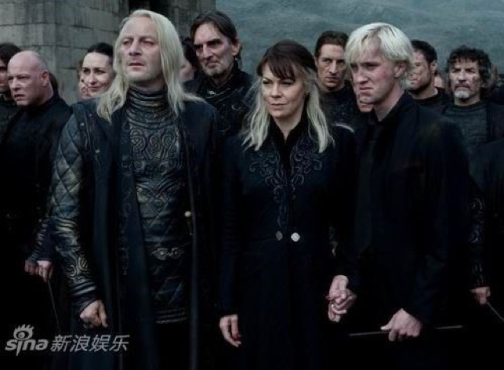

他们头发也是一个颜色的（至少父子两个马尔福是一样的），因为他们也是一家人。

但是，对比一下，两个家庭的头发是不一样的。卫斯理家的人是红头发，马尔福家的人是“铂金色头发”，也就是金色浅到了接近白色的头发。

这就是片子中马尔福和卫斯理从一开始就对着干的原因，**因为他们不是一个民族的**，他们的祖先从很久以前就开始对着干了。

很容易从网上查到，英国的主体民族的正式称呼是“盎格鲁-撒克逊族”，但这仅限于英格兰地区，“大不列颠及北爱尔兰联合王国”还包括苏格兰、爱尔兰和威尔士三个地区，这三个地区人的民族，现在称之为“苏格兰族”、“爱尔兰族”、“威尔士族”，不过这三个民族的祖先在古代还有一个共同的称呼：“凯尔特人”。

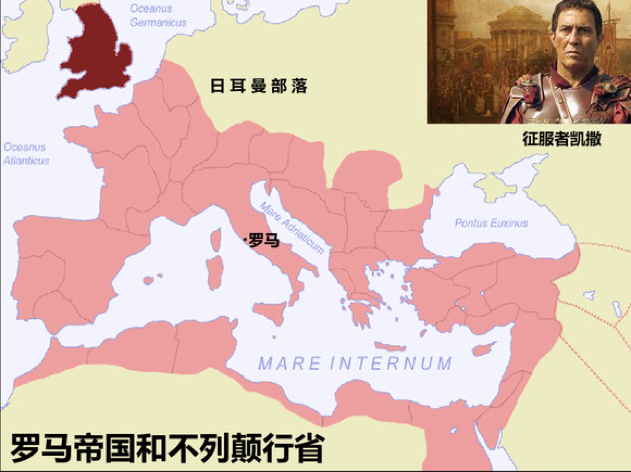

英国历史是从罗马帝国开始的，汉宣帝五凤四年，罗马将军凯撒渡海进入不列颠岛，这个岛屿才开始与罗马文明接触，从此英国人有了自己文明史。凯撒在不列颠遇到一些当地的土著人，这些部落的来源不明（后来有专家考证，可能是更早从欧洲中部某个中纬度地区迁移过来的），是否是一个民族也不一定。不过黑头发的罗马人没有功夫理会更多的细节，罗马人按照他们的自我称谓的拉丁音译，管他们叫做：“Celtae凯尔特人”，在罗马人看来，凯尔特人最典型的体貌特征，就是他们标志性的红头发。

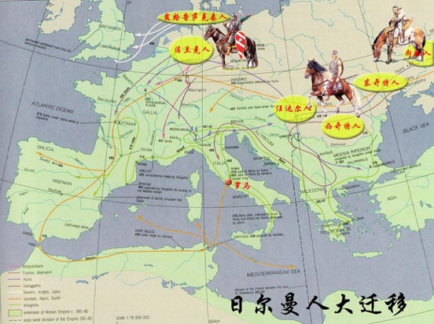

罗马帝国晚期国运衰落，老家大致在现在德国境内的“日耳曼人”冲入罗马帝国境内，解体了罗马帝国，建立了一系列日耳曼族的小国家，也奠定了今天的西欧各国的主体民族的大致血统，史称“日耳曼人大迁移”。具体到英国的“盎格鲁撒克逊族”，就是这场大迁移的结果。

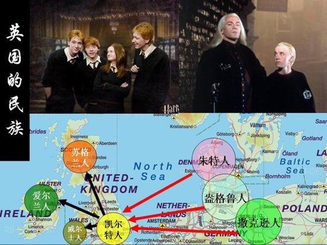

“日尔曼German”现在已经成了德国的代名词，其实这个名字也是罗马人给他们起的，当时日耳曼人还在部落状态，他们自己并不知道自己叫做“日耳曼人”，而是用自己部落的名字自称。日耳曼人中有三个来自丹麦附近的部落：分别是撒克逊（Saxons）人、盎格鲁（Angles）人和朱特（Jutes）人，一起渡海迁移到了不列颠岛。人数最多的盎格鲁人把这片土地命名为“盎格鲁人的土地”Angland，中古英语A相当于今天英语的E，就成了英格兰England。而撒克逊人留在德国的部分同族，命名了现在德国北部的“萨克森州Sachsen”；朱特人，也把名字写在了丹麦最大的半岛——“朱特兰”Jütland上，只是我们一般翻译为“日德兰半岛”。

日耳曼人三部落渡海来到不列颠之后，互相联合称为“盎格鲁撒克逊人”（朱特人很少），以便团结起来征服当地人，而当地的罗马人本来就不多，因此主要的征服战争，就落在了原住民凯尔特人的头上。大部分凯尔特人被杀或者变成奴隶，少数幸存者，只好躲到更西更北的荒凉地区，北部高地的凯尔特人成了苏格兰人的祖先，西部山区的凯尔特人成了威尔士人的祖先，西北爱尔兰岛的凯尔特人则成了爱尔兰人的祖先。后来开发北美的殖民运动中，波士顿地区聚集了大量的爱尔兰移民，他们的球队“波士顿凯尔特人队”，是现在“凯尔特”这个词曝光率最高的地方。

简单的说，现代英国人有两大族源：日耳曼人和凯尔特人，**前者是征服者，后者是被征服者**。两个族群的差别是可以从体貌特征上看出来的。凯尔特人是红头发，三个日耳曼部落的老家都在波罗的海附近，这个地区的纬度已经很高了，日照稀少，大家知道，纬度越高的民族头发颜色就越浅，瞳孔颜色越蓝，也就是我们平常说的“金发碧眼”，因此，盎格鲁撒克逊人的典型特征，就是头发是金黄色的，或者说头发颜色越浅的，就越是“纯种的”盎格鲁撒克逊人。

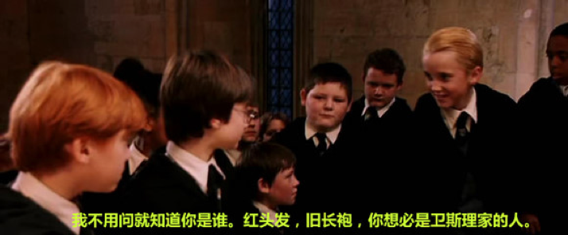

现在回到第一部的开场亮相，这场戏其实挺重要的。马尔福和卫斯理一上来就剑拔弩张，听到对方的家姓就互相瞧不起，就是民族因素在起作用。作为胜利者的后代、“纯种贵族”的德拉科向来以自己的血统和浅色头发自豪，而鄙视罗恩的民族属性，因此张口第一句话就是重提卫斯理家的“红头发”。英国观众都能看明白，马尔福肯定是“纯而又纯的盎格鲁撒克逊族”，这个罗恩虽然没有明确是那个民族，但肯定是凯尔特族系之一，按照现在英国的人口比例，苏格兰人的机会最大。（为了方便起见，下文提到罗恩家的民族成份，都按苏格兰人处理。）

夹在中间的哈利呢？哈利是黑头发，为什么马尔福不歧视黑头发的人呢？刚才说过，英国最早的文明史开始于罗马帝国，虽然今天正宗的罗马血统的英国人已经没有了，但欧洲各国都已罗马文明为自豪，就像战国中的齐楚燕秦吴越各国都以“周礼”为尊、以自已有姬周血统（至少是母系）为荣一样。哈利的黑头发，是他血统高贵的象征，他拥有和凯撒一样颜色的头发！

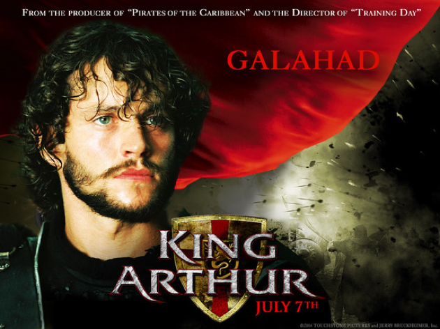

这个剧照是英国传说中的民族英雄：亚瑟王（king author），英国的通俗文学中，很多英雄都有亚瑟王的影子。此人生平没有明确的记载，大致生活在盎格鲁撒克逊入侵时期，是反抗入侵者的不列颠人的领袖，但是传说中他有罗马贵族的血统，因此也是一头黑发。作为日耳曼人征服者后裔的铂金色头发的马尔福，瞧不起红头发的凯尔特人后裔罗恩是正常的，但在亚瑟王后裔黑头发的哈利面前，就不能再炫耀自己的高贵血统了。（按：海报上的人物其实是圆桌骑士之一Galahad，不过电影中亚瑟王的头发确实是黑的。）

哈利波特全剧中，世界各大主要民族的元素都有体现，不妨盘点一下：

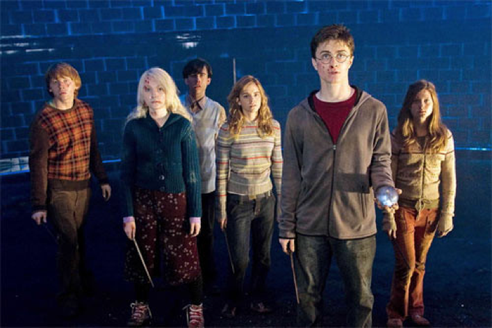

“邓布利多军团”主要成员里，除了哈利和两个卫斯理，还有一个铂金色头发的，一个黑头发的（赫敏的头发问题暂时放在后面讨论）。

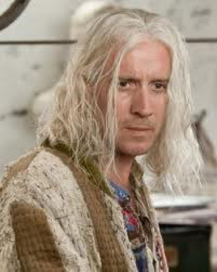

卢娜父女

卢娜的人气在中国观众中很高（至少高于张秋），主要是卢娜有一股超凡脱俗的、不食人间烟火的气质，配上一头和马尔福差不多颜色的铂金色头发，显然，她也是纯度较高的日耳曼族系。一般认为，卢娜的文化原型与北欧文化中“精灵Elf”有关。Elf的传说很多，比如暗夜精灵（Dark elf）、树精灵（Wood elf），常和月夜、树林、女性有联系。卢娜Luna这个词是拉丁文月亮的意思，她相信直觉，常有惊人准确的预断，也是北欧原始日耳曼文化的特点。北欧是日耳曼人的最老的老家，纬度最高，因此卢娜父女俩也是一头铂金色长发。不过条件太高的女性不太好嫁，卢娜有点像红楼梦里面的妙玉，和宝玉深夜谈禅可以，结婚就不太合适了。

顺便说一句，德国-北欧是一个文化圈，都属于比较原始的也可以说比较纯粹的日耳曼文化，有很多北欧传说，是基督教文化圈其他区域尤其是法国等拉丁国家没有的。英国人对日耳曼老家的民族的态度一直比较纠结，血缘上比较亲近，但利益上又有明显的冲突（打了两次大战）。好像自己的失散多年的亲兄弟，但现实中又可能和自己争夺家产。因此哈利波特全剧中日耳曼文化圈的形象代表，由卢娜和马尔福两个家族分别出演，各自代表一个侧面。两个家族的共同点，就是他们都比较“纯血”（卢娜也是纯血巫师）。

一头黑发的纳威的文化类型不太典型，不过如果非要找的话，他是个“学者”Scholar。需要注意的是欧洲文化中“Scholar”的地位并不如中国的高，只是对某种自然现象特别有偏好的人，常年住在郊外的塔楼里（现在的欧洲大学往往也在不起眼的小镇，所谓的大学城），摆弄些别人看不懂的东西。欧洲文化中最典型的学者当然是柏拉图、亚里士多德那一群希腊老头子了，他们都是黑发。纳威擅长草药学，平常说话有些结结巴巴的，最后留校当了教授。（纳威开始并不勇敢，哈7里霍格沃茨之战中纳威手斩大蛇，意思是连老学究都会拼命，大决战到了最后关头。）顺便插一句，欧洲学者有保持单身的小传统，柏拉图、牛顿、康德和诺贝尔都没有结婚。纳威和卢娜在保持单身的方面是有些共同点的，不过他们两个结婚的可能性很小，约等于定逸师太嫁给方证大师的几率。

**（头发的问题到此为止，《哈利波特》中，只有卫斯理、马尔福、卢娜、哈利、赫敏的头发和剧情有关，选演员的时候比较精确，其他演员的头发颜色并不是很严格，比如哈利的父、母、姨妈、姨夫、表兄的演员，他们的头发颜色就有问题。我们是盘点英国文化，不是讨论《哈利波特》剧情，谢绝各种头发的讨论。）**

再盘点一下哈利波特中的各国文化元素：

**法国元素：芙蓉•德拉库尔和布斯巴顿魔法学校**

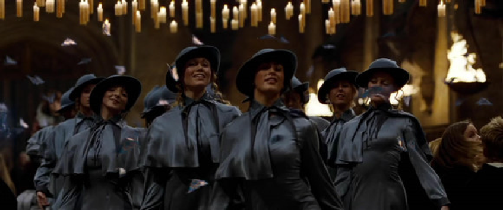

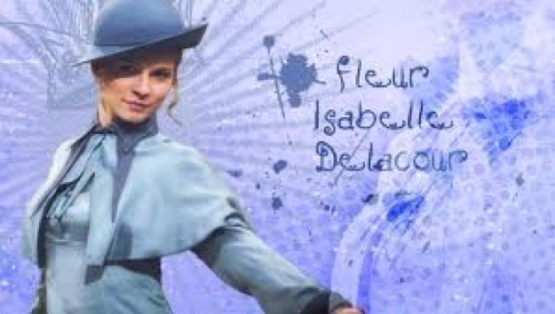

这个学校明显是法国的。英法文化互相渗透很深，很多地方不需要特别标记，光看芙蓉·伊莎贝尔·德拉库尔Fleur Isabelle Delacour这个典型法国姓名足矣。Delacour其实是De la cour其中“德”De是法国贵族姓名的标记，本意相当于英语的of，“拉”la相当于the，后面的“姓”其实是贵族的封地的地名，这个名字意思是“库尔领地的伊莎贝尔夫人的女儿芙蓉小姐”，就像孟德斯鸠的正式姓名“查理·路易·德·色共达”，意思是“色共达领地的路易老爷的儿子查理”。这种复杂的命名方式只在法国拉丁系文化中使用，是法国贵族文化的一部分。（cour本意是庭院，fleur本意是花朵，芙蓉的名字也可以翻译为“庭院之花”，不过采用法国贵族式的写法，是暗示法国元素，否则用英式写法Cour Fleur就可以了。）

（布斯巴顿魔法学校的校徽，精巧细致，其中的花纹叫“金百合”，是法国王室的标记。）

英国人对法国人，也有一个种非常复杂的感情，差不多是从小为抢一块糖经常打架的表兄弟之间的感情。在英国人的文化观念中，法国代表的拉丁文化纤细、精致、优美，一如布斯巴顿魔法学院的姑娘们的服饰和她们的校徽，因此安排芙蓉嫁给比尔，是可以接受的。当然，英法两国从百年战争开始打了几百年杖，总还有些瞧不起，芙蓉嫁入苏格兰族的卫斯理家还是可以的（顺便也抒发一下鄙视法国的心情，法国美女也只能嫁英国的二等族裔）。更高贵的门第，还是要留给自己人的。

**俄罗斯元素：克鲁姆和德姆斯特朗魔法学院**

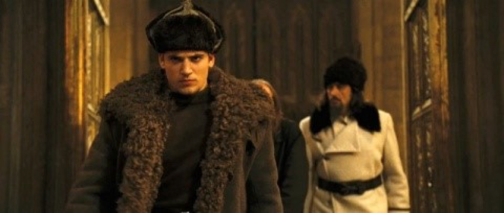

这个也很明显，只有俄罗斯这个冰天雪地里的民族才会穿成这样。如果你仔细看，德姆斯特朗学院驶往霍格沃茨的船的帆上，还有俄罗斯国徽的图案。

哈4开场的魁地奇世界杯中清楚的表明，克鲁姆是“保加利亚队”的选手，为什么又是俄罗斯？因为欧洲文化圈中，保加利亚其实就是小号的俄罗斯，他们的关系就像今天的汉族和满族一样，一般不用分太细的。保加利亚人和俄罗斯人不仅都是斯拉夫族，而且还是不分你我关系非常要好的斯拉夫族。“保加利亚”这个词来自东欧的第一长河：保加尔河，俄语中把“保加尔”读做“伏尔加”而已。在英国人看来，克鲁姆这个“伏尔加国”的选手，其文化原型是明显的。

（罗琳阿姨为了避免麻烦，对片中的大多数文化符号都做了一些似是而非的小改动，以免读者对号入座，影响票房收入，不过改动以不不影响文化含义为限，稍做解析就能看出来。）

**中国元素和印度元素：张秋、佩蒂尔姐妹。**

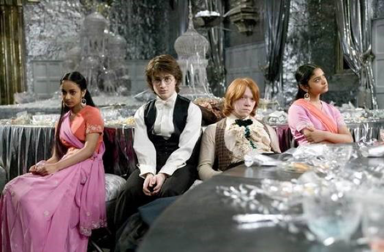

判定这三个女生的民族属性不是问题，“张秋是不是配哈利”这个话题，也已经被国内的哈迷讨论了一万遍。这里不讨论爱情，只是从英国人的文化观念来分析一下。英国人的主流观念里，对中国、俄罗斯这样的能够构成对手级别的民族或者文化还是有一定地位的。哈4中的舞会，首先进场的4对舞伴，英美4个，中法俄印各1个，简直是联合国五常加一个发展中国家代表嘛。

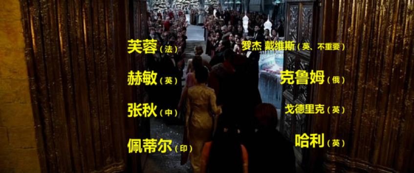

细分下来，根据不同的民文化实力，英美文化给予这些外国形象的地位还是有微妙差别的。比如印度文化的代表佩尔蒂，剧情给她的评价就比代表中国人的张秋低得多。剧情中，佩尔蒂参加舞会，是因为情节需要抬高赫敏，压低哈利和罗恩，因此需要个倒霉的女孩垫在下面。这个倒霉女孩之所以选择印度而非中国，是因为英国人统治印度过百年，在心理上占有巨大优势，看印度人总是像在看家仆。因此在片中佩尔蒂姐妹的举止略显轻佻，礼貌奇多至于惶恐，缺乏女生应有的矜持。

对张秋则不然，有求必应室中哈利和张秋的初吻，是很多欧美观众心中的浪漫的东方情调。

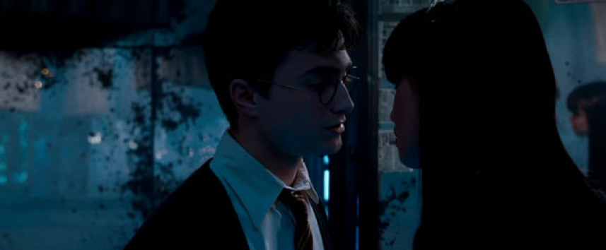

不过尊重归尊重，英美文化对中国人也谈不上多么崇敬，英美还是对自己的文明很自豪的，所以一定要在文艺作品中表现出中国人的缺点，以维持自己的心理优势。一般认为，英美人认为中国文化最大的缺点，是中国人懦弱和缺乏勇气。英美的主流文化是征服者的文化，**崇拜强者，遵守规则，最瞧不起叛徒。**孙子兵法这样的东西，他们可以读读但很难真正接受。因此片中张秋被乌姆里奇拷打而叛变了邓布利多军之后（作为对照，哈利也经受了刑罚，但挺过来了），她和哈利的关系也就结束了。

**更边缘的，犹太人元素：古灵阁的妖精**

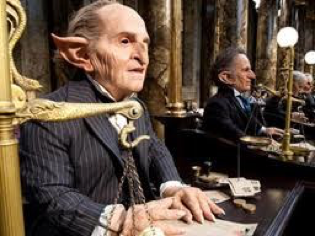

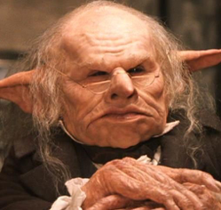

古灵阁的原型很明显是银行，尤其是瑞士的银行，而犹太人擅长经营金融业是世人皆知的。从体貌特征上讲，犹太人最大的特点就是一个大鼻子。比如下面两个有代表性的犹太人，演员伍迪艾伦和基辛格，注意鼻子。

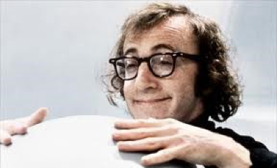

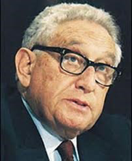

英美主流文化中对犹太人的评价并不高，普遍认为他们唯利是图，为了一块银币出卖良心。所以哈7中，妖精拉环又出卖了哈利一次。欧洲反犹传统，并不是说说而已，在儿童剧中都有渗透。

**黑人元素：片中只出现过两个黑人**

一个是哈利的同宿舍成员，本文第一张照片中的黑人，迪安·托马斯Dean Thomas。

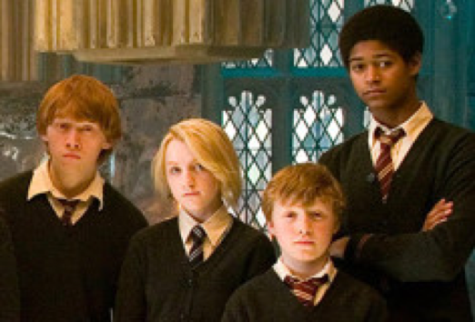

另一个是魔法部的官员金斯莱·沙克尔Kingsley Shacklebolt

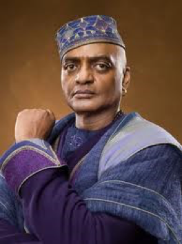

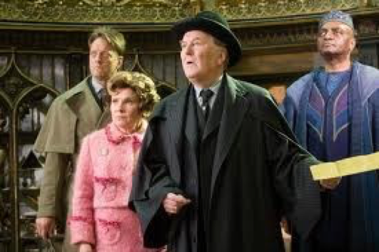

还有个哈6中无姓名的酒馆女招待：

在英国主流观念看来，黑人谈不上有什么独立文化，基于人种的差异，不好同化到欧美文明里，但是出场也没什么好表现的，只好安排个跑龙套的角色罢了。要不是照顾美国观众中有不少黑人，可能这个龙套都给不了。

**下图是哈剧中各种文化的地图：**

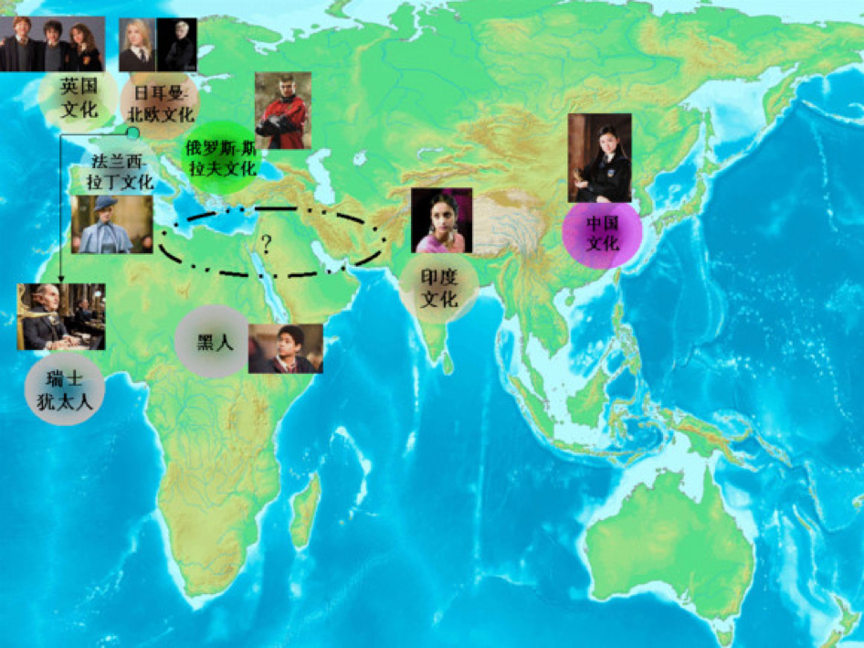

应该说作为目前世界的领先的文明，英美国家的主流观念里，对外国文化的态度持有相当开放的态度，和盛唐时期中国人对外族人的看法是类似，宽容外族，本质上是给英美文明增光添彩，就像人大开会的时候总能见到各种民族盛装一样。不过这种宽容是有限度的，所谓“外宽内忌”，就是不以威胁英美的主体地位为限。

地图上有一个非常重要的区域、一个大的文化体系没有出现。下图是这个民族元素唯一一次出现，只是张照片。

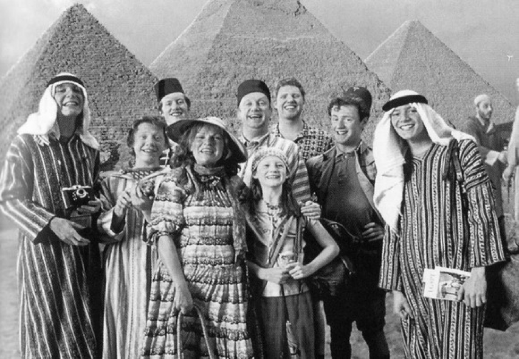

英美国家潜意识里世界各个文明的分量，对谁看得重些，对谁看得轻些，谁是对手，谁是朋友，谁是家奴，谁可以结婚，谁只能恋爱，是很有分寸的，细节可以随意，大原则决不能违反。英、法、德、俄四大文明都出自基督教文明，和这个文明从中世纪斗到“911”，在影片中作为正面形象出现，是要触犯英美观众心理底线的。如果非要出现一点点色彩，只能展示他们的古代文明时段，因为埃及和金字塔也算是基督教文明源头的一部分。但是这个民族有了自己的独特的信仰之后的那些元素，就不能在影片中出现了。

其实也不能这个文明说没有出现，只是这种出现的方式非常微妙。尽管作为儿童文学作品，罗琳阿姨为了避免麻烦，已经尽了最大可能消除“那个人”的文化因素，但是“那个人”的文化原型又能是谁呢？如果从“那个宗教”的角度分析，其实也可以写很多的，不过这个问题比较敏感，咱们中国人也犯不着去趟这趟浑水，这里就不多说了。

**言归正传，继续讨论哈利和赫敏的婚姻问题。**赫敏的头发问题刚才放到一边，现在我们再好好看看赫敏：

一头褐色的头发，不同于马尔福的铂金色、哈利的黑色和罗恩的红色，有什么意义呢？为什么罗琳阿姨不能安排赫敏嫁给哈利，却最后嫁给了罗恩？

翟按：网络交流还是有些益处的，前文有几个技术性错误，谢谢各位指正，最终定稿会改正的。另外，我没看过原著，而且只看过电影没看过原著的读者较多，只看过原著没有看过电影的寥寥无几，下面的讨论均以电影为准。以原著为资料和我讨论的，恕不回复。抱歉我不是哈密瓜，是来切哈密瓜的。

翟又按：**再说一遍，本帖原来是我和几个高年级的法学专业的学生私下里交流用的，内容是关于英国的历史文化和政治**，我没有义务也不可能考虑太多读者的情况。只是人人分享功能太强大，现在来了这么多围观的，我只能说大家愿意来捧场欢迎，看不下去想走也欢送。不过楼主提醒各位哈利波特爱好者，尤其是喜欢赫敏的人，继续阅读有一定风险，本文的题目叫做“赫敏为什么不能嫁给哈利”，论证当然是要分析赫敏的各种缺点，随着论证的深入，越往下文毁赫敏越深，不仅要毁掉你们的童年美好的记忆，也要毁掉很多你们习以为常的观念，必须先做提醒。

昨天晚上发了条状态进行随机投票，两个选项：温柔的毁赫敏还是粗暴的毁赫敏，结果是17:3选择温柔的毁赫敏，看到如此高人气的投票结果，我第一反应就是不准备再写下去了，给大多数哈密瓜保留一点美好的童年不好吗？犹豫了半天，最后决定暂时还是不要停笔的好，因为毕竟还是给一些平时网下无法接触的同学人传播了些知识。而且，大家的胃口已经吊起来了，不继续更新下去，只怕我这个小宅院要有些日子不得安宁。只是一定要提醒大家，本帖后面的内容具有较强的摧毁力，越往后越是如此，各位非法学专业的哈密瓜们，请慎重。

对法学专业的同学来说（是不是我的学生倒无所谓，不过最好年级高一点），不反对你们继续看下去的。不管你个人感情如何，毁掉赫敏有助于你们的专业进步（当然只是我个人的看法，待喷）。因为法学是统治之术，是西方学术的制高点，就像《哈利波特》中的火焰杯，代表最高荣誉，但是拿到火焰杯的过程却充满了危险和挑战，前面的深水区里漩涡密布，很容易让你们受到伤害。借用《火焰杯》中校长的一句话，有些游戏：

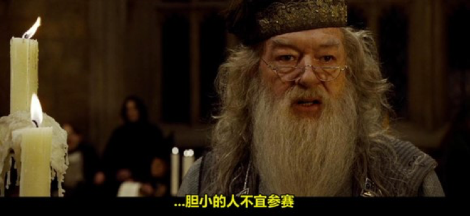

最终的成功者必须经过残酷的淘汰。法学是典型的先苦后甜、胜者通吃的长线专业。你们必须经受各种痛苦的经历，无法承受的人趁早出局。入学第一天你们就应该知道，这个专业要背最厚的书，参加最难的考试，忍受最低的一次就业率，更重要的是，必须在精神上脱胎换骨。**法学是成年人的工作，如果不快点毁掉你们的童年，你们怎么真正成熟！法学是统治者的事业，如果不毁掉你们的平民心态，怎么能进入领导者的行列！法学是研究人性恶的科学，如果不深刻的直面邪恶，你们又怎么能彻底的明白正义！**这些话，也许你们很久才能明白。

对各位非专业的读者，我也再说两句，我知道不可能禁止大家围观，也理解各位的好奇心和逆反心理，说一句画蛇添足的话：如果你们非要阅读，请留言的用语文明一点，张口污言秽语的，我保留删贴的权利。

另外，为了照顾一些人的情绪，我决定在文章的逻辑结构上做了较大调整，本来要分析赫敏的头发的，现在暂时放在一边。下面的段落原来是文章的第四部分，特意提到前面，因为这一段对赫敏毁的不深，或许还能够接受。可能会造成一些行文逻辑上的不连贯，我只能说声抱歉。各种留言还是欢迎的，我会根据留言调整下面的写作风格。最后，本文如果写完，也会很长，大家不要指望一次读完。

### 3\. 哈利的选课1：飞行课和魁地奇

前面有人嫌我跑题，绕着地球转了一圈却没有说到为什么赫敏不能嫁给哈利，前两段确实是本文的铺垫，正文现在开始。先帮这些急性子的朋友总结一下我前两段的观点，共两句话：**“盎格鲁撒克逊”英国人是一群征服者，霍格沃茨是他们的继承人学习统治术（法学）的地方。**够简单了吗？下面的问题是，因为上述原因，整个霍格沃茨的价值观取向，完全是征服统治者的视角。或者说，霍格沃茨评价学生的标准，就是看你是不是一个优秀的征服者/统治者。常说价值观的作用像尺子（价值尺度），用这样一把尺子量下来，赫敏的问题就很多了。

先从简答问题的开始。

最基本的问题，做一个征服者**首先**需要什么？

1

2

3

最基本的回答：做一个征服者首先需要**有力气**。

估计这个答案很出人意外，太简单的答案有时候反而想不起来。

大多数同学都是中国应试教育这面大筛子筛下来的幸存者，久经考验，习惯成自然，对体育是一种教育形式会感到很隔膜，上体育课不就是玩嘛。大概上过小学的同学都听说过“德智体全面发展”这句话，也都知道在中国的教育实践中基本上是句空话。人人都知道“三好学生”的真实意思，是“体育及格、没有犯过错误的分数最高的学生”。很少有人仔细的考虑过，为什么从教育理论上，体育竟然是和整个道德、智力相提并论的，或者说数学、语文、物理、化学……加在一起，理论上才等于一个体育。

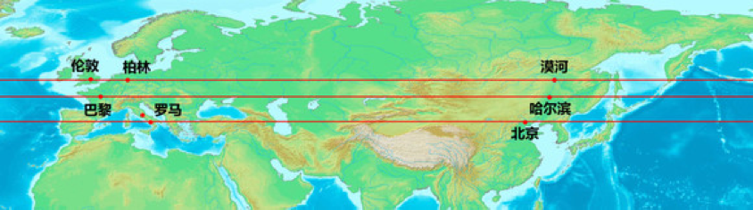

中国古代教育，一直以智育为核心，但重视体育，却是西方教育的一项重要传统。西欧各民族的祖先都是游牧民族，因为西欧的自然环境和中国不同，如上图所示，伦敦和柏林大体上和黑龙江的漠河在一个纬度，巴黎和哈尔滨在一个纬度，北京比号称“炎热”的南欧的罗马还要靠南些。这种纬度的地方在中国古代基本上是无人区，之所以西欧地区还有人类文明，完全是因为欧洲是一个深入大西洋的“大半岛”，常年盛行的西风从北大西洋上带来充分的降雨，气象学上称为“温带海洋性气候”。饶是如此，欧洲的大片地区也是常年阴冷，光照不足，并不很适宜粮食作物生长，无论日耳曼人还是凯尔特人，早期都是以牧业为主的民族，农业只是副业而已。因此，这些民族的很多特点，大到喜欢迁移游牧、喜欢独立自由，小到喜欢吃牛肉、不吃狗肉（牧羊必备），都是和这种生产方式相适应的。

和农业较为依赖耕作技术相比，牧业对身体条件的依赖要求比农业重得多，因此在欧美的教育传统中，对身体的训练，是教育的头等大事之一，和智育可以相提并论。体育教育不仅仅能锻炼强健的身体，更重要的是，这是一种准军事训练。在草原上，猎人们必须排列好队形，组织好分工，才能对猎物进行成功的围猎，一人失职漏出一角，则全体猎人的工作都是无用功。**欧美体育教育的精华，就是在分队竞争中，锻炼人的斗争精神、规则意识、协作才能。**只有能在球队中做的了队长的人，才能在猎场上指挥同伴，也才能在战场上指挥的战士。等战争结束后，也才能承担统治者的重任。

英美的大学每年要举行无数的各种类型的体育比赛，著名的比如剑桥牛津划艇对抗赛，美国的大学棒球、篮球、橄榄球联赛等。这种比赛花费相当惊人（远比在教室里上课费钱），但学校从来是在所不惜，就是因为是否有发达的体育教育，是一所大学是否是一流大学、是否属于培养统治者的摇篮的标志之一。学校中真正能做学生领袖的，很少是考试中的第一名，往往倒是球队的队长或者明星。到了找工作的时候，在学校的球队中当队长的经历要比拿几个A更受雇主的重视。华人的孩子来美国就学，刚一开始最不容易适应美国大学环境的就是这种体育文化。

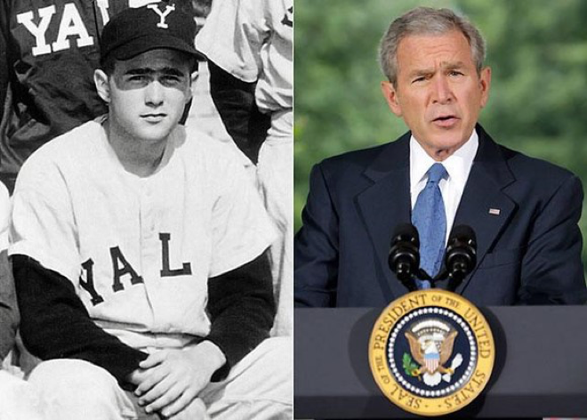

小布什耶鲁棒球队照

美国总统竞选的时候中，学历太高是不受选民待见的，历任总统中有正规博士学位的只有一个，也是历史评价平平的角色。大多数总统，尤其是共和党方面，都是本科生，其中学习好的并不多，很多人最自豪的大学经历，就是自己在学校的球队中打什么位置。布什父子总统三代都是耶鲁大学的学生，也都是耶鲁运动明星。布什爷爷普里斯科特就加入耶鲁棒球队，还获得过全美大学生运动会高尔夫球冠军，老布什本人是耶鲁的棒球队一垒手，而且是全队的队长。小布什也是耶鲁大学校队二垒手，并且是家乡棒球“得克萨斯游骑兵队”老板。布什家族的智商问题一直被媒体嘲笑，尤其跟两个克林顿对比，这其实正是布什家两代总统的竞选策略：我不是只会念书的象牙塔的书呆子，我是运动场上的英雄，因此我才应该做美国的领导者。老布什过八十岁生日，竟然是以高空跳伞的方式庆祝的。在这方面，女生教育也不让男生，体育成绩好的女生容易嫁人，因为可以为家族生下更强健的后代，小布什的奶奶就是美国女网国家队队员。

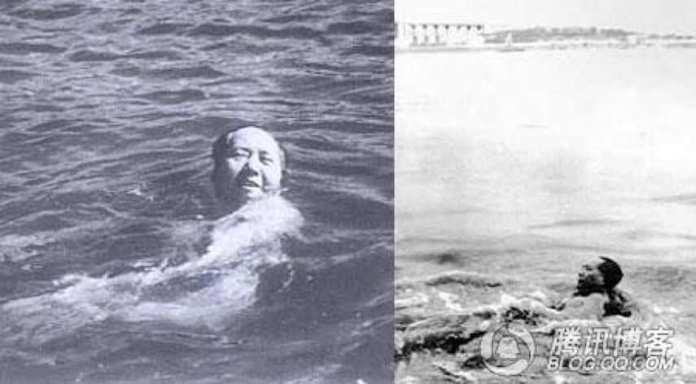

毛主席畅游长江

其实中国的领导人也是如此。作为国家领导人，工作压力之大，常用“日理万机”来形容，没有过硬的身体条件绝对是不行的。老一代领导人中，毛主席73岁畅游长江，邓小平88岁在北戴河下海游泳，这两位都是走过长征路的。近一点大家比较熟悉的，温家宝是搞地质的出身，在甘肃青海爬了十几年荒山，才能以接近70岁的年龄，在四川地震灾区救灾第一线连续工作一个星期。身体是革命的本钱，这个道理并不难理解。

回到剧中。哈利波特来到霍格沃茨的第一场大戏，是大家熟悉的分院帽选学院，接着就是几堂魔法课。大家不妨重看《魔法石》开场的一段，就会发现波特和罗恩根本不是中国意义上的好学生。两人在上课方面是很失败的，比如第一堂课两个人就迟到了，严格遵守规定的麦格教授讽刺说要把他们两个变成一只表或者地图。

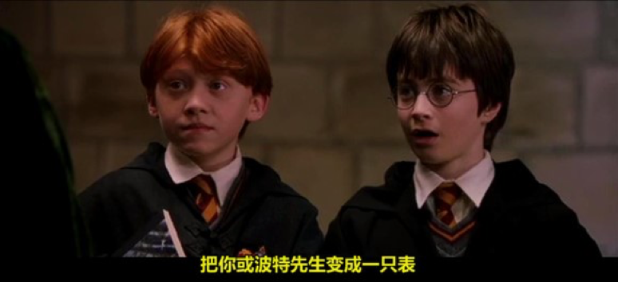

第二堂课，斯内普教授的魔药学，哈利先是上课走神被斯内普警告，又接连三次没有回答上来斯内普的问题，斯内普本来就严重偏心，少不了对哈利一番冷嘲热讽：

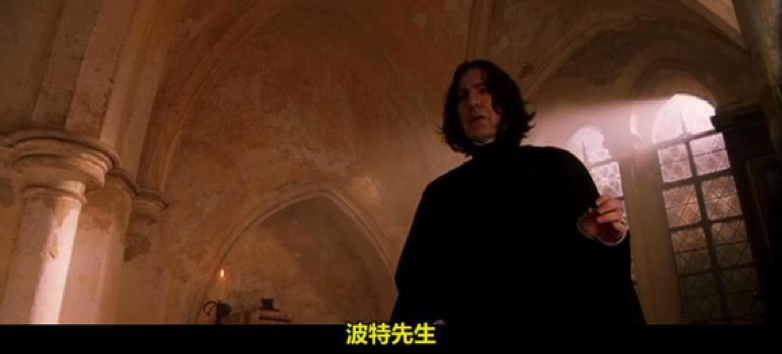

可见，波特在教室里混得并不得意。波特真正的转机在第三节课：飞行课。

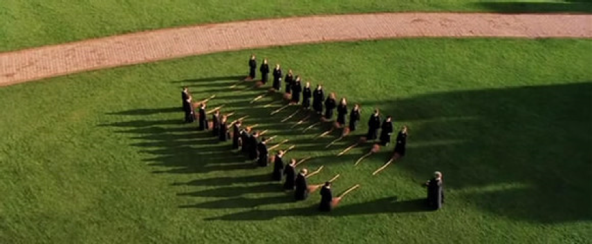

这是堂室外课，大部分同学也很容易看出相当于我们的体育课，不过是把跑圈改成骑扫把而已，都是为更复杂的球类运动做基础训练的。上课不久，纳威受伤了，老师去找护士，马尔福趁机捣乱，将飞球扔掉，而波特具有极高的运动天赋，几乎是无师自通的掌握了高难度飞行技巧，用一个非常惊险的高空急转弯接住了被马尔福扔掉的球。这个动作发生在麦格办公室窗口，直接打动了麦格教授：

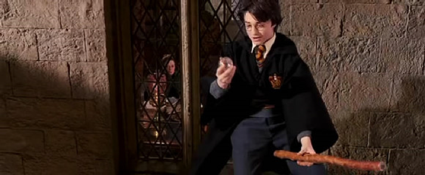

接下来，波特被麦格推荐进入格莱芬多的魁地奇队，并且在赛场上成了赛场上最优秀的找球手，后面的情节大家都很熟悉，就不再多说了。

《哈利波特》几乎每一部都有魁地奇比赛的情节，看电影的观众，绝大多数都把魁地奇当作一场好玩的游戏，震撼于精彩刺激的高科技场面而已，其文化意义，最多能理解到魁地奇相当于英国的国粹运动——足球上（或者橄榄球）。其实，每场魁地奇赛场上中，都埋藏这相当丰富的剧情线索，各派人物在魁地奇赛场上的较量，包括观众席上的各种小动作，是霍格沃茨学院故事的重要内容。哈利（包括罗恩）正是靠着在魁地奇比赛中的一次次胜利，成为众所瞩目的学院英雄，在同学中获得了尊敬和拥戴，并在六年级当上了院队的队长。哈6大决战前的魁地奇队长，也就意味着哈7大决战的指挥官。

同理，罗琳阿姨笔下的赫敏的主要弱点之一，就是她从来不打魁地奇。

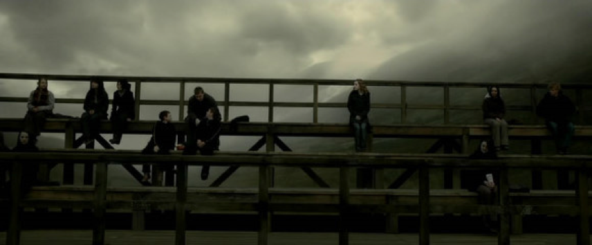

中国观众喜欢赫敏，很大程度是按照中国教育的标准衡量的，赫敏每次上课都能正确回答问题，每次考试都是第一，不是最优秀的学生吗？按照英国人的看法，不是，这只是她是个次优秀学生的表现。英国观众看到每次魁地奇比赛，哈利在赛场上拼搏，而赫敏只是坐在观众席上喊加油的时候，心里都明白，罗琳阿姨这样安排，是暗示赫敏是配不上哈利的，因为她不具备做一个优秀统治阶级的身体素质。中国观众，则一般没有反应。

金妮呢？这个小姑娘出场机会并不多，但是关键的第六部，金妮成了学院魁地奇球队的副队长，选拔新球员的时候，金妮就站在哈利的旁边。

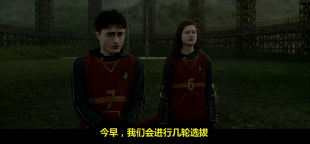

更重要的是，哈利压不住底下乱糟糟的队员的时候，金妮大喊“都闭嘴”，让全场鸦雀无声，连他哥哥罗恩在内，都乖乖的站好听训。好电影不需要太多台词的，这场戏金妮一共只有一句话的台词，就充分表现出一个优秀统治者的气质：攻击性。

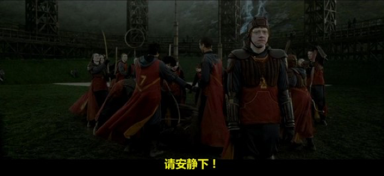

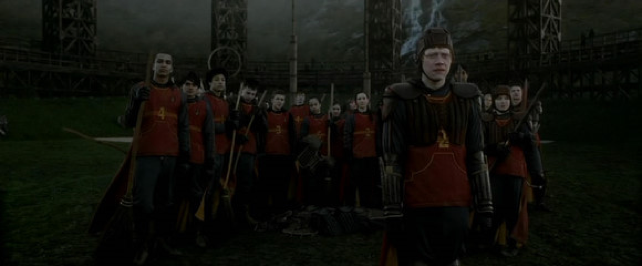

对赫敏而言，更糟糕的是她接下来犯了一个不可饶恕的错误：为了帮罗恩通过选拔，赫敏偷偷的对罗恩的竞争对手使用了“混淆咒”，让罗恩不光彩的赢得了选拔赛的胜利。

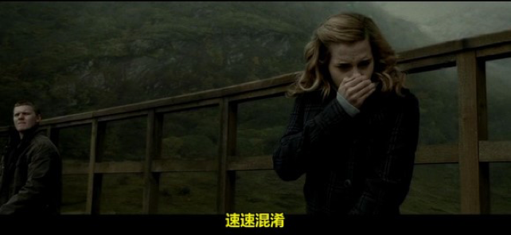

赫敏帮自己的男朋友，也许中国观众表示可以理解，只是人之常情而已。但是一个有英国主流价值观的观众看来，这种违反规则的行为，绝对是个无法容忍的的大错误，这样选拔出来的球员是要输球的——要是在战场上，是要败阵的。英国人所谓体育精神，费厄泼赖，首先一点就是遵守规则，在规则之内可以合理冲撞，但绕开规则作弊，是对所有人的欺骗。比尔•克林顿身为总统之尊，和个把女实习生莱温斯基出轨绝大多数美国人都不介意（考虑到希拉里，很多美国人都有点同情），但是一旦克林顿在调查之下说了谎，那就成了“誓言之下的谎言”，竟然到了引发国会弹劾的地步。

**遵守规则，是法学的基本特征，也是区分统治者和平民观念的重要分界线。**统治者必须严格执法，平民则喜欢抄捷径走后门，大家先记住这个话头，下面还要深入讨论。

对照之下，选拔赛的时候金妮也在场，她是罗恩的亲妹妹，按说比赫敏和罗恩更亲，而且她直接就是选拔赛的裁判。但是片中金妮毫无徇私枉法的表现，就这样看着罗恩差一点被淘汰，直到赫敏出手作弊为止。球队是集体项目，做球队的队长或者副队长，不仅要身体强壮，更重要的是要处事公正，才能领导全队战胜对手，金妮无疑就具有这样的素质。如果说这场戏是哈利、金妮和赫敏的三角关系的选拔赛，并且让英国观众来打分的话，结果肯定是金妮而非赫敏应该嫁给哈利。

奇怪的是，以罗琳阿姨对赫敏的偏爱，为什么罗琳不安排赫敏也打魁地奇呢？

（“飞行课和魁地奇”本来是一段，因为后面的话比前面重些，按照温柔的毁赫敏的要求，分两段发，抱歉了各位读者。）

翟按：人人网是一个实名网络，我的个人信息不难找，不过请私信和留言的朋友别把我的姓写错了，我不姓瞿，也不姓霍，姓翟，有些学生私下里坏坏的叫我宅老师，我也坏坏的接受。仍然感谢各位的回复，纠正了我很多技术性错误，比如把三强奖杯错称作火焰杯等等，定稿会一一改正的。留言中还是有很多精熟原著的朋友貌似不太开心，非要我用原著做材料分析，其实原著我也是看过的（当然没各位看得细），不过你们的要求恕难从命。说实话，我对各位原著党提供的各种细节纠正颇有兴趣，只要不说脏话，我还是挺喜欢看你们的留言的，因此这里暂时就不解释我为什么坚持用电影了。

大家都知道，赫敏是罗琳阿姨在书中的影子，为什么不设计一个情节，让赫敏也打打魁地奇？很多人分析的和剧情有关，不错，但本帖从另一个角度提供一种思路，这个问题和英美国家的教育理念有关，只是这种教育理念，在中国的教育的实践中不被承认，大家比较陌生而已。

前一篇本宅介绍西方国家重视体育教育，这倒也不是什么独得之秘，差不多是教育理论界的通识。那为什么万恶的中学老师总是抢走大家宝贵的课外活动时间，拿去给文化课补课？大家的第一反应应该是我国的“应试教育模式”——因为高考不考体育呗，但这只是表面现象，高考又为何不考体育呢？如果教育当局认为体育教育非常重要，把体育考试吸纳进高考体系很难吗？比如在高考里增加一门体育，占一百五十分（重视的话可以再多），测试百米、跳远、铅球三项，某日统一集中到某中学测试，按照指标记分，这在技术上也不是什么做不到的事情。如果这样，万恶的中学老师一定会风雨无阻的把大家从教室里赶出来跑圈的：亲，跑圈哦，加油哦，有一百五十分哦。

问题是这一切都没有出现。原因何在？

因为体育和智育不同，体育更加依赖人的先天条件。随便一个班同学排排队，总有大个子、小个子，每个人的身体天赋是明摆着的。相对于文化课，锻炼对天赋改变并不大——无论怎么锻炼，你也不能长到姚明那么高。大家都锻炼，最后还是比天赋。过几天大家就要看伦敦奥运会了，这是西方体育文化的集中展示，大家不妨留意其中的价值导向。奥运会的口号是“更强、更快、更高”，稍一注意就能发现，其实奥运会根本和普通人无关，完全是一群体育天才的竞争。

中国高考的基本理念，是假设幼儿的大脑是一片空白，在这个层面上人人先天平等。教育的目的在于传授知识，传授的效果则取决于学生的努力程度，教师要鼓励好学生刻苦读书，而高分就是对勤学的奖赏。因此，像体育这种比较依赖天赋而非勤奋的科目，在中国的高考体系中就很难找到位置。你能接受一个刻苦读书的勤奋女生落榜，而一个五大三粗的笨男孩被高校录取吗？

而英美国家的主流教育理念正好相反，在他们的教育理念中，勤奋并不特别重要，而天赋则是首要因素。爱迪生有一句名言，“天才是1%的灵感加上99%的汗水，但1%的灵感比99%的汗水更重要”，就是这个意思。（这句话的原文有争议，在美国也有，大家耐心，我后文也会稍微解释一下这种争议的原因。）

英语中有很多概念和天赋有关，比如genius、talent、gift，这几个词可以被混杂着翻译成天才、天资、人才、才能等等，但实际上汉语中很难找到对应词。英美主流教育理论认为，知识是一种人脑的内在的机能，无需被教育活动传授，教师的作用只是把它激发出来。这种教育理念对天赋非常强调，一个人如果没有天赋，就没有教育价值，等于是对牛弹琴，反之，天才可以无师自通。教师的作用，仅仅在于帮助学生发现自己的天赋，将其由潜在状态激发出来成为现实。英美高教界有句话：“好学生不是教出来的，是被大师的氛围熏陶出来的。”

哈利波特电影中，很多细节都体现了这种教育理念。《魔法石》中哈利的第二堂课，斯内普的魔药学。斯内普给一年级同学的开场白是这样的：

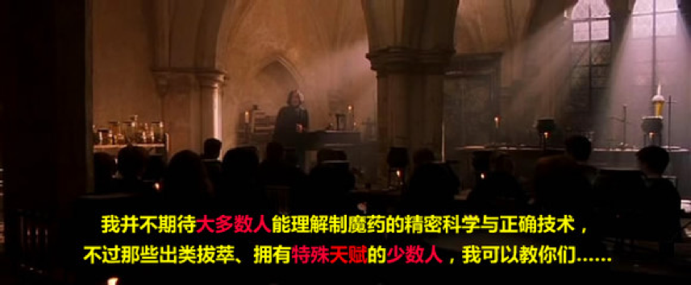

（下面很多长字幕的截图在电影中原来是若干个镜头，是我截图后配的文字，加粗字体也是我加的，细节党不必见怪。）

众所周知，斯内普一贯歧视非纯血的学生，他性格古怪，说话阴阳怪气，对学生很不友好。但斯内普这句话实际上可算是“直言不讳”，因为他的教育理念并不是霍格沃茨的特例。紧接着第三堂课飞行课，导演安排了如下镜头：首先霍奇夫人布置任务：

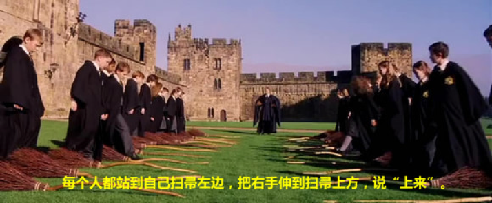

下面四个镜头，第一个镜头是哈利的，他一伸手，扫把就毫不费力的飞了上来。

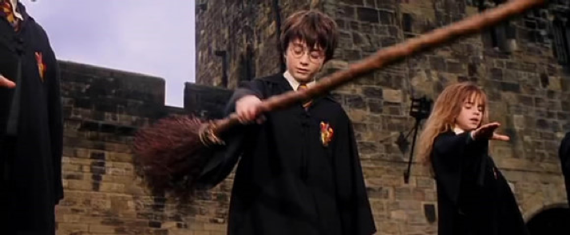

旁边的赫敏的表情是这样的：

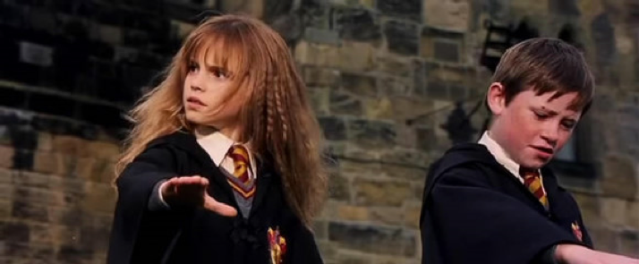

第二个镜头呢，给了马尔福！他只是比哈利稍慢一点点而已。这就是马尔福参加了食死徒却在第十九年后还活了下来的原因——他血统高贵并不是空话，他本人有相当高的天赋，这届学生中仅次于哈利而已。

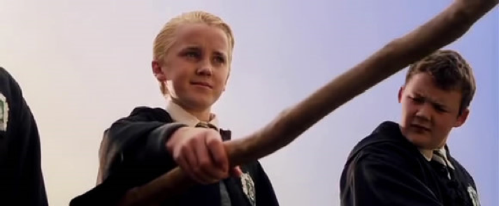

第三个镜头给了罗恩，扫把飞起来打到他的头。罗恩的魔法爱出错，一直是片中的笑料，这一次也是如此，不过好歹是让扫把飞起来了。

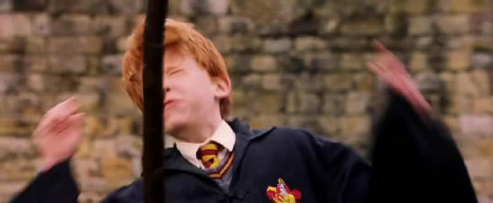

最后一个镜头才是赫敏，她喊了半天，扫把最后也没有上来。按照英美观众的看法，这是在表明，赫敏没有飞行术的天赋。

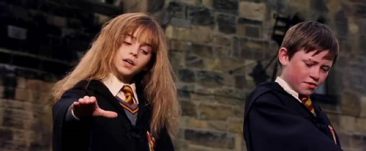

赫敏缺乏的天赋还有很多，比如西比尔•特里芬妮教授（Sibyll Trelawney）的占卜术（Divination，有的地方翻译成“圣术”）。赫敏一上来就不喜欢特里芬妮，特里芬妮同样不喜欢赫敏，认为她没有天赋，颠三倒四的讽刺了赫敏一顿，气得赫敏一怒之下走出课堂。

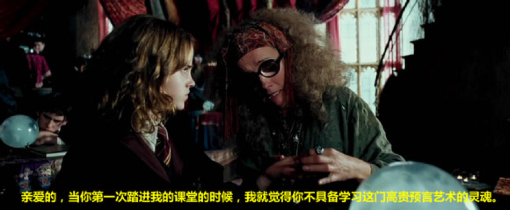

大家别小瞧这个疯疯癫癫的特里芬妮，她教的这门课是霍格沃茨课程表里最高级的课程之一，大致相当于中国儒家五经中最难的《周易》，现实中也对应着一项非常悠久的西方文化传统，其历史渊源甚至在希腊罗马文化之前。有时间我会单独写一篇分析的。

赫敏当然不是没有天赋的孩子，但她的优势偏向于依赖背诵的课程方面。赫敏从第一部开始，每一级都有她在回答老师提问方面压倒同学情节，这类镜头不胜枚举，从英美教育观念来看，这些情节只是说明赫敏有“记忆天赋”。赫敏喜欢的课程，比如“古代符文”，就是典型的背诵课。

什么是“古代符文”呢？表面上看是用如尼文字等书写的咒语。其实英美贵族教育体系中不学外语（坦率地说是瞧不太起“低等民族”的语言），只学古典语言（拉丁语、希腊语），这门课实际上相当于中国的外语课，赫敏这句台词，意译的话大概可以翻译成“我觉得量子物理学根本就是乱七八糟的课程，学英语才有意思呢”，仔细体会就能发现其中微妙的贬义。罗琳虽然喜欢赫敏，但作为一个优秀的儿童文学作者，她编故事必须符合英国社会的客观实际，塑造人物要符合其性格和身份，否则故事就没人看了。

英美教育理念的“天赋”是个很有趣的概念，一方面，他们认为每个人的天赋差别很大，而且基本不能靠后天改变，这好像很不平等；另一方面，他们又认为，每个人都有不同的天赋，即使再差的人也有某种天赋，只是和别人不同而已。老师只要发掘其中的潜力，则任何人都可以成功。这个理念常玩欧美网络游戏的同学应该很熟悉：你注册一个角色的时候，有各项天赋值——比如力量、敏捷、耐力等——供选择，但一个角色不能同时占有各项天赋。每个角色类型都有特定的天赋，比如法师有法师的天赋，骑士有骑士的天赋，在游戏中天赋会数字化到一个点数，而各项天赋加在一起，总和是一样的。（没玩过网游，有错误请指正。）用他们的话来讲，就是“上帝在这里关上一扇门，就会在那里打开一扇窗子。”

这种教育理念在剧中的典型例子，如胖胖的小朋友纳威。

前几部纳威是个很倒霉的角色，导演总安排他负责丢丑。第一节飞行课，他根本控制不住扫把，最后受了伤。

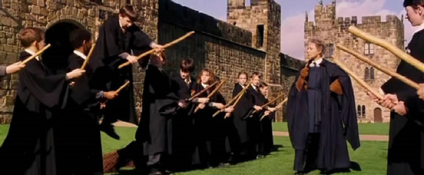

第二部的黑魔法防御课，又被一群小精灵挂在了挂灯上。

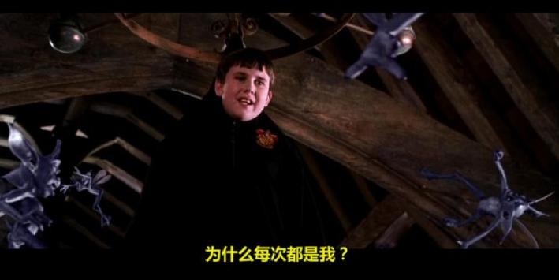

第三部的黑魔法防御课，他是卢平第一个叫出来练习咒语的学生，这次稍有进步，卢平是个好老师，至少帮助纳威完成了训练项目，虽然很勉强。

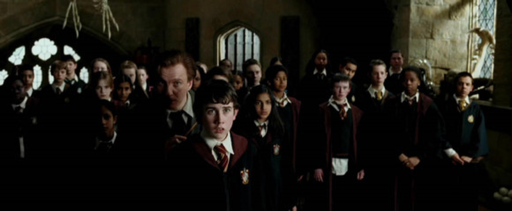

总之，纳威可以说在班里算是各科都比较差的学生，这种同学大家在身边也能找到，要是在中国的计算总分高考体制下，差不多就是个没戏的学生了。

可是，这个笨笨的男孩有一项“天赋”：草药学，因为他不喜欢运动，也不太会交际，只喜欢整天呆在野外观察各种生物。第四部火焰杯以后，纳威开始上戏，三强争霸赛第二场黑湖探险那场戏，赫敏和罗恩在图书馆里找了半天找不到潜水的答案：

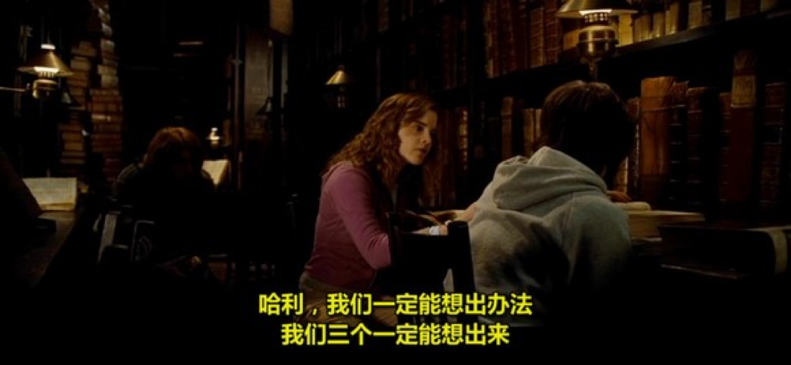

问题是在专业领域，三百个外行加在一起也不如一个内行。真正帮忙的还是纳威•隆巴顿，他不仅提供了呼吸草的线索，还直接找到了呼吸草的实物（好像是假穆迪从斯内普那里偷的，转交给纳威），帮助波特取得了黑湖探险的胜利。

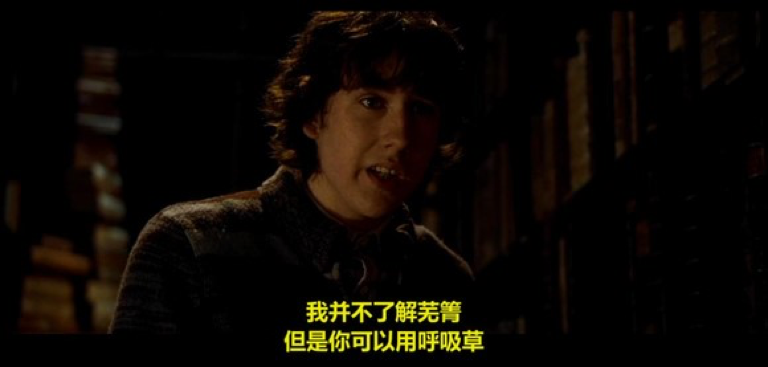

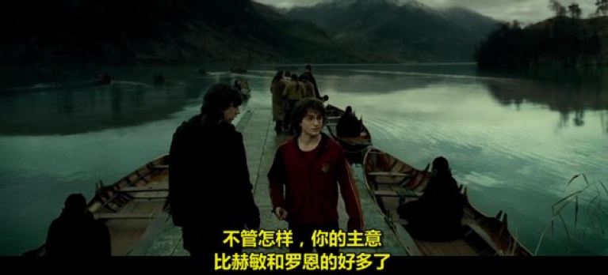

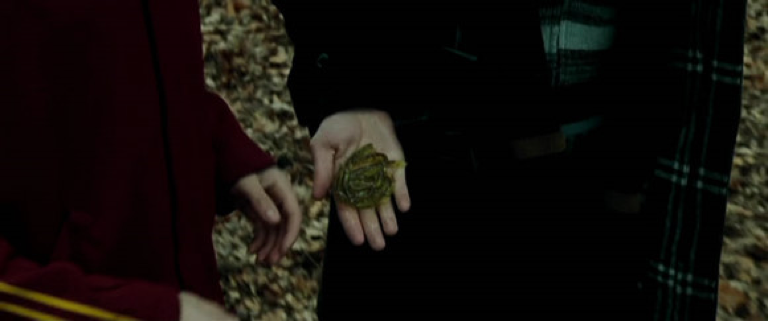

在小说里，纳威的最后结果是留校任教，担任了霍格沃茨草药学课程的教授。但是在中国，这严重偏科的孩子恐怕考大学都很困难，就算考上了大学，只怕也难经过硕士、博士重重考试最后站在讲台上，虽然他教的草药学，肯定比赫敏强。

另一个例子是片中的双胞胎乔治和弗雷德兄弟，他们来霍格沃茨是因为家庭原因（纯血巫师），但两个人对统治术下的各种课程都缺乏天赋，上学只在搞各种恶作剧，虽然逗得观众很开心，但从受教育的角度来说，不是什么好事。最后两个人在不停的恶作剧中发现了自己的天赋：商业。

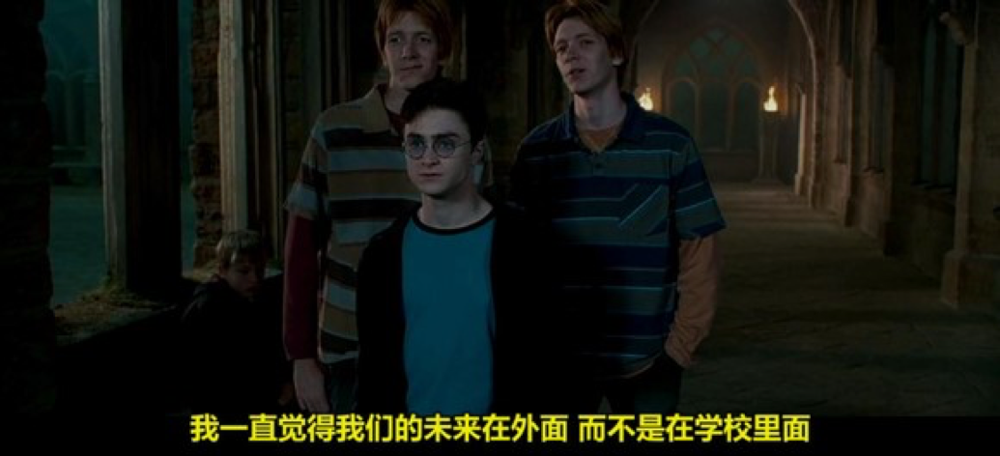

那就索性发扬这项天赋，因此他们在《凤凰社》中干脆退了学，虽然没能成为霍格沃茨合格的毕业生（做政治家），却成了成功的商人。

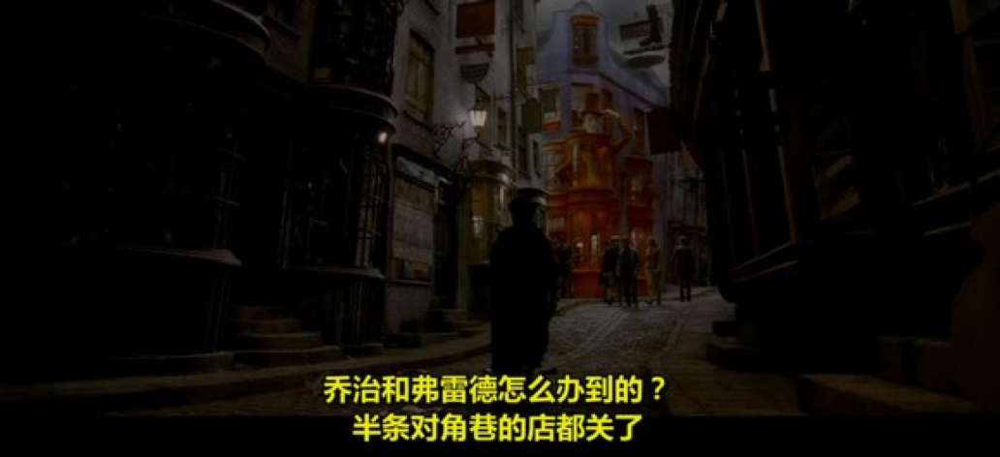

霍格沃茨课程里有关于商业的项目吗？没有。两个人完全是无师自通，一边玩一边找到门道的。

怎么样，这种教育理念是不是听着挺动人的，在这种理念下，几乎没有教不好的学生。老师应该鼓励个性、强化特长，而不是逼着有外语天赋的同学练飞行，或者让有经商才能的同学搞草药研究。这些年中国的教育改革，引入了不少英美国家的教育理念，所以这些说法，估计各位也不完全陌生。

但是说也奇怪，中国现在的教育模式，仍然是高考体制为主，多少“素质教育”的好计划，听起来不错，一旦遇到高考指挥棒，就会出现各种走形。为什么不根本上引进英美国家的教育理念呢？

因为强调天赋的教育，有一个隐含的逻辑，不知道各位能不能接受。在这种教育理念下，人的差异会被固定化。天赋是先天的、用生物学的说法就是遗传基因决定的，但基因会代代相传，是不可改变的因素。强调天赋的结果造成这样的逻辑：商人有经商天赋，他们的子女仍然有经商天赋，也就应该继续经商；音乐家有音乐天赋，他们的子女仍然有音乐天赋，也就应该继续搞音乐……这还不要紧，关键是：**统治者有统治的天赋，他们的子女仍然有统治的天赋，也就应该继续统治大家。**

说人话。

龙生龙，凤生凤，老鼠的儿子会打洞。

你是什么意思！

你是不是法西斯！作为一个大学老师，你不觉得可耻吗！日本人杀害了我们多少同胞，南京大屠杀你难道忘了吗？你竟然在网上公然散布这种腐朽的法西斯思想！难道共产党带领大家翻身做主人是错的？打到地主有什么不对吗？喜儿就应该嫁给黄世仁做小老婆？杨白劳就该世世代代给黄家种地？你是不是南霸天的私生子？政府一个月给了你多少五毛？现在政府腐败成这样，漫天的有毒空气，遍地的环境污染，还不许我们屁民上街散个步！你爸是不是个贪官！你是不是觉得，白富美就得嫁给高富帅，然后生下官二代富二代继续骑在我们头上？你到底是什么意思！

（以上摘自本帖后部分网友的评论，先摆在这里，看看本宅预测能力如何。）

抱歉我只是个普通教师，给我的几个学生介绍英国的历史、文化和政治而已。**英国文化的主流是贵族文化，而贵族的基础则是血统，**你喜欢也罢，不喜欢也罢，不搞明白这一点，学习英国的一切都不会入门。

### 4\. 赫敏的头发、血统和身份

今天两段联发，主要是不愿意让人骂我卖关子。现在终于可以讨论赫敏的头发问题了。褐色的头发是什么意思呢？

前面网友的跟贴中，提供了很多有想象力的答案，依照发言次序列举如下：吉普赛人、斯拉夫人、诺曼人、加拿大人、凯尔特人、意大利人、伊朗雅利安人、美国人、澳大利亚人、爱尔兰人。我看到最有创意的答案是这个网友的留言：

**“赫敏到后几部出现的眼部烟熏和眼线，头的脸比例（高额头），杂色卷发，博学智慧，和对基督教道德观的细微批判态度，很容易得出，原型代表了一种两河流域文化。阿拉伯信仰使之和传统格格不入，深厚的犹太教时期遗存知识，巴比伦，埃及，苏丹时期，丰富的文化交汇。赫敏对事件的一些预判和先知，仿佛新约中记载的，预兆耶稣诞生的东方三圣人。赫敏从书中知道的事物很大程度上引导哈利做了很多决定性的事。魔法石，赫敏差了书。密室，变形药。阿兹卡班，穿越。火焰杯……好吧这集没她什么事，恋爱……不胜枚举。所以说赫敏的东西方矛盾和交融特质，很可能就代表了阿拉伯，两河流域文明。**”

请允许我膜拜一个先。

问题是，这么多的选项，哪个是正确答案呢？

各位修炼统治术的同学们请注意，经过多年素质教育的提倡，说我们老师只会照本宣科是不正确的，很多老师也经常提供各种教科书以外的、甚至是相当激进的观点。但坦率地说，目前我们的法学教育还缺乏一项很基本的素质训练。一个优秀的统治者最重要的素质并不是见识广博，因为一般来说统治者并不缺乏各种信息。**关键是，在大量眼花缭乱互相矛盾的信息中，能做出正确的一个判断并坚持到底。**法学案例课上大家都上过，每个案件中包括大量信息，哪些是有法律意义的，哪些是无意义的干扰项，哪些是自相矛盾的谎言，优秀的律师必须做出准确的判断，才能打赢官司。在英语里，表明这种判断的能力有一个词：insight，这个词由内（in）和看（sight）两个词根组成，可以翻译成“洞察力”、“悟性”、“眼光”等等。

各位请试着运用你们的“洞察力”，选择一个答案，记得要坚持己见哦。

1

2

3

答案是：赫敏的褐色头发，意味着她是个普通的英国人，她的头发的颜色是大多数英国人头发的颜色。

估计大家都很愤怒。等了这么久，等来这么一个结果。

请先不要着急愤怒。得出结论并不困难，但一定要给出判断的理由。为什么褐色头发是表示普通英国人呢？

英语中有两个词表示民族：nation和ethnic group，前一个词更多的表示“国家”、国家政权下的民族，比如Britain nation或者American nation，后一个是语言文化上的人群，比如Anglo-Saxon，可以表示英国和美国的英语族裔。无论用哪个定义，赫敏都和哈利、马尔福一样，属于英国的主流民族（用后一个定义，罗恩属于少数民族）。但这不足以区别赫敏和马尔福的身份。

有在英国留学的同学留言说，现实中英国人很不重视我们说的“民族”差别，他们的身份登记也没有“民族”这个选项。没错。大家研究英国人的身份问题，可以从民族入手，但民族问题有时候并不是最主要的划分方式。在民族之外，还有一个平行的概念，在传统的欧洲观念中，称之为“阶级”class，但是这个词在现在的中国被改造成和财产（有产、无产）联系在一起，和片中对不太上，比如罗恩家很穷，但他是贵族阶级。其实欧洲人所谓“阶级”这个词的本意，大体上对应古汉语中的“门第”。在阶级分类下，人的身份分为三种：贵族（noble）、自由人/平民（freeman）和奴隶（slave）。前面说盎格鲁撒克逊人是征服者/统治者，其实并不准确，严格地说应该是盎格鲁撒克逊人中的贵族阶级才是统治者。留学生一般接触不到比较高端的贵族阶级，因此会感觉英国人不太重视身份差别。

在早期的英国历史中，无论盎格鲁撒克逊人还是凯尔特人，内部都已经有了阶级分化。有人以农牧业、手工业等为职业，也有人专门以战争为职业，即武士阶级，其领袖则称为“王”，这些职业大体上都是世袭的。日耳曼民族大迁移之后，盎格鲁撒克逊武士战胜了凯尔特武士，成了英国贵族（严格地说还有后来的维京人、诺曼人，这两族也属于广义上的日耳曼民族），大部分凯尔特人或者被征服成了奴隶，或者和盎格鲁撒克逊族的平民混杂在一起，融合成现在的普通英国人，也就是平民。

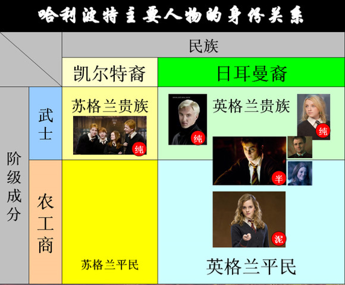

贵族与平民的划分，一直是英国历史、文化和政治的重要特点，也是中国人学习英国文化的难点之一。很多人不能接受，号称“先进”的英国，直到今天仍然是一个法定的贵族国家。英国女王作为贵族之首，她既不是民主竞选的，也不是推选或者指定的，而是依照血统原则继承的。女王在英国政体中是有实权的，并不仅仅是教科书中所说的“君主立宪制下统而不治的虚君”那样简单。（女王的实权问题比较专业，不展开。）

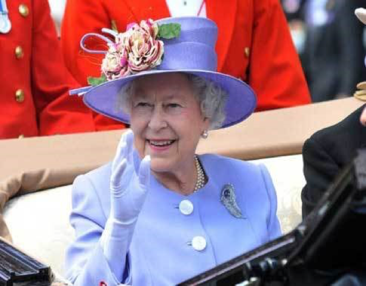

现任女王伊丽莎白二世

女王之下，英国还有大大小小的亲王、公爵、侯爵、伯爵、子爵、男爵和教会贵族、法律贵族等共一千多人。这一千多人组成的贵族院（上院），和剩下8000万人选举出来的平民院（下院），理论上是平级的，二者加上国王，共同构成英国政治的中枢——英国国会。历史上，上院曾经拥有比下院多得多的权力。即使在贵族制度高度式微的今天，上院也仍然是英国政治的重要组成部分。不知道大家是否相信，直到三年前的2009年，英国才在历史第一次成立了“英国最高法院”，此前上院一直是英国的最高上诉司法机构！也就是说，最高司法权一直在贵族手中（这个问题也很复杂，不展开）。在一向以法治传统著名的英国，大家可以理解这意味着什么！

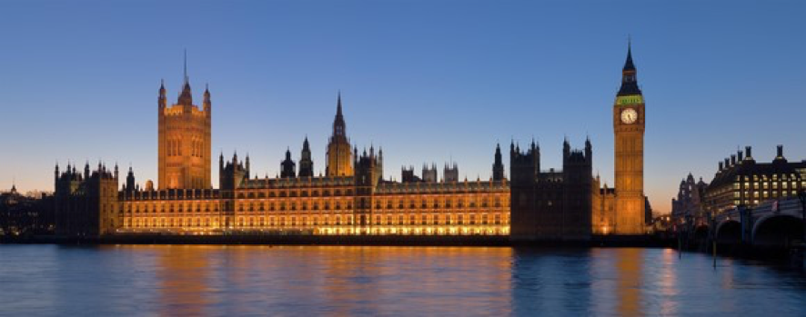

英国国会大厦

至于贵族精神对经济的、文化的、社会的影响，那更是无所不在。民间对贵族精神的追求，比上流社会有过之而无不及，去年大家都领教过的这个场景：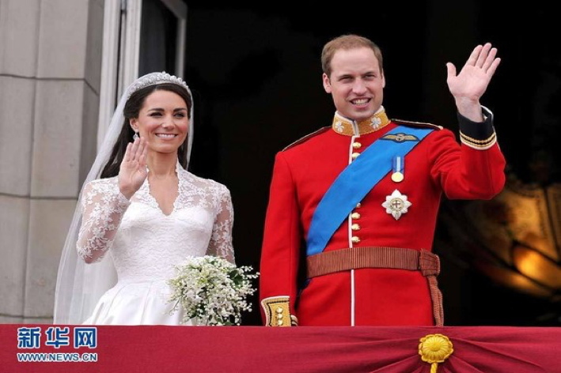

威廉“大婚”

这场婚礼一共花费4722万英镑（折合4.7亿人民币），全由纳税人支付。英国民间的态度呢？一片欢腾，载歌载舞，视若第二国庆（英国国庆节是女王生日）。

发张稍微敏感点的照片，2009年9月9日，某开国元帅之孙女在北京劳动人民文化宫的婚礼。哦，抱歉，这地方古代叫做太庙。

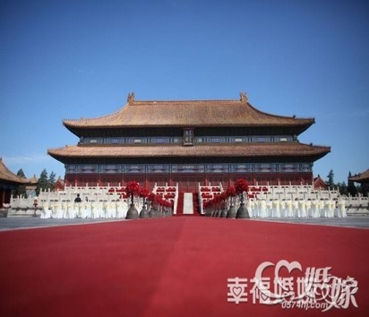

不知各位什么感觉。反正新郎的名字，到现在还处于保密状态。

言归正传，《哈利波特》中的贵族和平民，对应的是什么呢？这个问题不难回答，片中有一对很常见的概念：“纯血”/“麻瓜”：

《密室》的开场，卫斯理和马尔福两个家庭在书店相遇，两个家长亚瑟卫•斯理（罗恩爸爸）和鲁修斯•马尔福第一次直接面对面，下面是鲁修斯的一些对白：

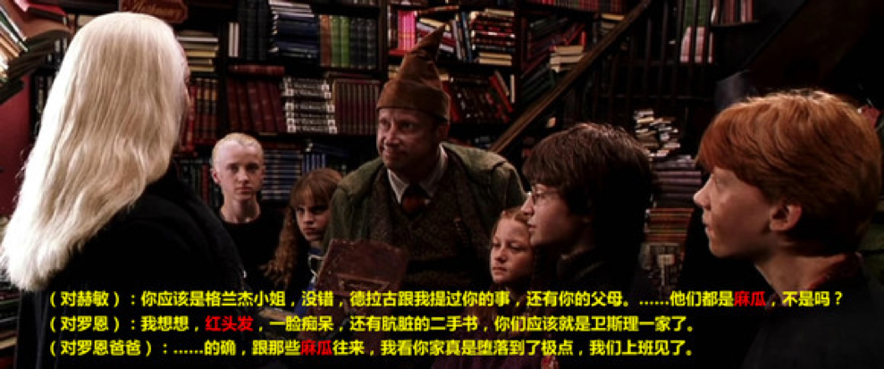

除了又一次侮辱了卫斯理家的红头发之外，重点是muggle麻瓜这个词。这个词是罗琳创造的英语单词，还有一个近似的词，也是在《密室》中，小马尔福和赫敏在教学楼前冲突的时候说的：

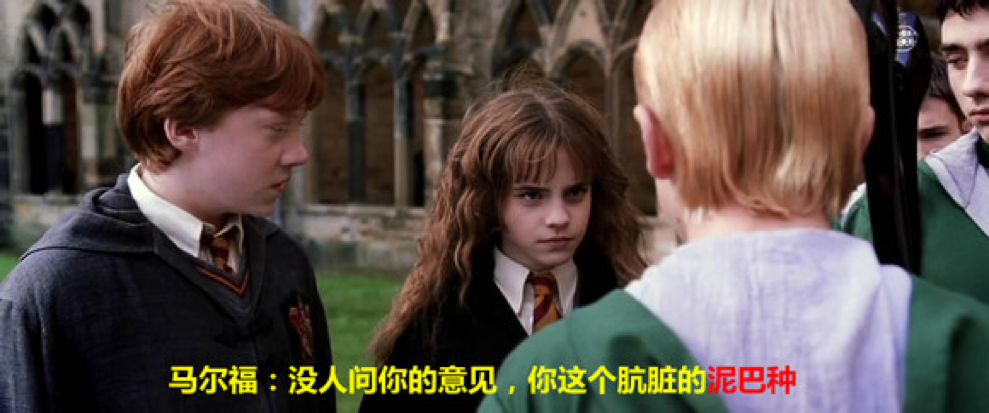

Muggle，词根来源于mud blood，blood是血统，mud是泥巴，因此中文译成“泥巴种”。这其实是个漂白了的译法。在英文中，mud可以引申为肮脏、混杂。Muggle或者mud blood，其实翻译成汉语中的“杂种”更准确一点。这个词的关键，就在于“混血”。

贵族和平民的分界线有很多，最主要的一点，是血统，或者是对血统的态度。平民不介意血统是否混杂，而贵族们则坚持只和贵族结婚，因此才叫做一个“族”嘛。所以欧洲大多数贵族都是中表兄弟（姐妹），就像红楼梦里面贾史王薛四大家族的连环套一样。研究欧洲中世纪史，搞清楚8个亨利、6个恩里克或者12个海因里希之间的关系，历来是件麻烦之极的事（这三个名字是一个单词，英语和法语翻译成亨利，西班牙语和葡萄牙语翻译成恩里克，德语翻译成海因里希）。

到底为什么贵族一定坚持近亲结婚呢？不是常说“远缘杂交，生下小孩聪明”吗？哈利是个父纯血母泥巴，看来正好符合这条规律，德赫党不也一直在希望聪明的赫敏嫁给高贵的马尔福吗？

很抱歉，这在逻辑上是不可能的。马尔福的家族如果能接受赫敏的话，他们家早就不再高贵了，一头铂金色长发也早变色了，也就不会被各位马赫党喜欢了。

我们高中生物书上有这样一段话，“每个人都携带有5~6个不同的隐性致病基因。在随机结婚的情况下，夫妇双方携带相同致病基因的机会很少。但是，在近亲结婚的情况下，双方从共同祖先那里继承同一致病基因的机会就会大大增加，双方很可能都是同一种致病基因的携带者，这样，他们所生子女拥有遗传病的机会也就大大增加，往往要比非近亲结婚者高几倍、几十倍，甚至上百倍。”大部分人认为的“近亲结婚，生下的后代是白痴”，基本上是从这里来的。

有没有什么问题吗？

**教科书没有撒谎，但它只提供了一半真相。**

问题是对于贵族来说，他们是战场上的胜利者，是具有优秀基因（跑得更快、跳的更远、更聪明、更勇敢）的人群。我们把上面一段话中的“致病”基因，改成“优秀基因”，结果就是：

“每个人都携带有5~6个不同的隐性**优秀**基因。在随机结婚的情况下，夫妇双方携带相同**优秀**基因的机会很少。但是，在近亲结婚的情况下，双方从共同祖先那里继承同一**优秀**基因的机会就会大大增加，双方很可能都是同一种**优秀**基因的携带者，这样，他们所生子女拥有**优秀天赋**的机会也就大大增加，往往要比非近亲结婚者高几倍、几十倍，甚至上百倍。”

这就是贵族们坚持只和贵族结婚的原因，他们怕流失自己的优秀基因。哈利的飞行天赋哪里来的呢？大家注意赫敏的英语原文：

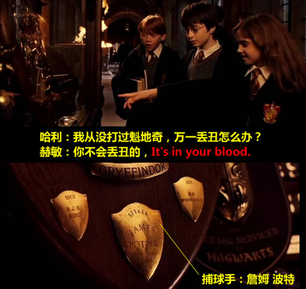

考察人类的婚姻史，贵族们总是倾向于近亲结婚。也可以说凡是贵族文化占上风的时间，婚姻法或者婚俗就倾向于近亲结婚。古代中国人在东亚地区是优势民族，受儒家贵族文化的影响，历来就流行姑表亲，以至于公公婆婆被称为“舅姑”，因为没结婚之前就这样叫的。姑表亲中大家最熟悉的，就是《红楼梦》中的贾宝玉、林黛玉和薛宝钗。在这种传统下，晴雯再优秀，也不能嫁给宝玉。

相反，凡是在历史上平民文化占优势的，都会有大量的亲属婚姻禁忌。在罗马天主教的教规中，最多的时候曾经禁止七代以内的血亲结婚。（历史上天主教会主要是代表平民的立场，这个问题很复杂，不展开讨论。贵族们一直反对这一教规，后来教皇特地作出了例外的规定，具体考证属于专业知识，也不展开讨论。）

欧洲贵族们的近亲结婚（主要是表兄妹结婚，但也不完全排除堂兄妹，反正在欧洲语言中这两个词是一样的）结果就是，纯血的贵族，更多的保持了他们祖先的典型体貌特征，英格兰贵族仍然是铂金色头发，苏格兰贵族仍然是红头发，而混血的平民，则出现了某种体貌特征的混合，于是赫敏就是褐色头发了。遗传基因的具体规律很复杂，这里不讨论遗传学的细节，比如头发的颜色是怎样决定的之类。哈利波特是部儿童文学作品，原作者只是简单的用这三种头发的颜色来表示马尔福、罗恩、赫敏三人的出身，就像京戏中的脸谱，红脸的关公代表忠诚，黑脸的张飞代表暴躁一样。（历史上这两位也长得是正常人。）

现在大家知道赫敏的压力有多大了吗？

顶着一头代表平民的褐色头发，来到这个学习统治术的贵族学院，大部分同学不是纯血就是Half-blood。在这里她面对的不是“偏见”，恰恰相反，马尔福们的看法是“正见”，是科学。人家的优秀素质已经比你领先几十代了，有优越感是正常的，歧视到你无话可说。

必须强调一点，**在英美主流文化中，坚持人种、出身方面的“歧视”是一个基本的思维方式。**其中的关键词，也是个英语固有的概念，叫做discrimination。

（抱歉这个帖子里总是爆单词，作为外语大学的法学老师，讲课总得加点本校特色。不过顺便给各位提个小小的建议：下载观看英美影视作品的时候，尽量听原声，看双语字幕，因为一个文化体系的核心概念，基本上是无法翻译的，只能看到原文才能理解。不信大家自己试试把道、太极、阴阳、仁、孝、关系、面子等翻译成英文看看。）

第二篇里带着大家转了地球一圈，分别讨论了哈利波特中的各种文化因素（其中日本文化错了，多谢各位指正，不过删掉并不影响结论）。主要的用意，就是想给各位直观的介绍一下这个discrimination的概念。这个词常和种族race连用，即racial discrimination，翻译成中文为“种族歧视”，其实英语的本意中，discrimination原指“鉴别”、“区分”、“区别对待”，并无贬义，意思是“对不同的人给予不同的待遇”，如果向古代延伸一点，**古罗马法学家乌尔比安有一句名言：“正义就是使人人各得其所”**，那么这个“区别对待”反而是个褒义词。法学的同学请特别注意，大部分法律制度（尤其是民商法）的价值取向，其实并不是“平等”，而恰恰是这个“区别对待”。

英美文化中有一种根深蒂固的观念，认为自己是征服者，是优秀的文化，其他民族都是被征服者，他们的文化都是劣质文化，但要根据其劣质程度，给予其不同的区别对待，比如法国是表兄弟，德国是堂兄弟，中国人是情人，印度人是家仆，防着点犹太人，千万不能给“那个民族”有正面露脸的机会，等等，这就是discrimination。说白了，英美文化的根子是征服者的文化，里面根本就没有“民族平等”这个念头。

说racial discrimination/种族歧视，最常见的还是对黑人的歧视。有人说怎么在电影中看不到呢？哈利波特电影中，黑人只有两三个跑龙套的角色，第二篇还忘了一个，乔丹李，第一部的魁地奇解说员。

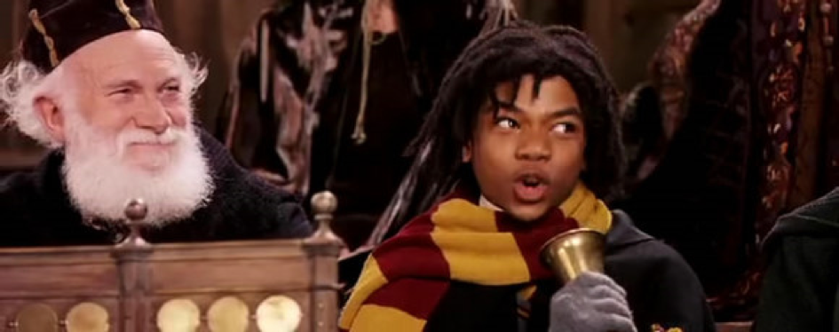

但其实这些都不是文化意义上“真正的”黑人，最多只能算是些认同英美主流价值观念，除了一张黑皮肤之外已经完全同化的黑人。像奥巴马、骆家辉，都是“黑/黄皮白心”的。（亚裔的俗称香蕉人，不知道非洲裔俗称什么，奥利奥？）大家不要被这种表面现象给迷惑住，美国文化中歧视黑人是根深蒂固的，哈利波特中也有体现。真正的黑人在这里：

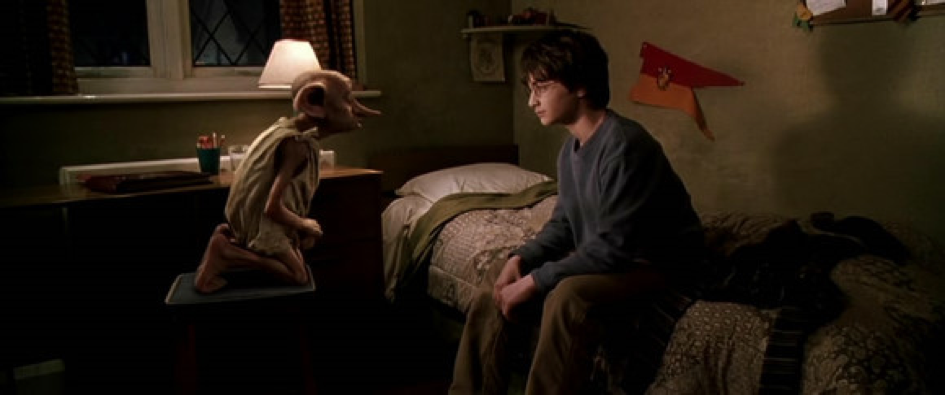

家养小精灵——多比！

没错，Domestic elf根本不是人。这就是美国人对文化上没有同化的“真黑人”的基本想法。除了野生的之外，他们最大的用途，就是充作家奴。

小说中家养小精灵戏份较多，电影中删掉不少，因为这个东西的文化原型到底如何，美国观众自己心里很清楚，家丑不宜多提。在剩下的一点点情节中，家养小精灵也是典型的奴隶族，他们怯懦、愚蠢、谦卑、经常干傻事，简单的说就是天生的奴隶。多比在第二部《密室》的开始出场，一上来就被哈利波特的一句“请坐”感动，可是大家看剧照，多比一直是跪着和哈利说话的。多比还算追求自由的“自由派小精灵”，最后为了追求解放而光荣牺牲。另一个布莱克家的克利切，就是典型的“保守派小精灵”，也就是美国文学中常见的“老黑奴”的形象。克利切最大的梦想，是像他的先祖一样，在老得干不动了之后，让主人将他的头割下，和他祖先的头并排悬在墙上作为装饰。克利切的这个形象，大家可以对照某些美国文学，比如经典的《gone with wind/乱世佳人/飘》中的黑人，去看看英美主流社会对黑人的真实心态。

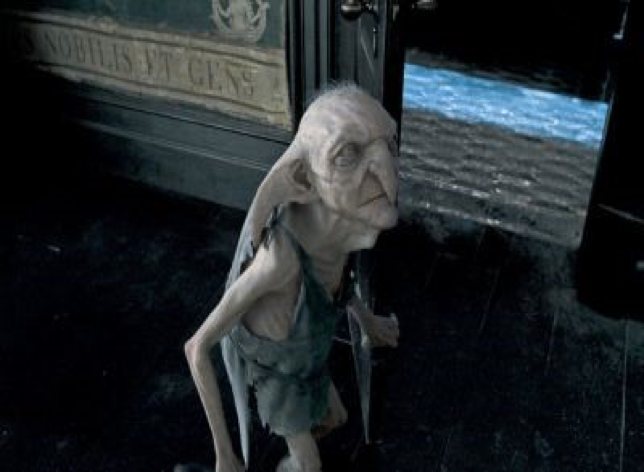

原著中霍格沃茨也有家养小精灵，负责扫地做饭，结果被电影砍掉了。同时砍掉的是赫敏在她的四年级时决定成立组织“家养小精灵福利促进协会”的事。Society for the Promotion of Elfish Welfare缩写SPEW，就是英文“呕吐”的意思。赫敏出身低微，全校同学中只有一个半血、一个少数民族做朋友，为小精灵呐喊符合她的身份，但在霍格沃茨的主流观点看来，就有点“令人作呕”了。

就算不考虑反角马尔福，男一号哈利对待家养小精灵的态度，其实也挺不怎么样的。《密室》的结尾，哈利虽然因为和马尔福作对，利用藏袜子的方法巧妙的解放了多比，但打狗是为了打主人，并不是为了狗。哈利和多比有下面的对话：

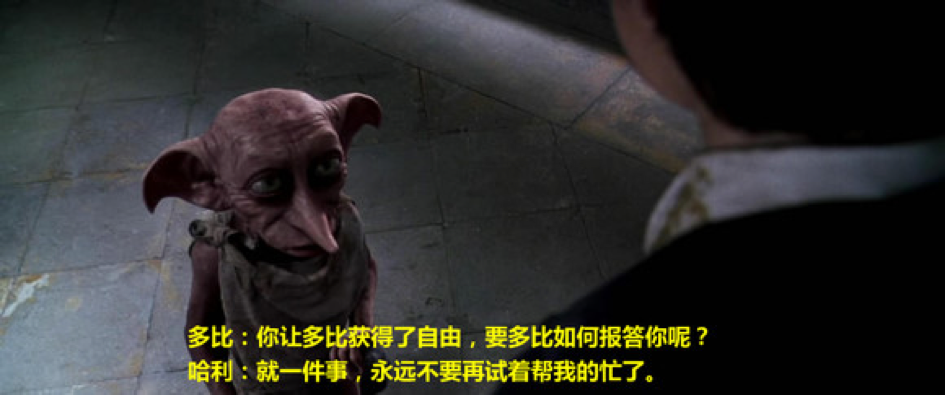

哈利的话其实就约等于一个字：滚。

大家都知道美国南北战争中林肯解放黑奴，实际上这更多的是一种宣传，南北战争的真正问题，是南北双方的白人在经济发展道路上的利益矛盾，黑人只是个斗争的题目而已。南方后来也通过了解放黑奴的法律，可是林肯仍然将战争进行到底，直到一把火把亚特兰大烧成一片灰烬为止。战后，白人的问题解决了，南北方也就和解了，叛乱领袖们，又重新回到华盛顿做议员和部长。黑人呢？美国从此开始了长达百余年的种族隔离制度。黑奴虽然获得了人身的自由，但只能生活在自己的小社区（如果你管它叫做社区的话），连坐汽车都是和白人分车厢的，直到二战后美苏争霸，为了抵消苏联的影响，才有六十年代的“黑人平权运动”。

种族隔离的原因，就在于主流白人对黑人的一贯看法：愚蠢、贪婪、缺乏自控能力。片中，多比对哈利确实一片好心，但是三次帮忙都帮了倒忙：第一次它警告哈利不要返回霍格沃茨，让哈利收到了一张魔法部的警告书。第二次封锁了九又四分之三车站的墙，迫使哈利和罗恩开着那辆超级老爷车赶路差点摔死，第三次在魁地奇比赛时控制了游走球，又撞断了哈利的胳膊。哈利虽然出于马尔福较量的考虑，解放了多比，但也肯定不愿意多和多比打交道。

有人说，这些早都是历史了，奥巴马不是已经当上美国总统了吗？为什么你还说美国歧视黑人呢？确实，现在美国已经没有“黑奴”这个具体制度了，但“种族歧视”的精神并没有改变，最多用“墨西哥非法劳工”代替黑人，或者用黑白混血的奥巴马打打广告而已。（奥巴马的白人妈妈家族血统很高的，而他的黑人爸爸除了生下他之外好像就和他没什么联系了。）道理很简单，**没有奴隶，就没有贵族。**不歧视异族，怎么凸显本族的高贵？让美国人对有色人种客气一点，没问题，让美国人放弃自己的优越感，那就等于没有美国了。

关于英美国家的血统论——贵族（平民、奴隶）观，暂时分析到这里。有人问我是不是法西斯，来这里推销血统论。这个问题我表个态：我和大家一样，也没有什么高贵的血统，只是个普通中国人而已。我当然也不喜欢被白人歧视。只是知己知彼才能百战百胜。英美国家是中国全球竞争的最主要对手，不搞明白他们的一些内心想法，我们的决策就会有错误。**建议各位不要对号入座，分析咱们中国人内部的族群血统，希望下面的讨论集中在欧美文化历史和政治方面。**

### 5\. 霍格沃茨的校长

下面有几个技术性问题要处理，有人问，既然你说血统是赫敏不能嫁给哈利的原因，可是我看到巫师们跨门第结婚很多啊，至少有这几个例子：

1. 第六部《半血王子》中，斯内普教授不是父麻瓜母纯血吗？
2. 赫敏最后嫁给了罗恩，罗恩不是是纯血吗？
3. 哈利的父亲是纯血，母亲莉莉不是泥巴种吗？

前两个例子，我确实有自己的看法，不过这涉及婚姻制度中更敏感的地方。说实话，婚姻法其实是个很邪恶的法，因为要彻底学好婚姻法，必须直面“性”这一话题，这并不是个适合在网上讨论的东西。今天已经很冒犯各位了，我需要等等看，才能决定是否和大家讨论这些问题，或者说用什么方式能更“温柔的”讨论这一话。（我肯定不会“粗暴的”讨论这个问题，各位重口味的同学不要起哄。）

但最后一个问题，可以这里给出答案：如果各位把“血统论”当作英美价值观念的一切的话，就太低估这个体系的复杂程度了。赫敏的头发问题吊了大家很久的胃口，各位可能把注意力过多的集中到了血统问题上，其实七部电影，讨论血统问题的主要是第二部，后面另有新的主题。（我的帖子全文如果能写完大概是10篇，现在也才写到五分之二。）血统论是基础，但绝不是英美文化的一切。简单的说，英美主流价值观念对血统论的态度是：**有血统论，但不唯血统论。民族和出身很重要，但你仍然有自由选择的机会。**

没错，哈利本身也是混血，而且身上有一部分伏地魔的“脏基因”，但在《密室》的结尾，校长和哈利有这样一段意味深长的话：

邓布多：你好像被什么事困扰着，对不对？哈利？

哈利：是这样的：我注意到了，我跟汤姆瑞斗之间，似乎在某些方面拥有相似的特质。

邓布多：我知道，没错，你是能说爬说语，哈利，这是因为佛地魔也能说爬说语。如果我没弄错的话，他在你头上留下疤痕的时候，也把一些力量转移到你身上……

哈利：所以分类帽说得没错，我应该就读史莱特林。

邓布多：没错，哈利。你的确拥有一些佛地魔自豪的特色，坚毅果敢，足智多谋，还有，不太遵守既定的规则，可是为什么分类帽会把你分到葛来分多？

哈利：那是因为我的要求。

邓布多：这就对了，哈利。这就是你跟佛地魔不同的地方。**让我们成为哪种人的，并不是我们的先天能力，而是我们的选择。**

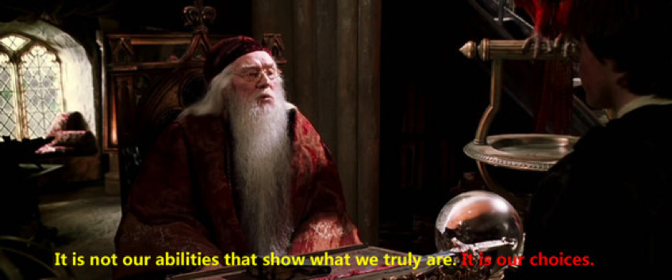

这就是英美文化中的另外一个关键词：自由选择。

写第3章的时候，我就有思路写赫敏的血统，知道血统论是个马蜂窝，所以先贴出前一半来试试看，发表之后，跟帖平静了不少，帖子中说赫敏“体育不好”，看来大家意见不大，结果从体育话题牵扯到血统论，跟帖还是和爆炸一样。

下面引用一些网友的留言：

1. 我深有感触，很多从大学或更高学历才去英国留学的学生是无法体会他们的阶级观念的。我的哥哥从中学起就被送到英国读书，就是所谓的贵族男校精英教育，他在学校的运动项目是击剑和马术。在英国呆了十几年，现在研究生毕业了，入了国籍，也就了业。但这么多年来他一直对家里人说的最多的就是英国人对阶层的看中。他以前在学校时没法融入到那些所谓贵族学生里的真正核心小圈子，男孩联盟之类的。即使他们知道有财力支撑你读贵族学校，但只要你的父母没法和他们的父母在同一个宴会场合上碰杯，互相没法扩展关系网带来利益那他们也不会拉拢你。哥哥目前就职的工作讲出去也很响亮，但他说了，永远也不可能做到核心层，在每个领域核心层里的始终都是一代又一代男孩联盟里的成员。
2. 同时用我认识的两个，虽然不知道算不算贵，但是肯定是upper class的人都说过的一句话支持老师的观点：last name doesmake sense。

引用不是因为留言对我的支持，是因为我自己也没出过国，缺乏这种第一手信息，我想大多数网友也和我一样。

相对来说，我更喜欢看反对的意见，大家别嫌麻烦，容我多引几段，因为这涉及到各位理解英美文化的一个难点：（懒的看的朋友，可以看加粗字体，相当于摘要）

1. 作为一直受英国高等教育的文化研究的学生，我想吐槽几点您文章中的问题：首先，英国种族主义固然有，但是英国自从90年代以来已经实行自由主义多元文化政策，虽然还有很多问题，但**已经基本实现了英国的少数族裔自身权利的平等**，比如穆斯林可以一夫多妻等等。英国人本身包括文化界政界一直都在试图提高少数族裔的社会地位和代表性，包括今天的议会中已经出现了非裔议员，好些媒体明星是黑人等等。
2. 关于您对法律学院的看法，我不是完全同意。我从小来加拿大多伦多，从这里的法学院毕业，现是律师。我觉得您的观点“法学是统治学”有点过于片面。我个人感受是，**法学是以最基本的民主、人权为基础，致力于将社会各阶层/方面系统化、管理好的一种学问。**Obama和Clinton都是律师出身，所以才更加懂得民主的精髓与重要性。我的中文也不是很流利，希望达到了我的意思。
3. 最后这个英国贵族理论我非常赞同，**但是英美并不一样**，其实这正是有着传统封建文化历史的国家被美国逐渐抛离的根本原因。美国人是没有贵族束缚的“白人文明”，对于平民而言已经不是传统的西方国家，所以这块土地上是爱因斯坦、莱特兄弟、福特、爱迪生、乔布斯、卡梅隆、扎克伯格等天才前赴后继发迹的地方，他们的成功不仅在于个人的超级地位和财富，更在于对人类历史文明前所未有的高效率强力推动。美国人不迷恋贵族甚至藐视贵族，美国人喜欢《社交网络》中平民天才小子用甚至不太公平的手段干掉传统贵族高富帅兄弟的故事，在这个地方，平民创造力得到的超级释放是又封建贵族统治历史历史的国家给不了的。
4. 看完这目前的四篇，刚开始觉得角度确实很新，但是如果纯粹是讲解英美阶级民族制度是无可厚非的，但是偏选中了这样一部让很多人爱了十几年的经典来讲解，确实容易引起许多辩驳。我觉得根深蒂固的阶级血统观念是不可否认的因素之一，但是哈利这本书并不是为宣扬这个而来的，**哈利是一部宣扬废弃阶级血统观念，讲求平等自由的书，同时也是一部关于爱的书。**所以您将这样一部书用如此生冷的解释彻底颠了个个，确实看起来挺不舒服，起码我会是这样。
5. 老师，你的逻辑出问题了哦。原作根本没有强调出身论，基因也没有决定一切，魔法部官员的儿子有的经商，有的研究龙，有的是普通银行职员（韦斯莱一家），这是作品中明白告诉大家的，唯一一个进魔法部的还有和他爸爸不相符的野心。综上，这样的描写怎能说是“龙生龙凤生凤”神马的呢？欧美教育的确强调天赋，但并非强调遗传和继承，否则纳威就该也是傲罗而非草药学教授，而且也不会有那么多麻瓜家庭出巫师了。**老师的理论再发展就成为伏地魔了哦～**
6. 我感觉罗林女士这本书里更强调的是自由选择，而非血统。在罗琳笔下，许多纯血统巫师都非常邪恶，加入了伏地魔而成为真正的法西斯。反抗他们的纯血统巫师都不是特别看重血统，愿意与非巫师家庭通婚。因此这可不可以看作是一种对英国主流思想的批判呢？此外，我觉得很多人喜欢赫敏并不是仅仅是因为她的学习好，成绩好，**而是因为她其他的优秀品质。**
7. 翟老师，我有一件事不明白，既然英国人有根深蒂固的贵族意识，而且，罗琳写这部书面向的也是大部分的英国人，那么作者应该站在拥有贵族血统的马尔福的立场才对，但是为什么却把马尔福写成了一个反面，把赫敏这个血统不纯的人写成了正面？

持有上述观点的，在国内大有其人，甚至包括很多著名学者在内，对英美文明都是这个看法：英美文明崇尚民主、自由，鼓励自由选择、个人奋斗（至少美国如此）。至于证据，也可以举出无数，比如这个《哈利波特》系列，正面人物是哈利，负面人物是马尔福，还不是“一部宣扬废弃阶级血统观念，讲求平等自由的书，同时也是一部关于爱的书”吗？

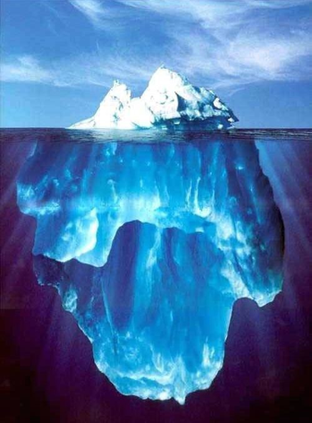

法学特别强调洞察力，就是要求看问题要深入，不仅要看到冰山的表面，更要看到隐藏在深处的东西。比如有人说赫敏性格强势，因此不配哈利，呵呵，诸葛亮六出祁山，肯定是蜀国国力强过魏国。

具体到英美主流价值观念上，英美有很浓重的血统论、门第观念，这并不难理解，这和他们的人种、传统其实倒也关系不大，关键是利益。领先者历来对“平等精神”兴趣不大，最在意的是保守和秩序，作为几百年来世界体系的领先者，英美推崇血统论就是保持本民族的优势地位。1840年前我们中国人也大体如此，有什么难以理解的吗？

那么怎么解释英美国家的自由主义呢？

前面说了，英美国家有血统论，但不唯血统论，如果把英美文化简化为“唯血统论”，并且在本国照搬模仿，那是纳粹。关键是血统论本身有一个巨大的缺陷，必须用“自由平等”加以弥补。

血统论像一道墙，给贵族以安全，但墙修的太高，未尝不是一座监狱。血统论最大的问题，是让出身较低的人（下文简称平民吧，并不严格）感到失去生活的希望。在霍格沃茨，马尔福不和赫敏说话，只是用阴冷的眼光看着她，同样，在麻瓜的世界里，哈利也少不了挨表兄弟的拳头。如果平民们也相信了血统论，从而隔绝了两个阶级的交流，那么早晚有一天维克多•陈和布拉德•吴就会揭竿而起，即使遗传学的血统论是正确的（呵呵，存疑），贵族们的质量优势也会被平民的数量抵消，毕竟，平民永远是大多数。

这个问题对统治者非常重要，必须想出办法。

贵族对平民的认识，有时候比平民对自己的认识要深刻的多。大部分平民反对贵族，只是因为自己没有机会进入这个圈子。只要把墙稍微打开一些缝隙，允许一些平民中的活跃分子进来，大多数平民都是乐而不疲的。这才是统治者的长治久安之道，唐代的科举制不就是这么干的吗？用欧美的制度作比方，就好像一个股份公司，在保持大股东控股的前提下，发些股票让别人分享部分红利，是壮大公司的资本的好事。英美一贯嘲笑纳粹，就是嫌他们太笨，一块钱本钱只做一块钱的买卖。英美国家向来是能把一块钱花成十块钱的。其奥妙，就在于怎样借平民的力。

血统论让平民绝望，站在统治者的角度，解决之道就在于办法就是贵族们自己相信血统论的同时，**一定要让平民们相信个人奋斗。**必须画一张香喷喷的大饼，让平民们感到食物的香气，最好就在眼前！因此，英美贵族体系文化中一向都有大量鼓励平民奋斗的内容。罗琳的小说把哈利、赫敏当正面人物，很正常啊，英美文学界自古以来就是承担这项画饼充饥的光荣任务的。麻烦搞欧美文学的同学来证实一下，整个欧美的文学圈子历来偏左，据说战后的诺贝尔文学奖除了丘吉尔之外，直到911才给了一个右派（奈保尔，2001），其他都属于左派文学，自称是社会主义者的作家不计其数。还记得吗，“我贫穷、低微、不美丽，但当我们的灵魂穿过坟墓站在上帝面前的时候，我们是平等的！”，嘿嘿，中国人都感动好几代了。可是真的如此，为什么《哈利波特》中还在反复讨论“纯血”/“麻瓜”呢？

还有朋友提到英美的差别，这里也说两句。我本人对于初学者来有个建议，刚刚学习英美文化，要从英美一体的角度，尽量用英美文化互相参照，这样能更快速的入门。这个阶段，尽量不要试图作太细的区分。

为什么呢？因为英美爱唱双簧，专门组团忽悠人。

**英美是夫妻**，夫妻就会经常吵架，互相找对方的小麻烦。比如哈利波特剧组就特别强调“完全的英国血统的演员”，剧中也少不了轻轻讽刺两下美国文化，比如这个活宝：

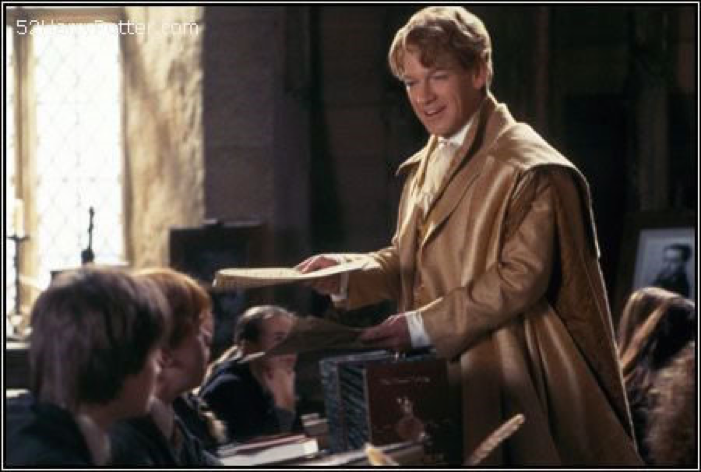

他的衣着大体上是二战前美国人的正装（凭感觉待考证，请各位核实），是片中最典型的美国元素。他在全剧中的表现，基本上是英国人在嘲笑美国的“自由市场经济”下骗子太多。

但这种吵架往往是一种障眼法，人家夫妻吵架跟吃饭差不多，床头吵架床尾和嘛。这两个国家价值观念99%是近似的，只是经常出来一个扮红脸，一个扮黑脸，才能把舆论控制权从左手调到右手，就像华尔街党民主派和华尔街党共和派天天干的事一样。

进阶的同学如果要研究两个国家的差异，简单的说：英美文化都有51%的贵族，49%的平民，只是不同时代比重不同。大体上以两次世界大战划线，战前的英国是贵族精神占优势。**有人说我写的英国不是现代英国，倒像是维多利亚时代的英国，确实如此。**此时的美国大体上还没有摆脱祖先流浪汉、穷人、异端的影响，价值取向上偏向平等。外交上是门罗宣言、威尔逊主义、门户开放，内政上是毫无限制的“自由市场经济”，史称“镀金时代”，在英国这些老贵族看来，当然就是“骗子多”的地方了。此时美国的贵族自豪感，主要还是从黑人身上获得的。

两次大战之后，美国从英国手中接过世界领导地位或者说世界霸权，两国的平民/贵族风格就颠倒了过来。英国是工党上台、自由党式微（等于是“平民”的主体从中产阶级下移到了劳动阶级，简单地说就是偏左了），伦敦政经成了名校，多元文化、种族平等、义务教育这些东东，都开始出现了。当然，还有不可避免的大政府、福利病。

美国呢？虽然有些历史的惯性，表面上仍然强调平等，但实际上美国越来越保守，越来越“贵族化”，冷战后尤其如此，突出表现就是政治领导人的家族化，肯尼迪家族、布什家族和克林顿家族，每个家族周边都聚集着一群类似古代门客的智囊团，小布什上台用的国防部长拉姆斯菲尔德，竟然是福特爷爷的当年的国防部长。全世界的保守主义大师（哈耶克、列奥•施特劳斯）都跑到了美国，外交上也开始讨论“美国的世界责任”，现在还在中东打仗。相反，黑人平权了，因为大量“非法移民”大体行接任了黑人当年的角色。“奥利奥”（黑皮白心）可以努力的去营造49%了。

至于英美文化的整体倾向，到底是平等为主，还是贵族为主，如果各位留学生方便的话不妨试试我下面的预测：如果你问一个中国人，1997年世界上哪个重要的人物去世了？一般人都会说是邓小平；如果你问一个英国人或者美国白人同样的问题，回答是什么？

我猜100个人里面有99个人会回答是：戴安娜。

戴安娜就是个典型的王室包装抛给平民的幻想彩球——她本是侯爵之女，但英国王室硬把她宣传成一个“平民”——结果引来英美平民疯狂的追捧。英美“戴安娜文化”到现在仍然是非常热门的现象，这就是英美文化中骨子里的贵族相。现在的凯特王妃，大致也走的这个路子，只是随着时代的进展，加点平民喜欢的“婚前同居”之类话题。

另外，留神点那1个回答是邓小平的人，他反倒很可能是个贵族，能分得清谁真正在拨动这个地球。

（我没出过国，全凭猜测，猜错了请留言告我。教师只是我的职业，但我不是万事通，深知人之患在于好为人师也。）

（我不喜欢这样写帖子，太学术，像论文，不好玩，只是血统论引来的争议太多，不知这样的回答能否解答留言中的问题。）

还是好好分析霍格沃茨吧。

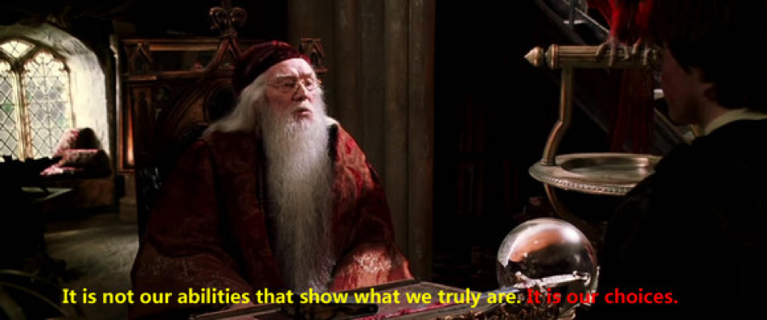

如前所述，英美文化中的“平等自由人权”倾向，集中体现在“自由选择”理论，也就是在《密室》的结尾校长说出来的一句话：“**让我们成为哪种人的，并不是我们的先天能力，而是我们的选择。**”这种论点在英美文化中比比皆是，因此血统论分析完了之后，现在可以比较详细的介绍一下英美文化中的“自由选择”论了。这也是后面几篇的基础。

严格地说，英美国家的“自由选择论”并不是本土货——整个英国文化，都是广义上基督教文化的一部分，“自由选择”的源头来自基督教的教义。有人问我为什么片中的文化符号为什么没有梵蒂冈，我一直觉得这个问题比较简单，没有特别必要专门解析，教皇大家天天见：

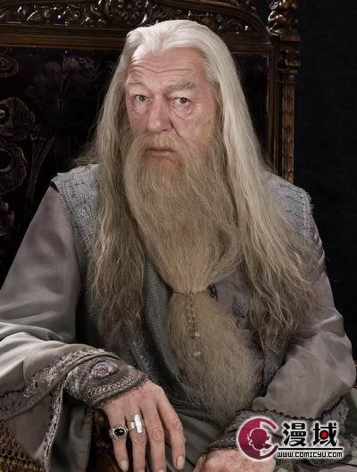

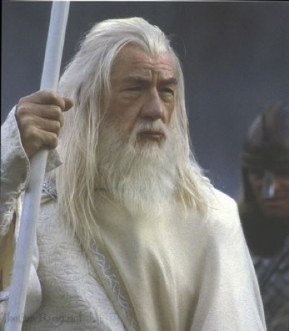

能分清吗？

我在网上搜索，居然有人讨论两个人是否一个演员的。

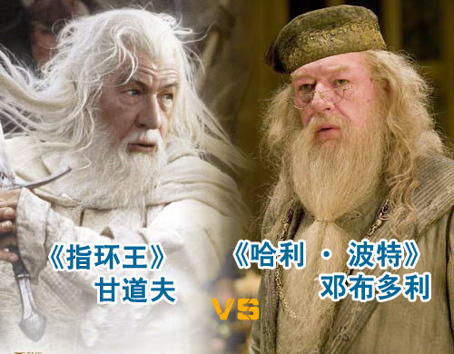

这个讨论本身也能证明两个人的文化符号实在是太接近了。凡是在有关中世纪的奇幻文学中，出现白头发、长胡子、传长袍，一脸慈祥的长者形象，基本肯定是中世纪的基督教传教士/教皇的形象。

因为政治原因，当今英国和梵蒂冈的关系并不好，主要是现在天主教徒主要在南欧和拉美，经济上和西欧北美有矛盾，因此梵蒂冈必须经常发表谴责“为富不仁的资本主义”的圣谕，以争取信徒的支持。为富不仁的资本主义们当然也不客气，罗马和伦敦近在咫尺（用中国的标准），英国居然拖到1982年才和梵蒂冈建交。哈利波特全球大热之后，梵蒂冈教廷官方报章《罗马观察家报》发表专文谴责，并号召信徒们抵制，理由是哈利波特“传播巫术”（大家别笑，教皇还真信这个，就像他同时也相信处女生子、死人复活升天一样）。作为回报，罗琳召开记者会，宣布“邓布利多是个同性恋”（天主教教士不结婚，同性恋和恋童癖一直是个大麻烦），英美人也都知道她在暗示谁家的事。

但这只是政治。从文化层面来看，基督教文化对英国文化的影响是无孔不入的。两位教皇在电影里干什么呢？在《魔戒》中，甘道夫负责加冕：

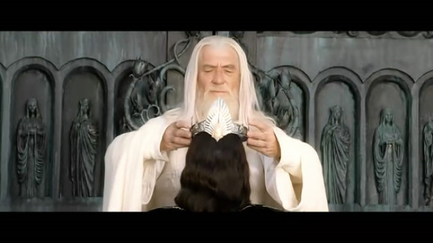

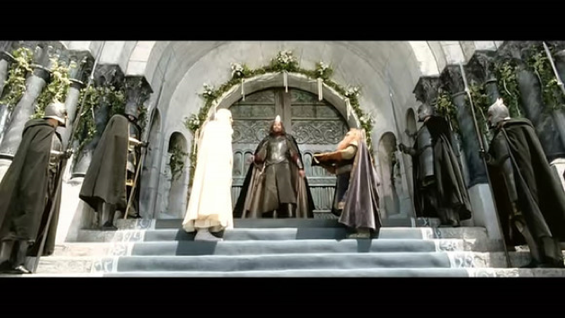

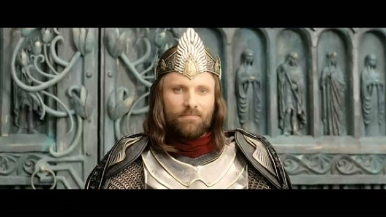

（《魔戒》结尾，甘道夫给亚拉冈带上王冠，“王者归来”。）

原型在这里：

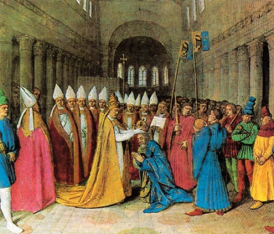

（公元800年，教皇利奥三世给日耳曼人法兰克部落领袖查理加冕，法兰克人称帝自此始。）

《哈利波特》中，邓布利多负责洗礼：

（《哈利波特》第六部结尾处，邓布利多带哈利去取萨拉查•斯莱特林的挂坠盒。哈利浸入水中，遭遇危险，邓布利多燃起大火救他。哈利经此洗礼，开始成熟，下面就是大决战了。）

原型在这里：

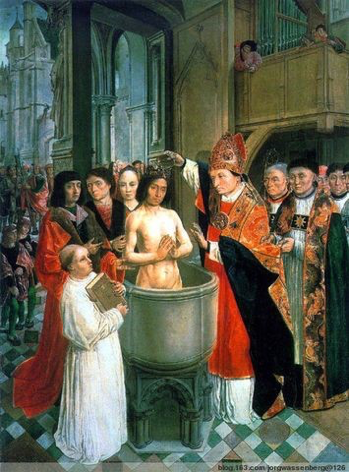

（公元496年，法国兰斯大主教圣雷米吉乌斯为日耳曼人法兰克部落首领克洛维一世施洗，法兰克人从此建立王国。）

这两件事都是欧洲史上的重大事件，欧洲人家喻户晓。洗礼和加冕礼都是基督教的圣礼，用在王者身上，就是哈利和亚拉冈的登基仪式。邓布利多有甘道夫和教皇的影子，哈利有凯撒、亚瑟、亚拉冈、查理曼和克洛维诸位王者的影子，嘿嘿，伏地魔也有黑暗君主索伦的影子——没有脸（关于伏地魔的文化原型，下文分析）。

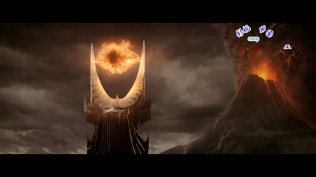

如果说前面的民族学、人类学，差不多是西方人“关于身体的知识”（因此这两个学科建国后和法学一样，被直接关门了），**基督教和源于基督教的各种理论（中世纪常称为“某某教派”，近代常称之为“某某主义”），就是西方人“关于精神的知识”，**“自由选择”理论就是其中之一。

基督教的教义很复杂，我很不成熟的将其简化为“一个中心两个基本点”。两个基本点是：上帝面前人生而平等（旧约），每个人靠信仰得到拯救（新约）。一个中心就是“自由选择”。

众所周知《圣经》是由犹太教的《旧约》和基督教的《新约》两部分构成的。基督教之所以保留《旧约》，更多的是为了保留上帝的概念，这个超然于宇宙四方之外，存在于时间起点之前的概念，能给每个人以平等的机会——在造物主面前，什么血统论等等都不重要了，我们都是亚当夏娃的子孙。西方思想史上，从卢梭到罗尔斯的形形色色的平等论，都有《旧约》故事的影子。最好的体现，就是美国独立宣言中那句名言：我们认为下面这些真理是不言而喻的：**男人生而平等，**造物者赋予他们若干不可剥夺的权利。We hold these truths to be self-evident, **that all men are created equal,** that they are endowed by their creator with certain unalienable rights。中文翻译中省掉了原文的圣经色彩，顺带也省掉了男人和女人的区别。为什么是man？因为在圣经中，woman是man的一条肋骨。

《旧约》本是犹太教经典，但是犹太教经过一段时间发展之后，变成了一种非常保守的宗教，特别强调血统和礼仪，只有结果富有的犹太人才能上天堂。随着罗马帝国征服广大地中海地区，罗马公民垄断了帝国的全部政治权利，大量受奴役受损害的人无所归依，急需一种宗教来抚慰心灵。结果，犹太教中一个小教派独立出来，这个教派宣称他们的领袖基督是上帝的独子，来人间替人赎罪，跟随基督的人就能上天堂，血统不问。这种教义获得了广泛的成功，发展成后来的基督教，其基本教义之一，就是自由选择说或者救赎说。

（宗教话题很复杂，而且很容易跑题，本文主要还是介绍英国历史文化，顺带解析哈利波特，对基督教的解析尽量从简。留言讨论的欢迎，传教的恕不回复。）

自由选择说内涵丰富、流派纷呈、情况差异很大，本文不能尽数，只分析基督教在英美文化中的影响。搞学术的朋友请注意，你可以用基督教解读英美文化，但一定要慎重，因为历史上，英美文化是在反罗马教皇的宗教改革运动中，从天主教的文化中脱胎而来的，因此，英美文化中的基督教因素，很多是受限制的。很多流行的用基督教精神弘扬英美文化的论证，其实往往是牛唇不对马嘴。

**在英美国家看来，基督教的教义中的自由选择理论一直是一个很危险的理论。**在这方面，他们受古罗马帝国时期基督教思想家、教父哲学的代表人物圣奥古斯丁的影响很深。

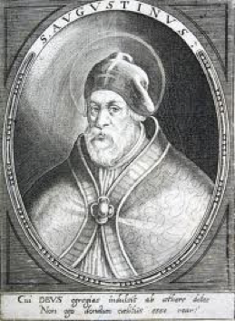

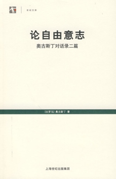

奥古斯丁的理论体系庞大而丰富，他关于自由选择的观点，集中体现在一本叫做《论意志自由》的书里。这部书国内有译本，不过是部很枯燥的哲学专著。

选择论的关键，在于人是不是有“自由意志”？而这并不是一件很好玩的事。在没有选择之前，人服从于礼俗或者权威，固然没有自由，但也不用无需为自己的行为承担责任，就像包办婚姻，嫁错人怨命。而是一旦有了“自由意志”，人有了自由，也同时有了犯错误的可能，就像自由恋爱，嫁错人只能自己哭了。**选择论等于打开了一扇大门，人可以为善，也可以为恶，但善恶之间并不是简单的一清二楚。**

大家都知道，哈利的额头上有伏地魔的N标记，电影中也经常有这样的镜头：哈利和伏地魔之间有某种奇怪的“心灵关联”，他会说“蛇佬腔/爬说语”，也常常和在自己的噩梦中和伏地魔斗的筋疲力尽。

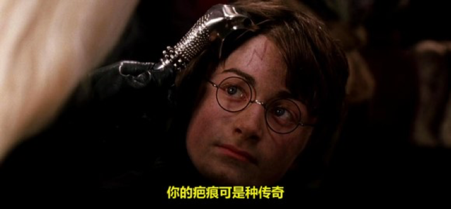

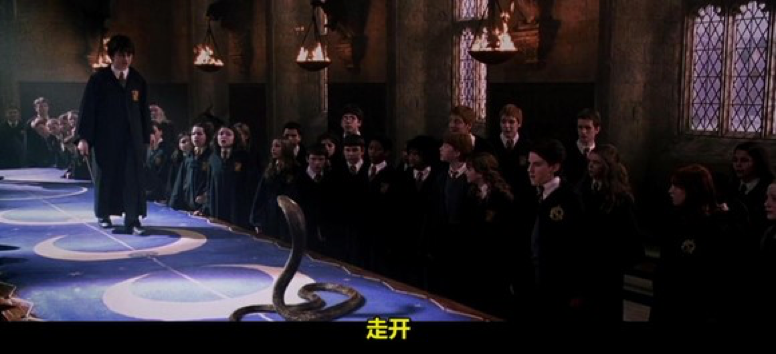

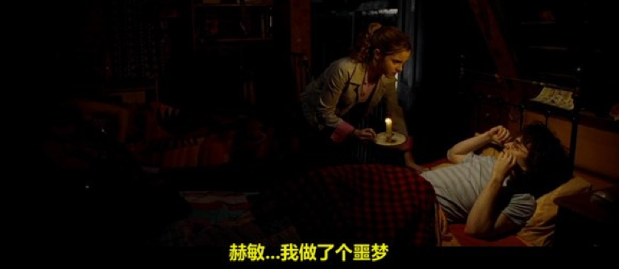

（更多镜头不截图了。）

哈利和伏地魔之间的关联，就是选择论的一个推论。因此奥古斯丁的《论意志自由》的第一个问题就是，意志自由是恶的起源吗？

因此，英美国家的意识形态中，总体上是对“自由选择论”有所控制的，在英美国家，“自由并非为所欲为”。英美文化中的“自由选择”，其实是一种比较保守的选择论（比血统论激进，但和法德俄意等国的选择论相比，就保守多了；这个问题其实深挖很有意思，但这里就不展开了）。前面说了，英美文化的基础是血统和贵族，他们的选择论，是在贵族意识占优势的情况下，给平民一个希望的出口，其实是血统为本、自由为用。因此，英美的“自由选择”，总要把选择“贵族精神”、“英美主流价值观”作为导向。比如英美通俗文化（影视剧、口袋文学）中有一种常见的类似灰姑娘的故事类型，从平民出身开始，到嫁入豪门结束，戴安娜和凯蒂的故事都是如此。

**法学的同学们也可以注意一下，西方法学中有很多区分意志的善恶程度的概念，比如刑法中的故意、过失、意外事件，民法中的善意第三人、恶意第三人，这是中国传统法学所没有的，也常常是中国学生学习的难点。复习司法考试的同学们，你们还在为“直接故意”、“间接故意”、“过于自信的过失”和“疏忽大意的过失”之间的区别发愁吗？嘿嘿，有些东西在法条之外。**

回到电影。

“自由选择”理论对电影影响很大，3456基本上都脱不开。还是先处理简单的。

从副线来讲，霍格沃茨故事是一系列赫敏的平民驯化课。赫敏的选择比较简单，无非是是否加入统治者行列的问题。从赫敏的角度看电影，哈2提出了血统问题，哈3456就是对赫敏的驯化，也就是校长为代表的校方，给出一个又一个不同的题目，让赫敏“自由选择”是否能够进入“天堂”——统治者的行列。不知道大家注意过没有，赫敏从来没有被邓布利多请到过校长室（哈利是常客，罗恩也去过），她和老师最近距离的接触，就是哈6中的“鼻涕虫俱乐部”的宴会。剧透一下，这就是赫敏训练课的终点。

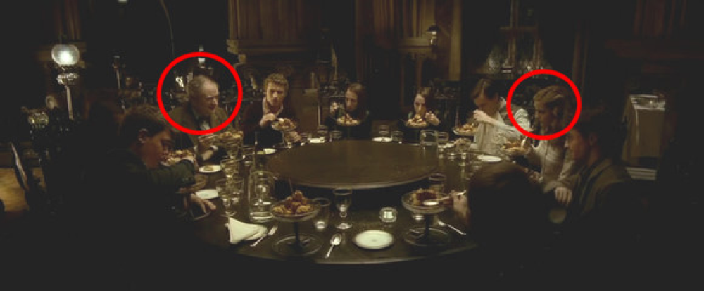

宴会的布景是典型的英国上流社会风格。作者对此稍有点讽刺，但整体把握还是比较符合艺术规律的。其中赫敏和斯拉格霍恩的对话挺传神，把一个平民女孩初次参加贵族宴会的心态表现的很到位。大家去自己体会吧。反正本宅看到这里，心中的感觉是：赫敏的故事结束了（我本人挺伤感的）。

再说比较麻烦的（这个问题详细说挺复杂的，今天的时间只够开个头）。

从主线上来讲，霍格沃茨故事是一场正邪之战，哈利和伏地魔都是霍格沃茨的学生，也都是混血，两个人的起点，基本都在正邪之间。（马尔福和卫斯理倒不需要选择，两家都几十代是霍格沃茨的学生。）按照故事情节，正方的哈利终于发现了自己的“善的天赋”，最后经邓布利多点播，成为王者；反方的伏地魔则发现了自己“恶的天赋”，霍格沃茨故事就是他的堕落史。或者说，两个人因为自己的选择，分别走上了天堂和地狱的道路。

伏地魔的原型到底是谁呢？

根据大家的留言，嫌疑大概集中在下面两个方面：

是他：

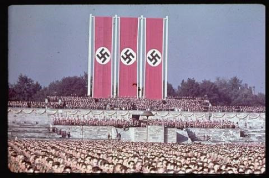

还是他：

应该说，原书作者和导演为了避免麻烦，不可能在文中透露出特别明显的线索，但是文化潜意识还是无处不在的，并不是不能分析出来。

先提示一下，上面两个都不是准确答案。

准确的说，伏地魔的原型是一个幽灵，在欧洲各地徘徊，也可以说，是个鬼魂。

可是世界上真的有鬼魂吗？

翟按：本文后面会涉及文化意义上的伊斯兰教的某些话题，但请大家留言中不要对伊斯兰教乱泼脏水。我很反感网上非理性的反穆言论。另外，在线写做容易导致文章结构混乱，下次更新在一周之后，我想尽量一次写完。

### 6\. 哈利的选课2：黑魔法防御

翟按：上一篇写的时候就感到不好玩，像论文，很多朋友也有类似的感觉。抱歉了。后来念了三遍“大脑封闭”咒语，静心反思，还是自己太把这帖子当回事了。学术性和通俗性本是一对儿矛盾，大家放暑假上个人人网，又不是来看论文，我还是好好胡扯才对得起各位观众。因此这一篇又开始不严谨了。提醒各位，如果本帖能给大家一点学术上的启发，就已经很好了，想学真知识，回图书馆看书。

另外，从上一贴起，对哈利波特的分析从民族、历史方面进入思想、哲学、神学领域，水越来越深，各位小心，身体和大脑不适的请提前退场。毕竟，英美称霸全球几百年，不只靠分析头发的颜色。我尽量把帖子写的生动点，但也请准备修炼统治术的各位，做好绕弯弯的心理准备。只能看得懂头发颜色的人，是做不了统治者的。

#### 6\.1\. 黑魔法

今天继续八卦英国文化中的信仰元素，包括在“自由选择”的命题下，哈利和伏地魔是如何炼成的。爱看剧情分析的朋友，也可以顺便讨论一下《哈》中的各种“魔法”的原型。上一篇有点抽象，有的朋友读的很累，好吧，今天我想试试更直观的做法。前面说过，**霍格沃茨是一所法学院**，反过来说，**法学院也是一个霍格沃茨**，我作为法学院教师（以下简称法师），当然也会几段魔法。今天本法师不才，准备给各位网上教学，现场传授各位几段咒语和秘诀，以证明我这个法师确实货真价实。

先把我的魔仗亮出来给大家看看：

五点一英寸，塑料材质，杖芯是1节7号电池，使用的时候会发出红色闪光。麻瓜们叫它激光笔或者鼠标笔，淘宝有售。

（声明一下，本法师上课一直坚持使用魔杖，可惜手里没有照片，哪位我的学生给我传个上课的照片过来作证。）

至于课程嘛，今天要讲的是霍格沃茨故事中出镜率最高的课程——黑魔法防御（刑诉）。本法师很久没上黑防课了，不过这个学期刚刚讲过“白魔法对抗”（民诉），有我的人人状态为证，这两门课相通之处甚多，勉强客串一下还是可以的。

先讲讲这门课教什么。课程名叫做“黑魔法防御”，这个名字起的就很内涵。子曰，名不正则言不顺，有些东西，起一个好名字非常重要，比如“刑法学”是研究犯罪的，我们要是给它起名“犯罪学”结果会怎样？以下摘自该专业部分人士的对话：

（甲）明天要考犯罪了，复习的怎么样？（乙）杀人、抢劫都行，就差诈骗还不熟。

（甲）今天犯罪老师讲得不好，到最后我还没明白拐卖妇女怎么回事。（乙）我教你。

（某老师）各位同学请安静，强奸有三种学说，我分别给大家演示一下……

听起来就很邪恶！

霍格沃茨的教务处也考虑到这一点，“黑魔法防御”这个名称，你找不出任何不正义的地方。不过呢，前面引用假穆迪老师所说，要学好黑魔法防御，首先要直面黑魔法。本法师是学术型的法师，鄙视只有实践经验的假穆迪，再把话说的深刻一点：**其实大部分黑魔法和白魔法都是一回事。**

某甲开枪打死某乙，是故意杀人，武警战士枪决死刑犯，是执行刑罚。开枪有什么区别吗？区别在于谁来做这件事。同样的，我们不说“国家**绑架**了某甲”，而是说“国家**逮捕**了某甲”，不说“国家**掠夺**了某甲的全部财产”，而是说“国家**没收**了某甲的全部财产”，区别也只在意义不同。黑白魔法的关系也是如此。片中哈利波特也使用过不可饶恕咒，有问题吗？为了对付伏地魔就没有问题。因为在技术层面上，黑白魔法都来源于某些基本的魔法技术，差别往往只是个“名义”。

今天我们要讲解的几个咒语：夺魂咒、守护神咒、大脑封闭术、摄神取念，其原理都来自于某个基本的魔法技术，可惜电影中没有这种魔法的名字。好在片中从哈3开始出现了一种魔法生物，摄魂怪Dementor。

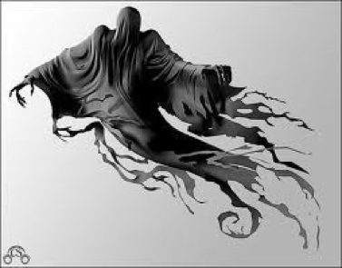

据说这种负责看护阿兹卡班的魔法生物很可怕，凡是它经过的地方，都会被吸去所有快乐，甚至灵魂。他的法术很简单，就是张开大口去吸，这是《哈3》中哈利在火车上第一次遭遇摄魂怪的场景：

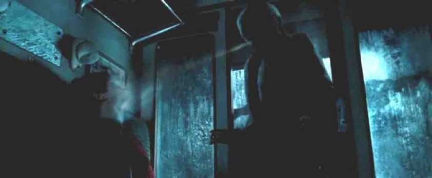

下面我们就从这种简单的法术开始，说明一般魔法运行的道理，再来解析各种咒语的具体含义。为了行文方便，下文把摄魂怪的法术简称为“**摄魂术**”。哈迷注意，这个词原作里没有，是本法师杜撰的新词。

要学摄魂术，首先要理解什么是“魂”？

#### 6\.2\. 魂

《哈利波特》中，“魂”是一个出现频率的非常高的词汇。从第三部的摄魂怪，到第六部的“魂器”horcrux，基本上贯穿了片子的始终。可以说不了解“魂”，就不能理解大部分哈利波特的剧情。

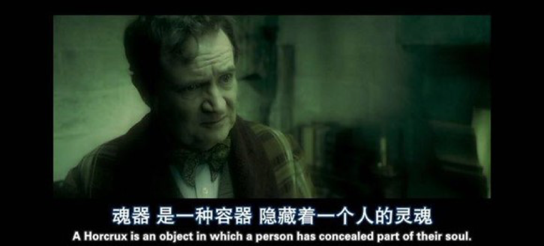

究竟什么是魂呢？

网上传言，魂是一个人在阳光下的影子，如果你影子深，说明你魂浓，如果你影子浅，说明你魂淡。

可惜这只是传言，大家对网上传言要有判断力，老师说的也不行。

魂，或称为灵魂，毋宁说是西方文化中的一个概念。基督教对西方影响深远，现在西方人关于“魂”的概念，也常常用基督教语言来表达：

问一个中国人：世界上有上帝吗？人有灵魂吗？人死后灵魂能进天堂吗？

我和大家一起回答：没有！没有！没有！（省得有人说我传播唯心主义。）

问题是本帖在讨论英国，如果问英国人这三个问题呢？

大部分人在正式场合都会回答三个“有”，然后再加一句，“我是基督徒”。

这就是中西文化深层次的区别之一，也是我们学习西方文化的一个常见的误区。很多离开基督教讨论西方的文章，结论往往离题万里。西方人普遍相信，在具体的物质世界之上，存在一个抽象的、理念的、意义的、精神的世界。这个世界里居住的，就是魂。

**（枯燥的理论部分开始，犯困的同学可以直接跳到下一个加粗字体。）**

其实“魂”的历史远比基督教要长，这个概念从古希腊就开始出现了。第一个在西方哲学史上提出这个概念的，是西方哲学的鼻祖——柏拉图。

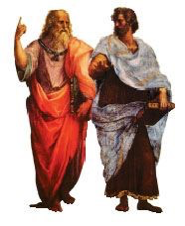

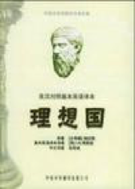

左面这位穿红袍的哲人认为，世界的本源来自于现实世界之外的某个“理念的世界”，人类感官所接触到的现实世界，只不过是这个“理念的世界”不完美的投影。柏拉图一生都在理念世界中寻找完美的政治制度，所以写了一本书叫做“理想国”。这个理念的世界，就是魂的最初栖身场所。

基督教兴起以后，为了充实早期基督教的简单教义，圣奥古斯丁为代表的神学家们做了很多工作。圣奥古斯丁把柏拉图哲学和基督教信仰结合在一起，把“理念世界”升级为“上帝之城”——这也是圣奥古斯丁代表作的书名。

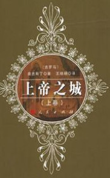

圣奥古斯丁认为世界由“两个城”组成，一座城由按照肉体生活的人组成，另一座城由按照灵性生活的人组成。前者是“尘世之城”，它是撒旦的领域，是肉体淫乱的渊薮，在现世中表现为异教徒，最终必将灭亡。后者是“上帝之城”，它是上帝的“选民”即预定得救的基督徒的社会，这是一座永恒之城，在现世中代表着它的就是教会，它将历千年而至永恒。圣奥古斯丁的学说成功的说服了欧洲人，此后的一千年里，全欧洲都接受了基督教信仰，这座上帝之城里，也住满了人类高贵的灵魂。

宗教改革之后，教皇遭到质疑，基督教在思想领域的垄断地位也一落千丈。为了挽救这些无家可归的灵魂，一个新的哲学巨人康德挺身而出，重新给灵魂找到位置：

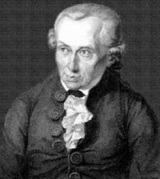

康德哲学体系宏大，复杂精致，哲学界素有“现代西方哲学绕不过康德这座桥”的说法，其最聪明的一点，在于把本体论放在一边，把讨论转到认识论——人的认识能力/理性——方面，所以他的书叫做《纯粹理性批判》。国内一般把康德哲学称之为“不可知论”，可以简单的概括为：知识不是客观的，是由人的认识能力决定的。人对世界的认识能力是有限的，世界的本体即“物自体”是人无法认识的，人只能认识“物自体”给我们的感觉——现象。

再简单一点，康德以抛弃掉上帝本身为代价，保留了世界的二元论。“现象”大体上相当于“现实世界”、“尘世之城”，“物自体”则类似于理想国和上帝之城，存在于现实世界之外，以便居住灵魂。（今年的民诉课给同学们讲了两周康德的《纯粹理性批判》，深感收获极大，民诉中大量难题不解自解，这本书给各位推荐一下。因为本文的简化太过，有点对不起老先生。）

**（枯燥的理论部分结束。）**

柏拉图——圣奥古斯丁——康德是西方、尤其是英美哲学的正统，具体学说虽有不同，始终不变的就是某种二元论。如果你看不懂前面的哲学部分，只要简单记住这一点，**在英国人的文化观念中，普遍相信存在两个世界，一个是物质的世界，一个是精神的世界——意义的世界。**下文中，我们把前者称之为“体”，后者就是刚才说的“魂”。

英美文化特别喜欢描述各种心魔幻境，总是在各种场合顽固的坚持二元论，这种情节在《哈利波特》中可谓贯穿始终。第一部魔法石是给初一的小朋友们看的，里面就有最浅显的二元论的剧情。哈利深夜到披着隐身衣来到塔楼之上，看到一面神奇的镜子：

哈利从里面看到了自己死去的爸爸妈妈。他们好像又和自己在一起了。

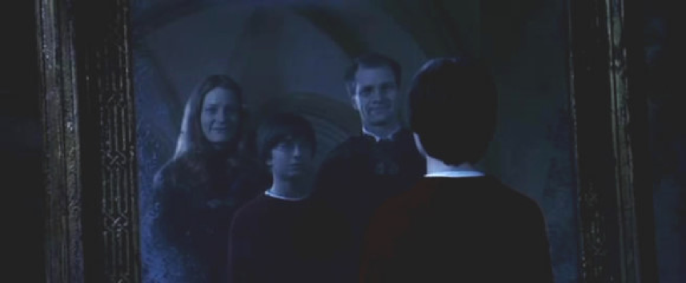

哈利拉来好朋友罗恩，罗恩看到的却全然不同：

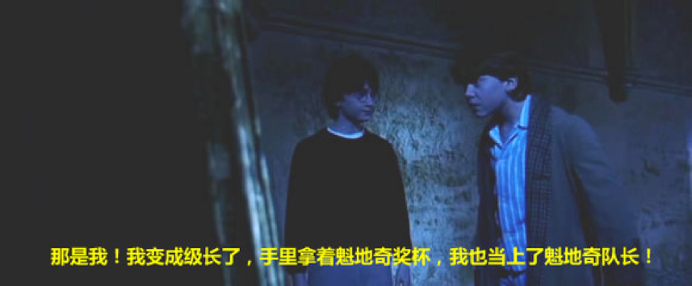

这面镜子叫做厄里斯魔镜（the mirror of erised），Erised是“欲望”Desire的倒写，按照邓布利多的解释，里面看到的是“其实是我们内心深处最渴望的事”。用前面的观点分析，这个镜子里的世界就是一个“意义的世界”，在这个世界里，哈利的爸爸妈妈的灵魂仍然存在，还可以和哈利在一起。

有趣的是，哈4中，哈利在父母的帮助下逃离伏地魔的绝杀，对自己父母的重生还有一线希望。在回到霍格沃茨后，哈利向校长提问关于复活的事，邓布利多的回答是。

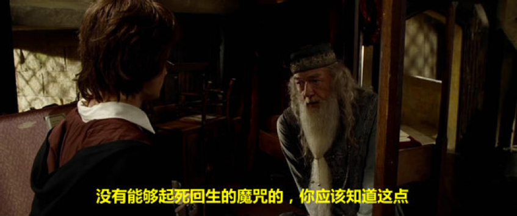

这句话的意思，大体相当于我们中学教育中的观点：“世界上本来没有什么上帝”，英国人在常识方面也和我们没什么区别。但是，不知大家是否想过，在科学如此发达的今天，为什么在西方基督教仍然是国民的主要信仰呢？在我们这些无神论者看来，基督教念念有词“天国、灵魂、末日审判”都两千多年了，物质世界从没有一点点上帝复临的迹象，他们为什么总是相信上帝存在？

**因为“体”和“魂”的划分，是统治者行使统治术的关键，离开这种划分，统治术就不灵了。**

如果没有灵魂，就没法使用咒语了。

#### 6\.3\. 咒语

咒语差不多是电影中最常见的元素了，哈密瓜也经常讨论各种咒语的细节，片中有大量精彩的特技镜头，展现魔法世界中咒语的魅力。

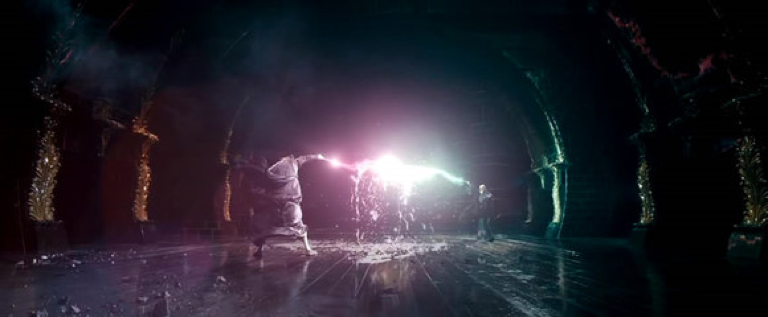

小说中咒语的文化原型是什么呢？或者说，世界上真的有魔咒吗？

咒语确实是存在的——如果你相信灵魂和肉体的划分的话。

我们还是先找一段剧情看一看咒语的基本形态。

哈3，卢平老师的黑魔法防御课。为了对付会变形的怪物博格特Boggart，卢平教给大家一个简单的咒语“滑稽滑稽”Riddikulus。

纳威第一个上场，博格特变作斯内普教授：

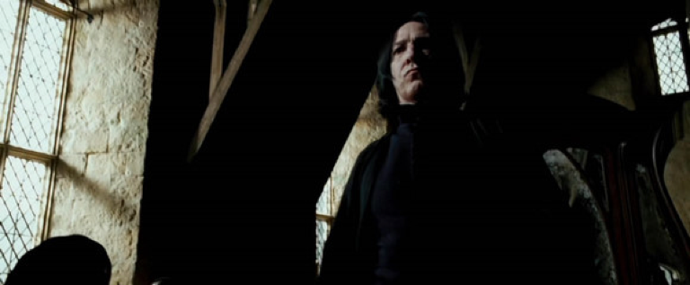

纳威念动咒语，把斯内普成了老太婆。

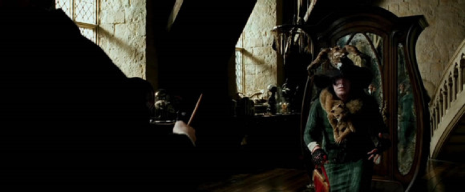

同学们都很开心的使用这个咒语，罗恩给他最怕的大蜘蛛穿上溜冰鞋，帕尔蒂则把大蛇变成木偶。

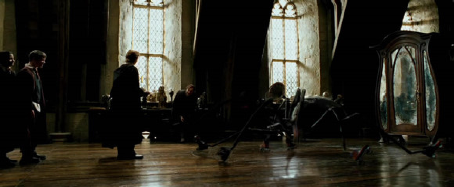

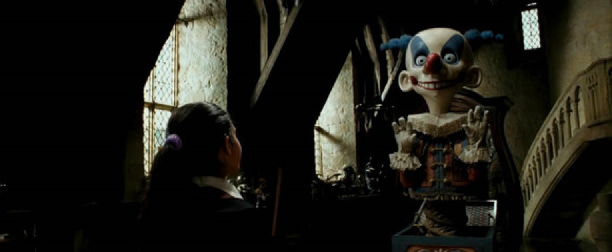

咒语的基本功能，就是“变”——不管什么咒语，反正要改变点什么。客观世界会因为一句话发生改变吗？不会。真正改变的是人的主观世界、意义的世界，如果你相信“意义的世界”存在的话。

简单的说，**咒语就是一种能够把人绕晕、让人服从统治的文字魔术。**

各位没有学过法学的朋友，试试做做下面这道刑法习题：

某甲喝酒后驾车，在路上连续撞死二人后停车，直到警察到来。该怎么判决？

A. 交通肇事罪，有自首情节，有期徒刑三年，缓刑三年。

B. 过失致人死亡罪，有期徒刑三年。

C. 故意杀人罪，无期徒刑。

D. 以危险方法危害公共安全罪，死刑，剥夺政治权利终身。

1

2

3

答案并不重要，关键是各位做这道题什么感觉？

我估计大部分人的感觉是：晕。

晕了你就要请教律师，然后由律师给你一个说法，这个人的生死也就由律师们决定了。这就是统治术。

现在我们请卢平老师帮忙来演示一下咒语的使用过程：

某甲站在卢平面前，这时候他还是个等待审判的犯罪嫌疑人——理论上，还是自由人。

卢平念动咒语：“某甲达到刑事责任年龄，能够辨认自己的行为，主观上属疏忽大意的过失，驾车撞死2人，客观上侵犯了他人的生命权，因此，某甲犯有过失致人死亡罪，判处其有期徒刑三年。”

不用听懂他说了什么，只要知道结果：卢平把某甲从“自由人”变成“犯人”。

某甲变化了吗？没有，改变的是他的“意义”，用前面的说法，就是改变了他的“魂”。那些拗口的法律名词就是咒语。卢平念动一段咒语的行为，就是一种**“把意义从实体中抽取出来的行为”**，也就是本文所说的“摄魂术”中的“摄”。

只要承认了二元论，就会有某种“咒语”之类的东西，作为沟通两个世界的通道。换句话说，只要相信有某种意义的、精神的东西，就可以通过某种文字魔咒，控制这种通道，从而让其他人服从自己。这就是英美国家主流文化坚持基督教信仰的原因。英国的国歌说的很清楚，《上帝保佑女王》，**没有上帝，女王和贵族从哪里来呢？**整个霍格沃茨其实学的都是这么一套东西，法学院的同学，你们的课程也大体如此，等你们的法学知识积累到一定程度之后，就会发现单个的民法、刑法概念汇合在一起，就构成了一种特殊的语言，什么主谓宾、单复数、时态、语态、祈使句、虚拟语气，各种语言学的概念应有尽有。借用另一部美国法律电影《律政俏佳人》中法学教授的台词：

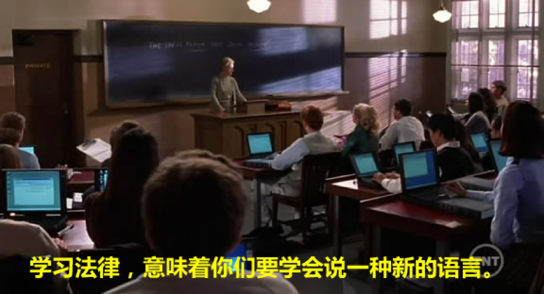

（为了方便行文，本帖关于刑法的内容不是很准确，《犯罪学》也是存在的，只是没有帖子里这样恶搞。具体的法律语言学问题属于专业内容，复杂枯燥，留到课堂里给我的学生讲课，网上恕不详解。）

#### 6\.4\. 摄魂术

如前所述，摄魂术首先是一种“**把意义从实体中抽取出来的行为**”。“魂”和“体”是相对的。我们可以从一个“体”中，抽取一个“魂”，也可以把一个“魂”当作“体”，抽取一个更高级的“魂”，如此重复以至于无穷。比如罗琳阿姨看到一个小男孩产生灵感，撰写了小说《哈利波特》小说，小男孩就是哈利波特的“体”——原型，哈利波特就是小男孩的“魂”——艺术创造；导演大卫•叶慈把小说改编为电影，小说就成了“体”，电影则是导演从小说中摄取的“魂”；我又对电影加以分析，认为霍格沃茨其实是一个法学院，则我把电影当作“体”，这个帖子就是电影的“魂”；也不排除哪个朋友，把我的帖子继续“摄魂”下去。历史没有真相，只是被历史学家们不断书写。关键是，按照康德的说法，对于“体”——物自体——我们是无法认识的，能认识到的只是“魂”——现象。

这有什么意义呢？

意义重大。在这种理论下，唯一的实体不能被认识，总要借助于某种途径“摄取”，**结果，一个“体”可以被摄出多个“魂”。这里面就有了选择，就有了善恶，就有了哈利和伏地魔的区别。**

为了说明这一点，我们再邀请一位魔法师帮个忙，这次请斯内普教授。

刚才卢平老师把某甲变成“三年徒刑犯”，斯内普表示不同意，他也念动了一段咒语：“某甲明知自己喝酒后，仍然不顾危险继续驾车，主观上属于故意犯罪，导致撞死2人的严重后果，其行为发生在公共场所，因此，某甲应按以危险方法危害公共安全罪，判处其死刑，剥夺政治权利终身。”

还是听不懂也没关系，反正斯内普的意思是：某甲去死。

卢平只准备把某甲关三年，斯内普一定要某甲去死。

这样两个魔法师就斗了起来。

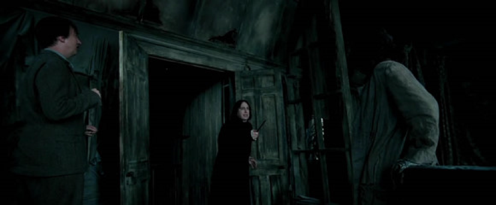

剧中无数斗法的场景，是什么意思呢？

就是两个律师在法庭上辩论呗。

我们随便借张法庭审判的电影截图，简单说明法庭辩论的原理。

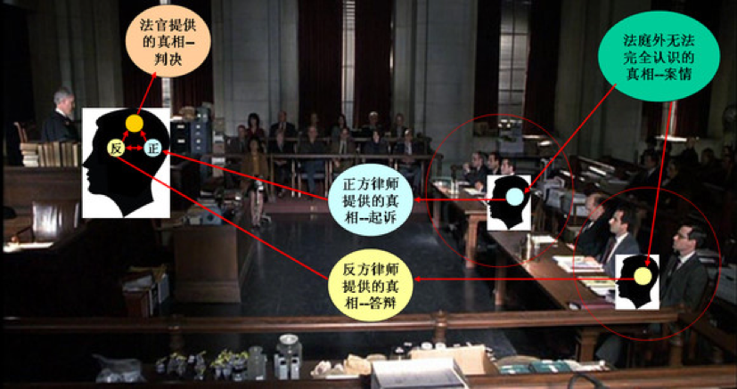

每场审判都有两个律师，比如斯内普和卢平，还要有一个法官，比如邓布利多校长。每个案件都有一个案情，但案情的真相发生在法庭之外，是不能完全认识的，控辩双方律师通过对案情的了解，形成各自的判断，并用法律术语表达出来，也就是刚才斯内普和卢平各自施咒的场景。问题是，“从实体中提取意义”，为了干什么呢？

一个案情有两个解释，必须由法官作出裁决。控辩双方制造的“意义世界”，都要交送法官的内心来检验，也就是英美诉讼法上的“自由心证”。大家知道，律师的工作就是说服法官，两位律师都把案件的“魂”——意义——“摄”了出来，其目的，就是投送到邓布利多的头脑中，压倒对方。

问题是，在邓布利多的大脑中，本来也有一个他自己的主观状态，他的大脑现在就是战场，这里面同时发生了两场战争：卢平希望让邓布利多作出有利于自己的判决，斯内普也是一样。最后，邓布利多以自己的主观意志作出选择，即法庭的判决，同时就决定了谁胜谁败，谁是黑巫师，谁是白巫师。

看明白了没有，胜诉的关键不在于法条——咒语本身，而在于两个律师从“体”中抽取的“魂”，要和邓布多心中的状态发生相互作用。或者说，咒语施放的关键，在于施咒者必须用自己的主观状态，去刺激、影响和控制对方的主观状态。康德的高明就在于此，他让每个人都有自己的主观意志，没有什么超然于物外的人，也就没有什么确定的真相。真相取决于主体之间的主观状态。卢平看到了三角的，斯内普看到了四棱的，邓布利多心里偏偏想着三角的，那就是卢平胜诉了。

下面是摄魂术的完整定义：**施咒者使用自己的主观能力，从“实体”中提取出“意义”，将其投放到对手的精神领域，使其服从自己。**

“摄魂咒”差不多是所有统治者的基本功，可谓无处不在：用在法学领域，就是律师在法庭上辩论求得胜诉；用在新闻和传播领域，就是媒体争取舆论控制权；用在文学领域，就是作品吸引读者；用在市场营销领域，就是让产品吸引顾客；用在教育学领域，就是教师在让学生相信自己的学说；用在科学领域，就是科学家提出各种假说对客观世界进行解释。

现在读帖子的理科同学也不少，关于科学容我多说一句。我一贯反对文理分科，也有点理科背景，在当法学老师之前，我还教过四年计算机，编程数据库什么的，对理科各科不敢说都有了解，但也不是一无所知。很多人误认为只有文科知识才需要解释，理科知识是“确定无疑的真理”，其实在自然科学的最前沿领域，各种假说互相矛盾，真正较量的往往还是解释能力，比如量子物理中的哥本哈根解释和EPR（爱因斯坦-波多尔斯基-罗森）佯谬，很大程度就是个哲学讨论，生物学中的神创论和进化论，也互相揪斗了上百年，也不见得进化论就完全否定了神创论。狭义《相对论》原文我读过，实验都是别人的，爱因斯坦只是提供了一个天才的解释罢了。很多大科学家相信基督教，主要还是能从中获得对自己理论的支持。爱因斯坦：**“没有宗教的科学是盲目的，没有科学的宗教是跛足的。”**

倒是因为公众对科学的普遍信仰，吸引来我的一些修炼统治术的同行，利用这种对科学的无条件的信任，念动“科学科学”的咒语，使用摄魂术来实现各种好的坏的目的。这种情况世界各国都有，比如北美基督教就有一个“基督教科学派”，以科学的名义传播基督教信仰。各位同学，关键还是不能放弃自己的判断。

#### 6\.5\. 斗法秘诀

关于摄魂咒的基本概念，我们已经讲完了，但这还只是法术的表面层次。黑巫师和白巫师都是霍格沃茨法学院的学员，他们对咒语同样熟悉，能使用魔法取得胜利、分出哈利和伏地魔的诀窍才是关键。前面说过，魔法咒语相当于法条本身，法学专业的同学都知道，法条只是法学的初级阶段。学校里，只会讲法条的老师是最一般的老师；高级一点的都在讲各种冷僻的司法解释；最牛的老师，是那种张口“我当年参加立这个法的时候……”的人。法庭上所有的律师都会背法条，为什么有人胜诉有人败诉？用好法条的诀窍并不在法条本身。大家听好了，下面才是本法师的不传之秘：

**法律的精华在于解释，但解释的对象，并不是逻辑，而是人性。**每个律师都必须明白，你在案件中面对的，并非条文和卷宗，而是人——各种各样有具体利益的人。律师的工作，好听一点就是激扬人性的优点，难听点就是寻找人性的弱点（我觉得都是一回事）。每一次庭审的辩论，其实都是对人性的探讨。每一个优秀的律师，都会“利而诱之、乱而取之、怒而挠之、卑而骄之、佚而劳之、亲而离之”的一套功夫。历史上每一位伟大的法学家，也都是深明人性弱点的智者。他们讨论法律问题，不会说“法律规定是怎样”，而是说“法律应当怎样”，说到底，就是人性应当怎样。

因此，施放咒语的关键，不是咒语的正确发音（这方面赫敏很擅长，经常纠正罗恩和哈利的错误），而是施放咒语时候的“精神力”——激扬自己的人性优点，或者找到对手的人性弱点，才能取得法术的成功。

举个例子。还是哈3，卢平教大家用简单的咒语“滑稽滑稽”收服博格特。这个咒语是怎么施放的呢？卢平先教了咒语本身，但这还不够：

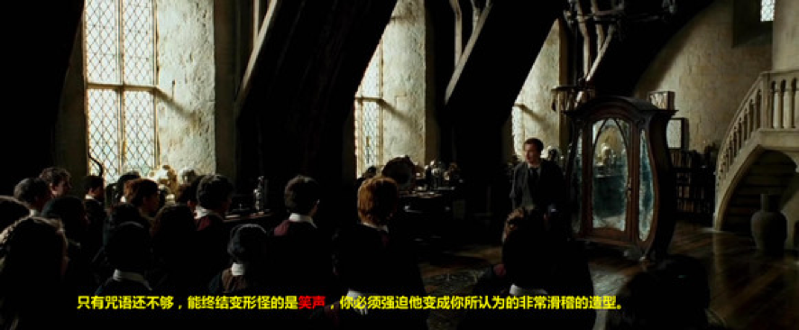

然后大家分别练习，第一个上来的是纳威，他最怕的是斯内普，于是博格特化成斯内普的形状，卢平教他：

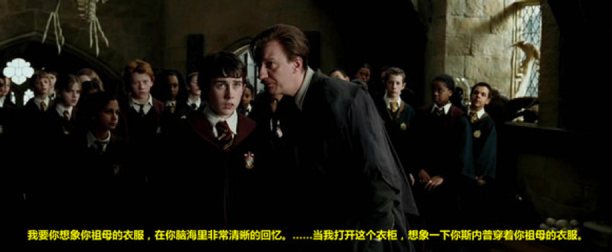

纳威口中念着：滑稽滑稽，心里想像斯内普穿着祖母的衣服的滑稽样，结果，法术成功了，斯内普变成了老祖母。

什么是“笑声”，其实就是对敌人的蔑视。博格特本身，就是一种人性的弱点——恐惧感。只有用内心深处的蔑视，来克服内心深处的恐惧，才能把凶恶的敌人变成滑稽小丑。**越是身处逆境越要豁达开朗。**曹操赤壁兵败如此之惨，华容道上接连大笑三声，十万红军长征，只有八千人到达陕北，毛主席赋诗云“更喜岷山千里雪，三军过后尽开颜”，都是这个原理。假如毛主席诗云：“问君能有几多愁，恰似一江春水向东流”，八千红军也要散伙了。

有趣的是，片中的哈利有极高的天赋，为什么在这堂课上，连罗恩都没犯错的简单咒语却没有学好，还需要卢平帮忙呢？

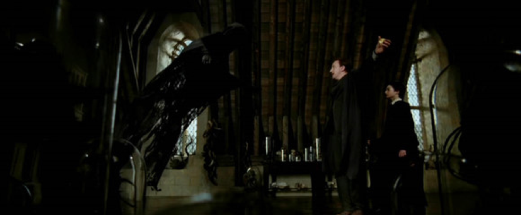

就是因为哈利内心深处的恐惧太深。英美文学有一个基本的叙事模式：塑造一个有天赋的英雄，配上一个性格上的弱点，让他自己征服这个弱点，从而获得人性的升华。哈利自幼失去父母，缺乏慈爱，内心深处深埋恐惧，因此对摄魂怪特别敏感。现实生活中，孤儿出身的人容易成大器，但也容易有冷漠、残忍的人性弱点。整个一部哈3，其实都是在讲哈利怎么克服自身性格的弱点，用快乐战胜恐惧的。他和伏地魔出身类似，都要经过自由意志——自由选择，才成为分出善恶，所谓的选择，就是对人性善和人性恶的选择。

那么什么是人性？

这个问题实在是太大了，各种版本的人性论有上百种，我这个胡扯的小帖子，只是从法学的角度随便说说。这事儿还要请古希腊一位老先生帮帮忙，这次麻烦亚里士多德。

前面提到多比的原型是奴隶，很多细节党给我挑了一大堆毛病，说原著如何如何。我不懂原著，不过各位也不懂奴隶制，奴隶制是西方社会内嵌的元素，永远也不可能消除的。

大家都知道，古希腊是奴隶制社会，古希腊亚里士多德是奴隶主阶级的思想家，一贯为奴隶制辩护。亚里士多德怎么给“奴隶”下定义呢？

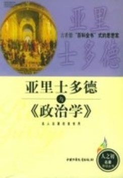

右边这位蓝袍的学者是西方“政治学”的鼻祖，他在《政治学》中对奴隶是这样定义的：

**奴隶是欲望压倒理性的人。**

本宅各种杂书都读一点，不过最佩服的还是四个古人：中国的孔子和老子，西方的柏拉图和亚里士多德，有时候甚至有点嫉妒——他们把道理都讲完了，让我们这些后来者无话可说。亚里士多德的这个定义，与民族和人种无关，与“生产力和生产关系”无关，直接切入人性，再过两千年也不过时。按照这个定义，我在生活中见到过铺天盖地的奴隶，有些人权倾一时，有些人富甲八方，有些人名动天下，有些人会用法文背诵原版的《人权宣言》，只要把欲望放在理性之上，在我眼里都是奴隶，高学历高智商高科技的现代奴隶。

人性无非是喜悦、愤怒、忧虑、思念、悲痛、恐惧、惊吓，人性无非是饿了想吃，困了要睡，生下来找奶，小时候要糖，大了想结婚，老了怕生病。一句话：欲望。历史上的奴隶怎么来的？日耳曼人和凯尔特人两军对峙，只有勇往直前才能取得胜利。问题是前面长矛如林、飞箭如雨，谁没有临阵脱逃的小念头？两军的较量其实就是人性的选择：理性压倒了欲望的一方成为统治者，欲望压倒了理性的一方成为奴隶。

顺便说一句，亚里士多德在《政治学》里紧接着说了另外一句话，《律政俏佳人》中的哈佛法学教授也曾引用（注意黑板上的英文）：

这句话是“西方法治理论”的源头，可惜不是每个引用它的人都明白“法治”的真实含义。我见过太多的用“法治”名词装点自己欲望的人，左派右派都有，**有些人的法治理论，简直是没有理性的激情。**按照亚里士多德的看法，这些人也只是奴隶。

因为每个年代都不缺乏这样的奴隶，因此才有了他们的领袖伏地魔。伏地魔是选择欲望的人，准确的说，是选择挑逗人的欲望、用邪恶控制别人的人。哈利则相反，是选择用理性达到至善的人。

下面可以解析片中的几个咒语了。

#### 6\.6\. 夺魂咒和摄神取念

按照电影，夺魂咒Imperio是三种不可饶恕咒之一，对人使用后会使对方迷失心窍，完全按照施法者的意图做事。摄神取念Legilimency则是大脑封闭术的相反法术，使用时施咒者直视对方，读取对方的感情和记忆。其实这两个魔法差不多，都是从摄魂术中变出来的。简单的说，就是精神控制——通过制造幻觉，煽动人的欲望，从而获得对人的控制。

理性无法控制欲望，最典型的例子就是彩票。彩票原理就是下面一个数学模型：你给博彩公司1元，他找回0.9元，你再给他0.9元，他再找给你0.81元，如此循环往复，差额就是博彩公司的盈利。偶尔一次可能会发大财，但是学过一点概率论的人都知道，久赌必输。

为什么还有博彩业的存在？就是因为人总有不劳而获的欲望，而理性压不住而已。世界各国的博彩业，都是在穷人社区比较发达，也是这个原因。每次在媒体上看到博彩业的软性广告，诸如某某巨额中奖之类，我心里就小声念着，这里有一个伏地魔。

我上法理课的时候，经常做些课堂讨论，设计某种和伏地魔的咒语类似，用利益做诱饵骗人上钩的命题，结果，也几乎次次成功。

比如说我问同学们：“国家是否应当立法，在高等教育阶段实行义务教育，或者说，国家是否应该免除大学生的学费”？课堂上肯定是一片哄闹，绝大多数人表示赞成。接下来：

师：你们是否认为，大学老师应该不发工资？

生：不是。

师：那么大学老师的工资，还有水电、机房、图书馆的费用——也就是教育费用，应该由谁负担？

生：政府。政府有提供免费教育的义务。

师：政府自己创造财富吗？

生：不创造。

师：政府的钱来自哪里？

生：纳税人。

师：你们的父母是纳税人吗？

很多同学开始不说话了。

师：如果把国民按照收入划分成高中低等，只有中等收入以上的才会纳税。你们的家庭是贫困家庭吗？

大多数同学摇头。

师：所谓免费的义务教育，并不是教育不花钱，而是政府向你们的父母要10块钱，4块钱给你们“免费”，3块钱补助贫困家庭的子女，3块钱是政府运行的成本。绝对贫困家庭可以受益，数量等于纳税人的转移支付减去政府运行费用。对大多数中产阶层以上家庭的同学来说，不如直接掏4块钱学费划算。中学阶段你们已经“被义务”过了，大学阶段还愿意继续吗？

这个推理并不复杂，大多数同学都能明白，但是我再换些题目问一问，比如：各省高考分数线不同是否违反我国宪法？是否应该立法禁止女性就业歧视？政府能否干预房地产市场、设置最高销售价格？温州动车事故，应该按照违约赔偿还是按照侵权赔偿？还是有很多人上当。人性中都有贪婪的一面，只要涉及到自己的眼前利益，很少有人能够坚持理性。

问题是，普通人固然无法克制自己的欲望，统治者却应该明白这些道理。如果身为统治术的修炼者，却故意去煽动普通人的欲望，靠空头支票来实现自己的某种目的。作出这种选择的人，就是伏地魔了。

回到电影。片中使用夺魂咒和摄神取念这两个咒语的镜头不多，我们借哈1的结尾哈利第一次面对伏地魔的场景客串一下，道理是一样的。

哈利来到地下室，魔法石藏在厄里斯魔镜里。伏地魔急切的想找到魔法石，就用镜中的影像诱惑哈利，哈利又一次在魔镜中看到了自己的父母。

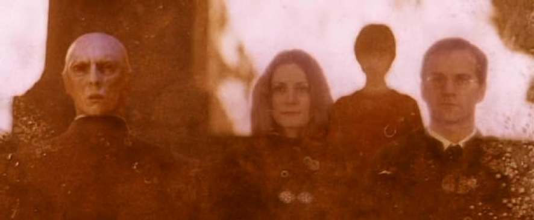

伏地魔：告诉我，哈利，想不想再见到你爸妈？只要我们合作，就能让他们起死回生。我只要求一样东西作为回报，面对现实吧，哈利，世上并没有绝对的善与恶。

魔鬼从来都是这样，许诺给你需要但不可能实现的东西。哈利最缺乏的是亲情，伏地魔就给他制造了这种幻象，如果哈利不能控制自己和父母重逢的欲望，那就上了伏地魔的大当。没有什么能够起死回生的魔咒，一旦交出来魔法石，父母是回不来的，伏地魔却回来了。

死人不能复生，这是个简单的判断，但是不知多少人因为有切身的利益而迷乱。好在哈利虽然年龄很小，但在大是大非的问题上立场却坚定，没有被伏地魔的摄魂术骗倒。对付伏地魔的这种骗局，大家不妨一起学习哈利：

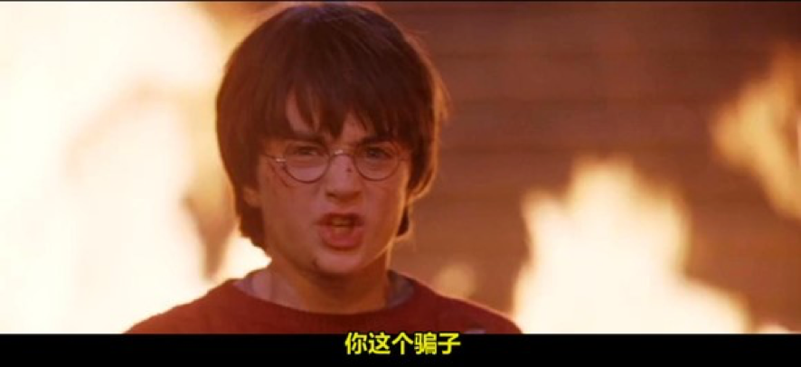

#### 6\.7\. 大脑封闭术

同理，哈利学习的几个白魔法，都是教人怎么控制欲望的。

第五学期的时候，哈利发现自己内心和伏地魔有“联结”，罗恩爸爸被蛇咬伤，哈利感觉好像自己就是那条蛇。校长邓布利多于是专门让斯内普教授给他一个人开了一门课，叫做大脑封闭术Occlumency。关于这个法术，斯内普是这样介绍的：

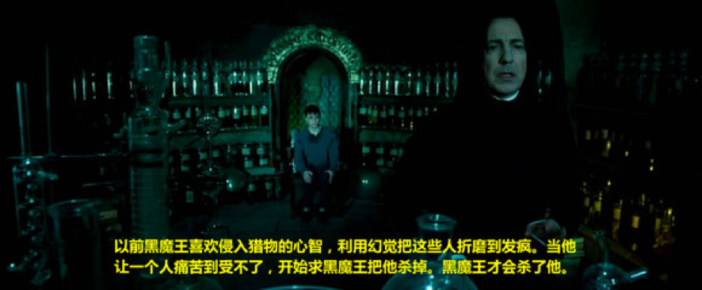

大脑封闭术是摄神取念的反法术，上课的时候，斯内普模仿伏地魔使用摄神取念，试图读取哈利的隐私：

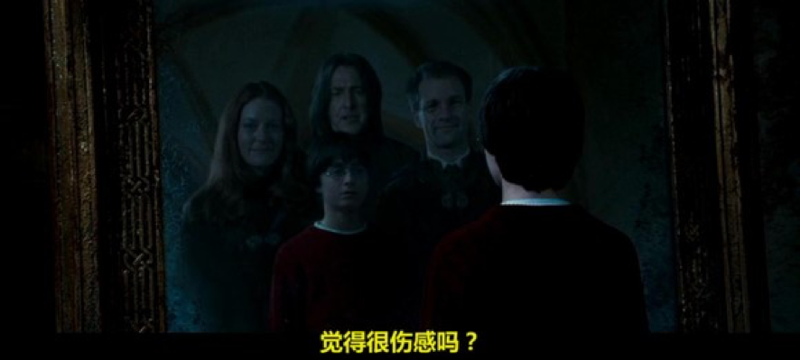

哈利内心深处的欲望，比如又和爸爸妈妈在一起了，又浮现了出来，这就给侵入者以机会。斯内普不停的让哈利集中注意力：

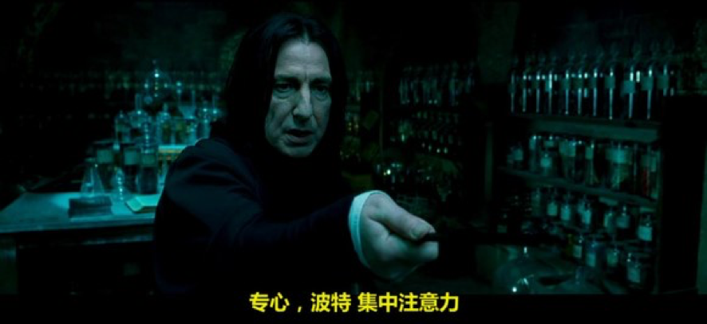

前面说过，伏地魔黑魔法的精华，无非是制造幻想，挑逗各种欲望。大脑封闭术的关键，就是反其道而行之，用理性克制自己的欲望，做到“泰山崩于前而色不变，麋鹿兴于左而目不瞬”，集中精力，控制自我。这一点说起来容易，但做起来很难。

举个比较极端的例子。我在《国际法》备课的时候，曾经读过一些关于东京审判的材料，其中有一段律师辩护，堪称非常邪恶的案例，不知道这里讨论是否合适。

大家都知道，侵华日军曾经强征日本、朝鲜、台湾和大陆的妇女充当随军慰安妇。各位可以用百度搜索先搜索些相关资料，尤其是受害人的陈述，增强一下愤怒感。

东京审判的时候，日军慰安妇问题曾被检察官作为日军战争罪行的一部分提起公诉，而日本律师为此指控进行了辩护，主张：日军设置慰安妇制度是无罪的。日本律师的辩护意见最后被法庭采纳，因此东京审判中没有关于慰安妇制度违反国际法的认定，日本政府也一直以此理由拒绝对慰安妇进行赔偿。不知各位法学专业的同学，是否能猜到日本律师的辩护词。

慰安妇问题现在仍然是个经常引起争议的话题，我这里毫无为日本军国主义翻案的意思，只是想从法学的角度说几句。反正我看了辩护词之后，深感惭愧，自己“大脑封闭术”修炼的还是不够——个人的欲望容易控制，一旦涉及整个民族，仍然不能免于感官刺激的干扰。非专业的同学对律师的印象一般停留在“保护无辜、伸张正义”层面，专业领域的同学稍好，都被老师教育过：“大多数刑事案件的当事人都是有罪的，但律师应该给他们提供罚当其罪的辩护”。但是，即使是在法学领域摸爬滚打多年的人，也不是每个人都能接受对慰安妇问题的“理性考验”。

该辩护的要点有二：平时强奸无死刑，战时军人无徒刑。具体论证比较复杂，为了避免形成不良的舆论影响（比如什么“大学老师公开替日本侵略军辩护”之类，我可承担不起），不做更多展开。专业的同学可以自己推导，非专业同学也请按下你们的好奇心，不要随意联想。我前面说过，法学研究必须直面邪恶，但这有一定危险，需要循序渐进的训练，违反次序会走火入魔的。另外，法律不追究不等于受害人不愤怒，比如某未成年人残忍的杀害了一个人，依法不能判处死刑，但不能说受害人家属不能在法庭上表达情绪，因此中国方面一直在进行的慰安妇诉讼是有意义的。但是，这里面也确实有人在故意煽动民间情绪（目标很复杂，反日、反华、反现政府都有）。**关键是，统治者的决定必须理性，不能受个人感情的影响，**影响了对中日关系的基本判断。孙子云：主不可因怒而兴师，将不可以愠而致战，就是告诫统治者要好好修炼大脑封闭术。

从某种意义上说，理性是反人性的，甚至可以说**有时理性是残酷的**。但只有经受残酷考验的人，才能成为霍格沃茨的合格毕业生。片中哈5中哈利通过了斯内普的教学之后，在哈6中有两段呼应情节，很能体现这种“残酷的理性”。哈利波特的剧情是逐渐深入的，魔法也是如此。

邓布利多带哈利寻找伏地魔的魂器挂件。他们深入海岛的地宫，几经周折，终于找到装着魂器的水晶盆。但是，水晶盆里装满有毒的水，为了拿到魂器，邓布利多告诉哈利：

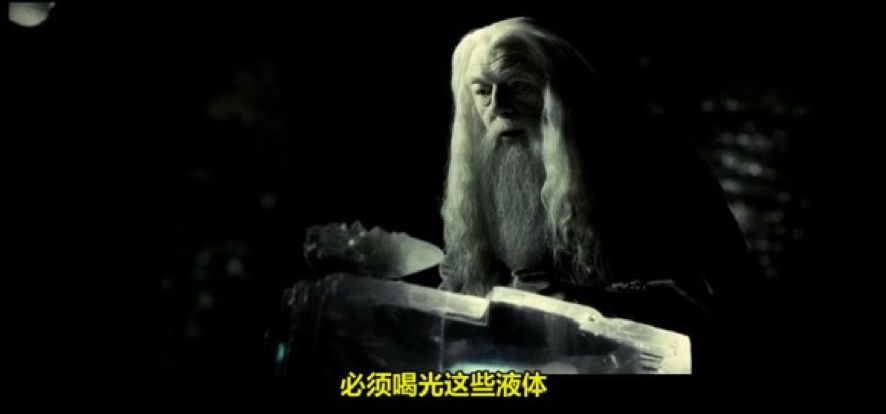

喝下这些水会产生各种痛苦和幻觉，甚至失去对心灵的控制，因此邓布利多交给哈利一项艰苦的任务：在自己失去控制的时候强迫自己喝下毒水。果然，邓布利多喝到一半，已经痛苦的不能继续，哈里强忍心中的刺痛，给老校长灌下毒水。

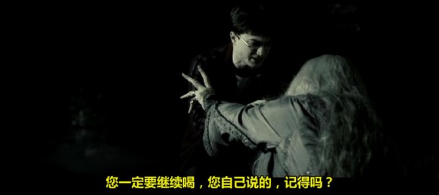

不知道大家看这一幕的时候，是不是有一种一根针在不停的扎自己的感觉？观众能感受到，哈利的痛苦不是在肉体，而是在精神上。哈利是孤儿，邓布利多在他心中相当于父亲，现在他却必须做这种伤害老校长的灌毒工作。这就是残酷的理性的考验。但唯有经过这一考验，哈利才能在大决战中直接面对伏地魔。

哈6结尾，另一个大脑封闭术大师——斯内普的处境也同样如此。邓布利多中毒后，生命已经所剩无几，因此布置斯内普杀死自己，以取信伏地魔，做白巫师在食死徒中的卧底，准备迎接大决战的关键时刻。这是一招苦肉计。

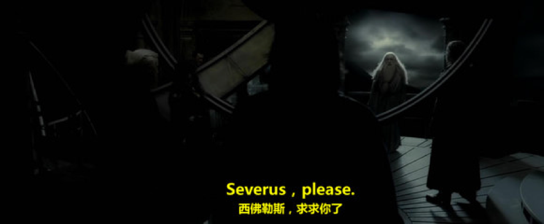

面对相处多年的同事、学生时代尊敬的师长，斯内普没有说一句话，只是有个非常悲壮的表情：

然后使出魔法，杀死了邓布利多。

结局大家都知道。斯内普的卧底工作在哈7中大决战中非常关键，但斯内普作出这个选择，本人内心深处的痛苦是可想而知的。正因为如此，也在有了哈利在“19年后”回忆斯内普的那段精彩台词。哈利波特的故事是教英国的孩子们怎样成为贵族/统治者的，大家不要以为贵族是个随随便便的职业，铸造一个合格的统治者，需要毁心毁骨，百炼成钢。没有大智大勇，是不能承受的。

#### 6\.8\. 守护神咒

当然，统治术也不是一味的残忍。人性中有邪恶的一面，也有光明的一面，成功的法术，还要激扬人性的善。说实话，片中的斯内普是邪中有正，并不完全是正面人物（呵呵，这也和他的血统有关，先买个关子），他的法术虽然不是黑魔法，也是属于阴暗边缘。片中对抗黑魔王的摄魂术，也有相应的光明法术，就是守护神咒Expecto Partronum。

守护神咒是哈三中的情节。因为哈利不能独自面对摄魂怪，因此卢平专门给他传授了一个高级咒语：

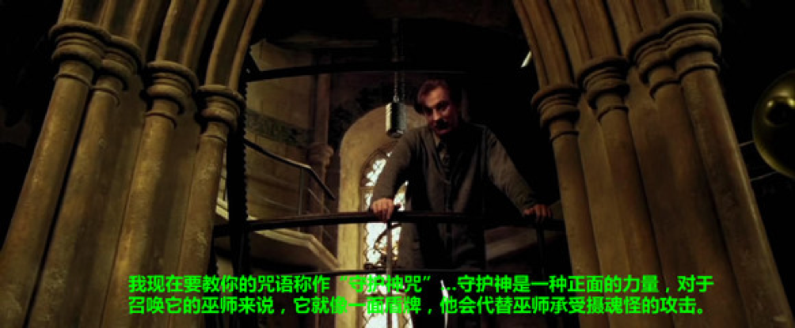

这个咒语施法的要诀，是快乐。

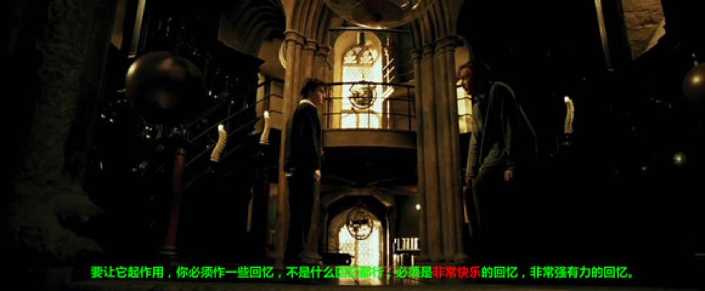

快乐是一种“善的人性”。哈利不能面对摄魂怪，根源在于幼小时受到的伤害，进而带来了内心深处的恐惧，所谓“魔由心生”。对付恐惧，快乐是最好的办法。

进一步说，快乐从哪里来呢？卢平老师接着教哈利：

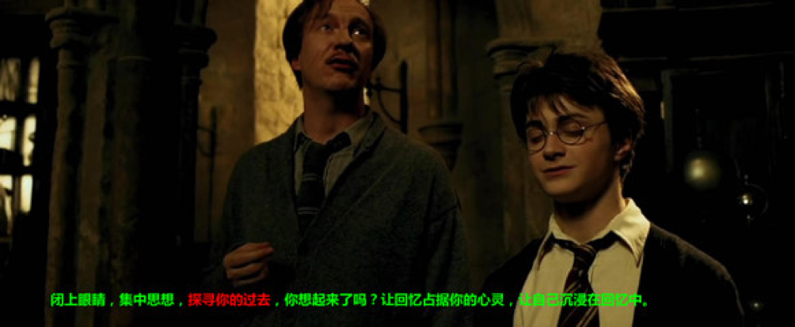

快乐来自对过去的记忆。片中哈利学习这个咒语第一次失败了，因为他只回忆起自己第一次骑扫帚的场景，这还不够快乐，第二次哈利回忆起自己的爸爸妈妈，才成功的使用了这个魔法。

哈三的后面，哈利在湖边真正面对摄魂怪的时候，他开始的时候仍然不够坚强，被摄魂怪逼到绝路，小天狼星布莱克已经看起来死去了，这时候，远方出现一个“守护神”：

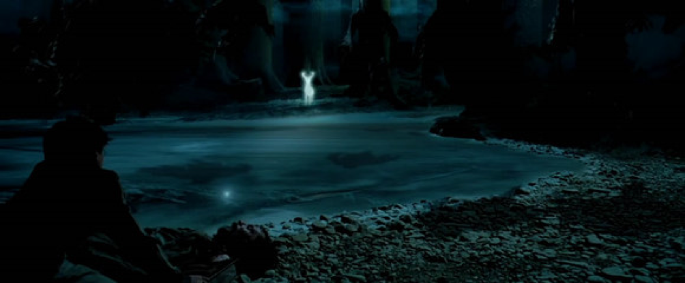

哈利的守护神是一头牡鹿，他一直以为是自己的父亲召唤出来在帮助自己。哈3的结构差不多是7部中最精巧的一部了，后来通过时间流转器，哈利才知道这个“父亲”其实还是他自己。

守护神咒的关键，是从过去的回忆中找到快乐，并认识到这种回忆其实是藏在你内心深处的。

英美文化中有一种很特殊的历史感。他们很重视经验的传承和积累，前面说的重视血缘、出身，其实都是重视历史的结果。在法学上，英美法是个非常重视历史传承的体系。众所周知，英美法属于判例法，不像大陆法系那样依靠明确的法律条文，而是将条文蕴含在一个个历史形成的判例中，法官在判词中引用中世纪国王的诏谕，甚至罗马、希腊和希伯来的典故，都是很常见的。在英美文学中，主人公面临困境，也常常会向自己的祖先求助。很多美国电影中有这样的镜头：主人公面临极大的压力，去华盛顿、林肯的雕像前坐一夜，或者抚摸着去世的父亲的遗物凝神半晌，然后豁然开朗，重新站了起来。哈利波特中，还专门设计了一个帮助回忆历史的魔法道具：冥想盆。

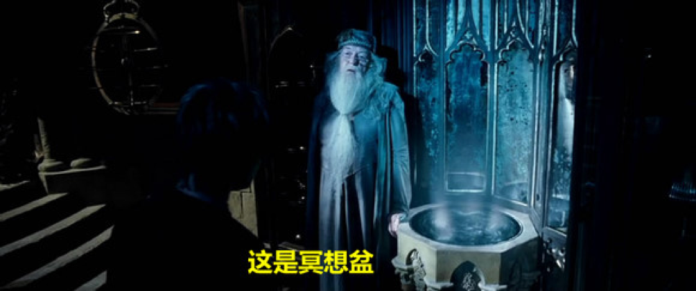

抱歉各位，今天的帖子挺长的，结尾我想跑一下题。说到对历史的偏好和“历史感”，我们中国人并不陌生，也一向以自己悠久的历史而自豪。中国现在有很多问题，但是，我不认为简单的照搬西方就能够解决。前面说了，按照康德的理论，意义和实体是分离的，**我们并不能看到英美文化的“物自体”，而只能看到英美文化在我们的脑海中的“投影”。**如果你不能明辨是非，被自己的欲望所迷惑，你看到的仅仅是“你自己想象中的英美文化”，因此简单的照搬等于什么都没有改变。关键是提高自己的认识能力，或者说提高对本民族文化的把握能力。

说点个人的体验。我这个系列帖子里面知识点很杂，经常在各个学科中串来串去，不过我早就公开自己是个法学教师，这里请各位猜猜，我在法学系是教那门课的？

不好意思，虽然通篇在谈论英美文化，其实我的研究生专业是“中国法制史”，这也是我的主讲课程（这是个很冷的理论法学小专业，读起来艰苦枯燥、就业也不好，不鼓励法学本科同学报考）。我个人的感觉，如果说我能对西方文明作出一些和流行观点不同的判断，恰恰是因为我对中国历史比较熟悉，能依靠自身的“洞察力”（insight，内在的观察力），过滤掉一些浮在上面的泡沫。

比如前面谈到的英美文化中的“歧视”discrimination问题。很多国内的著名学者，长篇大论的宣扬美国的各种平等。美国到底是不是一个种族歧视的国家？中国史看多了，我觉得这种“优秀文明看不起落后文明”的心态，根本不是什么需要藏着掖着的秘密。在古代中国领先东亚的时候，儒家学者一直是这样思考问题的。

司马光的巨著《资治通鉴》，我一直把它当作法学书来读，因为里面是各种统治术的大全。这本书比较厚，全文294卷，每天睡前用半小时时间读两卷，读一遍差不多需要半年时间。至今我读过8遍，远远不敢说读懂，只是对第一页第二句话有点感觉而已：

《资治通鉴》第一页第一卷第一句话是一个历史事件：

初命晋大夫魏斯、赵籍、韩虔为诸侯（韩赵魏三家分晋）。

下面第二句话是司马光的评语：

臣光曰：臣闻天子之职莫大于礼，**礼莫大于分，分莫大于名。**

这句话差不多是《资治通鉴》的总纲，也就是儒家反复强调的“名分大义”。什么是“名分”？针对不同的对象（名），进行有差别的对待（分）。不就是discrimination吗？

再举个例子。本篇刚刚分析过，哈利波特中魔法斗争中，体现的英美基督教文化的观念是“控制欲望，坚守理性”。我为什么得到这个结论呢？**“存天理，灭人欲”。朱熹。**

司马迁作《史记》，里面舍生取义、杀身成仁的贵族意识比比皆是。孔子授六艺，礼乐射御书数，中国传统教育何尝又少了体育精神？现在有些人把中国历史贬低的一塌糊涂，称之为“专制的历史、吃人的历史”，然后跑到自由女神像下去歌颂他心目中的民主自由，我只能说，这种人既不懂中国，也不懂美国。找我要书的朋友不少，《史记》和《资治通鉴》都不算是什么秘籍，大家如果有时间不妨读读，我觉得里面的营养比很多流行读物更丰富，文言文也很优美。

大家都知道，鸦片战争后的中国曾经遭到过巨大的历史创伤，直到现在，有些国民的心态仍然没有恢复正常，每逢一些国内外争议话题，或者亢奋的不知节制，或者谦卑的缺乏尊严。如何找到我们的文化自信，让我们再来复习一下卢平老师的教诲：“**你必须做一些回忆，非常快乐的回忆，强有力的回忆……闭上眼睛，集中精力，探寻你的过去，让这种回忆占据你的心灵，让自己沉浸在回忆当中。**”

只有深入理解我们的祖先和历史，抓住我们的文化的根，才能驱散内心深处的恐惧，面对各种挑战。

（跑题结束）

翟按：本篇主要是想给大家介绍英美的主流哲学，尤其是柏拉图-圣奥古斯丁-康德这个系列，借电影串起来而已。只是这一篇太长了，上一篇结尾伏地魔的问题，只好放在第7篇中。本篇没有提到赫敏，因为情节上主要是分析哈利和伏地魔之间的魔法斗争，这两个人同出一源，属于统治阶级内部的核心价值观的选择，在这个层面上，赫敏基本是没什么戏份——电影里里涉及“意志力”、“精神力”的魔法，大体上都与赫敏无关，她擅长的魔法比如修眼镜、开锁什么的小把戏，也实在没什么解读价值。如果8、9篇如期完工，可能会分析哈利和赫敏之间的对比。最后一篇10是集中毁赫敏的，保证让各位原著党足够愤怒，人人有抡着斧子砍我的冲动，我是不会跑题的。

另外一个理由是，我和大部分中国观众一样，也挺喜欢演赫敏的小演员的，就不篇篇追着毁她了。

参考书目，给各位要书的朋友：《理想国》、《政治学》、《上帝之城》、《纯粹理性批判》、《论语》、《道德经》、《史记》、《资治通鉴》、《皇帝新脑》。

### 7\. 霍格沃茨的敌人

翟按：本篇原是第六篇的结尾部分，太长了分为两段。本篇的内容是讲伏地魔的，和赫敏关系不大，喜欢原著的朋友请千万留步，别再追问我“为什么不讨论赫敏的婚姻”了。全文共10篇，8、9讨论赫敏的性格，10讨论婚姻法，里面集中讨论赫敏的婚姻问题，只有这一篇例外。

第六篇讲哲学，总是很枯燥的，但哲学原理威力很大，能解释很多东西。今天这一篇分析伏地魔的文化原型，顺便介绍一下英美文化中的“敌人观”，方法上还要扯到摄魂术。刚才的法学课意犹未尽，我想再讲一堂课，**不过这次改讲国际政治学**。在我工作的单位，这两个系属于一个学院，我也给国政系的同学们上过课，深感这两个学科之间的联系之重要：法学（内政）是国际政治的内在支持，国际政治（外交）是法学的外在环境，两者互为因果，密不可分，很多问题必须通盘考虑。

不过今天的视角有点特别，和前几篇都不一样。我以前读书的时候，曾经自己给自己开过一门“正邪逆转”的思维训练课，就是读任何一本书，都从作者视角相反的方向出发思考问题。比如读《水浒传》，强迫自己用书中的材料写一个“高俅传”，为高球迫害林冲进行解释；读《红楼梦》，试着论证为什么薛蟠为什么无需为打死冯渊负责；读二战史，从法西斯阵营的角度出发，看看希特勒该怎样才能征服世界；读《奥本海国际法》，则假设自己是越南政府，能提出多少对南沙主权的理由。这些想法当然都很邪恶，但是，一旦从反面思考后，很多正面的问题会得到更深的认识。建议准备做律师的朋友试试，可以帮你猜到对方的辩护词。当然，这有一定危险，转过去还要转回来，不要最后成为相信“世界上没有绝对的善，也没有绝对的恶”的伏地魔，大家小心。

因为今天讲国际政治，所以我也把视角逆转一下，请大家注意，前面都是从英国人的视角出发的，总是在说“英国人认为……”，因此有人感觉我在宣扬种族歧视。现在变成从英国人的对手的视角，说的是“我认为英国人是这样的……”，看完后估计有的朋友会觉得我像个愤青了。按照英国人的视角，第六篇已经分析过，伏地魔的文化原型，就是人性的邪恶面；这一篇的结论却完全相反，伏地魔并不邪恶，倒是个可怜的悲剧英雄。两个结论看起来相反，实际上并不矛盾。就像有人看到英美的强盛，因此主张向他们学习，有人看到英美的霸权，因此主张和他们斗争，我觉得这两句话都没错，关键是，**人需要有多角度看问题的能力。**

下面正式开始。本篇叫“做霍格沃茨的敌人”，毫无疑问，是讨论伏地魔的。麻烦伏老师再出场一次：

我们的问题是，伏地魔的文化原型是什么？

只会分析头发的同学很恼火，伏地魔没有头发。

更多的同学留言，从剧情看，伏地魔最大的可能性是“纳粹”，比如伏地魔爱搞种族歧视，喜欢个人独裁，食死徒的宗旨就是以麻瓜为敌，一身黑袍像纳粹德国的冲锋队的打扮，等等。这方面素材挺多的，就不举例子了。

不过，爱穿黑袍的不仅仅是冲锋队，比如下面这张图片。

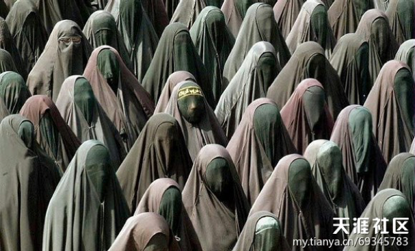

第6章留了个尾巴，看看大家能否把伏地魔和伊斯兰教进行联想，结果很多人连这张照片代表伊斯兰教都看不出来，郁闷的我不知说什么好。伊斯兰教现在是英美最大的两个国际政治问题之一（另一个是中国）。冷战刚刚结束的1993年，亨廷顿就撰写了一篇《文明的冲突》的论文（后来扩展成专著《文明的冲突与世界秩序的重建》），**提出美国的主要国际竞争对手已经从苏联转为伊斯兰教和儒教国家**。亨廷顿这个名字外专业的人可能不熟悉，这里推荐一下，他是美国政治学界的泰斗，是唯一一个还活着就在《中国大百科全书•政治卷》拥有专门词条的美国政治学者。老姜非常之辣，8年之后的911，简直是给他的文章做注释的。

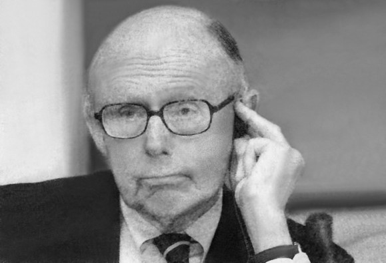

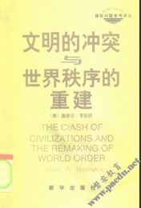

大家知道，哈利波特第一部书是1997年出版的，电影是2001年上映的，然后一直热到现在。大体同一时间，美国在伊斯兰世界打了两场战争（伊拉克、阿富汗），接下来还有叙利亚和伊朗。第二篇中盘点了哈利波特中的各国文化，唯独伊斯兰教文化没有出场。要知道，英国6000万人口中有200万穆斯林，换算到中国相当于4000万人，大部分聚集在伦敦等大城市，已经压倒北爱成为当前英国最大的民族问题，可是整个电影中，直接的伊斯兰教的元素只剩下这张照片：

如果大家仔细看，为了表现埃及风格，男人们穿上了阿拉伯人（准确的说是埃及贝都因人）的服饰，但两个女人却完全是英国打扮。因为英国的电影观众，绝对无法接受莫莉和金妮穿伊斯兰女人的蒙面装。原因在于，伊斯兰女性服装一直是基督教各国的心理敏感点，轻易不能碰的，法国甚至立法，禁止法国的穆斯林女性出门戴头巾。我前面一张图片要是发到欧美论坛上，早就吵翻天了。

其实哈利波特中还是有伊斯兰的元素的。2009年上映的哈6混血王子的开头，就是一大段食死徒大闹伦敦的镜头：

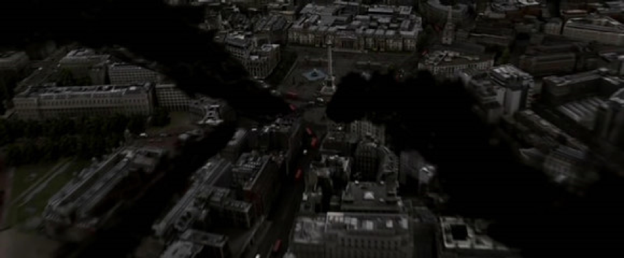

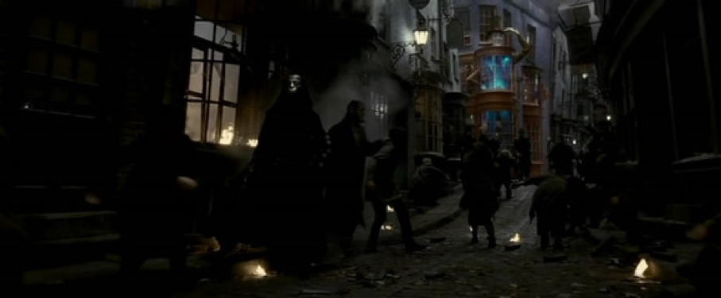

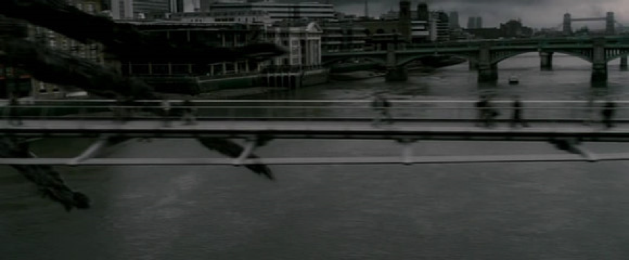

这段场景的原型是2005年7日7日的伦敦恐怖爆炸案，这起基地组织策划的自杀式爆炸一共引爆了7处炸药，死亡56人，是911之后最大的恐怖袭击之一。2009年的伦敦观众，是不会忘记这件惨烈的伤心事的。恐怖分子的形象，对应到电影镜头中，就是这些穿着黑袍、蒙着脸、飞起来一溜黑烟的食死徒。

有同学问：那么宅老师的意思是——伏地魔的原型是伊斯兰教？

我的回答：不是。我第五篇结尾说的很清楚，**伏地魔的原型是一个幽灵，在欧洲各地徘徊，也可以说，是个鬼魂。**

呵呵，上一贴的留言里，很多同学都能从《共产党宣言》的开头找到这句话的出处，接着有些同学推测我说伏地魔的原型是共产主义、共产党人，不过这些同学心里有些奇怪，怎么剧情中一点都看不出来呢？

你们想的太多了！

说伏地魔是幽灵，是因为剧情。就在哈利波特和魔法石的结尾，伏地魔的化作一阵青烟般的幽灵，呼啸而去。

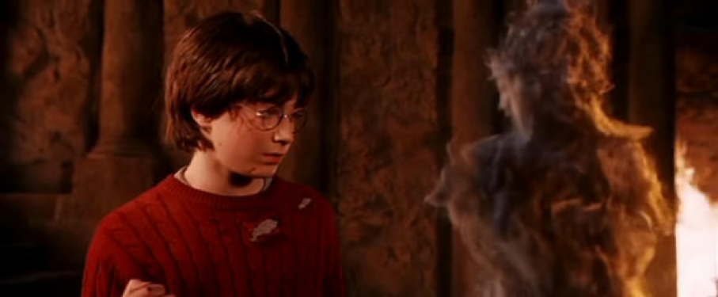

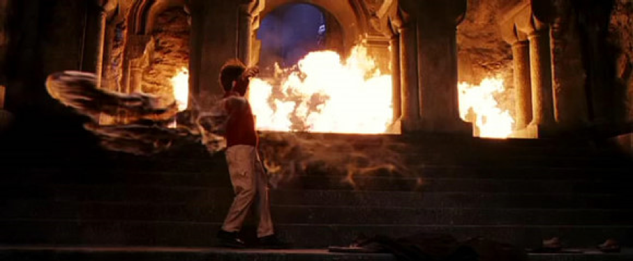

不过多想一点也没关系，我再替你们更多想一点。

不知各位想过没有，马克思为什么说“一个幽灵，共产主义的幽灵，在欧洲的上空徘徊”这句话呢？至少在逻辑上，这意味着在马克思之前，欧洲已经有共产主义了啊。可是不是说马克思创立了科学社会主义吗？

确实是马克思创立了马克思主义，但马克思主义并不是没有历史渊源的。只是这个渊源没有实体，经常变形为各种幻象。先给各位看张图。

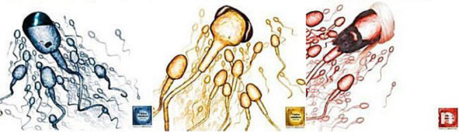

这是西方的一则重口味广告。很恶毒。攻击伟大领袖毛泽东，将其与希特勒和拉登并列，引起了本教师的强烈愤怒，特贴出来，和大家一起批判。

很明显，这个广告有违事实。为什么把伊斯兰恐怖主义、纳粹党、共产主义放在一起？希特勒猖獗在上世纪40年代，拉登炸楼已经是21世纪，地点上也距离十万八千里，离得太远了吧。

确实，这三个人本身确实没有什么联系，但是因为有了英美国家，他们就有联系了。

**他们都是英美国家的敌人。**

敌人。

敌人。

敌人。

今天我们就来讨论一下英美文化的“敌人观”，这是埋在英美基督教文化中一道很深的线索，在历史上，“敌人”这个词还有一个更加令人望而生畏的叫法：异端。

不好意思，事情的起源还在《圣经》里，就在第一页，“创世纪”第三节。

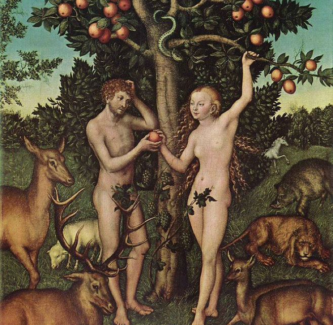

这段故事一般称为“失乐园”，在西方无人不晓：上帝创造了人类的始祖亚当夏娃，并且建立了伊甸乐园给他们居住，亚当夏娃遭到蛇的诱惑，违反神的意志吃了明善恶的果子，结果被放逐到人间，从此才有了苦难、救赎、复活等等一系列故事，这是基督教的核心信仰之一。

那个在图片正中、盘绕在树上，诱惑亚当夏娃的坏家伙，在哈利波特中也经常露面：

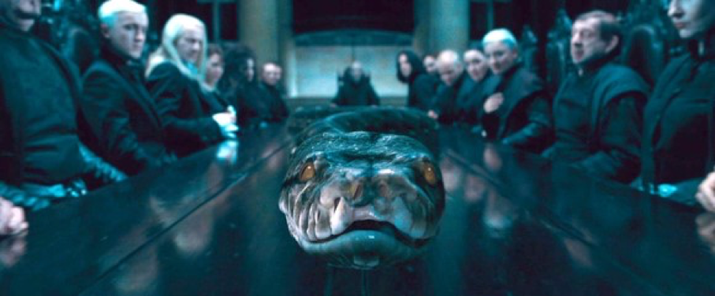

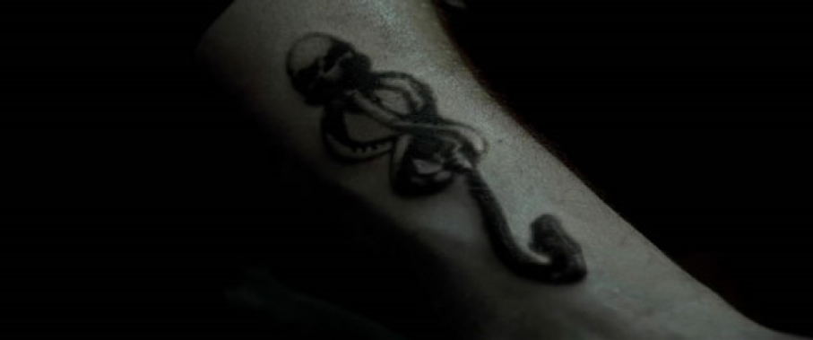

蛇的文化含义，在基督教文化中并无歧义，代表邪恶、诱惑。哈利波特中，大蛇纳吉尼是伏地魔的一个魂器，也差不多是最后一个毁掉的魂器。食死徒的身上，也都有会动的蛇形纹身。在英国观众心目中，蛇代表邪恶是很清楚的。（说句题外话，树上的果子也是有文化含义的，现在也经常来诱惑各位。）

但是圣经上又说，上帝虽然谴责了蛇，但并没有消灭它，只是让他用肚皮行走，终生吃土而已，蛇溜出了伊甸园，也还在世界各地生活。上帝的意思大概是，蛇只是个动物，亚当夏娃遭到诱惑的根本原因还在于人的本性，人性之恶无处不在，并不是消灭一个具体的生命就能解决。因此在失乐园之后，蛇仍在人间诱惑人类，善恶也仍在斗争，胜利者的“灵魂”上了天堂，失败者呢，只好化作“鬼魂”或者“幽灵”在人间游荡了。

基督教是一种触及灵魂深处的意识形态，也可以说把人性善恶挖掘到了极致，在基督教的世界观里，人或是至善（天堂），或是至恶（地狱），没有中间态（比如中国喜欢的桃花源）。各文明都有人性善恶的讨论，但都不如基督教深刻，比如《三国演义》的作者褒扬刘备、贬低曹操，但二人所争者争天下而已，谈不上灵魂和信仰。对于基督教来讲，极端化的思维方式产生某种特别的攻击性（也可以叫战斗性），是其从一个小教派成为世界第一大宗教的关键。马克思的名言，“**哲学家们只是用不同的方式解释世界，问题在于改变世界**”，实是把握住了基督教的精神实质。但是，这种极端化的思维方式也带来一个问题，就是容易产生“异端”。

关于异端，网上流传着一个小笑话：

甲走过海旁，看见另一个人乙想跳海自杀。

甲：先生，生命是如此的美好。为什么要自杀呢？你是无神论者还是有宗教信仰？

乙：我有宗教信仰。

甲：佛教、道教、伊斯兰教还是基督教？

乙：基督教。

甲：罗马天主教还是新教？

乙：新教。

甲：我也是新教呢！圣公会还是浸信会？

乙：浸信会。

甲：太好啦！我也是浸信会，你是Baptist Church of God还是Baptist Church of the Lord？

乙：Baptist Churchof God.

甲：真是太奇妙啦！我也是，那你是原教旨的Baptist Church of God还是改革派的？

乙：改革派的。

甲：太好了，1879年的改革派还是1915年的？

乙：1915年的改革派。

甲冲着乙的屁股一脚把他踢进海里：**去死吧！异端！**

“异端”是个中国文化中没有的概念。中国人很难理解，为什么只是崇拜上帝的方式不同，就会引发你死我活的战争。**但这正是基督教思维体系的优势，因为它加速了宗教的进化。**大家都知道，基督教是从犹太教发展出来的，和伊斯兰教关系也很密切，欧美人称之为世界三大宗教或者亚伯拉罕三教（亚伯拉罕是犹太人和阿拉伯人的共同祖先），因为总有人留言，给我普及这几个宗教关系的常识，因此花了一天的时间做了个简图，把亚伯拉罕三教的派系源流整理了一下。（这张图学术性很强，资料主要据《中国大百科全书•宗教卷》，不全，请大家多提意见，暂时不要转载，怕误导他人。我会根据各位的意见修改，定稿后欢迎转载。）

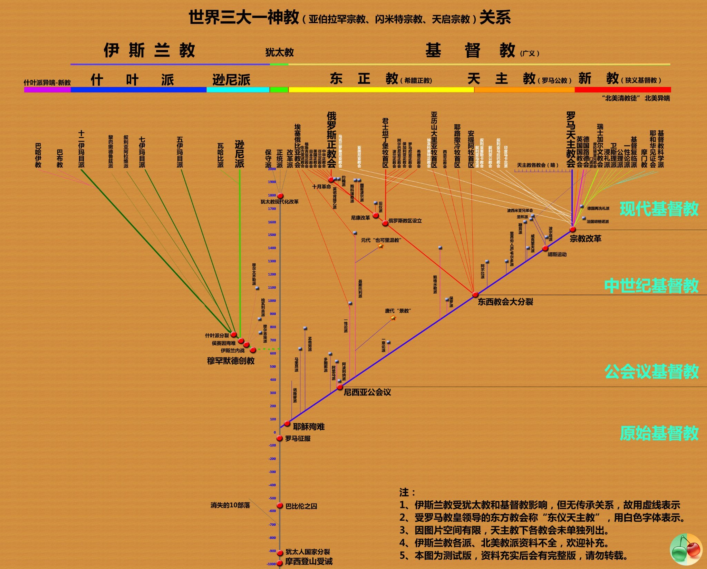

这张图的内容非常复杂，详细可以写一篇罗哩罗嗦的论文，只是写完估计大家都睡着了。**简单的说，三教关系像是一颗树，**树根在犹太教，分叉是各种创教/改革运动，树叶则是各个教派或者教会。大家知道，在数据结构上，多叉树等价于二叉树，二叉树又以某种算法等价于线性结构，因此这棵宗教之树虽然枝桠众多，结构其实并不复杂，也可以说三教就是一教，因为都有“善恶分明”的极化思维方式，经常分成若干对立的教派，取胜的是“正统”，被历史淘汰的是“异端”，互相僵持的则成为不同教派。今天我们看到的基督教，其实是经过历史上多次残酷的宗教战争留下来的，不适合的都淘汰了。

“异端”产生的原因和多，有的是深刻的政治经济斗争，也有的只是争权夺利的人事关系。表现在教义分歧上，有严肃深刻的神学命题，也有鸡毛蒜皮的礼仪之争，有些无聊的甚至可以当笑话看。比如基督教史上最大的分裂：1054年东西教会分裂为东正教和天主教之后，双方互相指责对方不遵守教义。直到1453年拜占庭帝国亡国前夜，皇帝被迫去罗马教皇处求救，君士坦丁堡大牧首专门列出一堆不能放弃的基本信条，包括这么一项：弥撒仪式上要按照“最后的晚餐”中给信徒吃饼，**一定要坚持东正教的有酵饼，而不能采用天主教的无酵饼。**

我第一次读书至此，看了半天也不明白，还以为是什么高深的理论。结婚之后学会做饭，才恍然大悟：“有酵饼”就是和面的时候放酵母的饼，天津方言叫做“发面饼”，反之“无酵饼”就是“死面饼”（各地方言可能不一样）。在东正教看来，亡国极小事，信仰极大事，只有吃发面饼才能上天堂，接受土耳其人的统治无所谓（当时的伊斯兰教不强制改教，也不管这些礼仪细节），但决不能接受罗马天主教吃死面饼的邪恶教义，吃死面饼会坠入地狱的深渊，在里边被当作羊肉串烤来烤去，一定要誓死捍卫吃发面饼的绝对真理！

大家看好，下面一定有信徒给我传授死面饼和发面饼差别的深刻道理，说我想的太简单了，我确实比较肤浅，只是多看了点教史而已。基督教历史上，为了那些发面饼或死面饼、葡萄酒或葡萄汁、长十字架或短十字架、三个手指或者两个手指的争论引发的宗教战争，简直罄竹难书。

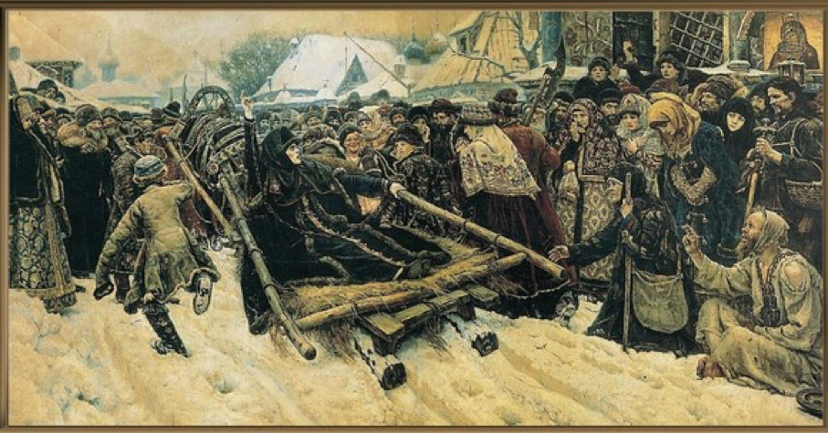

（苏里柯夫画作，《女贵族莫洛佐娃》，注意人物的手指，详情可百度。）

不知大家现在能否理解马克思所说的“幽灵”了，垫在基督教历史下的各派异端中，冤死鬼恐怕真的不少。

现代亚伯拉罕三教各教派中，影响最大的主流派是西欧北美地区的基督教新教，因此在民间，“基督教”是指新教（所以有网友留言说教皇不是基督教）。比新教稍微老一点的叫做“天主教”主要在南欧和拉美，再老一点的叫做“东正教”主要在东欧，再老一点的叫做“伊斯兰教”主要在西亚和北非，至于原始基督教和犹太教，差不多已经淘汰光了。

如果说哈利是新教的话，天主教、东正教、伊斯兰教就是哈利的敌人。

**希特勒、斯大林和拉登，就分别属于这三个文化区域。一个对一个。**

最后一个问题不大。前两个，需要点笔墨。

“纳粹党”NAZI并不是“德国国家社会主义工人党”的德文缩写，只是英美文献中使用的贬称。纳粹党领袖希特勒本人的信仰，是不是“纳粹主义”很难说（世界上有没有这个信仰也很难说，因为纳粹党掌权的时间太短）。但他家庭背景是天主教徒，这是毫无疑问的。

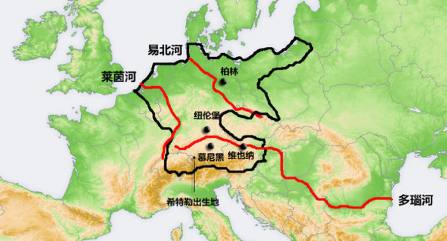

现在德国版图是被二战后列强决定的，文明意义上的德国要看我自己画的这张地图。德国地理简单的说就是三条河和三瓶酒：东部易北河人喝白酒，西部莱茵河人喝葡萄酒，南部多瑙河人喝啤酒。莱茵河流域是早期德国的大本营，但很早就被法国分割，莱茵三角洲的荷、比、卢三小国独立了，中游的洛林公国归了法国。易北河流域，东边的东普鲁士和西里西亚，现在在俄国和波兰的版图中。多瑙河上游南德山区的瑞士、奥地利，也都独立成国。但是，德国史上数代人为之奋斗的“国家统一”的对象，也就是大德语文化圈，就是这个范围。

宗教方面，德国本来全是天主教地盘，马丁路德宗教改革后，新教和旧教（天主教）各半，表现在地图上，大体是河水入大西洋的各邦信奉新教，河水入地中海的各邦信奉旧教。新旧教之争不是信仰，而是利益，环北海——波罗的海——大西洋地区是新教，英国就是新教商业圈的中心。环地中海地区是旧教，罗马是其中心。具体到德国，就是南德旧教，北德新教。经济上，德国的海岸线都在北边，莱茵河和易北河流域下游是沿海地区，贸易发达，偏向资本主义。而多瑙河的海口远在罗马尼亚，南德地区主要是农业，经济落后，容易出社会主义。

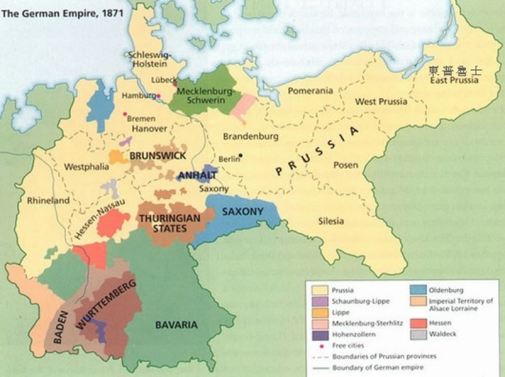

希特勒出生的时候，德国已经统一为“德意志帝国”，也就是第二帝国，这是个联邦制国家，但新教的普鲁士邦国占据了三分之二。大家注意另外三分之一，尤其是南方最大的一块绿色区域，地名叫做巴伐利亚Bavaria，首府慕尼黑，这是德国最大的天主教邦国，也是纳粹党的老家。第二帝国当权派是普鲁士的新教徒，天主教徒是受迫害群体，俾斯麦专门发动过针对他们的政治运动。一战以后，普鲁士军事贵族垮台，魏玛共和国实行多党民主制，各种受迫害的力量纷纷组党，纳粹党就是最大的一个。戈林、希姆莱等核心党员都是巴伐利亚人，希特勒本人生在巴伐利亚和奥地利边境的奥方一侧，而奥地利也是天主教。纳粹党的根据地城市，比如慕尼黑、纽伦堡，都在这一带。非巴伐利亚人的纳粹党骨干如戈培尔等人，也基本上都是天主教家庭出身。

英美国家有一个非常高明的宣传魔术：英美自身的价值观念是51%的贵族，49%的平民，但是谴责纳粹，总是让49%的平民冲在前面，谴责其“排犹”、“种族歧视”。这种做法一石多鸟，即压制了德国右派，又和苏联争夺世界左派的舆论阵地，顺便还讨好一下犹太人的以色列。比如罗琳这样级别的儿童文学作家来讲，把纳粹符号放在伏地魔身上，既安全，又顺手，因此片中伏地魔的“纳粹味”最浓。但是，这给很多不熟悉德国史的中国人造成一个错觉，好像纳粹党是个偏向贵族风格的党。（据我所知，大学生中二战德军粉不在少数。）其实德军那一套主要源自普鲁士容克贵族，纳粹则是容克们眼里的“街头流氓小无赖”，两者在复仇的名义下联盟，但内部一直是同床异梦，纳粹党在“国防军”之外另搞了一个“党卫军”，而军官团则有刺杀希特勒的举动。**其实纳粹党自身的意识形态是偏左的，党名又是“工人”，又是“社会主义”，这才是他们成为英美的“敌人”的真正原因。**

再说共产主义者，涉及到我国自身的问题，这一段从简。简单的说，苏联式共产主义流行的地区，大体上是东正教的覆盖区。大家注意树上东正教的“俄罗斯正教会”分支，在十九世纪晚期特别活跃，出现了很多异端，有些还特别狂热，这是该宗教生命力旺盛的表现。但是，所有的异端到1919年都戛然而止，表面的解释是十月革命之后，无神论的布尔什维克党镇压了东正教，其实稍了解教史的人都知道，基督教系列宗教最不怕的就是政权镇压，否则早就被罗马皇帝消灭了。唯一的可能，是出现了一种更彻底的、能够吸纳这些异端教义的新信仰。

网上讨论共产主义和基督教的关系的文章不少，但很多人是从马列的犹太人血统出发，其实关键不是列宁，而是斯大林。苏联体制常被称为“斯大林体制”而不是“列宁体制”，有非常深刻的原因。斯大林是个货真价实的东正教神父，格鲁吉亚第比利斯神学院毕业的。

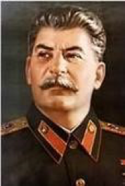

因为个人的原因，我曾经去过这种叫做“神学院”的地方，表面上看和大学类似，也有学生、教材和课堂授课。其实两者差别很大，中国的大学重在传授知识，思想领域大体上在放羊，而神学院教育虽然也传授知识，但重点是体验和实践。我看过神学院学生的作息时间表，从早上念经到睡前祷告，二十四小时全天无间歇的精神训练（也可以说是洗脑，也可以说是坚定信仰）。各位同学在大学4年里受到的信仰洗礼，神学院学生大概用不了一个月。这种训练的结果是，神父们都具有极强的精神力，也就是斯大林的名言“**共产党员是特殊材料制成的人**”的真正意思。

各位，我这里不是胡说八道，也不是变着法的讽刺本国政府。认真的说一句，因为宣传的原因，不适合说共产主义和基督教有联系，但是，从学术的角度看，共产主义攀上了基督教这棵大树，实际上就连接上了西方文化的正源，这绝不是贬低我党，而是找到了中国共产党能从民国乱世中脱颖而出的根本原因。网上不宜多谈，大家可以自己找一些早期的党史资料看一看。

最后一个就是拉登了，他是伊斯兰教毫无问题，详细一点，他是属于伊斯兰教逊尼派中的比较激进的教派：瓦哈比派。伊斯兰教主流派的逊尼派并不好斗，但是文明冲突的大背景下，二战后尤其是冷战后的中东各国，伊斯兰教越来越激进。这几年中东最大的政治，就是什叶派十二伊玛目支派的伊朗和逊尼派瓦哈比支派的沙特在争夺控制权，两派现在还在叙利亚僵持（叙利亚掌权的阿拉维派也是本国的激进派），短期结果虽未可知，但长期来说，激进派取代温和派（萨达姆、卡扎菲、穆巴拉克）是大势所趋。长远来说，伊斯兰诸国至少是阿拉伯国家的统一，也是个历史大趋势，一个民族不可能长期分裂成若干国家。

好了，三个“敌人”的背景分析完之后，亨廷顿的学说就更加清楚了。你只要把“文明冲突论”应用到世界史上，再重新自右向左看一遍那棵树，差不多就是整个近代史的故事：英美国家崛起称霸，接连遇到三个挑战：19世纪的德国、20世纪的苏联、21世纪的伊斯兰势力，中间有几个犹太人在穿针引线。**抛开眼花缭乱的各种主义的迷雾，实质仍然是亚伯拉罕三教的不同支派之间的文明冲突。**

分析到这里，有同学可能感到明白了一些，看来伏地魔的原型是新教的“异端”，也就是伊斯兰教、天主教和东正教的综合。没错，但是只说对了一半，异端为什么要用片中的形象呢？

电影中，伏地魔一共有四个形象：

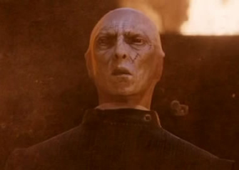

藏在头巾下的脸

英俊的“雅利安人”

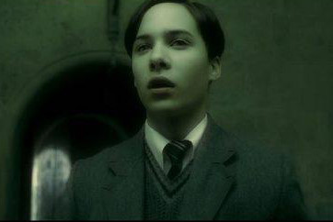

发型像毛主席吗？

没有五官的面孔，像不像蛇？

第二张汤姆•里德尔的英俊相貌，明显是讽刺纳粹德国的法西斯美学（说的深一点，来自圣经中的魔鬼路西法Lucifer），其他面孔的具体文化意义并不明显，反正是很丑很非人就是。我的问题是，为什么伏地魔总有这样极丑极美、变来变去的面孔？

因为伏地魔是失败者，是鬼魂，他的形象是由哈利的记忆决定的。

大家都知道，根据罗琳写的霍格沃茨故事，这个学校中曾经发生了一场内战，两个学生哈利波特和伏地魔（汤姆里德尔）带领各自的支持者，进行了霍格沃茨大战，结果哈利胜利，汤姆失败。这一点是没有问题的。至于伏地魔的本来面貌，他已经死了，只有哈利的记忆才能告诉我们。很简单，古往今来在争夺统治权中失败的一方总是长的很丑，因为历史从来是胜利者书写的。

我开始也不太喜欢教科书，世界史是从各种剑桥世界史开始的，后来发现一个很有趣的现象，这些书里，好像只有英美国家是天堂，其它文明，总是各种恶魔在统治。希特勒屠杀犹太人、斯大林搞大清洗，咱们的毛主席呢？大家自己去百度。这些民族都是恶魔的后代吗？又读了这些民族的人自己写的书，才知道很多事情其实不是那么简单。慢慢的悟出来诀窍，关键还是摄魂术。

在我最初的设想里，第六篇摄魂术其实是给这一篇做理论铺垫的。摄魂术是统治者的基本技巧，在国际政治领域，摄魂术可以丑化敌人、巩固盟友、给下一个对手制造麻烦，是一种很重要的“软实力”，英美人用起来也是无所不至之极。对我们来说，就是接受英美国家“敌人”的各种信息的时候，一定要小心各种陷阱。借用陀思妥耶夫斯基一部小说的名字，伏地魔其实是个“被侮辱的和被损害的”人——高贵的灵魂都已经上了天堂，只有鬼魂还在人间徘徊，求生不得，求死不得。

举几个例子：

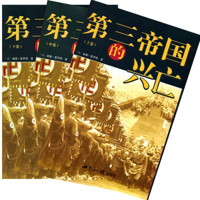

《第三帝国的兴亡》，美国记者威廉•夏伊勒著，是“全世界最畅销的反映纳粹德国历史的巨著”（百度百科），我大概十六七岁就读过这本书，现在看来，里面有大量的美国摄魂术。我不懂德语，也缺乏第一手资料，仅凭常识就能推断出一些问题。

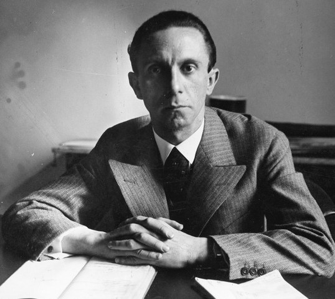

这个人是纳粹党的宣传部长戈培尔，大家能说出他最著名的话吗？

**“谎言重复千遍，就成为真理。”**

在大家印象中，戈培尔可能是历史上最大的骗子，这句名言就是证据。从戈培尔以后，连“宣传”Propaganda也成了个贬义词，去过英美国家的人都知道，英语中的Propaganda差不多跟谎言同义，你说你当过宣传委员，有人会拿鄙视的眼神看你。

可是，各位真的见过骗子吗？

我在法院实习的时候，见过很多诈骗罪的被告，大概可以称作骗子吧。这些骗子的共同特点，就是总有无数理由证明自己很无辜——这才是骗子，世界上从来没有一个骗子，会告诉别人自己会骗人。了解这一点不需要德语，只要常识和判断力，但是不知道有多少中国学者上当。戈培尔作为宣传部长，当然会使用摄魂术，但是和他的英国同行们比，也没有什么本质的区别，只是他摄魂术修炼的不到家，打输了而已。

输了以后，连名字都会撒谎。书名中的“第三帝国”，希特勒时期的德国真的叫这个名字吗？

百度一下，人家的正式国名一直叫做“德意志国”Deutsche Reich，这是1919年的德国宪法确定的国名，纳粹党执政后也从未修改过。德语Reich可以译成帝国或国家，但魏玛宪法第一条写的很清楚：Das Deutsche Reich ist eine Republik. Die Staatsgewalt geht vom Volke aus.（德意志国是共和国。国家权力来自于全体人民）。因此应该译成国家。可是有多少中文的历史读物，把这个国家称作“帝国”。

前面说过，摄魂术的诀窍，在于煽动人内心的欲望，蒙蔽其理性。具体的做法，就是提供“一半真理”。高明的记者能用99%的真相掺上1%的关键谎言，然后得到相反的结论。高明的律师呢？能在100%真相的基础上进行完全相反的解释。

同样的，大家对伊斯兰教什么印象？

爆炸？恐怖活动？一夫多妻？

人人网友大多数是八零后和九零后，如果从911后关注国际政治，媒体给大家的提供消息大概如此。我因为要进行比较文化研究，去过一些有关伊斯兰教话题的网站，里面有铺天盖地的反伊斯兰教宣传，很多散布民族仇恨的谩骂，简直让人触目惊心。（人人网友中好像关注的不多，我就不引用原文来制造民族矛盾了。）

我每年上课，学生名单里都有几个回族（天津回民不少），但在课堂里我根本无法分清。他们和我们一样的肤色，一样的头发，一样的语言，仅仅是不一样的个人信仰（准确的说回族也不一定必须是穆斯林），就真的那样可恶？看得多了，我对那些网上流传的段子也是半信半疑，难道伊斯兰教真是个邪恶的宗教？

直到有一天，我看了一部电影，才发现问题的所在。

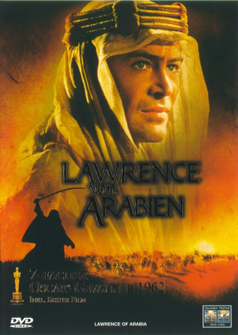

这部电影的名字叫《阿拉伯的劳伦斯》，获得过1962年奥斯卡最佳影片奖，讲的是一战时期，英国军官劳伦斯帮助阿拉伯人反抗土耳其人压迫的故事。这部电影很好的展示了伊斯兰宗教的教义，也有大量优美的阿拉伯风光。对阿拉伯文化和伊斯兰教感兴趣的朋友，可以作一个入门读物。

问题是我在这部电影里，没有看到一丝一毫伊斯兰教邪恶的踪影。

到底哪个是“真实的伊斯兰教”？

不好意思，真实的伊斯兰教，我接触不到。我不懂阿拉伯语，这辈子估计也不会移民去中东。真实的伊斯兰教只是我认识之外的“体”，我看到的各种“伊斯兰教”，都是英美魔术师们给我摄出来的“魂”，只不过，有时是美好的魂，有时是邪恶的魂。

《阿拉伯的劳伦斯》是冷战高峰时期的作品，此时英美魔术师的幻觉体系中，俄国人正在扮演伏地魔的角色，阿拉伯人则是可以团结的统战对象，结果就是《劳》里，我们看到的那些健康、勇敢的阿拉伯人。直到苏联解体之后，萨达姆这个美国人民的老朋友才会变成蜘蛛洞里的恶魔呢。有趣的是，《劳》中没有设定任何女性的形象，为什么？前面说过，伊斯兰女性的头巾是英美国家舆论的敏感点，电影中表现好也不是，坏也不是，为了统一战线的大局，索性就不要多提了。

我写这些东西，并不是给纳粹和极端恐怖分子翻案，希特勒和拉登两个死人，我再翻案又能怎样？问题是，国际政治，我们中国人可以置身世外吗？我们再看一遍亨廷顿的名言：

**冷战结束后，美国的主要国际竞争对手已经从苏联转为伊斯兰教和儒教国家。**

儒教国家。

儒教国家。

儒教国家。

昨天我们信仰孔子，人家叫我们儒教国家；今天我们打倒孔家店，改信苏联式共产主义，人家还叫我们儒教国家，明天我们放弃共产主义、换成美国式的普世价值，人家同样会叫我们儒教国家；我敢打赌，即使我们全民受洗改信基督教，人家最多也不过叫我们“基督教儒教国家”。因为有些东西我们实在无法放弃，比如方块字、比如孔子和曹雪芹。

本宅看哈利波特的时候年龄已经比较大，主要是当作英国文化看的，但也有一次动心的时候，是在哈5。

乌姆里奇的第一堂黑魔法防御课，只讲考试不讲实践，和哈利等学生发生冲突。

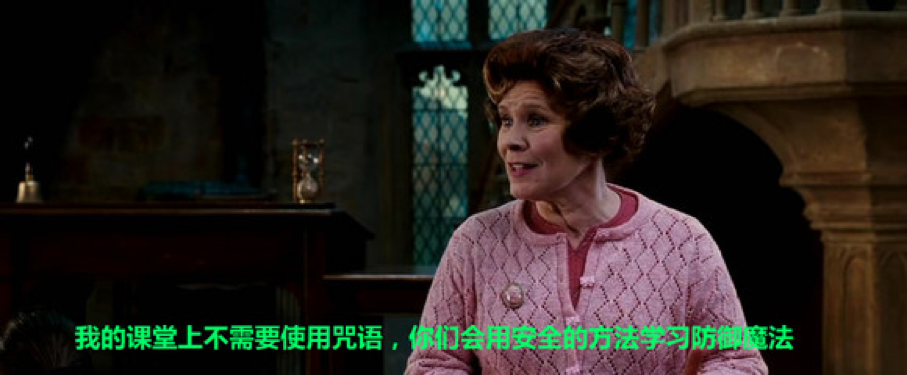

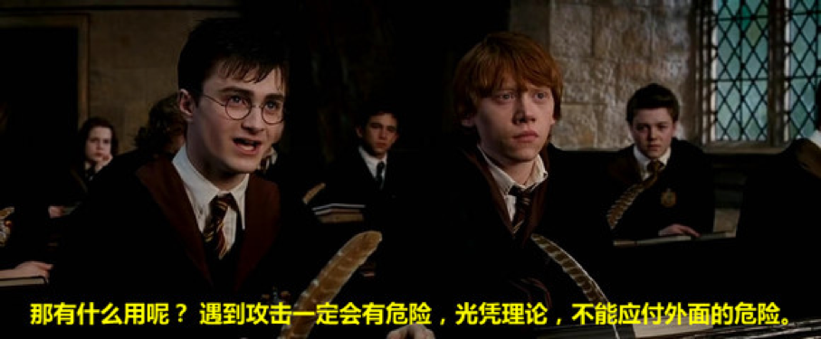

作为一个教师，直觉上感到哈利有一种和中国学生不同的气质，后来定神想想，是某种“主动性”或者“攻击性”。剧中的五年级相当于高二，咱们的学生估计满脑子还是考试、NBA和影星呢，可是哈利张口闭口离不开和伏地魔斗争，危机感和斗争意识很强烈啊，可是伏地魔究竟在哪里呢？

一时想不明白，暂时放在一边。很久后有次晚上关电脑之前，一眼扫过网上美国又在发表中国人权报告的新闻，本宅忽然想通了这段情节的含义，结果差不多一夜没睡好觉。

**伏地魔就是我们自己。**

因为谁是英美国家的对手，谁就是伏地魔。

哈5的结尾，同学们暑假乘火车回家的路上，哈利对小伙伴们说的下面的一番话：

这句话如果再加上四个字“价值观念”，就是我从希拉里的人权报告中听过一百遍的话了，现在终于找到了源头。本篇刚才分析了，与自尊自信的“贵族精神”相辅相成的，英美文化中又有一种强烈的“敌人意识”，连儿童文学中，都时时刻刻要教育小朋友不忘记战斗。看了《哈利波特》成长的美国小朋友，长大以后，就是我们熟悉的、整日在非洲、印度、半岛和南海各地奔波操劳的希拉里阿姨了。为什么希拉美如画？人民的鲜血染红了她。

感谢坚持读完的各位朋友，今天的帖子很枯燥，主题是文明冲突论，内容是宗教史，方法上还是第六篇的摄魂术。摄魂术是个很有用的法术，我给大家介绍之后，希望你们能应用到自己的专业领域。作为一个法学老师，我只是希望对我的学生讲，**你们的专业意味着你们的责任，未来的国家在你们手里，你们要守护好这个国家。**我相信总有一天，我们的文明会和盎格鲁撒克逊人正面站在PK台上，那时候，希望你们不要被各种摄魂术制造的幻象所迷惑。

哈利和亨廷顿的话，我也全文奉还给希拉里阿姨：

**虽然我们必须面对一场战斗，但是我们拥有伏地魔没有的东西——值得我们捍卫的、古老的文明的一切。**

翟按：我算不上是儒家的忠实信徒，只不过亨廷顿非要逼上来的话，也只好奉陪到底，努力把古老的儒家打造成一个称职的敌人。其实儒家、基督还是伊斯兰都只是个名词，有个留言的朋友说的比我好，引用一下：**真正值得为之战斗的，还是我们的家人乃至与我们的家人一样的人们。**本文只想给学习法学的同学们增强点国际政治意识，不想推销某种意识形态。推荐亨廷顿是让大家关注，不表示赞成他的学说（里面也有陷阱）。结尾做了几次修改，给各位阅读带来的不便，抱歉了。

翟又按：**标题没有写错，只是和天天追问我“是否跑题”的朋友开个玩笑，**大家不必在意，下一篇讨论赫敏，会改回来的。

抱歉了各位，看了很多朋友的留言，感觉有人上了点亨廷顿的当了：宗教（儒家）是个帽子，扣在我们头上，把话题转移到宗教冲突上去，对美国的国际政治地位是有利的。请大家不要再继续宗教问题的“冲突”了。

我对宗教的简单看法是，宗教改革以后，西欧地区，宗教大体上蜕化成个人的修养方面的问题，社会性的问题由“民族国家”来解决，因此新教各派并存也没问题。卢梭和康德以后，神学家也不是哲学家的主流了。但在其他地区，宗教还有一定的社会性，因此东方各文明圈为了反抗英美的国际压力，都要借助和模仿宗教的组织模式。不是说天主教产生了纳粹，东正教产生了苏共，而是苏共吸收了东正教的一些组织方法和运作模式。这并不是组织上的联系，也不是人事上的联系，更没有一个神秘的阴谋从罗马控制到莫斯科。大家不要被宗教的表面现象迷惑，争论哪个教派更好或更坏。国际政治学第一页写的很清楚，国际政治问题，主要是国际分工的带来的利益差异造成的。问题是人，是利益，而不是那些古老的符号。

对文章表达不清带来给各位带来的误会，很抱歉。第7章主要是想给法学学生增强些国际政治的意识，免得天天沉在美国政府的宣传品中不能自拔。因为有些地方涉及本国，不能说太详细，但是说不清楚又容易造成误会，请大家各自小心。

### 8\. 霍格沃茨的校规

翟按：有人问我为什么发帖迟缓，抱歉各位，实在是家里杂事太多，水电煤气，老人孩子，真想有个家养小精灵帮我干这些事。可惜在家里，我才是家养小精灵呢。好在后面还有两篇，思路大体已经完成，暑假结束前结束本帖应该没有问题。另，各位转载的朋友，我的文章有很多细节错误，习惯在发表一天之内修正，麻烦迟一天再转。

第5章开始从头发问题进入精神世界，引入西方文化中“意志自由”的概念，第6章和第7章都在写伏地魔，正反两个视角，分析解释“自由选择”的含义，伏地魔和哈利是统治阶级的核心，两个人的选择是善恶选择。这两篇也是全系列中最难的。翻过了哲学这座高山，接下来是法学的一马平川，就容易多了，也可以有更多的篇幅分析剧情和人物性格。今天继续展开“选择”话题，比较哈利和赫敏，他们都是善方阵营，是“善”和“较善”之间的选择。赫敏之所以不能嫁给哈利，血统和阶级成分是一个因素，但最主要的还是她的个人品质，用法学界比较流行的外来词汇，就是赫敏的“道德性”。道德性和出身有关，但是中间还是有选择余地的。

第4章讨论完血统论，曾经留了个小尾巴（后来因为衔接原因给删了，可能有朋友没看到）：

前面说过，统治者和被统治者的一个重要的区别，就是是否重视规则。霍格沃茨中除了体育场上的游戏规则，最重要的当然是学校的规则，即校规。

**在遵守校规方面，赫敏并不是一个霍格沃茨的好学生，至少和哈利比是如此。**

这个尾巴其实是我这个不精通原著的人写累了，欲效仿诸葛孔明草船借箭之计，从各位原著党人那里借些材料的线索。可惜宅孔明驾着草船，来到曹操大营之外，敲锣打鼓，大呼小叫，只见曹营兵将个个心不在焉，草草射了几箭便罢。本宅仔细观瞧，原来曹营之中，人手一本遗传学，纷纷埋头苦读，或者研究刘皇叔本人是否纯血宗亲，或者研究孙仲谋的碧眼紫髯来自哪国血统。（具体见第4章的留言。）本宅无奈，郁闷而归。因此这一篇中的细节，可能还是不如人意，这事儿全怪原著党……

不过宅孔明的锦囊之中妙计甚多，借箭不成，改借西风。寻来鸡毛扇，搭起七星台，面朝英伦，念咒曰：堂无恙孟德令。三日之后，伦敦果然传来消息：

这个案例大家记忆犹新，而且有各种不同观点，本宅借来，给大家介绍一下“英国人如何看待规则”、或者叫“英国人的法律观”。（抱歉使用了不可饶恕咒，我只是想对东道主表示一下问候而已。）

此事说来话长，我们还要从原理讲起。

无论如何，草船还是借来几根羽箭的，摘录两则网友留言：

"遵守规则，是法学的基本特征，也是区分统治者和平民观念的重要分界线。"……这句话在中国好搞笑啊。

最后一句和老师的看法恰恰相反，认为赫敏很大的一个缺点就是非常顾忌校规而看不到全局，记得《魔法石》中，三人组夜探校园，赫敏很纠结校规，而哈利却说当霍格沃茨都不存在，校规还有什么意义。既然哈利是一个不太遵守既定的规则的人，为什么还说哈利是优秀的统治者呢？

这两条留言有一定代表性，能反映一些中国人对规则的看法。我今天毁的就是这个。先说第一条：

统治者倾向于遵守规则，我并不认为中国的统治者有什么特别的不同，他们同样倾向于遵守规则。为什么呢？

**因为统治者是自私的。**

遵守规则对他们是有利的，因此他们遵守规则。

说明一下，统治者不等于官员，官员中有统治者，也有一副平民心态甚至奴才相的人。领固定工资执行上级命令的小公务员，并不属于统治者的范畴。相反，企业家、学者、宗教领袖，只要有统治者的意愿、决策力和责任感，都可以算到统治者的行列中。前文说过，统治者和奴隶的区别在于理性是否控制的了欲望，不是说统治者没有欲望（无私），而是说，统治者能用理性控制自己的欲望。你甚至也可以说，他们的欲望特别强烈，其所谋者大，其所图者远，其放弃各种具体的小利益，是为了得到整个天下。至公即至私，反之亦然。

站在统治者的角度来说，最大的利益就是统治地位，有了这个地位，其他都是小事——拥有国库的人，贪污点小钱有什么意思呢？世界上有贪污的官员，没有贪污的皇帝，有受贿的国企老总，没有受贿的私企老板，就是这个道理。前面分析过，统治者必须遵守规则，因为规则（法律）就是没有激情的理性，放弃规则谋取私利，那是通往奴隶的道路。自古争天下者皆不顾家，刘邦舍得太公，主席舍得岸英，唐三藏舍得女妖精，非如此不足以谋大事。

反过来讲，舍不得又会怎样？

成克杰

胡长清

2000年反腐连着枪毙了两个省级干部：广西自治区主席成克杰和江西副省长胡长清，看他们两个人的简历，都是平民家庭背景、通过高考或者入伍而从政的。近些年反腐案件不少，相当多的贪官也是类似的出身。本宅也是平民，没有任何歧视平民的意思，但是里面确实有些问题，我虚拟一封家信大家看看：

儿啊，当年你上大学的时候，你二舅家的三姐夫帮过你二百块钱学费，现在他家小四进城打工，跟人打架把人打死了，你想法儿把他弄出来吧，三姐夫给你带了两百斤老家的玉米，不要当了市长忘了本啊。娘。

各位设身处地的替这个市长想一想，他该怎么办呢？市长有干预的能力，母亲的心情也可以理解，问题是一旦开了头，就少不了一而再、再而三，一个接着另一个违法，因为老家亲戚是无穷无尽的，结果就是落马风险剧增，可这位市长又能得到什么呢？“两百斤玉米”？所以平民子弟从政，时间长了多不近人情，其实是对自己和家人的一种保护。而纯血巫师在这方面就有优势，他们根本不会接到这种纸条。西方国家的选举中，世家子弟对草根候选人，常打的一张牌就是“清廉”（或者攻击对手“贪污”），日本议员有三分之二是世家出身，因为选民也明白这个道理。

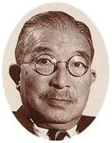

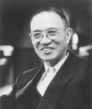

日本前首相鸠山由纪夫、祖父是鸠山一郎首相、父亲是鸠山威一郎外相，外祖父是世界三大轮胎企业之一的普利司通创始人石桥正二郎。典型的政治世家。

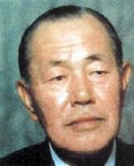

美国总统尼克松和日本首相田中角荣，都出生于小城镇、都以平民身份（小店员/学徒）起家，从政风格都偏向于不择手段，政治生命都终结于丑闻（水门事件和洛克希德受贿案），都是中国人民的老朋友。

前面曾经说过，各位法学同学如果想要真正进入职业状态，必须毁掉你们的“平民心态”，虚拟家书中的“顾念亲情”就是一种平民心态。在老百姓的层面上，顾念亲情是一种美德，但对于统治者来说，这不是美德而是危险，必须尽早除掉。麻瓜赫敏最后也走过这条路。赫敏在哈6中通过了鼻涕虫俱乐部的检验，平民训练课结束，进入了统治者的行列，因此下一部《圣器》的开场戏，赫敏就用法术抹掉了父母关于自己的一切记忆：

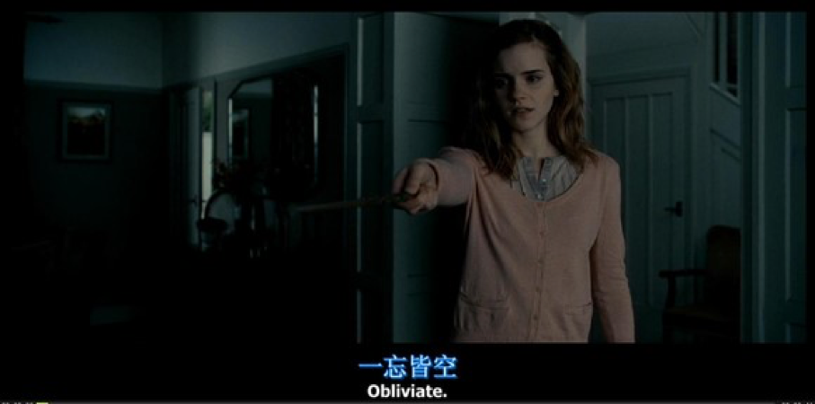

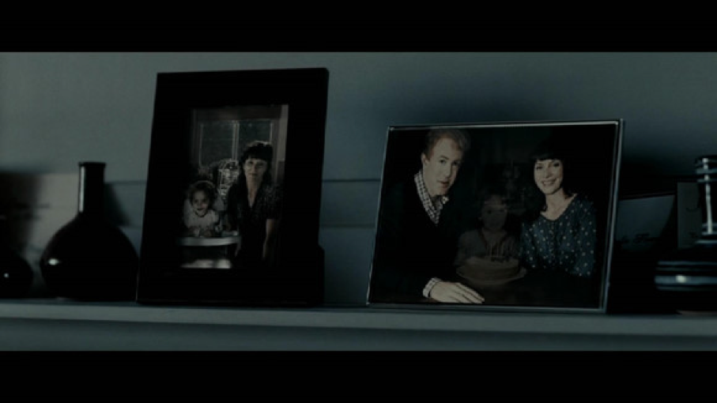

很多女生可能这一段都看哭了，确实让人伤感，但这就是铸造统治者需要的“残酷的理性”，赫敏既然选择了加入统治者一方进行战斗，必须切断和麻瓜世界的联系，这对父母也是一种保护。赫敏你哭吧，哭完了擦干眼泪继续战斗。

多说一句，“残酷的理性”是有副作用的，时间长了会让人变得冷酷无情，所以片中赫敏一直“性格强势”，她的性格其实很像红楼梦中的探春，一直为摆脱赵姨娘的mud blood而强撑硬作。问题是，一旦从战场回到婚姻层面，赫敏忍痛放弃的亲情，又成了家庭生活的必需品。探春最终远嫁，赫敏也让位给金妮——金妮的父母也是巫师，大决战前就不需要“一切皆空”。这对平民确实很不公平，但是确实又是平民自己选择的结果。

关于统治者倾向于遵守规则就分析到这里。再来回应留言的第二条：“既然哈利是一个不太遵守既定的规则的人，为什么还说哈利是优秀的统治者呢？”

其实英美规则的观念是：

**统治者重视规则（1），但不束缚于规则（2）。平民畏惧规则（3），又想彻底摆脱规则。（4）**

按照邓正来老师的说法，观念3就是中国法理学中的“法条主义”，观念4就是“权利本位”。观念4我们已经分析过，就是中国法学中那些把欲望放在理性之上，只讲权利不讲义务，天天用“公民有权得到”（其实就是“国家应该免费”）的空头支票诱惑麻瓜们的学说，不再展开了。下面我们分析23，这两句话其实是一句话。

这次我们从中文概念开始。在现代汉语中，法律是个并列式复合词，由“法”和“律”两个词素组成。大家有没有想过，“法”和“律”有什么区别？

有女生站起来发言：我可以接受嫁给律师，但不能接受嫁给法师。

这位同学请坐，嫁人的问题，第十篇再讨论，先容本宅讲几句正课。这次是我的本行，中国法制史。

在古汉语中，“法”和“律”曾经是不同的概念。“律”原指音律，因为音阶整齐如尺，又转引为“整齐划一”，商鞅变法之后，一直表示王朝的制定法，从《秦律》一直用到《大清律》。

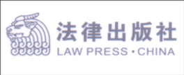

“法”的古字为灋，从水，从廌去，廌即“獬豸”，它的形象现在是法律出版社的商标，其实就是中国版的独角兽。传说此兽通神，能去不直之人。古代圣贤于水边审案，常以此兽断疑难之狱。战国李悝作《法经》，用这个词表示“正义的审判”，他的门徒即称为“法家”。到商鞅变法时，“改法为律”，这个词改指国家的大政方针，如“变法”、“祖宗之法”。

这种语言学上“两个法律”的现象，在英语中也有。英语中有两个与法律相关的单词：法律law和权利right，比如人们常说的，英美国家的法律重视权利、保护人权（human right）、法律以权利为本位，等等。Law相当于“律”，right相当于“法”，这两个词的差别，其实是贵族和平民法律观念的差别，准确的说，是贵族重视right，而平民重视law。

让我们把视角放大一些，整个西方法律观念都受罗马法影响， right和law都源于两个更古老的拉丁语词汇：ius和lex。

关于ius，按照罗马法学家的说法，“ius来自于正义iustita” （乌尔比安），“人们把任何时候都公正和善良的事物称为ius”（保罗），主要指不拘泥于具体形态的正义，也就是道德意义上的法。而Lex原指元老院决议和平民大会决议，主要表示形式意义上的成文的法律，像《十二表法》，就是lex而不是ius。

受罗马法影响，欧洲主要语言中都有两个表示“法律”的词汇：

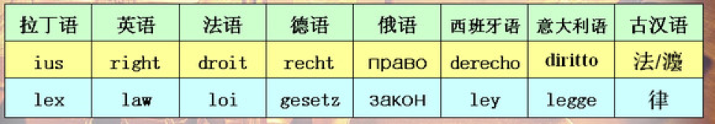

表中第一列，大体上可以翻译成“右面；正确；权利”，主要表示“道德意义上的法律”。第二列，一般被我们翻译成“法律”，实际上主要是表示“条文意义上的法律”。

在现代汉语中，“法”和“律”联合成了一个词：“法律”，这和我们现在的唯物主义哲学体系是对应的，因为我们的哲学是一元论的。但是，凡是贵族精神占优势的时代，比如春秋战国、古罗马和现代英美，“法”、“律”总要分为两个词，这就和哲学上的“二元论”有关系了。大家还记得，从柏拉图到圣奥古斯丁再到康德，西方哲学千变万化，总是坚持某种二元论，也就是实体和意义分离，这种哲学观念体现在法学中，就是“right”、“law”的分离。

为什么要分离呢？

**因为right要领导law。或者说，贵族要统治平民。**

用柏拉图的学说，right相当于理想国的法，law相当于现实中的法。用圣奥古斯丁的学说，right相当于神法，law相当于人法。用康德的学说，right是不可知的实体，law是可知的现象。在当代法学中，law就是法律条文，而right就是法律解释。

每个人都看得到法律条文，问题是，文字构成的条文有无数含义，需要解释，没有律师，你永远不知道条文是什么意思。前面说过，咒语本身没有意义，律师争斗的对象是人。有人就有思想，就有解释的可能。**因此用一部完美的法典解决一切问题的设想是不可能的。**刑法典算是很成熟了，但是如果法条可以直接拿来判案，律师们天天还在法院忙什么呢？

完整的证明这一点很复杂，举个简单的例子示意一下：

我国刑法232条规定：故意杀人的，判处死刑。够最简单的了吧，可是大家能“真正理解”这一条的“确定含义”吗？我虚拟一段刑法课上师生间的对话：

师：刑法232条，是什么意思？

生：杀人偿命。

师：你确定杀人应该偿命吗？

生：当然。

师：周克华是不是人？

生：是。

师：两个民警是否杀了周克华？

生：是。

师：两个民警既然杀人，是否应该偿命？

生：不应该，这是执法。

师：你不是说“杀人偿命”吗？

生：法条的意思，应该是“杀人偿命，但警察执法例外”。

师：如果周克华不是民警击毙的，而是市民用砖头打死的，这个市民要偿命吗？

生：不要，这是见义勇为。

师：你不是说“杀人偿命，但警察执法例外”吗？

生：这个，我的意思是“杀人偿命，警察执法和见义勇为例外”。

……

各位没学过法律的同学不要觉得这两个人是吃得太多难受，“杀人偿命”还有这么多讲究，我们法学课上天天讨论的就是这些东西，下面其实还有很多，比如什么是“警察”，什么是“执法”，什么是“见义”，什么是“勇为”，等等。刑法算是简单的，某些复杂的民法概念，比如“不动产”、“善意”、“占有”，加上二三十个定语也不新鲜。到最后，法条本身早就没有什么意义了，总要落到一种解释上才能在审判中应用。这种解释权呢，当然就掌握在统治者的手里。

问题是，从形式上来说，所有解释也是和条文一样由文字构成。对不懂摄魂术的平民来说，他们没有能力判断法律的解释是否正确，也无法分辨哪个是条文，哪个是解释，只能一概称之为“法律”。对平民来说，法律是崇拜、畏惧的对象，最高的善就是“严格遵守法律”。进而言之，如果贵族能尽量少以道德的名义变动法律，平民就能获得更多的安全感。自古以来，凡是平民势力在和贵族较量中占优势的，一般倾向于“公布成文法”，春秋有子产铸刑书，罗马有十二铜表法的颁布。因此，平民法律观念注重法律的外在形式：有法律形式的条文，就要遵守，没有法律形式的抽象的道德原则，就可以不必遵守。

比如甲到政府部门办事，和公务员乙有如下对话：

甲：这条规定不合理啊。

乙：合理不合理我不管，国家的规定，我只负责执行。

乙的回答就是典型的平民法律观念。对他来说，制定法律的“国家”和自己没有关系，法律只能遵守，否则就会遭到惩罚。

反之，大家假设甲的问题没有解决，逐级上访，最终见到敬爱的总书记：

甲：总书记，这条规定不合理啊。

总书记会说：“合理不合理我不管，国家规定的，我只负责执行”吗？

说了，他就不是总书记了。

因为统治者不能推卸自己的责任。规定有错误，必须更改，因为规定就是自己制定的嘛。平民不用考虑法律从何而来的问题，但统治者必须考虑。哈2中，斯内普要惩罚哈利和罗恩，在校长面前提到校规，邓布利多表示：

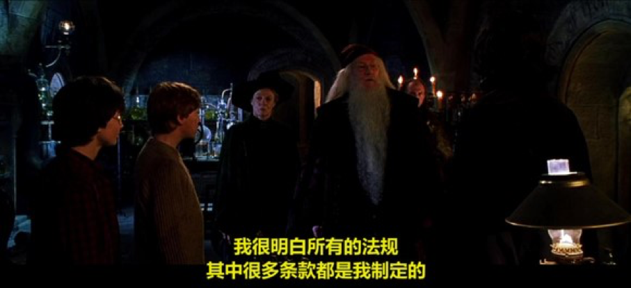

对于统治者来说，法律是自己制定的，因此绝不会把法律条文当作什么神圣不可侵犯的东西。比如美国宪法，对普通美国人来说，当然是绝对要遵守的，很多中国的宪法学者，也将其奉之为世界史上的里程碑、人类发展的引航灯塔，但是对制宪会议签字的39个代表来说，宪法不过就是一张白纸，大家在上面写写画画，签个名字而已。为什么黑奴算作五分之三人口，说实话理由一点儿也不神圣，不过是个政治上的讨价还价。

统治者更关心的，是自由选择是否在道德上正确，也就是自己的选择之后，会成为哈利还是伏地魔的问题。用一个法理学命题来表示，就是“法律的道德性问题”。这个问题是法理学的总纲，有无穷无尽的表现形式。**下面我讲几句法理学，外专业的读者可以直接跳到下一个加粗字体。**

法律的道德性问题，在学派上，就是“自然法学派”和“实证法学派”之争；在法律观念上，就是道德是否高于法律，或者法律与道德的关系问题；在运行领域，就是立法、司法和守法关系问题；在规则论中，就是法律规则和法律原则之争；在法律渊源上，就是判例法和成文法的优劣问题，具体到中国，就是司法解释和人大立法的优先权；上溯到哲学层面，就是唯心主义和唯物主义的争论，方法论中，就是不可知论和实在论的争论，平移到政治学，就是合法性和正当性的争论，进入中国法律思想史，就是百家争鸣时代吵得最热闹的一对儿——儒家和法家的主要争论之一，从《左传》里的叔向和子产一直吵到《盐铁论》里的桓宽和桑弘羊。

凡是把实质正义放在形式正义之上的，也就是认为自然法高于实在法的，都是贵族意识占优势的法律体系，相反，凡是把形式放在实质之上的，都是平民意识占优势的法律观念。下面要毁毁各位法学同学的教科书了。在部门法中，宪法中的“天赋人权”和“基本权利”之争，国际法中的“习惯”、“一般法原则”和“条约”之争，行政法中的“行政合理性”和“行政合法性”之争，诉讼法中的“自由心证”和“实事求是证据制”之争，知识产权法中的“自然权利”和“法定权利”之争，“使用在先”和“登记在先”之争，婚姻法中的民事登记生效和教堂婚/“事实婚姻”之争，彩礼的合法性之争，等等等等，都是这种“形式正义/实质正义”争论的表现。在这些立法中，英美国家大体上选择了第一序列，而中国现行法律大体上都保持在第二序列。

今天得罪的同行太多，索性再加一句：中国刑法中的“罪刑法定原则”是第二序列的。它的反义词，不好意思，是七九年刑法典废除的“类推适用”，以及九七年刑法典废除的“口袋罪”。反之，英美刑法实行的判例制，倒是大体上相当于大陆法系的类推适用。这两个立法倾向从拿破仑时代一直打架到现在。这个问题非常有内涵，因为顺着这条路走下去，对建国前27年的“法律空白说”也需要重新定义。还是到此为止吧。

（今天讨论的都是最宏观的法理学问题，为了给高年级的同学打开思路用的，观点也不完备，仅供参考。低年级的同学不要找借口逃避背法条，不背法条是不可能达到超越法条的层次的。另外，有些程度较高的同学会提细节问题，比如实证法不是始于英国的奥斯丁吗？没错。但这些西方法学家之间的关系很复杂，具体问题我都有解释，只是要用一个学期的《西方法律思想史》课程才能讲明白，抱歉了，展不开。）

**（法理学结束，八卦继续。）**

以上问题，用一个简单的法理学命题表示，就是在西方法学界争论了两千年的“坏的法律是法律吗？”，**简称“恶法非法”/“恶法亦法”问题**。因为只有承认了二元论，道德才能高于法律，法律也才有了“善”、“恶”之分。平民倾向于“恶法亦法”，而贵族们则倾向于“恶法非法”，而英美法律的重要观念之一，就是对“恶法”的否定。

霍格沃茨中“恶法非法”的典型例子，就是哈5中的“乌姆里奇立法”。哈5是给高二同学看的，正是“树三观”的关键时期，因此是全系列中政治意味最深的一部。剧中空降校长乌姆里奇重用行政人员，排挤深孚众望的邓布利多，制定了各种校规挂在墙上：

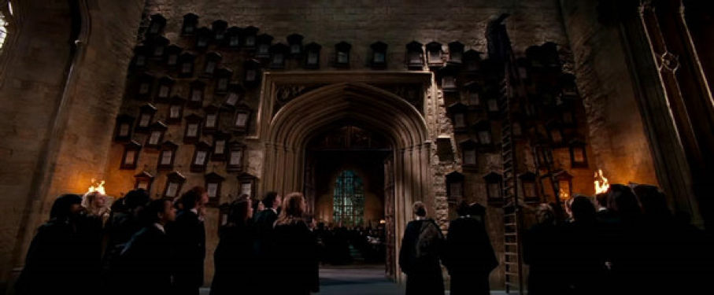

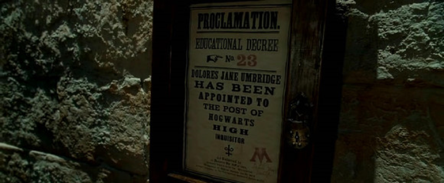

都是些什么东东呢？“男女学生之间必须保持八英寸的距离”、“学生加入督察小组可以加分”、“疑似从事不法活动者需接受质询”、“拒绝合作的学生将被开除”。这些校规形式上当然是“合法的”，但在英国观众看来，这些剥夺right而非保护right的law，实质上是“不正义的”，因此当然遭到师生们的反对。片中，“乌姆里奇立法”的最后下场，就是被双胞胎兄弟的烟花炸的粉粉碎。

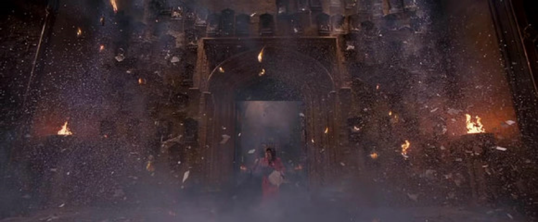

同学们乐不可支

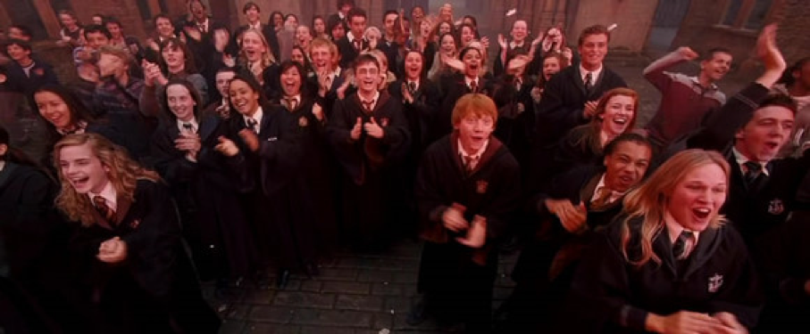

连一贯胆小的弗立维教授也暗中高兴

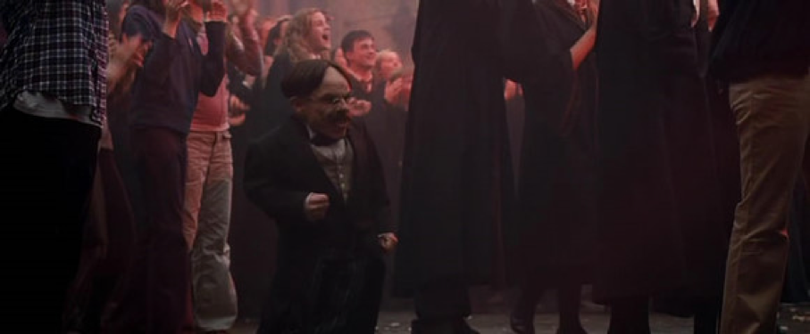

这段场景可能是哈5中最让人快乐的三分钟了，一个半小时的压抑一扫而空。这种狂欢的氛围背后，就是英美主流价值观念对“形式上合法而实质上不正义”的“恶法”的否定态度。正如《独立宣言》中说的**：“我们认为下述真理是不言而喻的……为了保障这些权利，人类才在他们之间建立政府……任何形式的政府一旦破坏这些目标，人民便有权予以更换或废除，以建立一个新的政府”。**

既然在英美法律文化中，有用“正义”、“权利”制约“法律”、“规则”的思路，那么他们赞成违反某些具体的法律，就可以理解了。英美法律文化甚至以挑战法律为能事，只要这种挑战符合“道德”。具体到剧情里，**就是霍格沃茨意义上的好孩子，不太遵守既定的规则。**

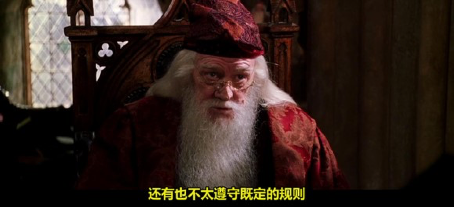

哈2的结尾，邓布利多曾说过一句很意味深长的话：“你和伏地魔有些共同点，……不太遵守既定的规则”，其实邓布利多自己违反的校规更多。在哈6中，邓布利多要带哈利去寻找魂器，在天文台的窗口，校长让哈利拉住自己的手臂：

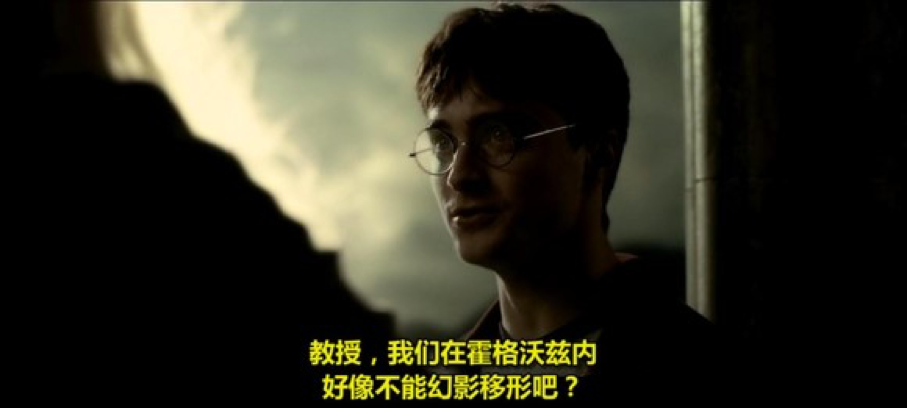

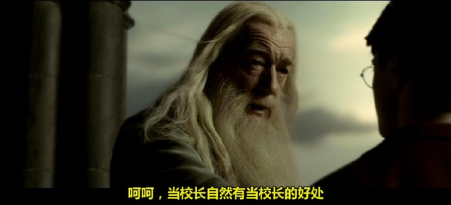

带着哈利波特一骑绝尘而去，对霍格沃茨的校规完全免疫。

邓布利多违反的甚至不止校规。哈5，因为乌姆里奇举报有人组织“邓布利多军”企图叛乱，魔法部长亲自带人去霍格沃茨抓人，在校长室里，邓布利多根本没拿魔法部的法律当一回事，招来凤凰，飞身而去，直接把部长晾在一边。

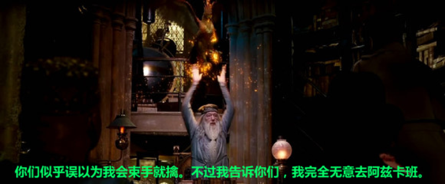

邓布利多、哈利、伏地魔这三个人，无论正邪，是霍格沃茨最核心的成员。他们代表霍格沃茨最高的法律价值：挑战规则，制定规则。

反过来说，过于拘泥遵守既定规则的观点，就是霍格沃茨中不太受好评的平民意识了。也就是我开篇中留言的话：

**在遵守校规方面，赫敏并不是一个霍格沃茨的好学生，至少和哈利比是如此。**

前面有朋友留言，说同样是学习法律，赫敏只是执法者的层次，哈利则是立法者的层次，确实如此。赫敏出身于麻瓜家庭，来到这个贵族学院，对规则有本能的畏惧心理，和上了几十代霍格沃茨的哈利和罗恩有明显距离。

首先是课堂规则：赫敏上课习惯于先举手后发言。

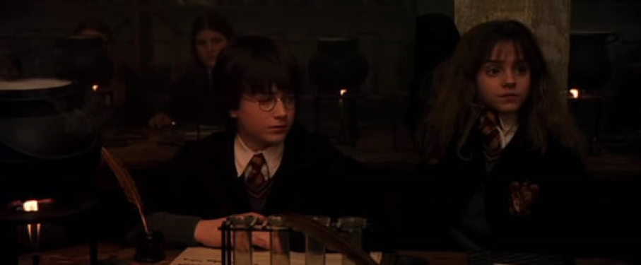

魔法石，魔药学

密室，草药学

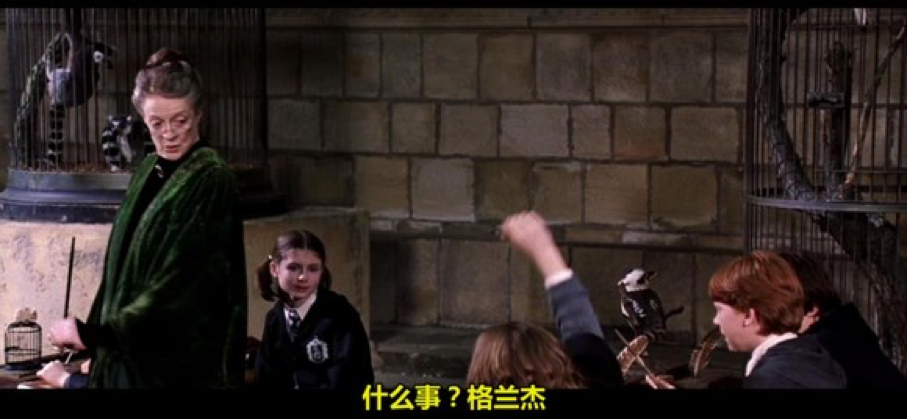

密室，变形课

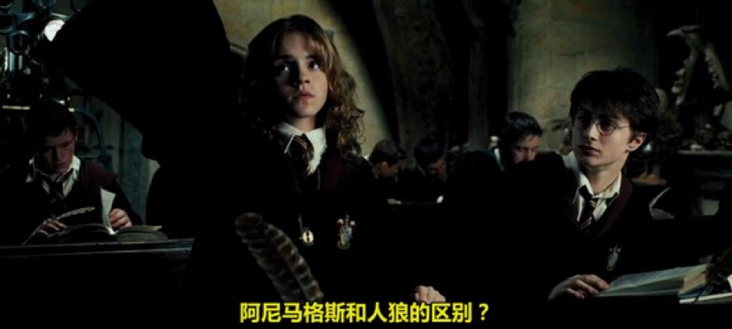

囚徒，黑魔法防御

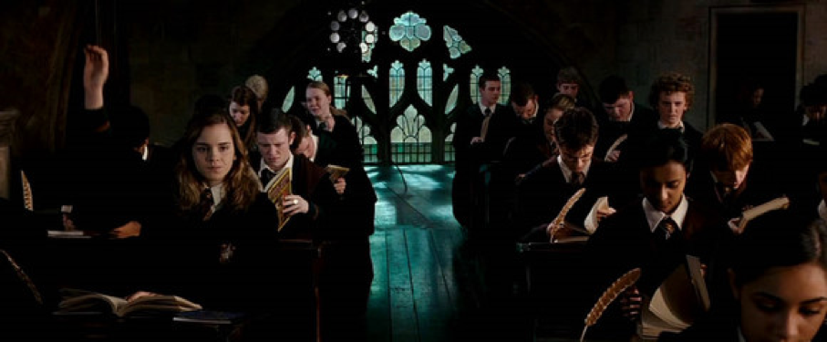

凤凰社，黑魔法防御学

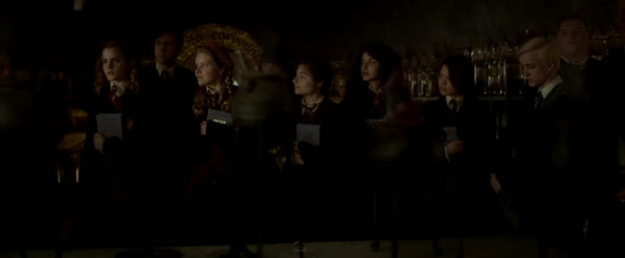

混血王子，魔药学

唯一没有举手的一部，是火焰杯中假穆迪老师的黑魔法防御。那一次赫敏差不多被老警察赤裸裸的暴力黑魔法吓哭了，表情都这样了，没举手可以理解。

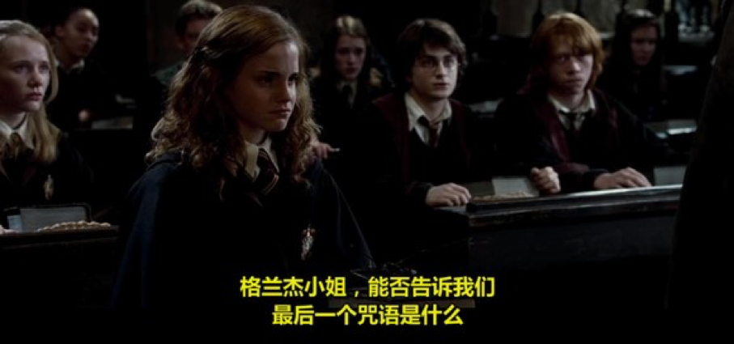

可能会有同学表示反对，是不是对赫敏挑剔的太严厉了。举手发言是讲礼貌，讲礼貌有什么不好吗？或者说，赫敏是女生，女生喜欢遵守课堂纪律，马尔福从来不举手，难道要马尔福嫁给哈利？不错，举手发言是个小问题，不必过分解读。只是连续6部电影，导演反复安排赫敏做这个招牌动作，应该还是和人物性格有一定的联系吧。至少，和全班同学对比，赫敏显得很特殊，整个电影中，除了哈4纳威举过一次，再没有其他同学举手发言的镜头，哈利更是习惯性的上课接老师话茬。反之，整个霍格沃茨的所有老师里，最爱要求学生举手发言的，就是坏典型乌姆里奇。

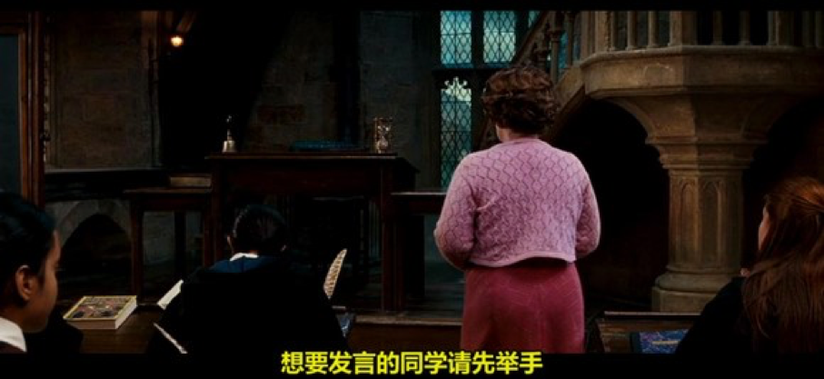

哈利不仅上课不举手，甚至还会打老师，这个档次的学生也是极品。

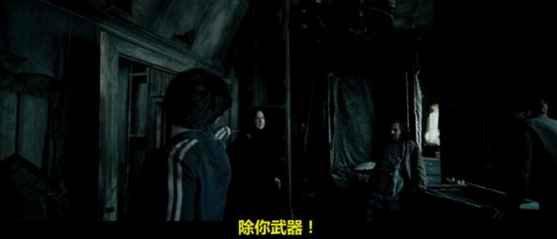

哈3中就攻击了斯内普，连罗恩都吓了一跳，还有哈5挑战乌姆里奇，哈6智斗格拉斯霍恩，就不一一截图了。哈5中斯内普的大脑防御课中，更是对斯内普进行反向攻击，连斯内普记忆中的最隐秘的私人信息都调出来了。

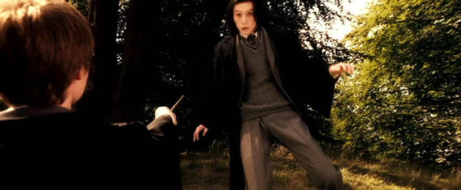

斯内普说什么了吗？没有，最多是让波特结课走人而已。斯内普这个人脾气古怪，一身坏毛病，但大原则上不出错。因为他明白，敢挑战老师的学生，才是自己真正的衣钵传人（“十九年后”哈利也真的这样做了）。我自己也是个老师，对此深有体会，学生中特别优秀的同学总是少数，偏偏这种人在课堂上表现的不太听话。对这种学生，我一般也保持宽容，因为最后有成就的往往是他们，而不是那些高分听话的学生。就像柏拉图数千弟子，只有敢和他吵架的亚里士多德自立一派，才是柏拉图“最好的学生”，其他人不过是柏拉图思想的复印件罢了。亚里士多德有句名言：**我爱我的老师，但我更爱真理**，这话其实挺内涵的。

回到赫敏，赫敏对各种校规都很在意，尤其是前几部，表现的很拘谨。拘谨多礼是一种平民气质，有朋友留言说不喜欢赫敏的“学生干部相”，原因就在于此。比如下面的剧情：

魔法石。入学典礼上邓布利多宣布校规：

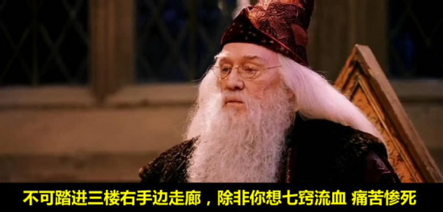

结果三人误入三楼右手边的走廊，赫敏的第一句话就是：

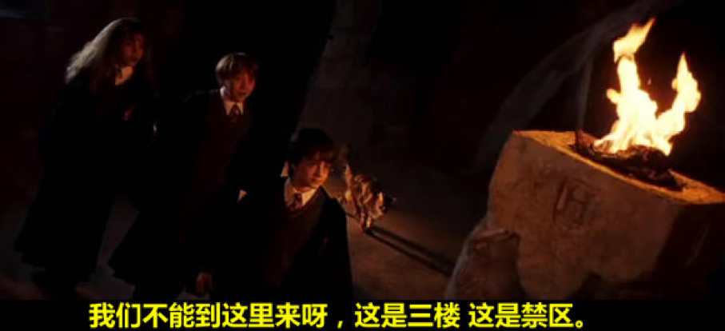

哈利不管，继续冒险，赫敏也只好跟在后面。直到三人从楼上下来，赫敏还是耿耿于怀：

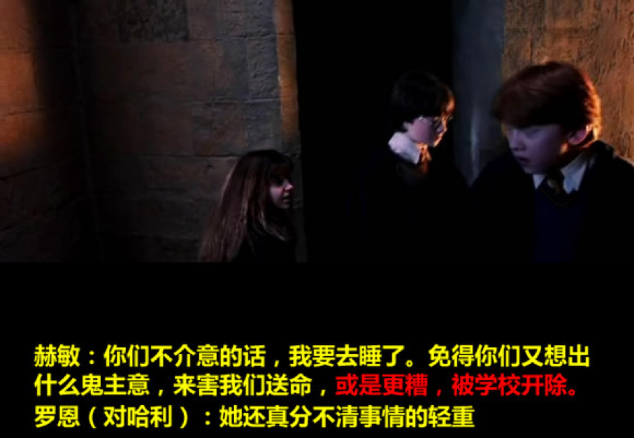

还有更多的截图不做了。

当然，赫敏是平民中的优秀人才，有经过教育进入统治阶层的潜质，倒也不是那种固守自闭的顽固麻瓜。但观念的改变需要一个长期过程，霍格沃茨的课程表上并没有“挑战规则”这门课，赫敏的背诵天赋也什么用处。在这方面，一直是罗恩和哈利在言传身教，办法就是一次又一次的带着她冒险。

哈1，三人组找魔法石的线索，哈利和罗恩不熟悉图书馆，找不到门路，赫敏则提示他们去“禁书区”，这是赫敏第一次真正违反校规。如果大家看看电影中的细节，赫敏的说话还是小心翼翼的：

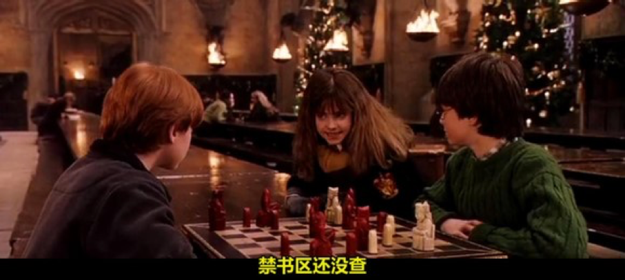

罗恩则偷偷的对哈利说：

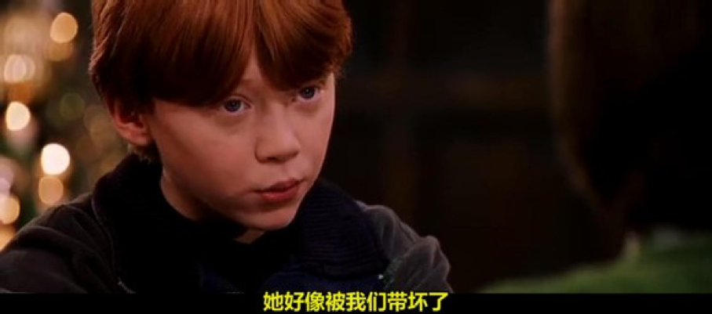

前面说过，哈1-6可以看作是赫敏的平民训练课，她的选择其实很简单，适应霍格沃茨，或者回家继续做麻瓜。赫敏的适应的速度倒也不慢。密室：

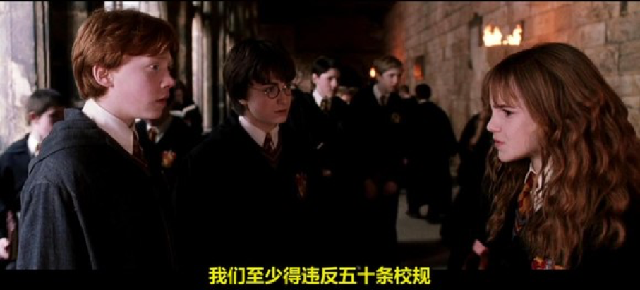

虽然还惦着“五十条校规”，但也没妨碍她策划了整个“变形水”的情节。再往后，赫敏跟着波特和罗恩进行各种冒险，也渐渐学会不把校规当一回事了。她最后一次提到“校规”是在凤凰社里：大家决定成立邓布利多军团，这严重违反了乌姆里奇的“校规”，结果赫敏来了这样一句话，

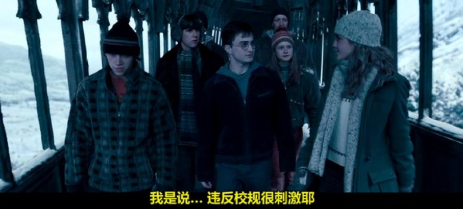

大家都觉得很反常，今天的赫敏不像她了啊？

再往下，哈6中就没有赫敏和校规的情节了，她也可以进入鼻涕虫俱乐部了。问题是，经过了五年的训练，赫敏才达到罗恩一年级的水平，和三年级就会打老师的极品同学哈利波特相比，还有很大距离。罗恩就等于金妮。因此赫敏嫁给哈利的问题，还是在金妮后面排队吧。（关于赫敏今天先讨论到这里，下面扯扯奥运会的羽毛球赛。）

原理部分结束，下面讲讲应用层面，也就是英国人如何“最好的利用或违反规则”的问题，或者说，英国人如何打“法律战”的问题？这里面的花样也很多，根据前面的分析，最基本的大概是三条原则：

**原则1：执法为公，不要为了自己的私欲，**也就是英美法中所谓“**无偏私的公正**”。原理已经分析过了，私欲是理性的大忌。这一条最简单，算不上英国特色，剧情中也很容易找到，就是麦格教授和斯内普教授的对比。

麦格教授很公正，突出的表现就是对所有同学，尤其是自己的学院格莱芬多的学生，一视同仁。她甚至保护过令人讨厌的马尔福，阻止穆迪体罚学生。

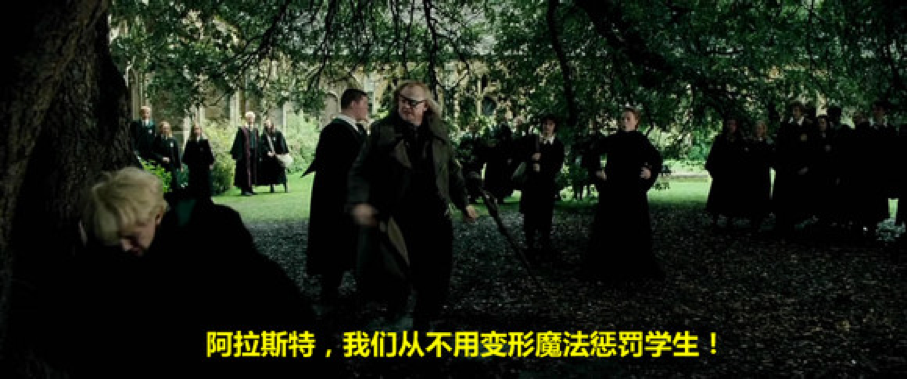

作为对照，斯内普一贯袒护本学院的学生。哈3的黑魔法防御课，斯内普代替卢平讲狼人，提问后，马尔福学狼叫，赫敏未经允许回答问题，明显应该是惩罚马尔福，但是，斯内普却扣了格莱芬多五分。

第4章中提到混血王子中赫敏帮助罗恩，使用“迅速混淆”咒语，就错在这个地方。这相当于奥运会比赛使用兴奋剂，被人抓住，那是没有任何逃跑的余地。

**原则2：穷尽规则，尽量在规则之内挑战规则。**

贵族尊重规则，即使想要实际上违反规则，也尽量照顾形式上的统一，不轻易另辟蹊径，以免造成麻瓜们的混乱。英美文学作品中，利用规则安排情节的不计其数，最著名的故事可能就是莎士比亚名著《威尼斯商人》中的“夏洛克和一磅肉”了。哈利波特中的老师们其实都是这方面的高手，比如麦格教授：

魔法石，哈利和罗恩在厕所里打晕山怪，救了赫敏。麦格教授赶来，因为赫敏违反了一年级新生的校规，扣了格莱芬多五分（其实是麦格弄错了）。

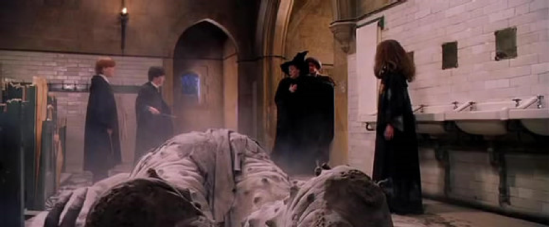

这是她公正无私的一面。紧接着，又给哈利和罗恩各加了五分。格莱芬多等于还赚了五分。这就是穷尽规则寻求利益的一面。

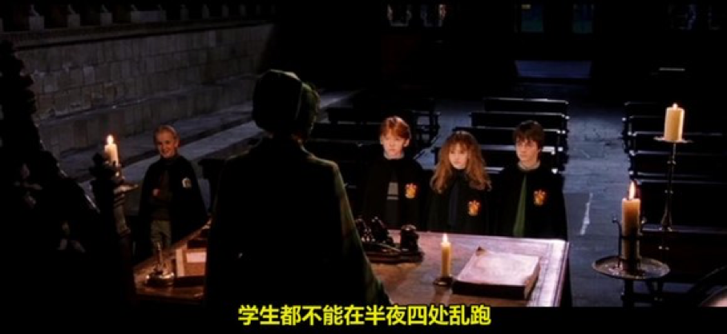

还是魔法石，三人组夜访海格小屋，被马尔福告密。麦格教授点着蜡烛过来抓考勤，哈利等三人都被惩罚，然后话锋一转，连马尔福一起也被关了禁闭。

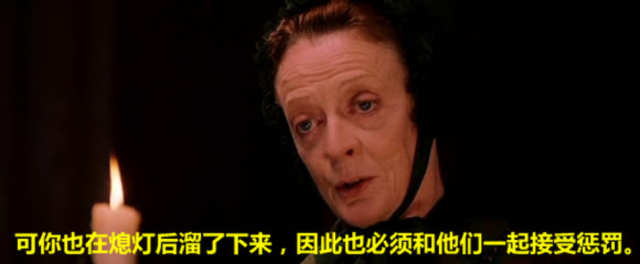

说英美人执法严格确实是真的，但是人家从来也不傻。

到了校长层面，水平就更高一些。哈5中的校长斗乌姆里奇：乌姆里奇利用督察权开除了特里芬妮教授，校长则出面保护，让麦格教授暂时收容特里芬妮，因此和乌姆里奇有一次短兵相接。

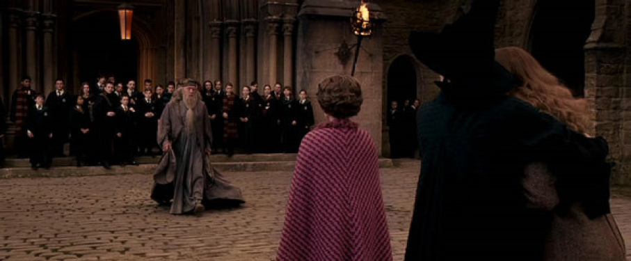

乌：邓不利多，容我提醒你，根据部长颁布的，教育章程第二十三条…

邓：你有权力开除学校老师，但是你无权把老师从学校赶走，这项权利现在还在校长手中……

乌：仅仅现在而已（for now）。

这段对话设计的很精彩，三句台词其实是两个教育章程的条文。两个演员都是靠抢着说出对方条文的漏洞，来从气势上压倒对方。这种台词设计只在英美这样法律文化深厚的国家的电影中才能拍得出来。

有这样的老师，就有哈利这样的好学生，哈利脱袜子解放多比的故事前面引用过，不再重复，哈6中哈利同样是帮助罗恩，就比赫敏高明的多：

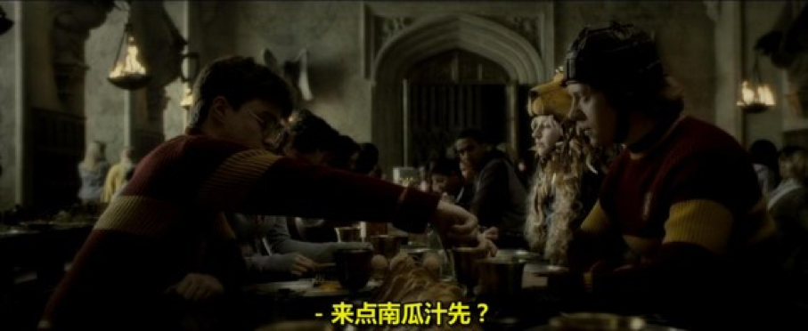

他假装把“福灵剂”放在南瓜汁里，让罗恩喝下，却又故意让罗恩知道。罗恩其实有打球的天赋，只是胆怯，喝下之后果然精神大振，最后打赢了比赛。其实哈利根本没有放幸运水，只是个心理暗示。

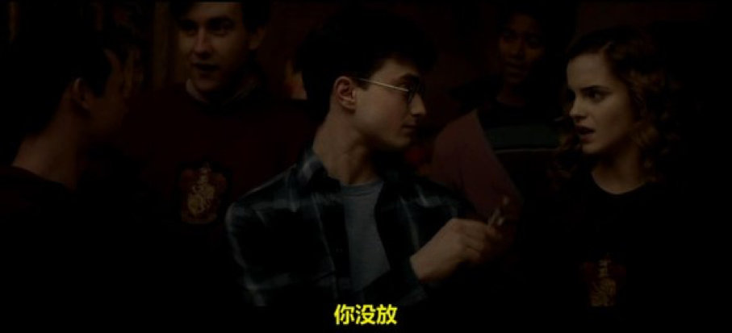

心理暗示法是否违反规则呢？规则并没有规定，最多算是擦边球。关键是不违反原则1。罗恩又不嫁给哈利，别人也找不到把柄。

**原则3：如果非要违反形式上的规则，一定要在上面加上一个道德原则。**这一条最重要，也就是刚才说的，用“恶法非法”抢占道德制高点。

哈利波特中，最爱违反规则是谁呢？其实就是邓布利多校长，1-3部差不多都是以此结尾的。

哈1。期末聚餐，按照成绩颁发学院杯。

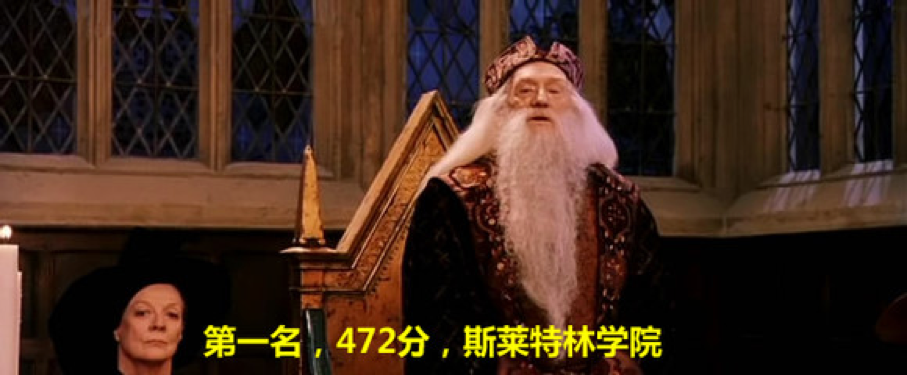

然后就是给格莱芬多左一个加分，右一个加分，连被赫敏石化的纳威都加了10分。直到格莱芬多总分超过斯莱特林。

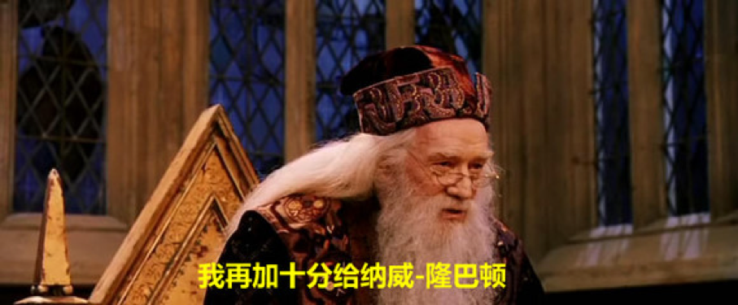

如果计算分数的方法是学校的规则的话，校长的加分就改变了这种规则。问题是，邓布利多总是有道理的，大家看电影的台词，他给每一个加分都配上一个高尚的理由。比如赫敏的理由是“在其他人陷入重大危难时，冷静地运用智慧脱困”，哈利是“胆识过人，勇气可嘉”，倒霉的纳威是“要挺身而出对抗敌人的确需要很大的勇气，但若是要挺身反抗朋友却需要更大的勇气。”这话从德高望重的校长嘴里说出来，改变规则的加分就变成了培养学生优秀品质的教育活动了，四分之三的同学在欢呼，四分之一的斯莱特林同学就只好接受了。

哈2。从密室里出来，哈利和罗恩来到校长室，校长又提到了校规问题：

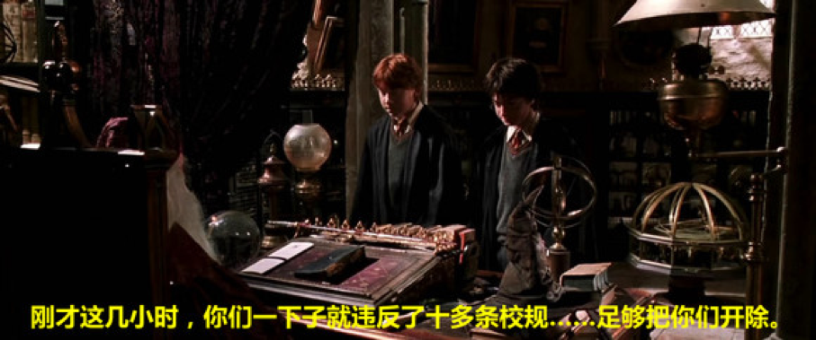

结果当然是没事。理由呢？

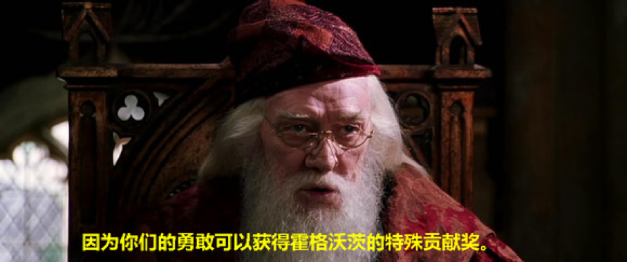

哈3。小天狼星布莱克被监禁，需要人拯救，这当然是违反了魔法部的法律，邓布利多自己不便出面，就手把手的教哈利和赫敏怎么操作：

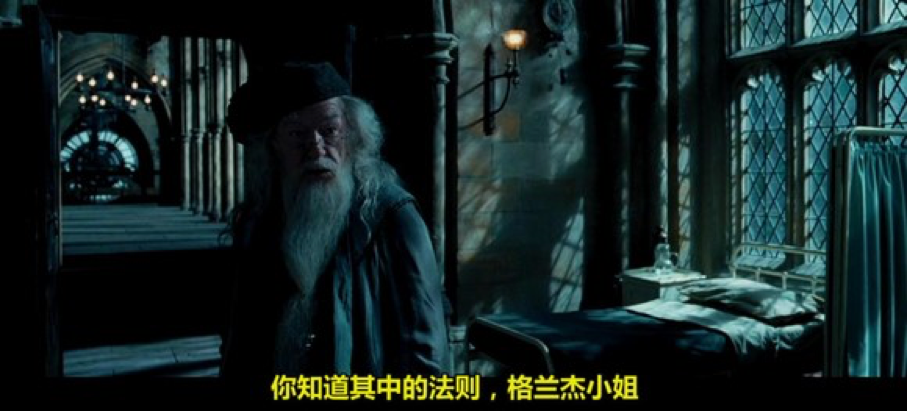

赫敏手里有时间逆转器，可以再来一次拯救布莱克行动。关键是下面一句：

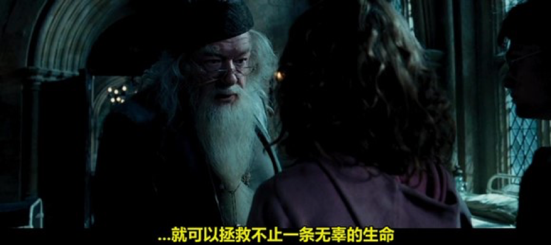

拯救一条生命已经是高尚的道德理由，拯救不止一条生命，当然就不止一般的高尚。魔法部的恶法见鬼去吧。

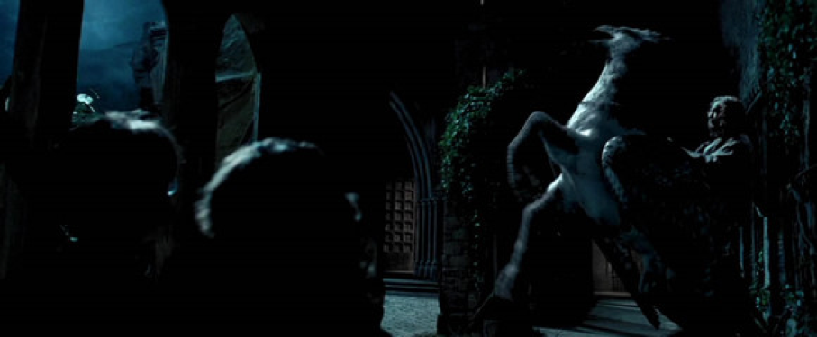

随着布莱克和巴克比克两条被拯救的无辜生命飞向蓝天，哈利和赫敏违法的问题，也就没人讨论了。

说完这三条原则，终于可以讨论一下奥运会上羽毛球禁赛的问题了。

前面有个同学问我，为什么英国人重视规则，却在奥运会上经常犯规。首先，奥运会这种事，对英国的老贵族们来说并不是什么了不起的大事，人家强盛几百年，沧海桑田见的多了，不至于开个奥运会就要举国动员。个别无心的失误，在所难免，比如风吹落国旗什么的，最多只是个仆人的错误，跟贵族老爷们扯不上联系。

其次呢，体育比赛也是一个国际竞争场所，因此跟国际政治也脱不开关系。“奥运会只是场纯洁的比赛”的想法，可能哈利经过火焰杯之后就不相信了。奥运会的主赛场当然是体育，不过我更关注赛场外的竞争，也就是宣传战、法律战方面。这里仍然是各种摄魂术的较量，双方都要鼓舞国民的士气，贬低对方的胜利，争取第三方的支持。其实斗争从京奥就开始了，年龄稍大的网友都还记得当年的火炬传递风波。京奥算是中国主场作战，赛事本身比较成功，因此美国必须在下一轮扳回来，这次选定伦敦做举办地，基本上等于美国的半个主场。

不得不说，开始几天中国人的运气确实很好，从偶然性很大的射击拿到第一枚金牌，四天内一直是金牌奖牌双第一。英美的运气也实在太差，英国最终以得到29枚金牌，但前四天居然没有拿到一枚金牌！真不知道东道主怎么排的赛程。美国甚至出现了CNN以偷欢运动员国籍的办法（把孙扬算成韩国人了），保持奖牌榜的第一的怪事。常看篮排球比赛的都知道，如果对手一直打顺风球，教练叫一次暂停，调整一下比赛节奏很重要。因此第四天，国际羽联发力了。（我也没有阴谋论的证据，不过不影响下文分析。）

羽毛球这件事本身，算是一次成功的舆论战，英国人的发力点找的非常好，技术上也很完美。前面说过，英美文化中的法律战有三个原则，第一要做到“无偏私的公正”，选择羽毛球发力就是因为这个。英美国家的羽毛球选手太弱，毫无冲击奖牌的实力，处罚的8个人全都是亚洲运动员，这很符合英美观众的心理，得失都是你们亚洲人（普通英国人分不清中国、韩国和印尼，一概称之为“亚洲人”），而避开了对执法者公正性的质疑。其实，印尼和韩国是不会和美国争总排名的，真正针对的只有中国。

禁赛的原因，是中国人钻了规则的空子，消极比赛，也就是前述第二个原则：穷尽规则，谋求最大的利益，这也是中国方面可能抗辩的理由。因此，国际羽联又提出了一个高于规则的道德原则：“消极比赛伤害了观众，影响了羽毛球运动的基础”。这一招是两难选择：你追求正义，就要吃哑巴亏，你追求利益（金牌），就落下个唯利是图的舆论形象。结果就是引发了国内舆论的大讨论和大分裂，当天晚上的新闻中，中国队新拿几块金牌的事被完全放在了一边，英国人也就控制了中国舆论的制高点。本宅早就说过，最高明的摄魂术不需要伪造事实，而是在完全清楚的事实上作出有利于自己的解释。

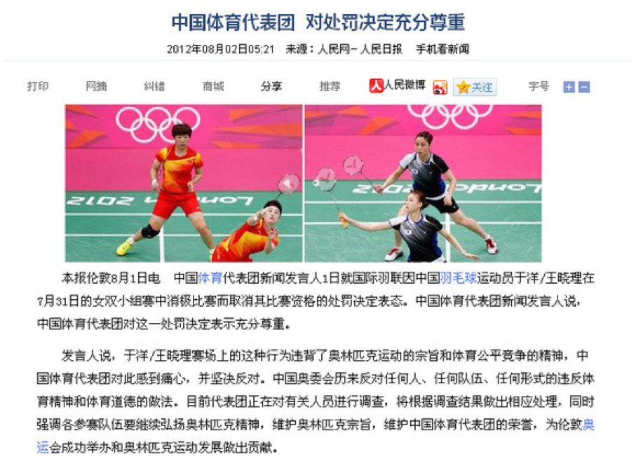

应该说，中国在这场斗法中虽然吃了亏，但应对倒也基本得体。因为暂时无法找到更高的道德理由，中国体育代表团新闻发言人表示，对这一处罚决定表示充分尊重，不再申诉。新华社和人民日报也都发表评论，主要观点还是支持禁赛。在这种舆论疏导下，网民投票也是支持者也多于反对者。这至少证明了，我们的舆论已经开始学着把“正义”放在“利益”之上看待问题。（有趣的是，人民日报的文章标题就是《羽球消极比赛风波规则与道德的碰撞》，法理学真是无处不在啊。）毕竟，北京奥运会拿金牌多到手软，下一步要学着抢占道德至高点了。如果倒退30年，举国靠着一两块金牌提神（和今天的印度类似），是绝对不会有这个结果的。就像这次惩罚中的韩国人，又在申诉，说到底还是小国的底气不足。本届奥委会应该设立一个新运动项目“奥运申诉”，给韩国人一块金牌，一块银牌，一块铜牌，一块铁牌，大家都没有意见。

英美法律文化一贯认为，规则从来都不是完美的，都有造成失误的可能。实际上，奥运会所有规则背后，都有激烈复杂的体育政治博弈，不合理的地方比比皆是。比如女子举重，女性重竞技在欧美国家并不被提倡，基本上是中国选手横扫天下，结果中国就提出一条很高尚的理由：男女平等，得到了大多数奥委会委员的支持，让女举进入奥运会。但是举重是必须分体重等级比赛，金牌巨多，如果让中国人不加限制的参赛，7个级别21块奖牌，会严重影响中美奖牌榜的平衡，结果又产生了另外一条规则，每个国家只能派四个选手参赛，作为女举进奥运的附加条件，这又造成中国选手改国籍参赛拿金牌的怪事。这种规则套规则的现象，在法学领域并不奇怪，说到底是利益平衡，因此，那种指责国际羽联规则有缺陷的国内舆论，是不会得到英美受众的支持，人家会反问：制定规则的时候你也参加了，为什么出了事才提出来？

亏已经吃了，唯一的抗议是继续沿着规则走到底，用实力说话。总教练李永波还是挺狠的，几乎是在千夫所指的情况下硬挺着过来，居然还指导女双二号拿到了冠军，并且包揽了羽毛球大满贯。从舆论战的角度，我感觉唯一有点美中不足的是，女双颁奖仪式上，两位冠军应该举着于洋王晓理的照片一同领奖，这是一种示威，让别人看到我们的态度。当然了，无论运动员怎么做，英国的电视观众是肯定看不到的，黑完了两个选手，羽毛球的消息就在英美媒体的奥运报道中消失了。

此后事态的发展呢，嘿嘿，我们的宣传部门也没闲着。这次奥运会我们派了整整六百名摄魂师去伦敦，肯定不是为了去看哈利波特的。羽毛球事件之前，当然也有负面报道，但是事件发生之后，我感觉国内舆论明显在发力，各大媒体事无巨细的报道伦敦奥运会的每一个违规，每一次争议，每一个错误，报道的篇幅有时甚至多于中国运动员的成绩。中国的媒体人愤怒了。**红巫师们的口号是：激怒一代人！**他们辛勤努力的工作，也收获了累累硕果，也就是有些留言所说的，“我再也不相信英国人遵守规则了”。各位，你们都被摄魂了吗？

翟按：个人认为，大学教师的职责，传授某种思想倒在其次——每个学生都有自己的价值判断，和老师是平等的。教师是否称职，主要还是在教学能力方面。天津这边考察教师有四门基本功课：说、学、逗、唱，上一篇就是“学”字功，学愤青，有的朋友留言觉得我资深愤青、资深五毛党，多谢夸奖，学得像就好。国际政治学本来就容易产生“愤青”，因为你是把“美国”、“中国”当作基本概念，研究其相互关系的。喜欢抨击政府的同学，改天我给你们讲一节宪法学听一听，这门课是把“公民”、“政府”当作基本概念，研究其相互关系的，风格和国际政治恰好相反。学公共知识分子的段子，也挺有意思的。

翟又按：今天的论证不是很严谨，尤其是羽毛球比赛，很多是凭直觉。个人感觉禁赛前后中国舆论导向是有变化的，前面微黑，后面狂黑。当然只是个人感受，缺乏证据。大家看看思路就好，主要还是介绍一下英国人的法律观念。法学本来就有很强的技术性，没有前面几篇火爆，在专业领域内，我其实已经说的很过分了。

### 9\. 霍格沃茨的教学

翟按：抱歉各位，8初稿上周末就写完了，这几天一直在努力修改，一时改不完，只好先把“上”发出来，大家看看就明白了。另外，**本篇使用了比较偏激煽情的写作风格，大家读完后都尽量冷静。**因为只有一半内容、也只提供一半真理。

另，请站外转载的朋友转载时保持完整，包括前后按语。谢谢。

在主贴中，我说霍格沃茨是一所法学院，很多留言表示反对，说受不了我的浓厚的法学优越感，这事挺抱歉的，主贴本来是和自己的学生闲聊的，证据列的不是很充足，今天和大家八卦一下英美国家的高等教育，尤其是法学教育，顺带把这个问题彻底回答一下。不过在欧洲教育史上，法学确实有点儿不一样，因为世界教育史上公认的第一所大学，就是一所**法学院**，里面的第一个专业，就是**法学**。

#### 9\.1\. 院系设置

在现代欧洲各语言中，“大学”这个词都差不多，比如英语中的university，法语中的université，西班牙语的universidad，德语的Universität，意大利语的università等等，其词源都来自拉丁语universus，因为世界第一所大学在意大利出现的。

欧洲是一个深入大西洋的半岛，以阿尔卑斯山为界，南侧是环地中海航线，北侧则是波罗的海——北海——北大西洋航线，这是欧洲最基本的两个经济单元。环地中海地区开发的较早，最终形成以罗马城为中心的罗马帝国。日耳曼人大迁徙之后，罗马帝国解体，但是相当长一段时间，欧洲最富裕的区域还在意大利，尤其是北部平原地区，有一系列历史文化名城如热那亚、佛罗伦萨、威尼斯等，文艺复兴就是从这里开始的。

当时意大利北部各城市都有自己的特产业，比如热那亚的奶酪和盔甲、佛罗伦萨的羊毛线、威尼斯的葡萄酒。在佛罗伦萨和威尼斯之间，有一个叫做博洛尼亚（或译波伦那）的城市，他的特产比较有个性：法学教育。因为意大利是罗马法的故乡，欧洲各地的学者们经常到意大利来学习法律，原本各城市都有，但博洛尼亚人有商业头脑，逐渐把无烟环保的法学教育办成了当地经济的支柱产业。

博洛尼亚古城

最初的博洛尼亚并没有统一的教育机构，学生们自己组成“同乡会”（按照籍贯组成，比如不列颠同乡会、法兰西同乡会等，类似于明清会馆），再由“同乡会”出面和老师签订合同，并给老师们支付报酬。结果，每到招生季节，法学教师们天天忙着打广告招揽学生，博洛尼亚城中“司考冲刺一百天”、“考研法学必过”、“罗马法速成”的标语铺天盖地，简直让人怀疑到了昌平。

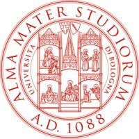

1088年，博洛尼亚一位杰出的教师伊纳留斯（Irnerrius，翻译成什么的都有），从当时的皇帝那里获得了特许权，把所有的同乡会联合起来，变成了一个统一管理的大型教育机构，这就是世界上第一个大学universus，拉丁语原意为“联合体”。这个大学开始只有一个专业，当然就是法学了。伊纳留斯也成了法学专业的祖师爷，欧洲人给了他一个后人难以超越的美称：“法律之光”，天不生夫子，万古长如夜！

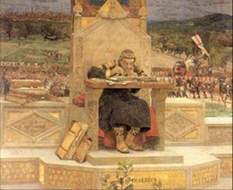

法律之光伊纳留斯

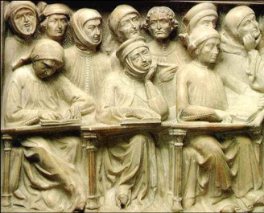

博洛尼亚大学授课

博洛尼亚的成功模式很快得到推广，北意大利的帕多瓦、费拉拉、比萨、都灵、佛罗伦萨、热那亚，都建立起类似的大学。在南意大利的维苏威火山脚下，有个温泉疗养胜地萨莱诺Salerno，很多人来此治疗皮肤病，因此聚集着不少医生。医学是一个很特殊的学科，大分类归入广义上的理科，小分类又和“理工农”并列，自成一家。医学研究的对象是人体，属于自然科学，但人体是个典型的复杂系统，和研究单一对象的物理化学等有区别，倒是和研究社会系统的法学有共同点。中国自古就有“不为良相、便为良医”的说法，西方人也经常把律师和医生并称。（本宅最早的国学启蒙，就是小时候乱翻家母的中医学教材，什么阴阳五行、虚实表里、辨证施治之类，都是中国传统哲学的重要概念。）因此，萨莱诺的医生们也仿照博洛尼亚，建立了教育史上第二所重要的大学：萨莱诺大学，专业是医学。

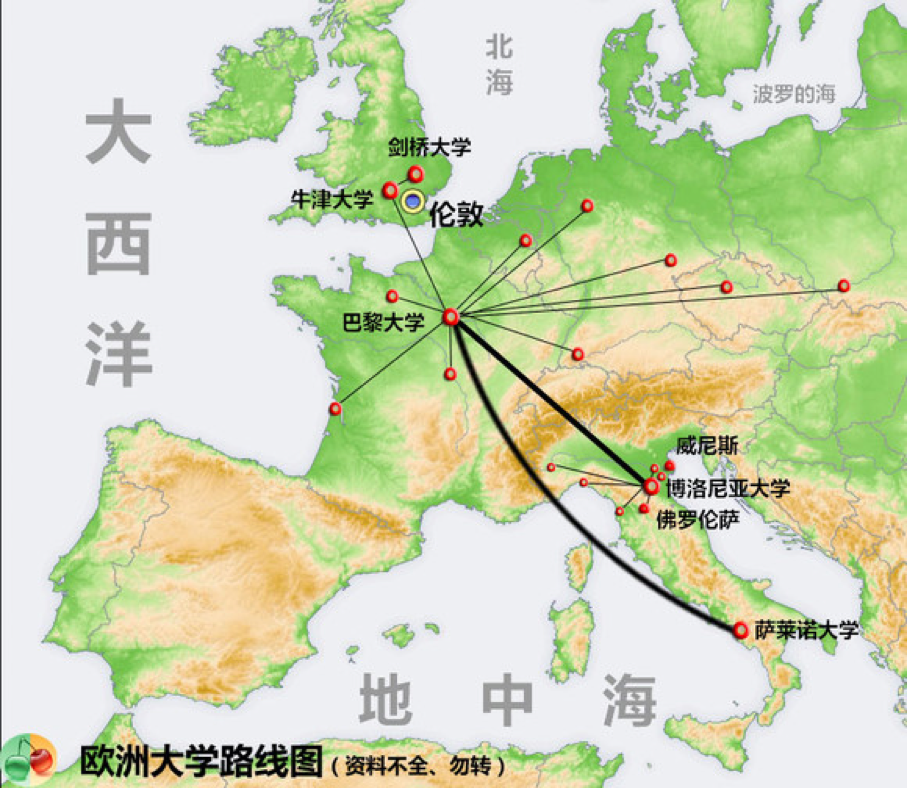

当时的西欧学生来意大利上学要翻越阿尔卑斯山，路途遥远，费用昂贵。几代留学生回国后，开始在自己的本国建立“大学”，其中最成功的是巴黎大学。巴黎大学不完全复制意大利的大学模式，而有很多创新，尤其是将传统的单一学科教学改为多学科教学，成了世界上第一所综合性大学。

巴黎大学一共拥有四个学院：

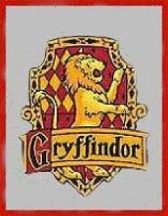

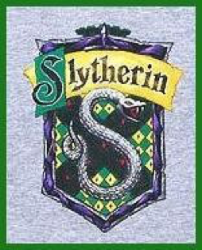

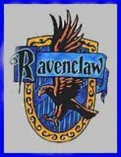

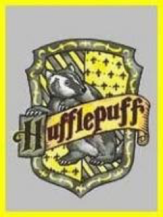

呵呵，应该是法学院、医学院、神学院（哲学院）和文学院。和霍格沃茨的四大学院并不严格对应，但确实有些联系。

格莱芬多学院有法学院的元素，不重复了。

斯莱特林学院有医学院的元素。比如斯莱特林院徽上的蛇，就是医生的标记，从萨莱诺大学一系传来的。意大利虽然是一个国家，但南方北方差别很大。北意大利人主要是日耳曼人的一支伦巴底人的后代，和基督教的日耳曼诸国交往密切。而南意大利主要是残存的罗马帝国居民的后代，和地中海东岸的希腊、阿拉伯地区来往频繁，萨莱诺大学的课本是希腊医学家希波克拉底和阿拉伯的医学的著作，第一任校长是犹太人阿非利加诺，因此医学院中有一些基督教视为异教的东西。比如基督教文化视蛇为邪恶，但在希腊文化中，“蛇绕手杖”是古希腊名医阿斯克勒庇俄斯(Asclepius)的徽记，图案见世界卫生组织的徽标：

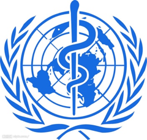

因为这层关系，医学院在巴黎大学的地位一直比较特殊。加上巴黎大学的四大学院是三文一理，文、法、哲关系密切，经常有学生转系或者兼修，而医学院的课程独立性较强，学习任务又重，和其他三个学院的关系相对疏远。因此在霍格沃茨里，斯莱特林的学生总是和别人不太好相处。当然，罗琳和医生这个职业无冤无仇，不是用斯莱特林影射医生，只是有些相近元素而已。

除了法学和医学，第三个学院神学（哲学）院是巴黎大学的特。最初是一个叫索邦Sorbon的巴黎神父，在塞纳河上的西堤岛建立了一个学校，就是巴黎大学的前身“索邦神学院”，前面我们已经看到，法学和神学（哲学）关系密切，法学问题研究到深处，超越了具体的法条，就变成哲学问题，因此索邦神学院很快和其他学院结合起来，组成巴黎大学，“索邦”也成了巴黎大学的代称。神学院一直是巴黎大学的招牌学科，培养出的号称“天使博士”的圣托马斯•阿奎那，是世界学术史的一座高峰。

霍格沃茨中的拉文克劳学院，有神学院的元素。分院帽对拉文克劳的学生评价是：“如果你头脑精明，或许会进智能的老拉文劳克，那些睿智博学的人，总会在那里遇见他们的同道”，就是这个意思。拉文克劳的宿舍在尖塔，院徽中的鹰有睿智的意思，常在天空翱翔，也是和哲学对应的。拉文克劳的孩子们聪明，有哲学家气质，比如卢娜。另外，如前所述，法学研究高度依赖于哲学基础，又不停的给哲学提供新课题。这两个学科一直是不分彼此，因此在霍格沃茨中，两个学院的学生也很亲密：

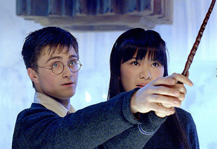

文学院也是巴黎大学的创新，不过文学院比其他三个学院的地位低，相当于其他三个学院的预科。文学院的课程只有语法、逻辑、修辞三门，学费不高，因此招生数量巨大，比剩下三个学院合计还要多。不过中世纪欧洲很穷，贵族子女才能长期脱产读书，家境较差的平民子弟，往往在文学院拿个文凭就走人了，因此文学院的文凭是不如其他学院的，文学院的毕业生叫学士bachelor，而神法医学院的毕业生叫博士doctor。前面说过，英美文学界有偏左的传统，罗琳本人拿的就是文学学位，整个哈利波特的主调是“**一部宣扬废弃阶级血统观念，讲求平等自由的书，同时也是一部关于爱的书**”，也是这个原因。

霍格沃茨中的赫奇帕奇学院，有文学院的元素。分院帽说的，“你也许属于赫奇帕奇，那里的人正直忠诚，赫奇帕奇的学子们坚忍诚实，不畏惧艰辛的劳动。”赫奇帕奇学生数量最多，但经常被别人视为饭桶，也没有什么杰出人物，最大的特长是做饭，“赫奇帕奇的金杯”就是一口锅嘛。他们的院徽是爱钻地洞的獾，宿舍在地下室，院长斯普劳特教授也是一副劳动者的淳朴形象。

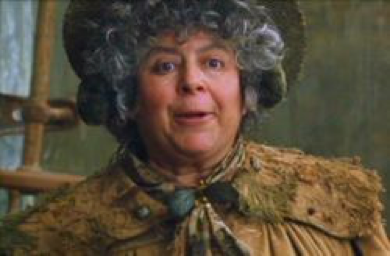

如果大家看得仔细，哈3中斯普劳特教授出场亮相的草药学课上，她和同学们打招呼，一共打了两次才有回应，这也是全剧中唯一的。

**（我们说的是欧洲，和中国的教育传统不同，很多概念名同实异，中国传统上文学是高分学科，恢复高考前几年文科状元一般都在中文系，最低分差不多才是法学系。强烈反对大家对号入座，变成学科混战。）**

巴黎大学的模式很成功，很快超过意大利，成为中世纪大学的样板。西欧各国仿照巴黎大学建立了一批大学，这些大学都按照神法医文进行学科设置，这也是最古老的一次大学分科。直到现在，欧美的神父、法官和医生这三个职业还是有关联的，他们都是实行终身制，有资格准入制度，靠行业协会而不是政府管理，甚至服装上也还保留着穿长袍的职业习惯，和霍格沃茨的校服是一致的。有趣的是，医生的白也很一如既往的和法官的黑色相反。

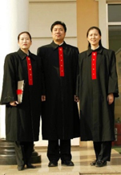

（从心理学的角度，白大褂主要是镇静病人情绪。法袍主要是增加威严感，神父则兼有二者。三个职业分别负责死亡和生命，确实有些相反相成。）

多说一句，欧美文化中和律师、神父、医生并称的只有一个职业，就是他们毕业后选择留校的同学：大学老师。大学老师的职业装是什么呢？

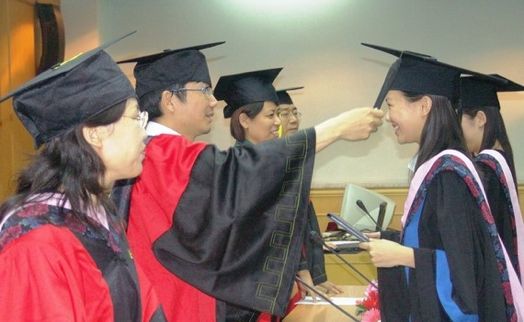

回到英国的高等教育。英国的大学也是从巴黎大学分出来的。百年战争期间，一批在巴黎留学的英国师生回国，在伦敦西北的牛津镇，创办了牛津大学，后来一些牛津的学者又在伦敦东北的剑桥镇创办了剑桥大学。英国很长时间只有这两所大学，到现在也仍然是英国高等教育的核心，英国人称之为牛剑/牛桥Oxbridge。中世纪，两校生源都以贵族子弟为主，课程上仍然基本上是神法医文四科。

中世纪法学院一般只教两门课：罗马法和教会法。前者名义上是罗马帝国的法律，后者是历代教皇颁发的教令，当时有法律效力。教学方法上也是以书本知识为主。这在中世纪还行得通，新航路开辟之后，需要大量适应资本主义生产方式的新法律，这种教学方式就显得有点out了。英国是新航路的中枢，又离罗马最远，根基不牢的罗马法很快被淘汰，以英国自身习惯为根基的“普通法”得到了重大发展，（普通法的源头则更早），即后来的英美法系。欧洲大陆地区的罗马法传统则发展成为大陆法系。对应到法学教育上，就是牛剑法学院之外，又出现了另外一套系统，就是主贴中的四大律师学院：格林、林肯、内殿、中殿。

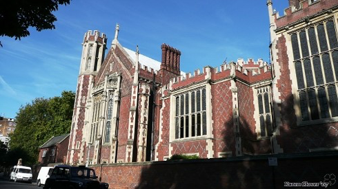

林肯律师学院

这四个学院建立的时间，差不多和英国资本主义发展的时代对应。教学方法上，甩掉复杂的拉丁语、希腊语和抽象的罗马法概念，以研究英国本土的案例为主，以便适应英国普通法的判例制。四大学院只有法学一个专业，包括财产法、合同法等若干门课程，之所以分为四个学院，主要是建立律师之间的私人友谊，并保持一定程度上的竞争。当时大贵族仍然偏好牛剑，中小贵族和平民上层更愿意去律师学院讨出身。随着英国资本主义的发展，有贵族身份又从事资本主义工商业的“新贵族”兴起，律师学院十分兴旺。很多人干脆先读牛剑，再读律师学院，比如亨利八世的大法官、《乌托邦》的作者圣托马斯•莫尔。

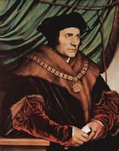

这两种法学教育的机制，都已经成了英国历史文化的一部分。**《哈利波特》中，霍格沃茨的组织结构就是“大学”和“律师学院”的混合**：四大学院有神法医文的元素，学生管理以学院为单位，日常生活中，强调培养私人感情，因此有长桌吃饭的传统。但学习又是以课程为单位的，各学院学生一起上专业课。（首贴写的仓促，这里稍修改一下，抱歉了。）英国这种高等教育双轨制的模式持了很久，直到19世纪中后期才有变化，具体过程一会儿再说。但是英国贵族们的教育重心在统治术，一直没什么变化。

#### 9\.2\. 课程安排

前面解析过霍格沃茨的几门课程，现在从整体上再分析一下。霍格沃茨课程表，百度百科提供：

保护神奇生物课——CAREOF MAGICAL CREATURES

变形术——TRANSFIGURATION

古代魔文——ANCIENT RUNES

黑魔法防御术——DEFENCEAGAINST THE DARK ARTS

幻影显形课——APPARITION LESSONS

麻瓜研究——MUGGLE STUDIES

魔法史——HISTORYOF MAGIC

魔药课——POTIONS

魔咒学——CHARMS

算数占卜学——ARITHMANCY

天文学——ASTRONOMY

草药学——HERBOLOGY

占卜学——DIVINATION

有些已经解释过，比如黑魔法防御相当于法学、古代魔文相当于拉丁语、也有的很明显是自然科学，比如魔药学相当于化学，草药学相当于生物。早就有同学对此表示异议，学草药学的怎么会是法学院？

我的回答是，不错，就是法学院。法学院学生，也一定要掌握自然科学知识。

为什么呢？因为科学和法学有密切的渊源。

大家是否发现，现代大学中招生量最大的理工科，在早期的大学中是不存在的。按照常理，每一代理工科学生，都是上一代理工科老师们教出来的，那么第一代的理工科老师们，又是谁教出来的呢？

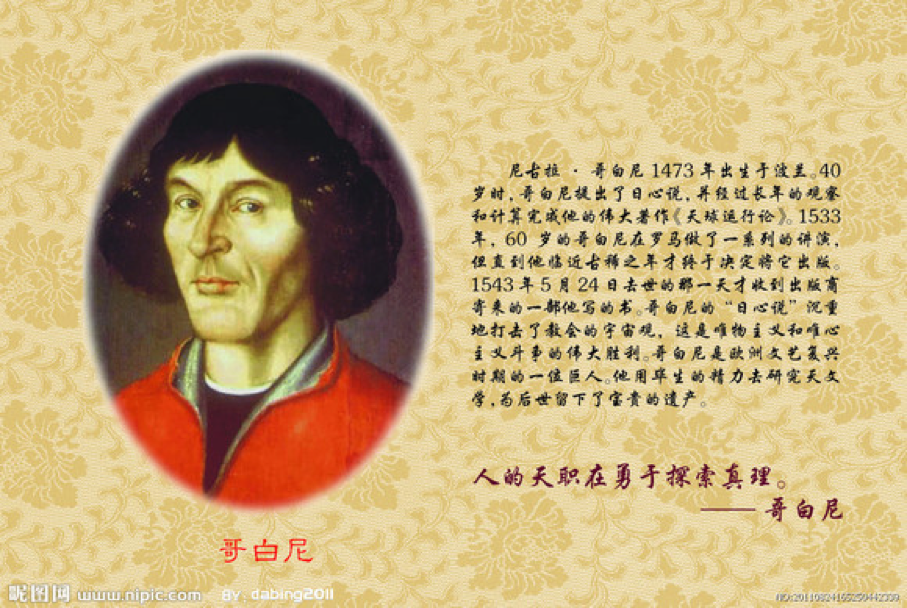

近代科学开始于哥白尼发动的天文学革命，很多近代科学史都是从哥白尼写起的。他在科学中的地位毋庸置疑。哥白尼读的什么专业呢？

**法学。**

哥白尼是波兰人，在波兰的亚盖洛大学读的文学预科，然后到意大利的博洛尼亚大学读法学，没错，**就是开篇介绍的以法学教育著称的博洛尼亚大学**，他最终的学位是教会法法学博士，研究天文学只是他的业余爱好。

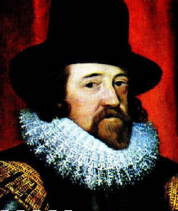

弗朗西斯•培根，英国哲学家，近代科学思想之父，提倡用实验调查法进行科学研究，名言是“知识就是力量”。他读的什么专业呢？

**法学。**

培根的他父亲是英王的掌玺大臣，他12岁进剑桥大学读文学预科，后来到格雷律师学院学习法律，21岁取得律师资格。他一生仕宦沉浮，最高曾任英国大法官。科学哲学也是他的副业。

笛卡尔，欧洲近代哲学之父，数学家，解析几何的发明人。他读的什么专业呢？

**法学。**

笛卡尔生于法国布列塔尼省的小贵族家庭，1613年到普瓦蒂埃Poitiers大学学习法律，1616年毕业，按照小贵族的传统入伍当了军官，在兵营中完成了他的解析几何体系。

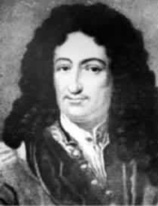

莱布尼茨，德国哲学家、数学家，和牛顿同时独立发明了微积分。他的学说涉及力学、光学、语言学等40多个范畴，被誉为十七世纪的亚里士多德。他读的什么专业呢？

**法学。**

莱布尼茨的父亲是莱比锡Leipzig大学的神学教授，1661年，15岁的莱布尼茨进入莱比锡大学学习法律，1665年就提交了博士论文《论身份》，因为实在太年轻被拒绝，1667年，阿尔特多夫大学授予他法学博士学位，还聘请他为法学教授。

还有更多，不再一一列举了。

非法学的同学们已经很不淡定的了，你们法学简直是尼玛帝国主义学科啊！

呵呵，别说“你们法学”，说“咱们法学”好不好。

抱歉各位，这里使用了一点“一半真相”的写作技巧，忽略了文学院的牛顿、医学院的伽利略、神学院的开普勒，不过第一代科学家中的法学院的人确实最多。只是当时大学一共就四个学院，拿法学学位的科学家多一点，不意味着法学有什么神奇之处。

我真正的意思是，**各专业是一家，在顶级人才的培养中，文理是不能分科的。**

为什么呢？法学知识和理工科各科学的知识，都来自一个共同的概念：理性。

前面说过，法学的精华在于理性控制欲望，也可以说，法学是理性的学问。中世纪，人的认识能力有限，只能用“理性的方法”研究宏观的“人”，因此获得的知识就是法学。近代，尤其是显微镜、望远镜等试验设备发明以后，哥白尼这一代人用“理性的方法”去研究微观的“物”，产生了巨大的突破，形成了科学这个新概念，最后发展成理工科。因此，科学和法学是同源的，前者是自然科学，后者是社会科学。

反过来说，法学也离不开自然科学。

本宅的前面几个帖子，稍微涉及了一些自然科学方面的知识，比如遗传学、进化论、EPR，当然是错误百出，很多网友已经指出了。其实我不说那些话，没人会挑一个法学老师的知识结构有缺陷。我落笔的时候很清楚这一点，但是还是在坚持，因为挨骂小事，作为一种教育理念，下面这句话一定要说出来：**真理是不可分的。**法学并不仅仅是个什么“文科专业”，靠摆弄文字混饭吃，法学也是科学，而且是全局性的科学，决不能放弃对自然科学的敏感，微观和宏观是相通的。

近代意义上的文理分科，主要还是存量知识太多，人一生之力不能穷尽。老百姓的层面只要掌握一才一艺就可以谋生，不用考虑全局，造桥的不管修路，挖煤的不用打铁，因此可以“分科”。但法学则不然，法学是统治之学，统治者必须考虑全局，**掌握“一半真理”的统治者，与瞎子无异。**哈佛校训是“真理”veritas，耶鲁校训是“光明和真理”Lux et Veritas，从来不分文理。法学教育不能画地为牢，放弃对文科和理科共同真理的追求。

这表现在英美教育上，就是法学教育的文理不分科。

工业革命之后，社会财富剧增，普通人也有了上大学的物质基础，从而引发了英国高等教育的大改革，史称“新大学运动”，结果是，牛剑的垄断被打破了，更多的大学设立起来，并在平民子弟中开始招生，学科设置上开始丰富，尤其是增加了很多理工科专业。但是坦率的说，理工科在英美教育体系中的地位并不高，美国白人读理工科博士的很少，物理系很多都是中国人和印度人，1900年之后的美国总统中只有小罗斯福的前任胡佛是工科，任内发生了三十年代大危机，以“胡佛猪”、“胡佛屋”名传史册。英美白人世家子弟，还是拼命的往法学院和医学院里钻（神学院也已经衰落了）。

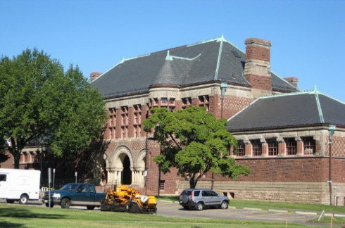

哈佛法学院

因此，律师学院之后，又出现了第三种法学教育形式：“大学法学院”，律师学院逐渐变成一种律师注册机构，不再承担教育职能了。“大学法学院”从表面上看，是牛剑的法学教育的复活，其实这是一种新设的教育机制。“大学法学院”根本不招收本科生，而是必须先读一个本科学位，然后才能申请进入法学院，并且有极高的入学门槛。法学院的学位叫Juris Doctor，JD，即“法学博士”。这是英美高等教育的二元论，说白了，就是**在平民也有大学文凭的时代，继保持贵族们的领导地位。**

在JD教育中，招生是不分文理科的。电影《律政俏佳人》中就有这样一段场景：

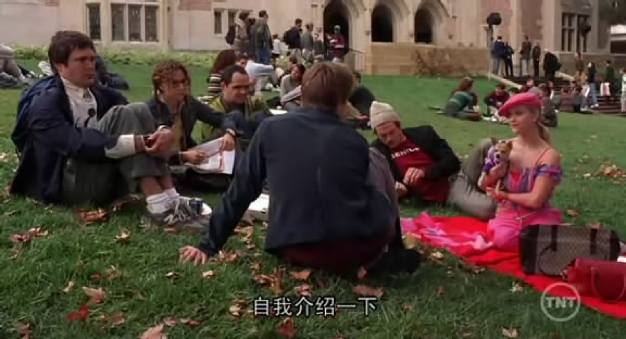

女主角考上哈佛法学院后，同学们进行自我介绍，4个学生的台词如下：

男1：“我有一个俄国文学硕士学位和一个生物化学博士学位，过去一年半，在索马里给孤儿除虫。”

女1：“我拿了妇女研究博士学位，主攻女权运动抗争史，去年我筹组支持女同性恋，以及反对醉酒驾车游行。”

男2：“我是普林斯顿的物理学第一名，智商187，霍金的《时间简史》可能是抄袭我四年级的作业。”

女2：“我从加利福尼亚州洛杉矶大学毕业，时装销售规划学士学位。女生会的主席，同学会的红心皇后。”

《律政俏佳人》是轻喜剧，台词夸张，不过确实能说明些问题。美国法学院的学生，必须先学习各种“专业”，法学院本身则是文理兼收，文学、政治学、物理学、时装设计，没有法学院不研究的东西。当然法学院的学生不是去研究具体的科学问题，只是关注其“理性的精神”，也可以说，法学院只招收“理性思维特别发达”的人，本科具体学什么反而并不重要。法学界甚至有终身文理双修的人，比如著名法学家罗斯科•庞德，先读的植物学本科和硕士，然后拿了JD，当律师执业，接着又拿了植物学博士，再去哈佛当法学院院长，成为美国法社会学这个学派的泰斗。

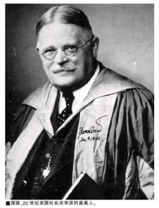

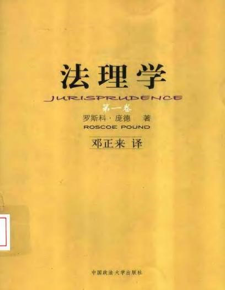

反过来说，顶级教育“文理分科”又会怎样？看看咱们自己就知道了。

这个帖子虽然东拉西扯，说到底总还是以我的专业法学为本，主要是写给高年级法学同学看的。最近因为这个帖子，加我好友的同学不少，我曾经用人人的好友分析器做过一个分析，发现好友的院系分布中，人数最多的竟然是清华大学，平均年龄24.4岁，等于我一个法学系小讲师在给一帮清华的工科博士讲课。我本人觉得亚历山大，同时又感到很奇怪。按说到了这个层次的读者，应该对赫敏的婚姻问题不是很在意了，但还是有人能看下去，到底这个帖子给大家提供了什么？

个人理解，原因是由于我国大学的文理分科机制，导致最优秀的理工科学生得不到必要的人文教育，不得不上网，从我这个胡扯的帖子中吸取些营养。这对我本人当然是一种荣幸，但是对于我国的高等教育来说，就是一种悲哀了。我们的文理分科早在高中就开始了，高考本身就是一次知识结构的大破坏。大学更是变本加厉，各个专业的学生安于自己的小天地，很少在老师的帮助下趟过知识的大海。这样的教育，培养出来的不是人才，是砖头。美国是一只狮子带着一群绵羊，中国是一只绵羊带着一群狮子，国际竞争中将会怎样？

平常在讨论专业话题的时候，我最怕碰到的是两种人。

一种是缺乏人文常识的理科生，尤其是在自己的专业领域小有所长、因此性格固执的那种人，比如有个留言的人，从第一帖开始跟我讨论原著的细节，到7还在提同样的问题，简直不胜其烦。我当然无权禁止理科生讨论人文话题，但是如前所述，文科的核心内容就是摄魂术，文科知识就是一个接一个的光怪陆离的气泡，全是摄魂术制造出来的心魔幻境，缺乏训练的人，很容易分不清欲望和理性，陷入伏地魔的操纵而不能自拔。

在现行的高考机制下，理科生平均素质比文科生要好，应该说其中的优秀者有学习历史文化哲学的潜质，但这需要训练，需要过程，任何一个天才都不能一蹴而就。网上有些自称为工业党的人，喜欢对政治问题发表意见，有些观点确实有创见，但也有些观点，确实是“too simple too naive”，人文科学没这么简单，拍拍脑袋搞定。还有些科学神教徒，天天用“科学科学”的棒子打人，仗着自己的理工科博士学位，文科生不敢还手而已。这些人领导国家，会怎样？

另外一种是缺乏逻辑的文科生，这个问题更加严重。我国的高考机制下，数学不好的选文科，因此法学系中有很多缺乏逻辑能力的人。个别法学博士，能做几个小时的演讲，并且让人搞不清他在说什么。这种人不是能否分清欲望和理性的问题，而是根本就没有理性的问题，有些论文连基本概念上的同一律、排中律都做不到。“工业党”所谓的“情怀党”，很多都是这样来的。人文科学少不了摄魂术，但是法学的摄魂术，需要严格的逻辑支持，大家跟着汽车司机学习民主，结果会怎样？

**（再一次强调，不要对号入座，问题出在文理分科身上，我自己也是受害者，前面稍微涉及科学话题，就出了一大堆错误，首先要自己检讨。）**

随着中国高等教育的正规化，越来越多的法学毕业生进入领导岗位，这种知识上的缺陷，也就越来越成问题。给理科生推荐文科读物还算容易，给文科生推荐理科读物，真是千难万难。很多文科生对科学都麻木了，一看到就远远的躲开，这迟早会出事的。最高领导人可以不关注细节，但对科学前沿一定要有基本的敏感度。比如当年的曼哈顿工程。如果罗斯福对原子物理一无所知，让希特勒抢先制造出原子弹，二战的结果将会怎样？

（曼哈顿工程，详情可百度。）

有人说，我又不当国家主席，只是个普通小文科，原子物理与我何干？统治者不仅仅是国家主席，你从老爸手里接过一个做皮鞋的小工厂，20个工人、两个技术员，也是这个工厂中小小的统治者。现在老爸供你读了四年法学院，除了背一肚子法条之外什么都不知道，连皮革有几种都分不清，这个班，你怎么接？就算是你专门做律师，打官司就是打证据，各种尸体检验、伤情鉴定、化验报告、精神鉴定，里面花样多的很，只懂法条的律师，能做好吗？

#### 9\.3\. 授课方式

因为文理不分科，霍格沃茨的上课，另有一个特。黑魔法防御截图已经太多，剩下的课程，随便截几张图大家看一看：哈利波特电影中，教室的布景非常有文化气息，每个场面都可圈可点，大家可以好好欣赏。

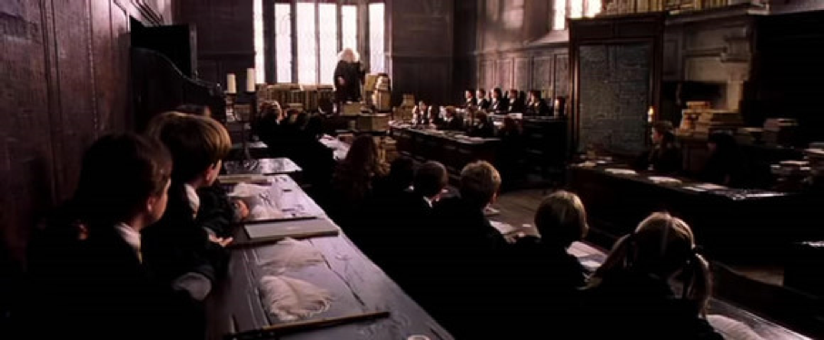

哈1，魔咒学

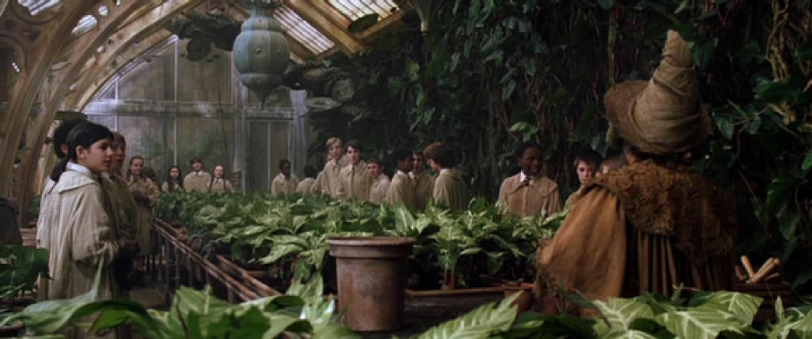

哈2，草药学

哈2，变形术

哈3，保护神奇生物学

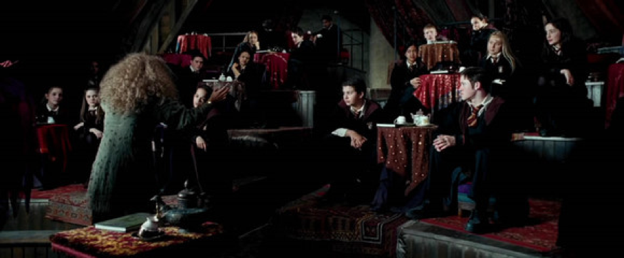

哈3，占卜术

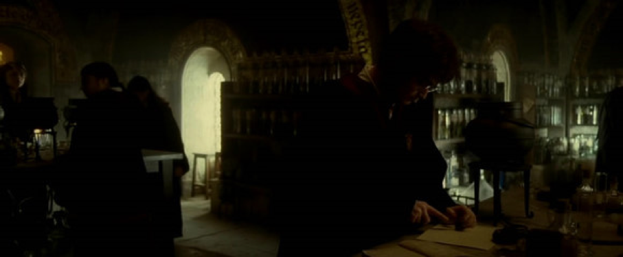

哈6，魔药学

从律师学院时代开始，英美法学教育就是以实践为主。他们的法学教育，跟理科生做实验差不多。整个哈利波特的系列电影，所有的课堂教学都是老师动手示范、学生动手操作，从来没有老师大段的板书、学生埋头记笔记的镜头。唯一只动口不动手的，只有乌姆里奇：

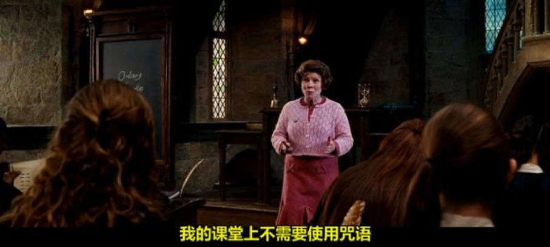

现实中，美国法学院教学的风格也是如此。大家有没有发现，《律政俏佳人》学生们自我介绍，除了学位，一定要说是自己的社会实践经历，表示自己不是个书呆子。美国法学院的课堂教学，也是以讨论案例为主。女主角的第一堂课，老师一上来就发问案例，结果毫无准备的她被轰出课堂。

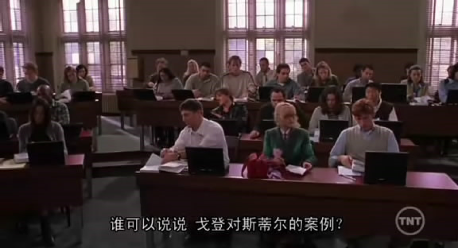

后来有学长帮忙，才知道法学院老师的教学方法：

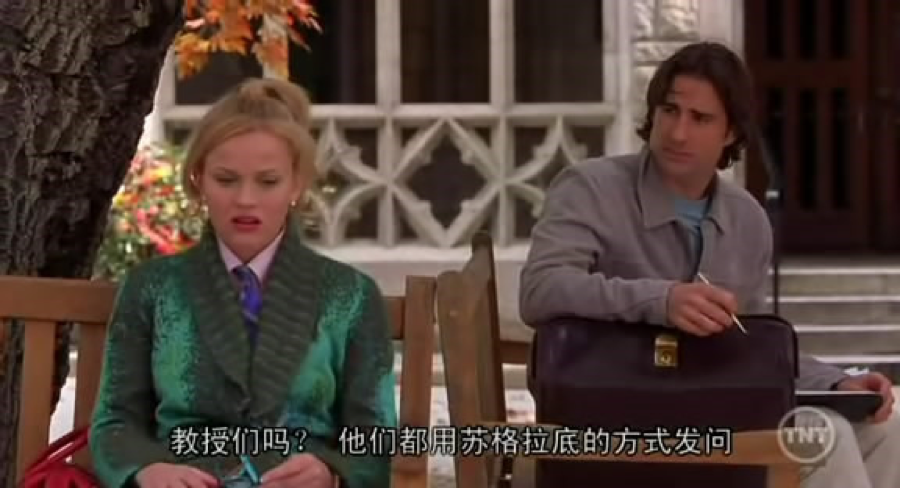

（苏格拉底教学法，可百度。）

到了二年级，老师已经带着优秀的学生到自己的律师事务所实习了。

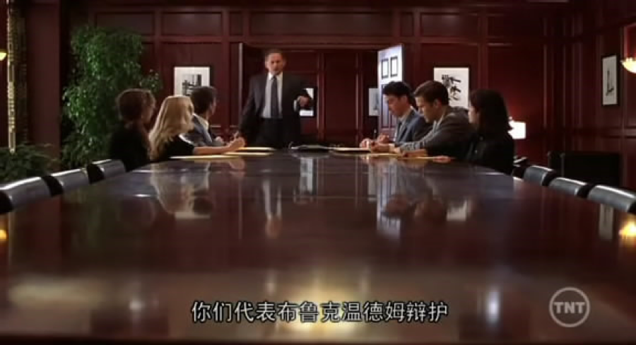

最后真刀真枪的上法庭。

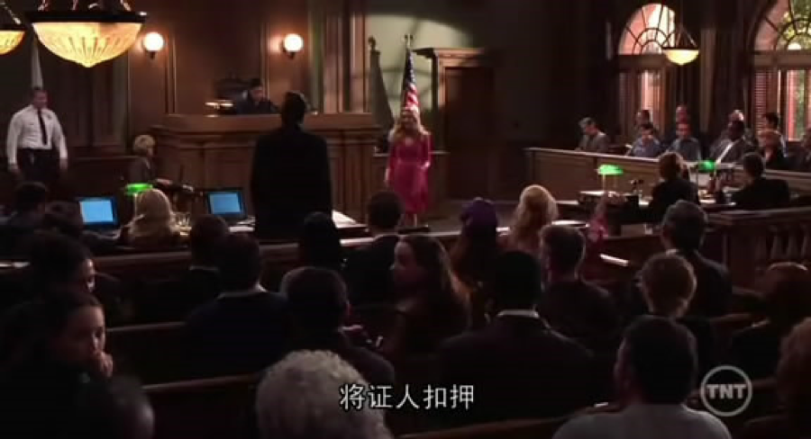

这才是培养律师的办法。

呵呵，我这个搞理论法学的老师，跑到这里来推广实践教学，可能有人觉得奇怪。有些人喜欢画地为牢，搞实践就瞧不起搞理论的，搞理论就瞧不起搞实践的，不是什么新鲜事。我确实喜欢理论，但也确实不太喜欢只喜欢理论的书呆子。

本宅在教学中也经常实践一下。我兼职讲过一门《法理学》课程，这门课没有法条好背，单讲理论枯燥无比，我一直在坚持案例式教学。每堂课安排一个主题，比如平等与自由、法律与秩序，提供几个有争议的案例，教师不预设立场，组织学生分正反双方讨论，分组讨论完了集体讨论，案例讨论累了就放法律电影，然后接着剧情继讨论。讲到结课前几周，同学们都在求我少放点电影，能不能讲几节课好准备考试。

凡是能走出教室的主题，尽量带同学们出门。这是我讲到“法律与宗教”一节，带同学们去天津西开教堂望弥撒的照片。

西开教堂是天津天主教的总堂，有百年历史，就在市中心滨江道商业区附近。周日上午大家一起去逛街，下午两点在教堂门口集合，先自由参观一个小时，三点钟是礼拜天的主日弥撒，本堂神父讲经，四点结束，一起坐车回学校。教堂又不收门票，最多是参观不计算工作量，我损失一个下午的课时费而已。但是回到课堂再讨论这个主题，同学们就有基本概念了。

#### 9\.4\. 教材选用

说到苏格拉底教学法和实践教学，不能不提教科书的问题。我每年法理课最大的抱歉，就是同学们花钱买的教科书，期末还跟新的一样。很多英美国家的教学中（不限于法学），老师从来不用标准教科书，都是靠自己收集的资料讲课的，很多是打印稿，每年还在不停的修改增加，有的老师甚至不考虑出版，就是为了方便增加新东西。在苏格拉底式的案例法教学中，教科书其实没什么用处。

哈利波特中的教科书就很有个性：

这是哈2中，海格在保护神奇生物课上选定的教材《妖怪们的妖怪书》，这种书籍会咬人，需要学生抚摸书脊，才会安静下来。**真正的教科书，确实是会咬人的。**

但是还有一种相反的教材，是乌姆里奇喜欢的那种：

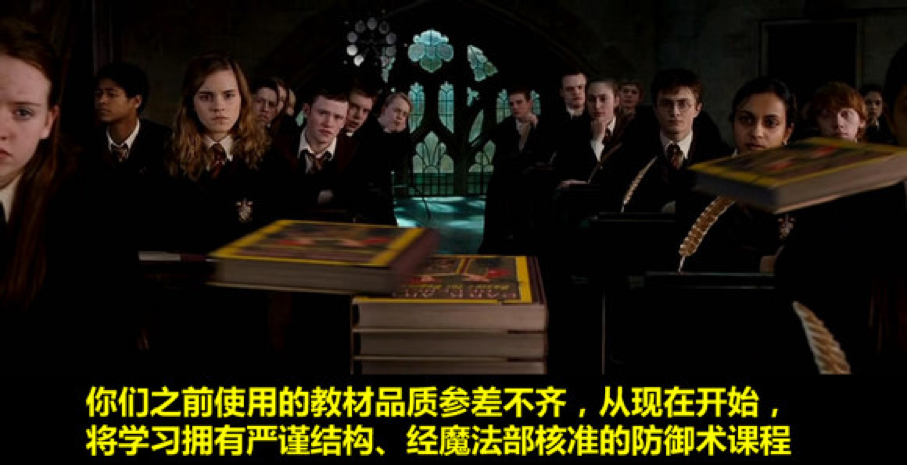

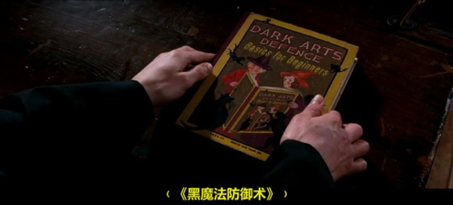

这种经魔法部核准的，拥有严谨结构的教材，是大家天天用的最多，什么感觉，各位自己都有体验。结构确实严谨，内容也很充实，只是好像少了点什么？

没有黑魔法防御术的咒语呗。

国内各专业都有统一教科书，理工科还好些，文科的统一教科书，有些已经很成问题了。比如这条新闻：

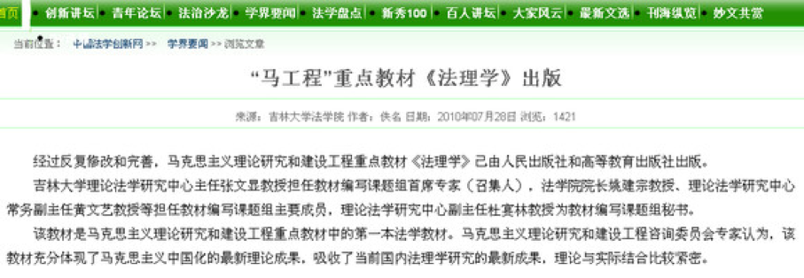

据说是一个系列，文科各学科都有。法理学是这一本：

我并不反感马克思主义。《资本论》是大一下半年读的，大一暑假，通读了一遍《毛泽东选集》1-4卷觉得不过瘾，还要跑到图书馆的角落里翻出来已经是半禁书的《毛选》5卷才罢休，马克思和毛泽东的文章都很有趣，和教科书里的不一样。教材本身没意见，问题是这种统一教材的做法，让学生失去了分辨力。分辨力不能灌输，只能从不停的接触错误中锻炼出来。

不培养分辨力的法学教育，还有什么意义？

教育部强调统一教材、统一思想，目的当然是维持稳定。我当然赞成维护稳定，谁也不愿意生活在一个动荡的社会中，问题是能被一本简单的教材说服的人，本来也不会制造麻烦。这些没有分辨力的人，在国内是马克思主义者，出国改信美国价值观念，就像一面镜子，照出来的都是别人。真正有能力制造麻烦的人，那是什么教材都拦不住的。看看美国，法学院里天天拿各种异端邪说当菜吃，培养出来的学生，一个个心黑油油的，都是忠心耿耿的美国价值观念的信徒。谁的社会更稳定呢？

#### 9\.5\. 教学检验

应该承认，乌姆里奇教授的经魔法部核准使用的教育思想，至少还是结构严谨的。乌姆里奇教育思想的中心环节，就是考试。第一堂课就强调考试的重要性：

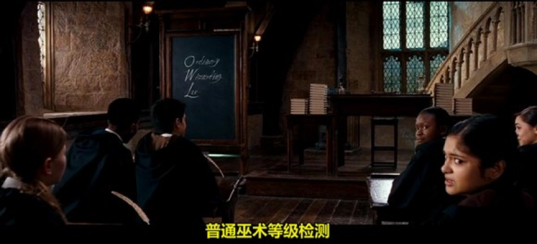

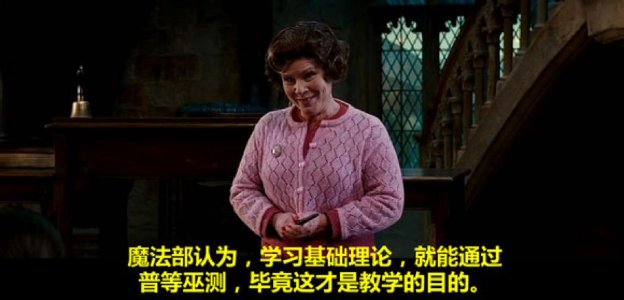

等到做了校长以后，更是把考试办成教学活动的中心。

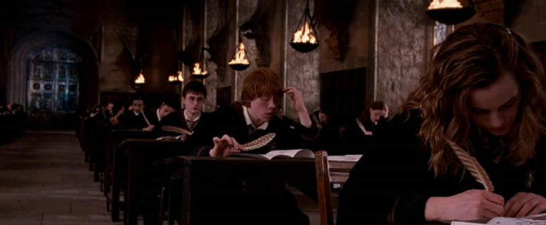

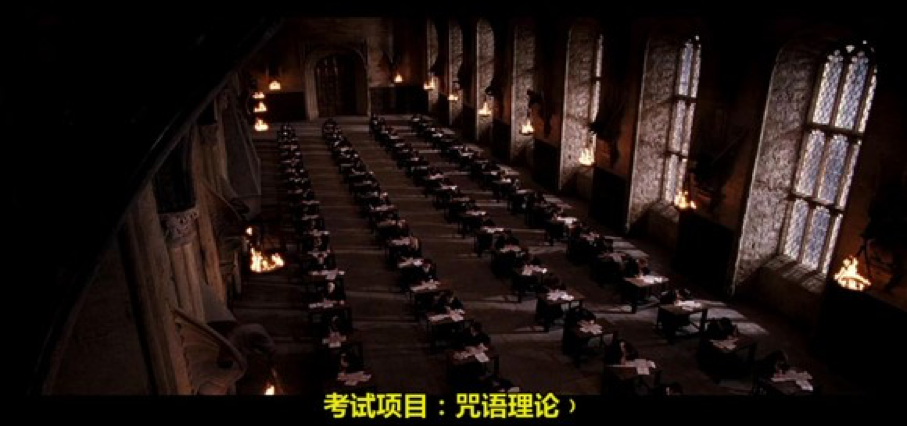

结果怎样，大家都很清楚。哈5中最快乐的一段场景，就是乔治和弗雷德的“烟花闹考场”。

中国大学法学教育指导思想，确实是和乌姆里奇老师有相通之处。中国的法学教育的中心环节是什么呢？

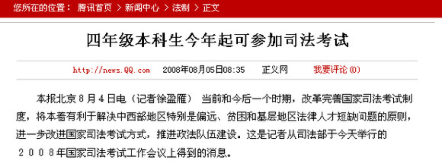

从这个政策出台之后，我大四的法律史课就没安静过，四个月的课，九月司法考试，十月、十一月公务员考试，十二月、一月研究生考试，每节课都有人请假。当然了，我这门小课也没什么重要的，司法考试才5分，毕竟通过考试才是我们的教学目的。

在乌姆里奇校长的领导下，同学们经过一个学期的基础咒语理论的学习，掌握了经魔法部核准的、拥有严谨结构的教材，经过规范的考试，就可以实现通过普等巫测的教学目的，顺利毕业了。毕业以后失业了怎么办？霍格沃茨正准备升级成研究型大学，继扩招研究生。硕士博士学位不够考的，可以增加壮士、烈士、圣斗士三个学位，圣斗士再分青铜、白银、黄金三个等级，慢慢考呗。我们的理念是：学到老，考到老。

教学离不开考试，美国的大学也有各种考试。但是如果把教学的目的放在考试上，确实有点本末倒置。上一篇说了，在规则领域，有重视实质正义和重视形式正义的区别，或者说right和law的对立，对应到教育学，掌握知识就是right，通过考试就是law。考试在形式上是公正的，但在选拔人才方面，并不是个好办法。考试其实就是用老师的知识画一个圈，让学生往里套，套的越严丝合缝，分数越高。这样的结果，淘汰了差的，也淘汰了最好的，因为**最好的学生，一定要比老师还优秀，学科才能有进步。**

美国的法学院入学也要进行考试，叫Law School Admission Test，LSAT，有人也叫它“美国司法考试”。LSAT共五个部分，包括阅读、逻辑及分析三项，另加30分钟的写作，这和中国的考试也没有什么差异。关键是，美国法学院录取学生并不完全依赖考试。

美国大学法学院录取有三个指标：“成绩”、“才艺”、“推荐”。成绩就是LSAT，才艺指的是个人特长，推荐指的是学生申请时附带的推荐信。（感谢留美的冷哲网友提供的资料，[他的人人日志](http://www.renren.com/313426043/profile)。）《律政俏佳人》里也有：

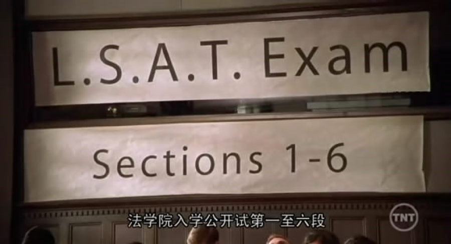

LSAT

才艺展示

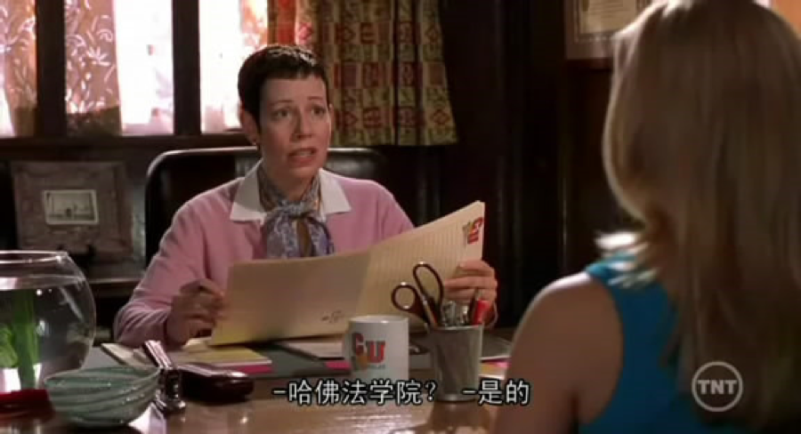

推荐信

三个途径，大家猜那个是最重要的呢？

推荐信。

有了名人的推荐信，成绩差点也没关系。没有推荐信，满分也可能落榜。简单的说，美国大学尤其是重点大学，成绩只是参考，推荐才是重点，和中国大学正好相反。

千万不要以为推荐信就是走后门。人家的血统论是明摆着的。哈一开篇，海格接哈利去霍格沃茨，遭到弗农和佩妮的反对，海格说了这么一句话：

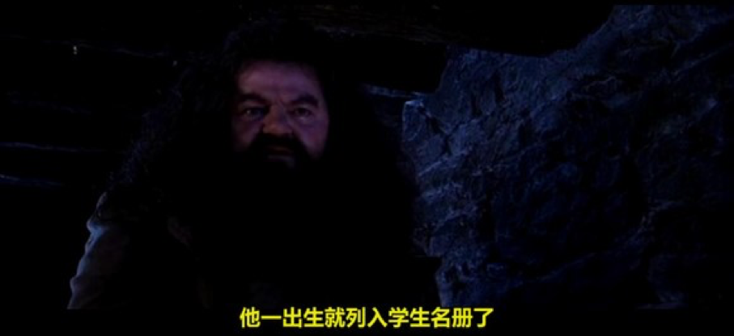

霍格沃茨在魔法界的地位类似北大在中国，在招生季节，哪个北大老师敢说出这话来，全国舆论是要爆炸的，还记得当年的“朱甘事件”吗？可是人家海格随口就说出来，也没觉得怎样。

但是，前面说了，英美国家有血统论，却不唯血统论，在血统的基础上，确实还有选择的余地。前面也分析过，统治者并不喜欢违反规则，因为坚持规则才对自己有利。之所以采用推荐信的方式，是因为试卷考试并不能识别顶层人才。相反，**能识别出“最优秀的人”的，只有“最优秀的人”本身**（这方面还是推荐看《皇帝新脑》）。或者说，推荐信和试卷考试都是人才选拔的规则，推荐信是right，试卷考是law。

这种做法，我本人也一直在坚持。校内教学当然用不到推荐信，但法理学的期末考试，我一直采用口试的办法，也就用“人”而不是“试卷”去识别学生的优劣。具体做法：准备20个案例或命题，现场抽签，每个同学和我面对面讨论5-10分钟，现场打分。

口试的效果很明显，平常爱看书和积极发言的，口试分数就高，上课玩手机的孩子们都现了原形，靠打小抄作弊混日子的，根本没有可能。影响到下一届，课上睡觉的都少了（我的课堂一直很吵，睡个觉其实挺不容易的）。我也是从这些面试中，慢慢发现每一个同学都有自己独立的思想，即使是最不起眼、最没特的同学，详细追问，脑子里也有自己的小宇宙和编年史。

那些照本宣科的法理教学，其实大部分都是在浪费时间，**灌输能增加知识，但不能解决思想问题**，不管你灌输什么都一样，除非你想把学生培养成傻瓜。顺便说一句，我这么做其实是受政法大学老校长江平教授的启发。有一次看到江平访谈，回忆起他当年留学苏联学习民法的时候，说苏联的大学教学很严格，期末都是用口试的方式，根本不能作弊。唉，人家也是社会主义的大学教育，做人的差距怎么就这么大呢！

（本节关于考试的探讨，仅限于启发高年级同学的思路，背法条和司法考试并非毫无意义，低年级同学不要给自己找偷懒的借口。）

#### 9\.6\. 教学管理

前面介绍英美高等教育，这并不是本宅多么优越，我说的这些都是常识，搞教育理论的人都知道。问题是，谁把高等教育办成学科分割、填鸭教学、标准教材、考试本位的样子？

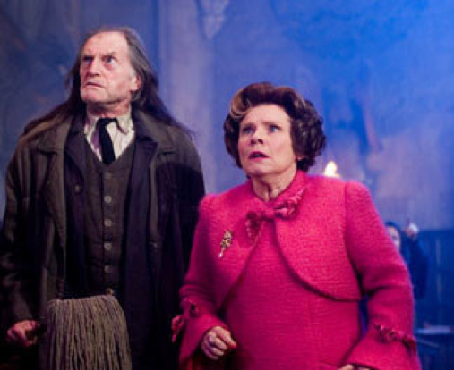

魔法部政务次长乌姆里奇女士和霍格沃茨管理员费尔奇先生，他们的共同特点，就是属于行政人员。这也是最近高等教育界经常讨论的，中国大学行政化的问题。

**（先强调一下，这里只是介绍英美大学的管理机制，行政人员也是大学的重要部分，不要制造教学人员和行政人员的对立。）**

从欧洲第一所大学博洛尼亚大学开始，学校的主体就是老师和学生。大学可以没有大楼，可以没有校舍，甚至很多大学连围墙都没有，只要有老师和学生，就是大学。也就是每年霍格沃茨开学的时候，坐在台上和台下的两群人：

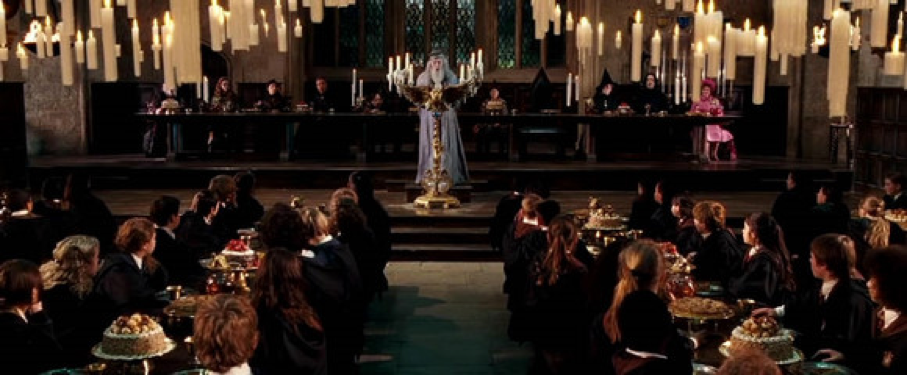

大家注意一下，霍格沃茨聚餐的时候老师席上有酒杯，学生席上有丰盛的菜品，管理员费尔奇先生连个座位都没有，他始终是站着的。

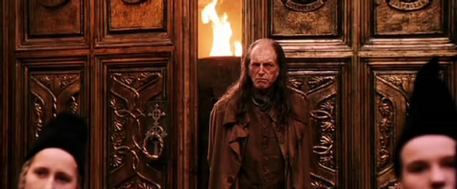

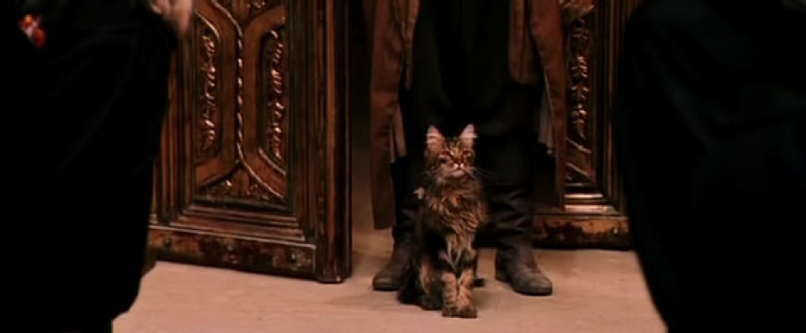

站着当然也没有餐具，只能看着别人吃饭。大家现在可以理解费尔奇的脸为什么一直不太好看了吧。霍格沃茨里唯一归他管的，就是那只叫陶乐斯夫人的猫。

一般说，欧美国家的私立大学的内部管理，涉及财产方面的问题，由出资设立大学的校董事会决定，比如鲁修斯•马尔福，就是霍格沃茨的校董，因此敢和邓布利多叫板；涉及教学方面的问题，由教授们组成教授会决定。行政人员只是负责执行两个会议的决议，没有决策权，剧中的费尔奇见到任何一个教授，都要先行礼，说话要用尊称。

大学的外部管理方面，一直强调学术独立。从伊纳留斯获得特许状开始，皇帝就不再干预大学的内部事务。美国的顶尖大学都在私立，组织“常青藤联盟”协调彼此关系。美国联邦政府没有高考、没有国立大学，自然也不管什么排定课程、审核教科书之类的事。不要说大学，连中小学也是如此。2009年9月新学期开学，奥巴马总统去某个中学参观，顺便发表了几句演讲，内容无非是鼓励美国小朋友好好学习，不要让我们的竞争对手中国超过之类，结果全美报纸骂声一片：总统好好管你的国防外交，教育问题不属于你的职责范围。

行政机关并不是没有控制大学的意愿，双方一直在较量。《哈利波特与凤凰社》全剧，就是围绕着双方的较量安排情节的。

乌姆里奇第一次在霍格沃茨亮相，是在开学的餐会上：

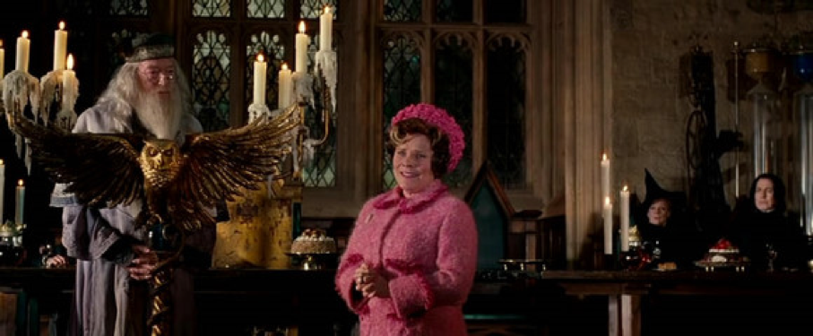

发表了一套官腔十足的就职演讲：

魔法部最重视的一向都是年轻巫师和女巫的教育，虽然每任校长都会替这所历史悠久的学校带来新的创意，但是绝对不能只为了发展而发展，让我们保存必须保存的一切，完善应该完善的境界，并且禁止应该禁止的练习课程。

校长礼貌性的表示肯定，学生们觉得是一派胡言：

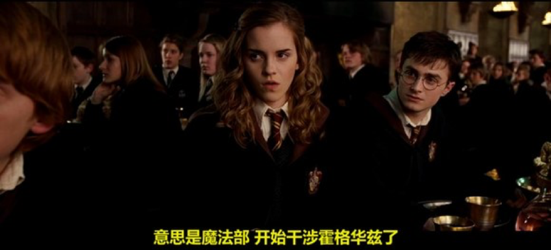

只有费尔奇很兴奋，不停的鼓掌：

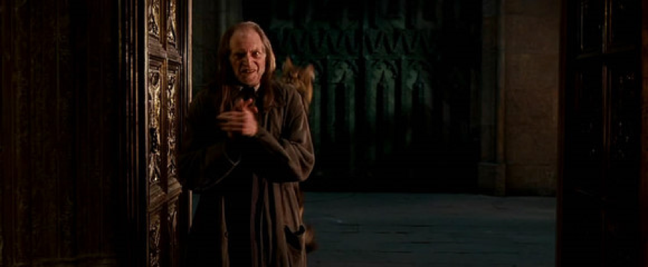

入校以后，自己的黑魔法防御课不受欢迎，乌姆里奇的主要精力就用在了夺权上。言必称魔法部长，用部长的权威来压倒对手。比如和教务长麦格教授的较量：

麦格：我只是质疑你体罚学生。乌姆里奇：

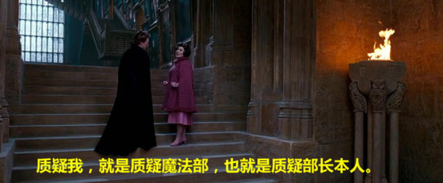

担任霍格沃茨总督察乃至校长之后，乌姆里奇继推行她的一套：

钻到每一堂课进行评估：

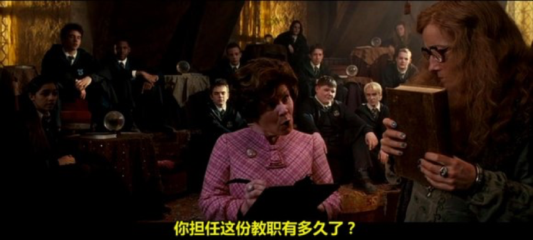

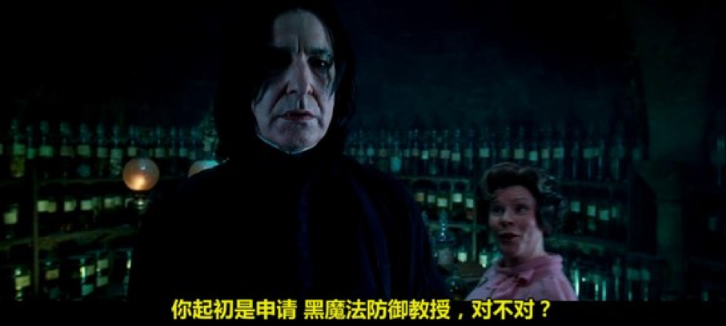

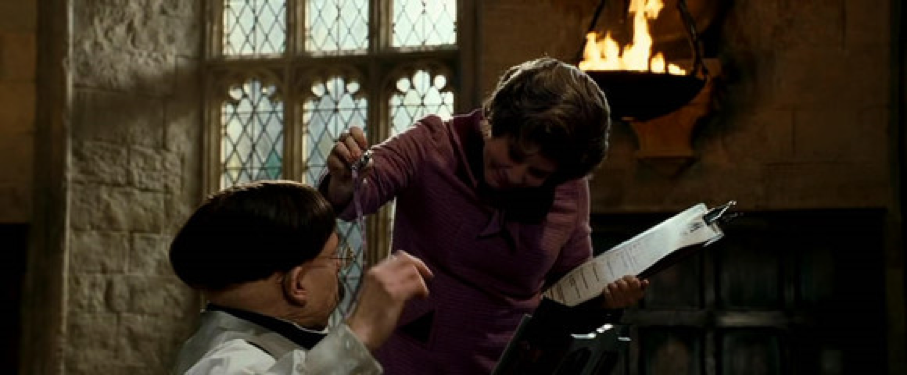

这种拿卷尺给教授量身高的做法、在中国教育史上也见过：

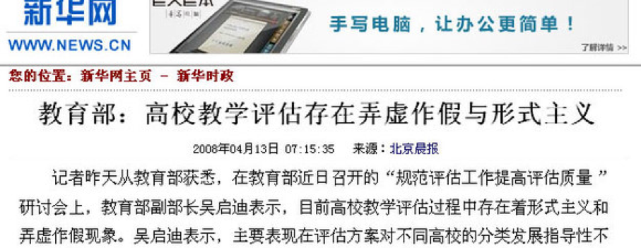

（关键词：教学评估。）

组织学生督察队：

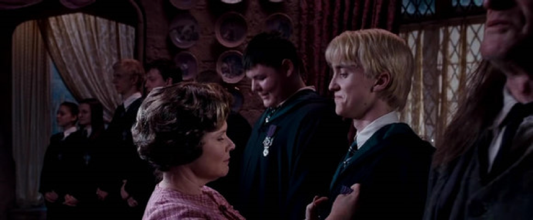

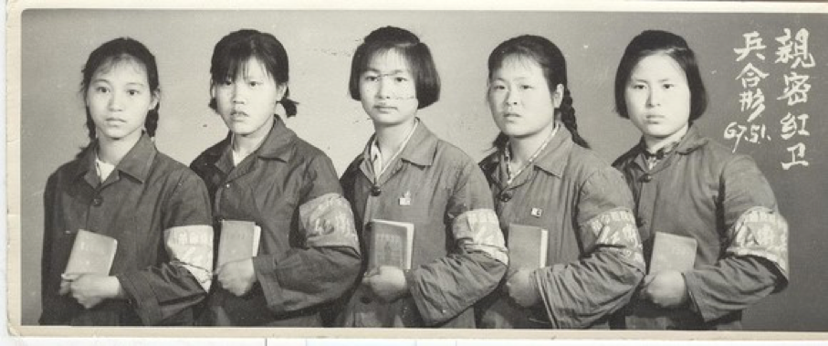

对怀疑的学生进行调查：

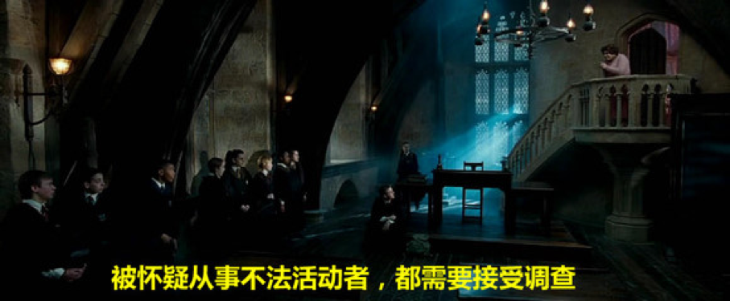

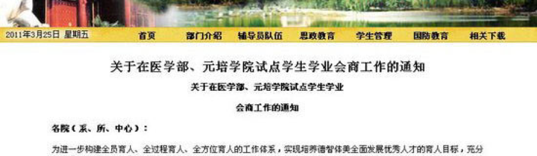

（关键词：学生会商工作。）

凡是反对乌姆里奇的，都被扔出霍格沃茨：

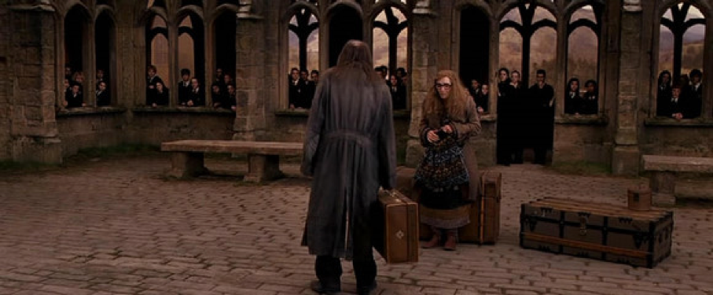

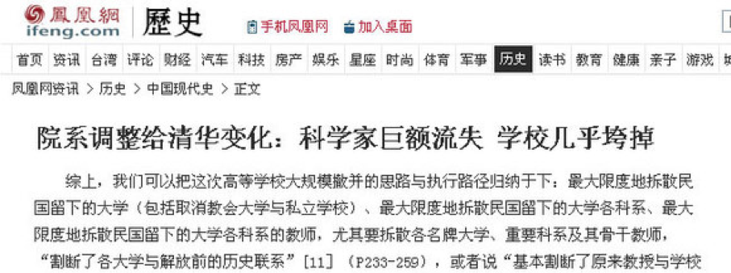

（关键词：院系调整。）

教师的下场很悲惨：

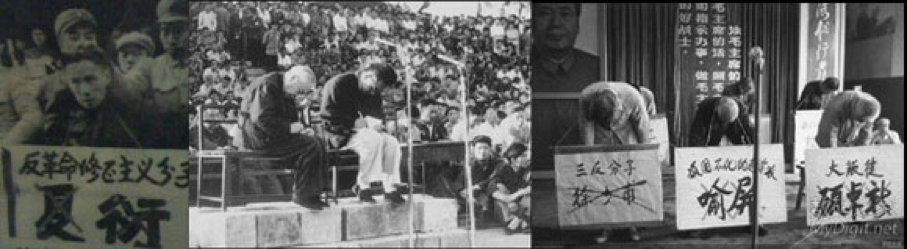

最后，霍格沃茨就这样了：

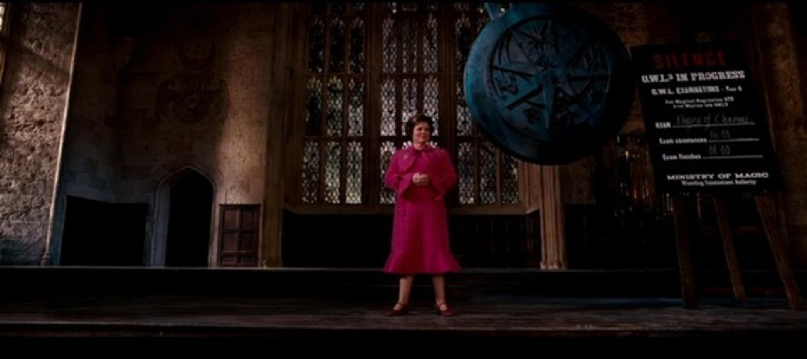

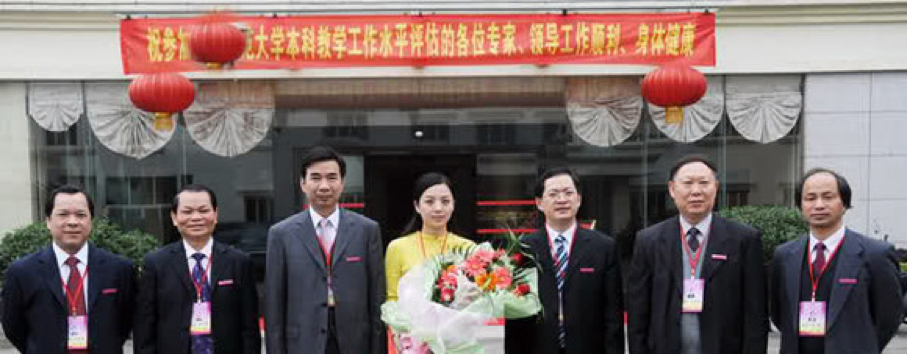

（关键词：某大学六位领导迎接教学评估专家组秘书。）

学科分割、填鸭教学、标准教材、考试本位的高等教育，就是这样炼成的。

其实我应该感谢大学行政化，要不然我的帖子火不了。帖子里的东西，是大学就本来应该提供的。咱们是世界第一人口大国，什么样的人才没有！像我这样的地方院校小讲师，车载斗量，大学里多得是。可是好玩的课程都跑到哪里去了呢？

有同学开玩笑，说“很想来听一节宅老师的《哈利波特与英国历史文化和政治》选修课”，抱歉了，不可能的，这门课不会出现在中国大学的课表里。按照我们高校的规定，《哈》这门课问题多多，至少有以下几点：

第一，学科定位不明。你是法学系的课呢？还是英语系的课呢？这个帖子涉及快二十个学科了，这些学科里，都有专业权威的结论吗？有严谨的学科体系吗？

这个问题还算比较好解决，中国教育里倒也有交叉学科、边缘学科之说。姑且算做英美文学系的选修课吧。

第二，没有教材。用什么教科书呢？总不能把《哈》1-7当作教科书吧。没有教材，凭什么保证教育质量呢？

这个也勉强能够解决，把帖子印成铅字，拉两个名人作序，打扮成学术著作，混进教科书队伍，也凑合。

第三，没有考试大纲。这个最要命。没有考试，怎么有成绩呢？没有成绩，怎么决定及格还是重修呢？怎么评奖学金呢？怎么入毕业档案呢？事情涉及到好多部门的工作，不好解决啊。

可是我也实在是不好解决啊。这门课考试，出什么题呢？

选择题：赫敏的褐头发，意味着她是：A英格兰平民、B苏格兰贵族、C英格兰贵族、D苏格兰平民

判断题：如果阳光下你影子比较浅，说明你魂淡。（ ）

简答题：简述关于摄魂术的三种学说。

论述题：结合邓布利多的教育思想，试论三强争霸赛中哈利斗龙的重要意义。

我自己先吐了，打死我也不开这样的课。这样学下来有意义吗？

不是脑补，我还真的试过。法律史学科比较清苦，经常面临课时不足的问题，前些年，我曾经准备过一门“电影与英美法律文化”，想申请公共选修课，也是为了混口饭吃。结果从教务处网站上下载了一张“公选课申请表”，发现根本就填不满，自己知难而退而作罢。大学行政化像个筛子，把所有有个性的东西都过滤掉了。教务工作枯燥琐碎很辛苦，并不是说我们学校的教务处老师有什么不好，我们是涉外院校，外教和留学生很多，管理上已经相当宽松了。问题是，谁来决定开什么课？

说到开课，再讲个小故事。我并不相信中国人不会办教育，不要说遥远的孔夫子，百年之内就有优秀的教育家。天津本地有个南开中学，现在算是个“市重点”，也是以高考为中心，学生们大部分去美国读物理化学博士，给盎格鲁撒克逊人培养些技术人员。但创办之初，南开本是个私立学校，那个时候南开中学和现在不一样。

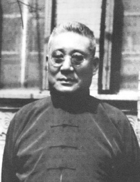

张伯苓，南开中学和南开大学创办人，教育家

1931年秋，日本关东军发动九一八事变，侵占中国东北。当年冬天张伯苓校长就组织老师收集材料，1932年春季学期开始，全校各年级都加开一门新课：《东北自然地理》。油印的课本里，是东北广袤国土上的每一座山脉、每一条河流、每一片大豆高粱。校长要让全体学生牢牢记住：**这些都是你们的，一定要记得拿回来。**

需要核准的教材吗？需要严谨的基础理论吗？需要规范的考试吗？需要向教育部申请设立新课程吗？说到底，教育部算什么！教育部的领导的领导，是张伯苓的学生。

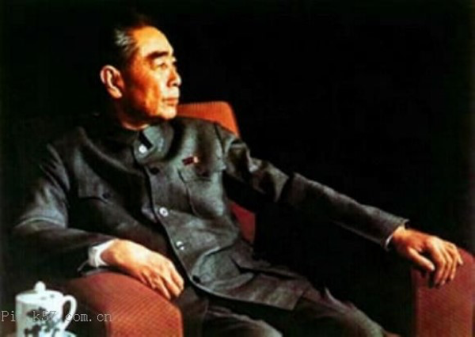

南开中学曾创下了中国教育史上的一个纪录：培养了三分之一的新中国总理。（周恩来到温家宝共6位总理，他俩都是南开中学毕业。）**这才是培养领导人的地方！**民国时代的物质条件和今天远远不能相比，当时一个中学尚可以如此，现在那些拥有大楼、豪华餐厅和五星级招待所的“大学”，是不是有点感到惭愧呢？

（关于赫敏的性格分析，在“下”中，我没有跑题。）

翟按：我只是个法学老师，对本专业比较熟悉，没有能力评论其它我不熟悉的学科。尤其是学科优劣之类的问题，我觉得没什么意思，如果科学是理性的表现，则所有的学科都是平等的。再次强调，千万不要成为各学科的混战。**另外，本篇使用了比较偏激煽情的写作风格，大家读完后都尽量冷静。**这一贴砸碎的锅，我下一贴当然会补上。

唯一需要说一下的是艺术。欧美学科分类中，没有中国意义上“文科”，法学属于社会科学Social Sciences，文学属于艺术art，不是一回事。本篇没有讨论与艺术有关的学科，原计划有一篇“特里芬妮、卢娜和占卜术”，大概能给艺术类一个定位。但是因为我的学力所限，不敢发表，怕误导各位，因为又涉及到另一个复杂的哲学问题：理性与直觉，等我读几年书再说吧。哪位哲学高手，不妨顺着这个思路下去写写看，多交流。

翟又按：贴子中开了一点昌平的小玩笑，不是对法大本身，只是对昌平城中各种假冒法大的培训班比较烦而已，广告都打到我身边来了。其它冒犯各种学科、学校、学生之处，如果有意见欢迎提出。

翟按：抱歉终于没有在开学前完成，食言而肥，这就是我为什么很胖的原因。开学后事情很多，写的更慢，让大家久等了。昨天教师节有很多同学给我送花送祝福，不能一一回复，就把这个帖子当作回礼吧。

#### 9\.6\. 社团活动

大家有没有想过，乌姆里奇又是怎么成长起来的呢？

片中对乌姆里奇的早期经历交代不清，但片中她会使用咒语，不是哑炮而是巫师。英国巫师都毕业于霍格沃茨，也就是说，乌姆里奇也曾经是霍格沃茨的学生。无论乌姆里奇的血统如何，有一点可以肯定，她上学的时候，应该对学科分割、标准教材、填鸭教学、考试本位这些做法并不讨厌，否则不会自己当了教授也来这一套。我推测，乌姆里奇的少女时代，应该是这样度过的：

呵呵，可能很多同学感情上接受不了。**我换一种说法：乌姆里奇的毛病，赫敏身上也有一点**：喜欢背书、喜欢考试，可以吗？我有证据的。

哈2的结尾，校长为了对学校接连发生的不幸事件表示一点心意，宣布：

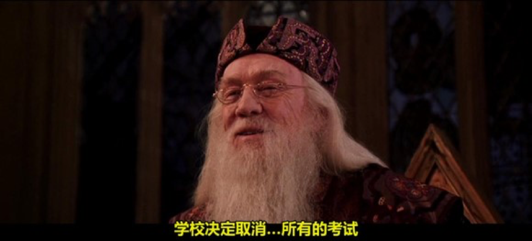

全体同学热烈鼓掌：

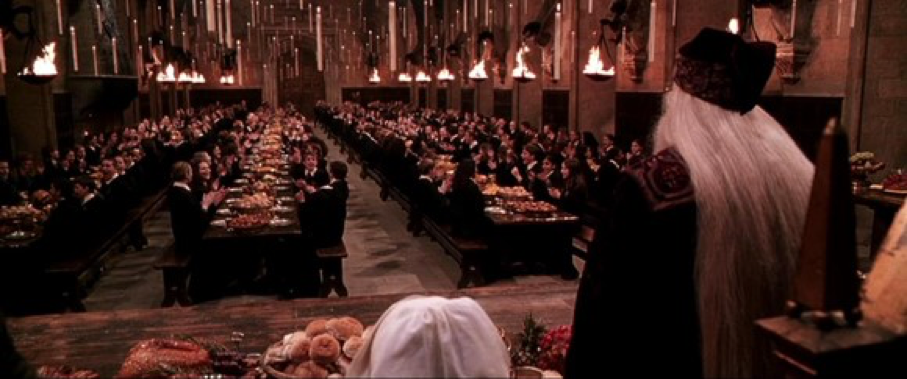

导演给了赫敏一个特写镜头：

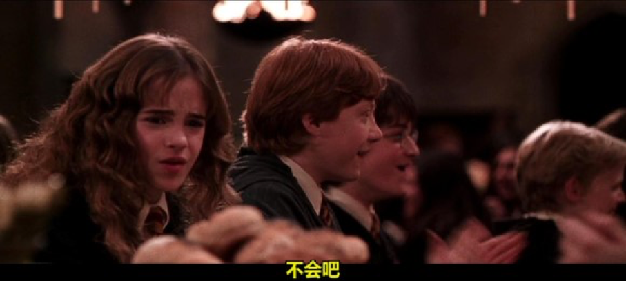

意思很明显，赫敏喜欢考试。

前面说过，知识本位和考试本位，是教育学中的right和law，前者重视实质，后者重视形式。贵族倾向于right，平民倾向于law，赫敏喜欢考试，是符合她的身份的。大家想想，她来霍格沃茨的时候，因为血统而受人歧视，体育课和魁地奇又不行，不靠考试成绩，还有什么办法争一口气呢？中国教育高度依赖考试不是没有原因的：

（浙江省永康市第二中学著名标语，详情可百度。）

再说书本知识和实践能力，赫敏也偏好书本。哈6霍拉斯格恩的魔药学，大家熬生死水。赫敏是这样做实验的：

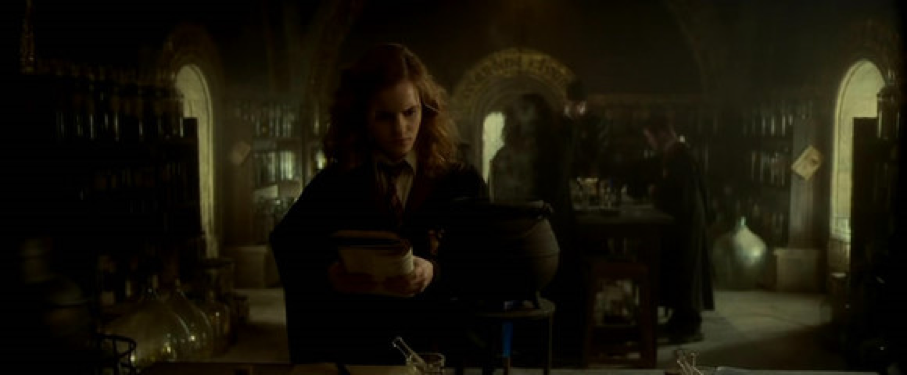

哈利碰巧拿到斯内普的课本，发现书上有错误，切跳跳豆的秘方在于：

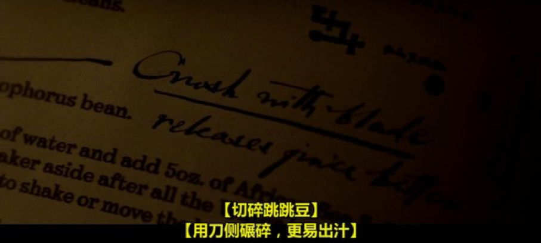

哈利很大方的告诉赫敏：

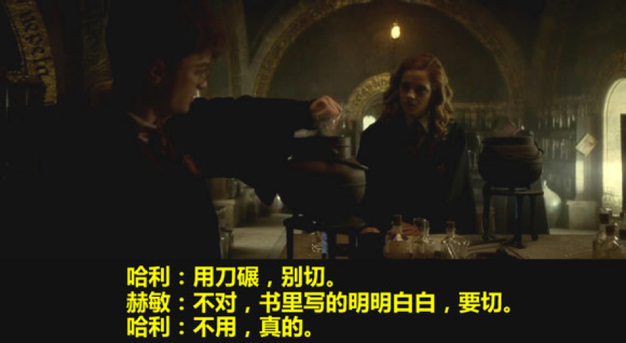

最后赫敏也没熬出生死水。找不到秘方不是你的错，但是过分相信课本，确实是个问题。人家都已经告诉你答案了，你倒是动手试一试啊！

前面分析过，在霍格沃茨这所培养统治者的学校，喜欢背书和考试可不是什么好事，这意味着不具有统治者的优秀素质。已经有朋友看出来了，赫敏的“道德性”或者说做事风格和她的出身密切相关，平民的身份就像一个包袱，她一直在甩，却很难完全甩掉。在生活中，她惧怕校规；在教室里，她喜欢考试；在实验课上，她相信书本。如果一直这样下去，赫敏难免不成长为另一个乌姆里奇。

**好在还有选择论，还有机会。**人总有些东西无法选择，比如民族、语言、出身。但是，任何情况下，人也总有些东西可以选择。你确实不幸生在了中国，但你为什么不选择让中国有幸产生了你？

同样是考试爱好者，乌姆里奇选择了保持平庸，选择了按部就班，巴结领导，排挤同事，热衷于办公室政治，做个庸俗乏味的官僚，就像她的形象符号：癞蛤蟆，不咬人，只是有些讨厌。

赫敏的选择有所不同，赫敏选择了冒险，虽然是跟在哈利和罗恩后面，但毕竟迈出了重要的一步。赫敏的考试偏好只出现在前几部，越后来她越学的像哈利。哈5中，也学会讨厌考试了：

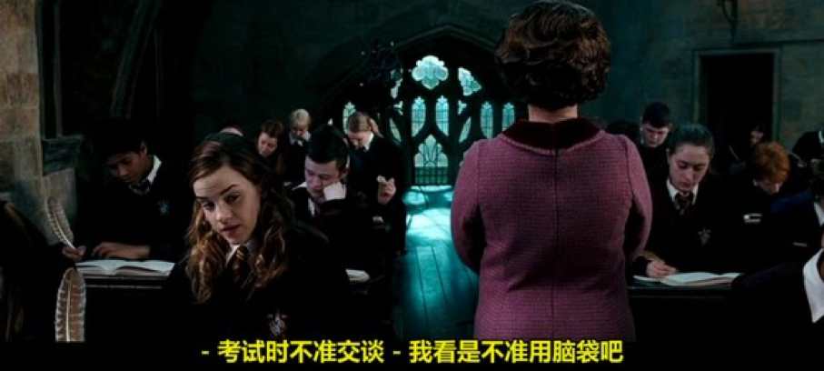

这还不算。赫敏还有更狠的。

先问大家这样一个问题，如果你别无选择的进入了乌姆里奇校长领导的霍格沃茨，你会怎样做？

睡觉？逃课？DOTA？刷人人？谈恋爱？考雅思？

**赫敏的选择是：组织一个D。**

找到一处偏远的会议地点：

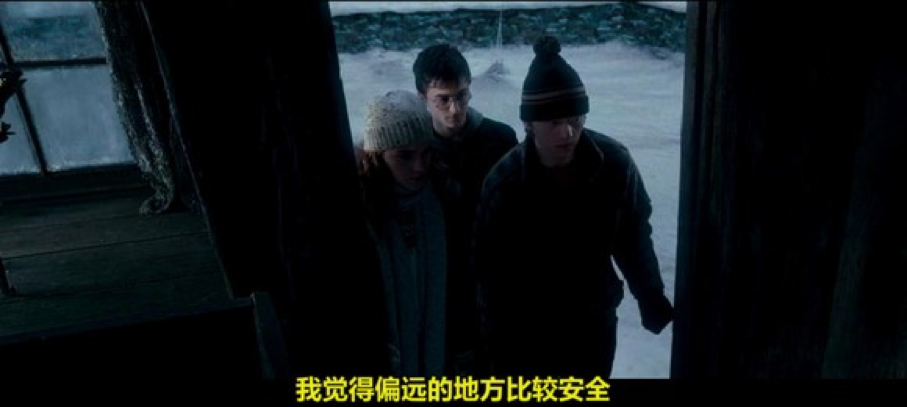

召集了了十几个代表：

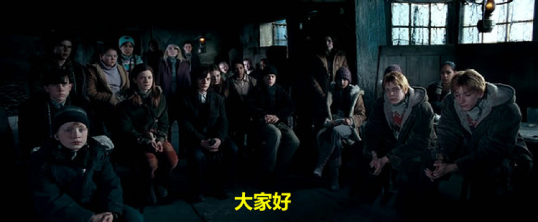

赫敏主持会议：

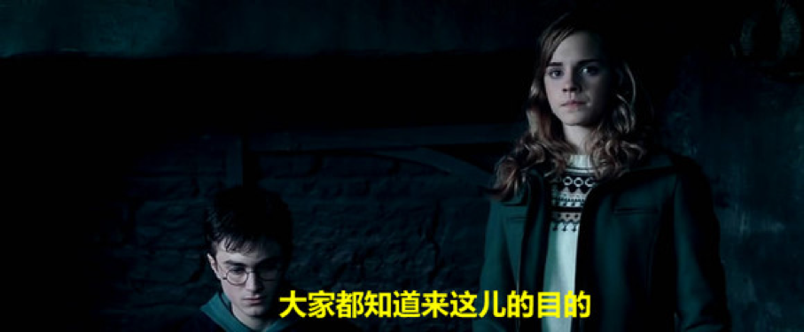

哈利做主要发言：

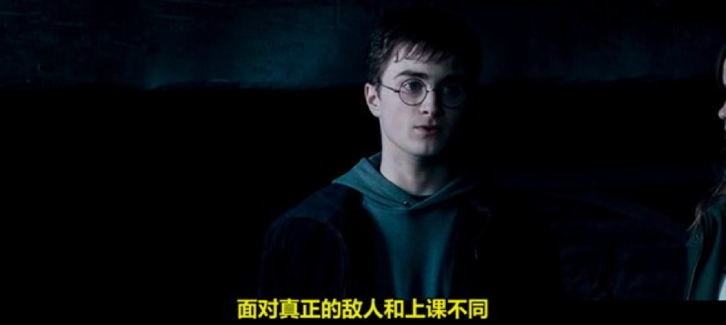

会议宣布成立了：

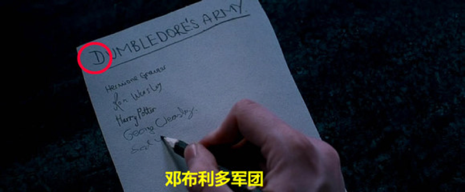

邓布利多军团Dumbledore’s army。嘿嘿，别想歪了。

邓布利多军团的原型，是英美法律教育中很常见的形式：学习小组study group。苏格拉底教学的案例教学法其实是很费时间的。JD教育只有三年，大二就要实习，因此，老师在课堂上布置的案例，都要由学生在课下做好准备，否则根本跟不上进度。在哈佛法学院，熬夜可不是什么新鲜事。为了节约时间，学生们经常结成讨论小组，按照案例角分工，并且互相合作，很多美国法律电影中都有这种情节，还是《律政俏佳人》：

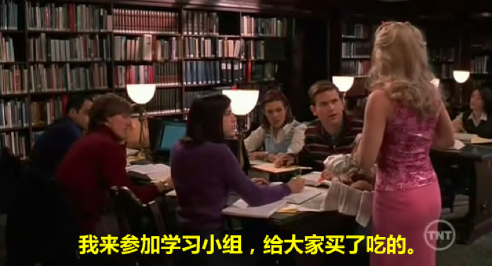

英美教育中的行政化和反行政化，没有哈5中的夸张。但是讨论小组的做法，确实是一种和死记硬背对应的教育理念：自主学习。这个概念最近些年也引进了中国，大家可以自己去百度。古人云，“师傅领进门，修行在个人”，学习说到底是学生的事儿，应试教育最大的问题，就是损伤了学生的自主学习能力。在知识爆炸的今天，靠大学里背诵的一点点知识，在职场上是坚持不了几年的。

进一步讲，讨论小组还有更重要的意义，它锻炼人的组织能力。讨论小组其实是一种简单的学生组织。哈利波特中的邓布利多军团，显然也不仅是个为学习成立的小组。这又涉及大学教育的另一个重要方面：社团活动。

古往今来，统治者都是少数人。除了个体的优秀之外，最主要的原因，是**统治者之间能结成组织，在局部形成多数对少数的局面**。所谓的领导力，除了判断力，另一个重要方面就是组织能力。组织能力同样不能依靠课堂灌输，也只有在实践中才能学到。前面提到，欧美体育教育的目的之一，就是训练组织能力和“团队精神”，而更多的组织能力，则是靠学生社团活动完成的。刚才说赫敏组织了一个D，很多同学吓了一跳，这个问题和社团活动确实是有关联的，在宪法上，二者共用一个概念：结社权。

**（跑题讲几句宪法，不感兴趣的朋友请直接跳到下一个红字体。）**

早在哈5引进中国的时候，就有对“the Order of the Phoenix”如何翻译的争论，很多网页现在还能看到“凤凰令”或者“凤凰密令”，这明显是个误译，“Order”必须翻译成“社”，因为涉及哈5的核心情节：公民结社权对抗政府控制。在欧洲历史上，order是个非常悠久的概念，甚至比现代意义上的国家nation还古老。这又要回到遥远的中世纪。

日耳曼人大迁徙之后，因为刚刚脱离原始社会，组织能力有限，处在一种非常松散的社会形态中。当时有所谓“神圣罗马帝国”、“英格兰王国”等说法，不过这些“国家”没有中央政府、没有首都、没有常备军、没有统一税收和司法，只是靠贵族之间的私人效忠联系起来，和现代国家是不同的。

高度分散意味着高度自由，但太多的自由并不是什么好事情，每个人都在和其他人战斗。因此，度过了中世纪最初的**黑暗时代dark age**，幸存的人们结成了很多社会组织，首先是按照行业和身份集结的：学者形成大学university，教士建设修道院monastery，工匠组织行会guild，商人聚集在市场market附近，这段有初步组织化但各自为政的时间，欧洲人称之为**封建时代feudalage**。

然后呢，随着经济的发展，木头、食物和黄金的进一步积累，尤其是成功的研发了建筑技术，使得城堡提供了有效的防御。因此自给自足的庄园制大行其道，欧洲进入**城堡时代castle age**。表现在军事上，就是原始的民兵消失了，步兵和弓箭手也成为配角，重型骑兵成了战场上横扫一切的主角，尤其是法国。反映到政治上，就是基层贵族——骑士们成了全社会的重心。骑士们往往跳过国王和高级贵族，自行结成组织，这种组织就是“骑士团”order。哈利波特中的凤凰会，其实就是“凤凰骑士团”。

欧洲历史上有很多骑士团，都是骑士自行组织起来的。有些骑士团经过教皇批准，负有宗教使命，则称为“圣骑士团”，其中最著名的，则是十字军东征期间建立的三大骑士团：圣殿、医院和条顿，分别由法兰西/英吉利、意大利和德意志地区的骑士们组成，一度在中东地区盛极一时。

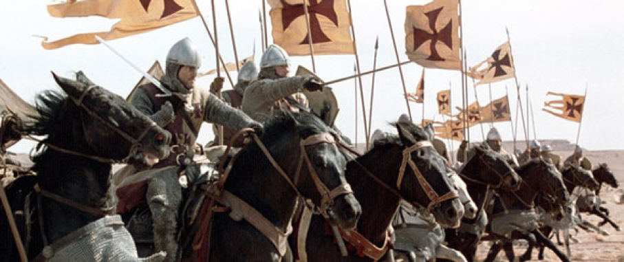

《天国王朝》

十字军失败后，医院骑士团在地中海几个岛屿中辗转，改名马耳他骑士团，现在是一个有一定影响力的国际组织，在联合国拥有观察员地位。条顿骑士团则远走东欧，在一个叫做“普鲁士”的地方建立了一个骑士团据点，最后居然统一了德国（具体过程比较复杂，这里简化的说）。但是势力最大的圣殿骑士团，却在和法国国王的竞争中败落，被彻底消灭了，只留下一个“骑士团宝藏”的传说，给欧洲各种通俗文学提供了不尽的话题。

《达芬奇密码》

这个消灭骑士团的势力，叫做nation，现在被翻译为民族/国家，但这个词最初的意思，是“同乡会”，和大学university、骑士团order类似，是封建时代的社会组织之一。Nation最大的特点，是按照领土而非按照职业组成，法律上表现为属地而非属人主义，又因为属地主义可以兼容平民的利益，所以，**nation的价值取向是大众而非精英主义的**。

一开始，Nation以国王king作为领袖，本来king也是骑士knight之一，在贵族意义上和普通knight是平等的，像狮子理查、红胡子腓特烈这些国王，打仗也要亲自冲锋。但king得到了nation的支持后，逐渐变成高高在上的指挥官，不再上战场了，都铎家的玛丽和伊丽莎白姐妹，才能以女儿之身继承王位。这一阶段的Nation，都以国王个人专制为特征，骑士阶层则受到压制，投石机和火药把城堡砸的粉碎，欧洲从此进入**帝国时代empire age**。

（开学事杂，文思艰涩，天天靠打帝国时代2放松自己，还有点效果。本宅男早就说过，不会玩的人，就不会学习。）

随着nation规模的扩大，专制王权又带来了新的不平衡，君主国又普遍经过一次内部革命，形成立宪政体，就是现代国家的基本结构，我们的教科书中一般称为“资产阶级革命”，其实这种提法有很多问题，英国的“资产阶级”比“革命”要晚200年才出现（见北京大学钱乘旦教授的《英国通史》），内战的双方领导人大都是贵族出身，议会只是贵族的马甲。议会派的目的是反对专制，既包括国王的专制，也包括小自耕农克伦威尔的专制，革命的最终成果是形成了贵族的“共和政体”而非“王权专制”和“民主政体”，甚至革命revolution这个以re开头的词，原意也是“回转”，本来就包含“复辟”的意思，简单的说，就是贵族要回到和国王平等的年代。

英国革命的成果，形成了不成文的古典宪法，这是世界宪法之母。凡是宪法都分为“政府组织”和“公民基本权利”两部分，前者是关于王权的法，后者是反王权的法。宪法中常用到两个词：权利right和权力power，用二元论来分析，公民权利human right还是right，而政府权力government power则对应law。**学习宪法的同学注意，在英美宪政中，公民权利是少数人的特权，而政府权力则相反，代表平民大众。**公民权中重要的一项就是结社权。Nation和order这对儿老冤家，也就从中世纪，一直打到霍格沃茨。

乌姆里奇靠谁发家的呢？

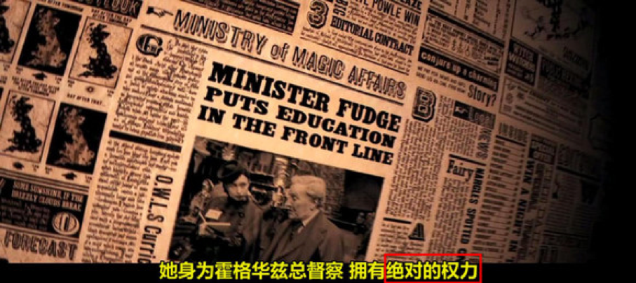

大家注意福吉的原文，乌姆里奇“will have powers to”，使用的词就是“power”。剧中魔法部明显就是英国政府、魔法部长相当于英国首相，福吉就是乌姆里奇的后台，这是魔法世界的government。而骑士精神的代表，当然就是霍格沃茨的师生们了。一旦魔法部干预学校的教学，power干预了right，学生们就组织起order，重新拾起当年对抗的武器。哈5的故事情节，其实是两代order之间薪火相传的过程：邓布利多、小天狼星、詹姆和莉莉等父辈人运用“结社权”，组织了the Order of the Phoenix和敌人斗争：

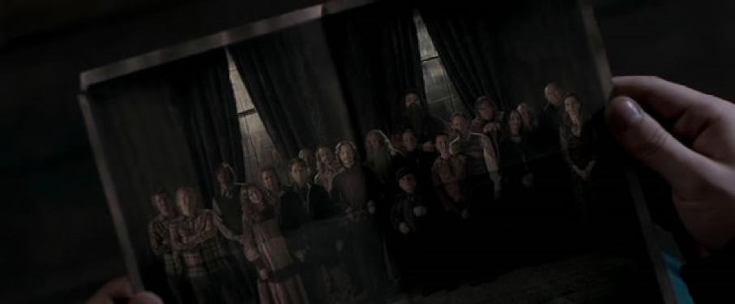

二十年后伏地魔重新出现，魔法部却畏缩不前、粉饰太平，哈利、罗恩和赫敏等下一代小英雄就效仿父辈，组织了Dumbledore’s army，继这种光荣传统。哈利其实就是好莱坞的潘冬子。

为什么这次不叫“order”，而叫“army军团”呢？这又涉及另一项公民权，美国宪法第二修正案规定的：管理良好的民兵是保障自由州的安全之所必需，因此人民持有和携带武器的权利不得侵犯，也就是美国人的“持枪权”。表面上看，持枪权是保护美国独立战争中打天下的民兵，其实这项权利的历史远比独立战争悠久。历史上，谁喜欢持有武器呢？

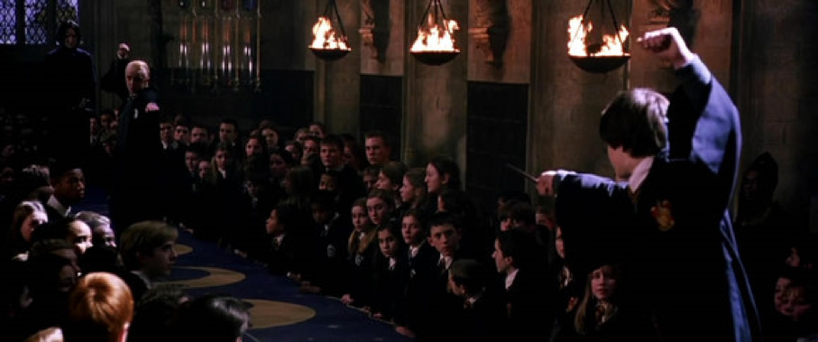

电影里其实还有一个小小的社团：哈2密室中的“决斗社”：因为密室传言搞得人心惶惶，吉德罗•洛哈特教授组织同学们学习攻击咒语而成立的。大家也可以重新看看这段场景，欣赏一下中世纪贵族们的决斗文化，也就是奥运会上的“击剑”项目，哈利波特电影中用魔杖代替长剑而已。长剑是贵族随身携带的武器，也是贵族们吃饭的家伙，拥有武器，当然是贵族的基本权利。

作为对比，家养小精灵多比尽管魔法强大，却从没有魔杖，它只能用手指施放魔法。很简单，奴隶怎么可以拥有武器？

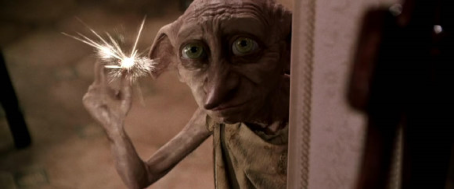

**（宪法跑题结束，回到大学教育。）**

不管是学习还是战斗，都需要组织的支持。组织能力也可以说是政治家的基本功。英美顶尖大学是培养领导人的地方，因此社团活动一直是大学教育的重要方面。

最基本的社团当然是学生会。美国大学没有团委老师，学生会完全由学生们自己组织，大学生除了缴纳学费，还要给学生会缴纳会费，因此学生会行动是独立的，不受限于校方。学生会有自己的预算、办公室和人员，其职权范围也比中国的学生会大得多，简单的校园行政工作，一般都是学生会在做，甚至有学生会办托儿所的，为了让有小孩的女生腾出时间上课。学生会的竞选，基本就是总统、议员选举的演练版。这方面有兴趣的朋友，可以看2007年的美国电影《大学新生Sydney White》：

至于其他学生社团，更是五花八门。比如著名的耶鲁骷髅会：

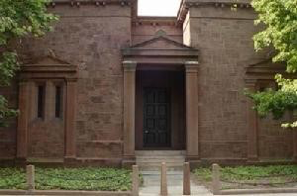

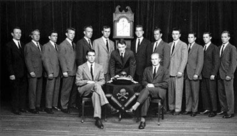

正式的名称叫做“骷髅骨”（Skull and Bones），别称“死亡骑士团”（The Order of Death），是美国耶鲁大学一个学生社团，每年吸收15名耶鲁大学三年级学生入会，总部设在耶鲁校园内的一幢希腊神庙风格的建筑里。建筑的侧墙上镌刻着一句名言：“谁是白痴，谁是智者？无论是乞丐还是国王，最后的归宿都是死亡。”骷髅会成员中涌现了许多美国政界、商界、教育界的重要人物，包括3位美国总统以及多位联邦大法官，又因其神秘的风格引发了很多阴谋论的联想。

顺带提一下网上传的神乎其神的“共济会”。我不相信共济会的阴谋，因为这个说法自相矛盾：共济会能够控制一切，却偏偏被一个普通人解密。其实凡是贵族风格的社团，活动都不会太公开，“邓布利多军”不也天天藏在“有求必应屋”中训练吗？共济会如果存在，也应该是骷髅会一类的精英社团，只是这种民间组织的能量较大，能在一定程度上和政府分庭抗礼而已。欧美国家的所谓自我管理的公民社会，就是这个意思。那些形形色的非政府组织NGO，都是在大学社团活动中锻炼出来的。

如果说大学行政化是个问题的话，中国大学生缺乏组织能力的训练，是更大的问题。比如前面的开设课程的问题，在欧美是由教授会议决定的。中国大学其实也有“学术委员会”，但中国的教授有学问的不少，有组织能力的不多，自古文人相轻，“学术委员会”基本流于形式，只好把学术问题推给教务处，用“形式要件”来进行管理。归根结底，教授也是从学生过来的，当年就没有受过组织能力训练。

在中国的大学教育中，学团（团委、学生会）是和教学、行政并列的三个系统之一，主要功能也是锻炼学生的组织能力。很多人把学团和行政工作搞混了，统称为“行政”，其实两者的风格正好相反，毋宁说中国的学团系统同样也有个行政化的问题。一个优秀的学团工作者，想必也不会喜欢填那些填不完的表格。

不知大家是否发现，最近几届中央领导人中，大学里参加学生会、或者做过学生工作的人很多，尤其是恢复高考之后更加明显。这事儿有很多解释，我不讨论政治，只是想从教育学的角度说一句：个人感觉，在中国大学普遍缺乏组织能力训练的背景下，学团系统提供了一个难得的训练岗位，锻炼人的组织、动员、协调等能力，对于日后担任领导职务有很多益处。

和老师教出的最好的学生会反对自己一样，学团工作也有个悖论：最好的学团工作，就是没有学团系统，因为要训练的就是学生自我组织的能力，管的太多，学生反而不能充分施展。中国大学设置学团系统，主要还是和高考指挥棒下的高中接轨，看着那些连行李都安排不好的大一新生，没有团委老师帮忙确实是不行的。但这不是学团工作的本意。美国大学没有中国式的学生会和团委，其用意，恰恰在于容纳哈利波特这样的特别优秀、不太遵守规则而是喜欢挑战规则的极品人才。如果能吸纳这种人进入体制，体制就永远不会有稳定问题，这才是中国大学应该向美国学习的地方。

#### 9\.7\. 思想政治课

教育界公认，德育是教育之首，体育、智育都讨论完了，我们稍稍说一下德育。不知大家有没有注意，和团委一样，霍格沃茨教育体系中，还缺少一样我们熟悉的东西：思想政治课。

大概从我老师的老师上大学的时候开始，思政课的课堂效果就不太好。原因前面已经分析过，道德不能灌输，只能从不断的接触错误、通过自由意志的选择而获得，靠考试是不能提高道德水平的。“实践是检验真理的唯一标准”，就是这个意思。

相反，霍格沃茨中没有具体的德育课程，但德育教育又无处不在：体育教育中的魁地奇比赛，智育教育中的实践教学，课外活动中的邓布利多军，校际联谊的三强争霸赛，都是在培养学生的道德品质。中国式的“德育教育智育化、智育教育考试化”的做法，只能说是一种没有办法的办法。体育比赛、实践教学、社团活动这些事情都搞不好，除了考试，还有什么办法可以“加强政治思想教育工作”？

前面说过，贵族重视实质right，平民重视形式law，在德育教育这个层面，形式并不重要，重要的是选择了什么。帖子快结束了，**我只剩下最后一个问题：霍格沃茨的德育教育的标准是什么？**高等教育的话题已经长的有些唠叨，最后这一段还是还给赫敏吧。789都在分析赫敏的道德性，三人组中的赫敏和哈利的道德性有什么差别？

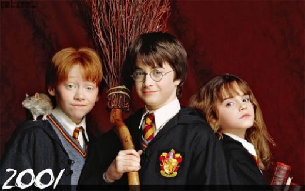

前几天发动一次投票，给三人组每个人提炼一个最优秀的品质，约有400个网友留言，除去一些没有意义的还剩下300票，大多数人的选择是：**哈利勇敢**142，**罗恩忠诚**170（忠诚136/义气22/友爱12），**赫敏聪明**136（聪明61/机智20/机敏9/智慧37/敏锐9）**或勤奋**54（勤奋36/博学18）。（感谢“左冰青Hélène”网友帮助整理，她的[人人日志](http://www.renren.com/275690879/profile)。）

本宅的观点：作者安排三人组的几个优秀品质，是有内在关联的。前面说过，赫敏和哈利之间的比较，是善和更善之间的选择，三个人的品质中哈利和罗恩是一档，属于道德的最高档次，赫敏的品质也不错，但比哈利和罗恩低一档。

按照一般的文学规律，男一号应该具有绝大多数正面的道德，再加一个先天的弱点，男二号则相反，作为对比，应该是有些普通人的弱点，加一处闪光点。经典的文学形象总是一胖一瘦，比如孙悟空和猪八戒、唐吉珂德和桑丘、米老鼠和唐老鸭、喜羊羊和懒羊羊，哈利和罗恩也是如此。哈利的优点太多，反而不太容易找到最优秀的，倒是可以从罗恩身上找到突破口。

罗恩是少数民族，虽然是贵族，但欧洲贵族也有穷的，他爸爸只是个小公务员，家里一大堆孩子，并不富裕，他身上的小毛病挺多的：

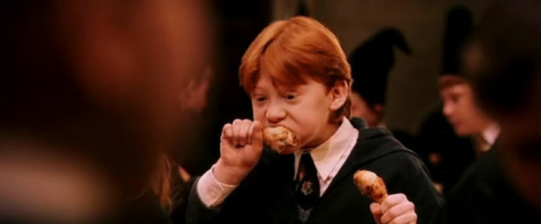

嘴馋，哈1，第一次聚餐

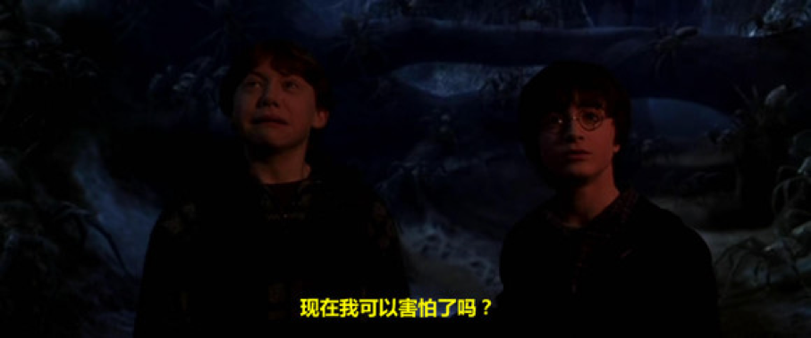

胆小，哈2，禁林遇蜘蛛

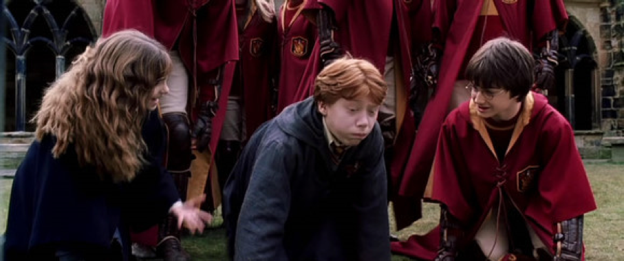

笨拙，哈2，吐鼻涕虫

有些人挺喜欢这些，觉得不像高大全的哈利，高高在上，这和有人喜欢猪八戒、说他像个居家男人是一个道理，不过罗恩仍然是霍格沃茨的优秀学生，人有点二，但大事不含糊。罗恩最优秀的品质，诚如网友所说，忠诚：

片中罗恩一直是哈利的死党，具体情节挺多的，典型的比如哈5，西莫质疑哈利在迪戈里死亡事件上撒谎，罗恩力挺哈利。

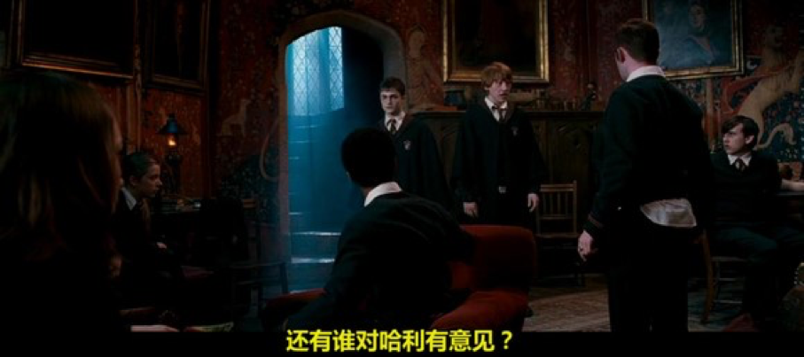

不过，罗恩的忠诚，并不仅仅是无原则的。比如哈4火焰杯，哈利因为未满17岁不能参加三强争霸赛，假穆迪作弊让哈利参赛，结果罗恩觉得受到了欺骗，和哈利大吵一架：

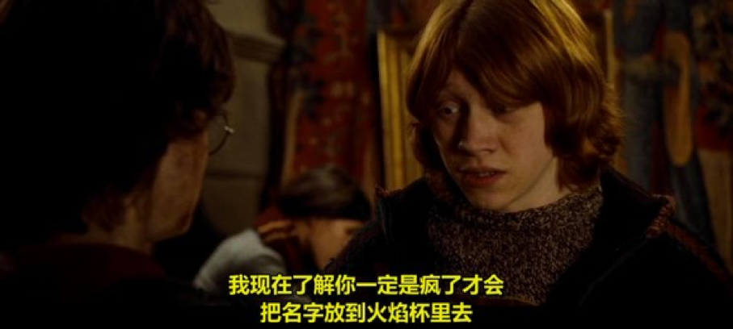

直到发现是自己错了，才和哈利言归于好。

对待朋友有自己的信念，并敢为自己的信念坚持原则，也就是古人所谓的诤友。

但是罗恩的忠诚，还不仅仅是这些。**在最高意义上，忠诚还有另一种说法：抱歉我不知道这样表达是否准确：“牺牲精神”。**

很多朋友觉得这一系列，最好玩的概念可能是摄魂术，其实摄魂术只是康德的第一批判中关于“真”的通俗版，对麻瓜来说，解密魔术很好玩，但对于霍格沃茨的魔法师来说，大家天天学的就是这些东西，没什么稀奇的。真正的两军对峙，最后起决定作用的，并不是这些魔术和幻影，而是康德的第二批判中，关于“善”或者“道德律”的学说。比如最简单的，“用理性控制欲望”。世界上最大的欲望莫过于生存，理性的最大问题，也在于面临死亡的时候，还能否坚持理性。

前面说过，贵族并不是个轻轻松松的职业，贵族的本职工作是战斗，是一种随时面临死亡的职业。死亡的话题很沉重，并不是一件开心的事情，但是经历过死亡的人，确实和别人是不一样的：

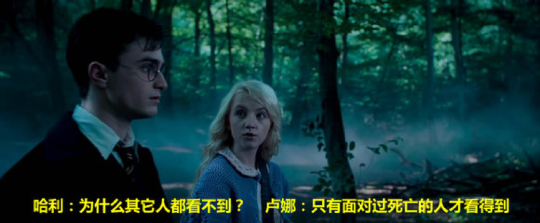

死亡是世界上最大的考验。没有经受过死亡的考验，都不能算是真正的成熟。前面提到的耶鲁骷髅会墙上的格言，其实就是这个意思。一个人如此，一群人也是如此。1950年中国共产党有登记党员300万，有姓名可查的烈士却有340万，这就是为什么300万能领导4亿的原因。在建国后的相当长一段时间，“牺牲”这个词出现的频率极高。

罗恩最优秀的品质，就是在面临死亡的时候，敢于牺牲自己。哈1魔法石，三人组进入地下正殿前的最后一关，罗恩下了一盘很大的棋：

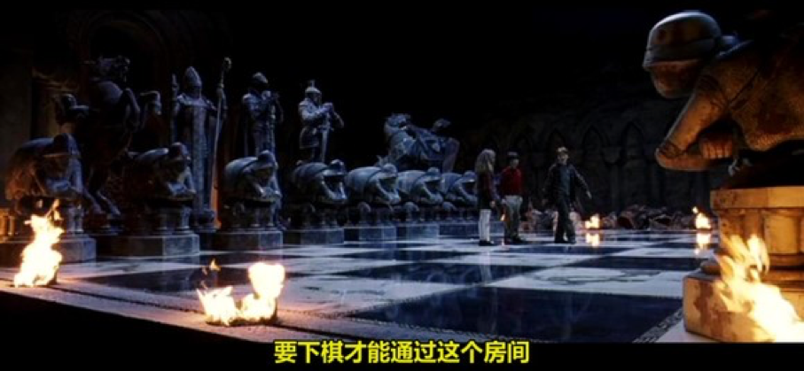

随着棋局的进展，大部分棋子被兑掉，棋盘上尸横遍野，终于到了决定胜负的关键：

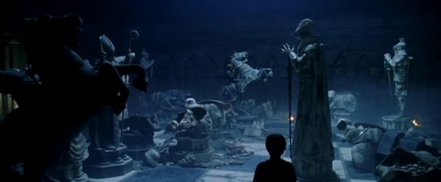

罗恩：你明白了吧，哈利，只要我一移动，皇后就会把我吃掉，这样你就可以趁机进攻国王。

哈利：罗恩！不行啊。

赫敏：怎么了？

哈利：**他要牺牲自己**。

赫敏：不行，一定还有别的办法。

罗恩：你到底想不想阻止斯内普偷走魔法石？哈利，你必须继前进。我觉得该去的人，不是我，不是赫敏，而是你。**骑士移到H3。**

在国际象棋里，各棋子的配合是取胜的关键，前面说过统治者需要组织能力，其实除了领袖的领导才能，组织能力还有更重要的一面：**服从组织安排、敢于牺牲自己、赢得全局胜利的能力**，职场上有时候称之为“团队精神”。从这个意义上说，罗恩的牺牲精神和哈利的领导才能属于一个档次。有意思的是，罗恩自己充当的棋子，正是骑士knight（中文的国际象棋称为“马”）。

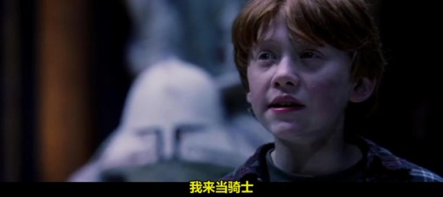

其实哈利也一样有忠诚的品质，只是忠于邓布利多。哈2密室，哈利和伏地魔的化身汤姆瑞斗在密室相遇，汤姆得意洋洋的说自己略施小计，就赶走了邓布多，哈利表示反对：

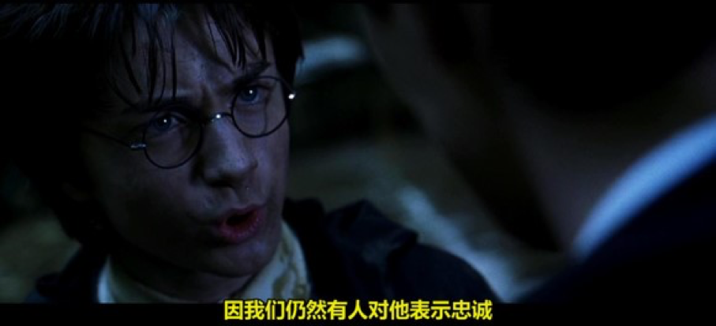

结果凤凰佛克斯被召唤而来，给哈利带来了藏在分院帽中的宝剑，击败了伏地魔。

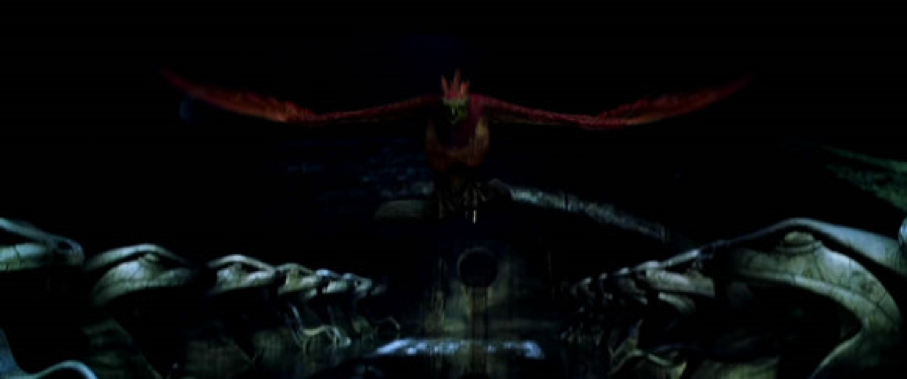

又是佛克斯用眼泪给哈利治好伤口，并带着大家飞出地洞。哈利见到校长后，邓布利多给他解释原因：

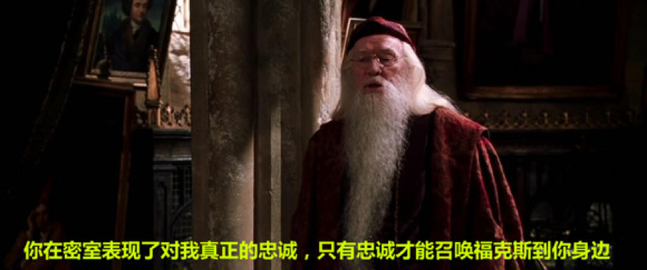

哈利和邓布利多也构成一组领导与支持者的关系，只是哈利是接班人，邓布利多死后就用不到忠诚了。相反，在三人组里，哈利一直是the one/救世主/王者，王者不死，罗琳不方便给他安排太多必死的情节，他的牺牲精神就表现为各种“勇敢”了。

而到了赫敏这里，问题就比较严重了。赫敏的平民训练课改变了她很多缺点，但是最紧要的生死关头，赫敏的思维方式还是受制于她的平民出身，比哈利和罗恩差一个档次。

电影中，遇到危险和困难，赫敏总爱靠撒点小谎、做点小弊度过难关，从1到6，无一例外，虽然都有良好的目的：

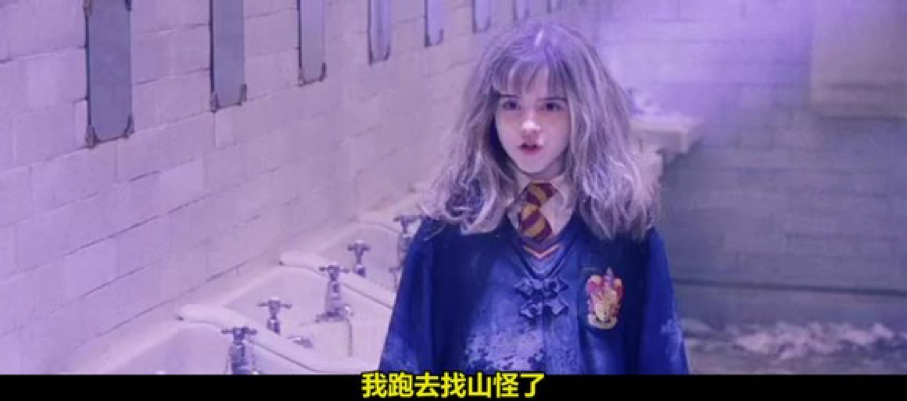

哈1，山怪。

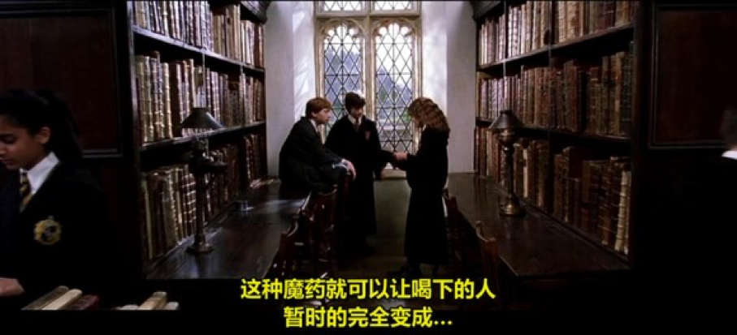

哈2，变形水

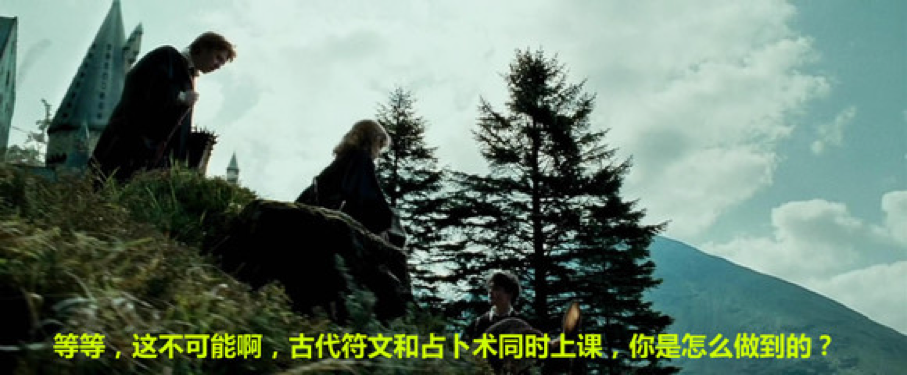

哈3，时间回转器

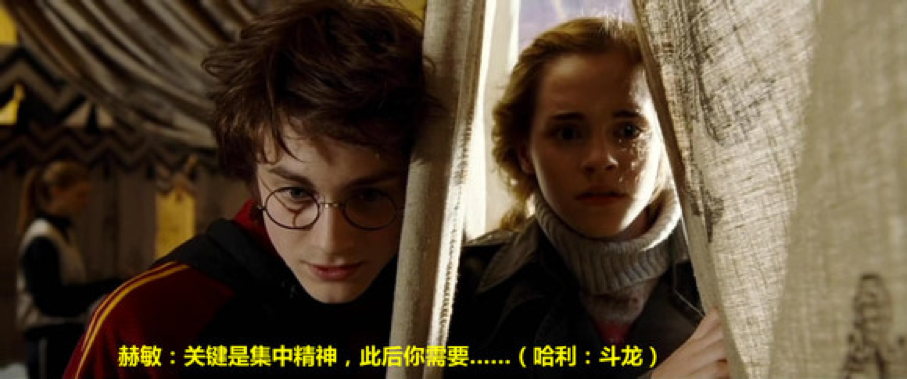

哈4，斗龙之前

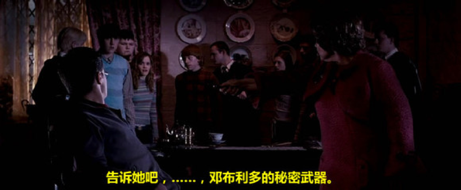

哈5，诱乌姆里奇

哈6，混淆咒

这就是我们对赫敏的印象“聪明”的原因。

必须明确，“聪明”并不是一项“恶行”，只是在善和更善的比较中，略输一筹而已。哈利也作弊，比如隐身衣和活点地图，但是该勇敢的时候绝不逃避，作为对比，哈1-6中，赫敏勇敢牺牲的情节却很少。

相反，金妮的出场机会虽然不多，罗琳却给她安排了类似罗恩的品质。哈6，哈利等人在罗恩家度圣诞节，贝拉等食死徒用火圈将陋居围住。

为了给小天狼星布莱克复仇，哈利第一个冲了出去，卢平等人都挡在火圈之内，可是金妮连外衣都来不及穿，独自一人穿着睡衣去追赶哈利。

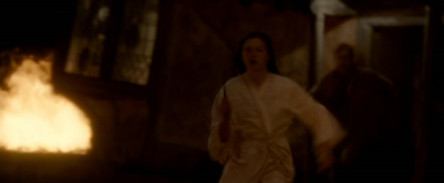

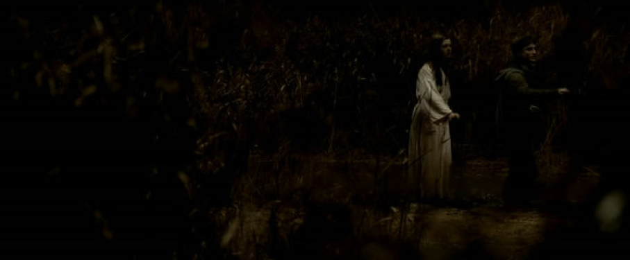

金妮的魔法水平一般，而且她比三人组还低一级，当时只有五年级，但是真到了生死关头，和她哥哥罗恩一样，也是选择的是不顾一切的冲了上去。这里面有爱情的因素，但是首先还是人物性格。假如换了赫敏，面对罗恩的危险，恐怕第一反应还是“这不行，一定还有别的办法”。说句大家不爱听的话，罗恩和金妮的血管里都流着卫斯理家族的血，他们的祖先是那种宁死不屈的凯尔特人，宁可躲进荒原和海岛，也顽强的拒绝同化和混血，这种勇敢的基因是一代一代传下来的。

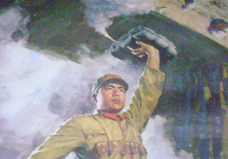

大家都知道董存瑞烈士舍身炸碉堡的故事，其实当时还经过一番周折。有人提出：董存瑞的军事技术不过关，炸碉堡不带支架，这种做法不值得提倡，军内有这种想法的并不只有一个人。这个问题其实就是“智慧/技巧”和“勇敢/牺牲”的比较。最后，军委经过反复权衡，才决定授予董存瑞“烈士”称号，理由是：真到了生死关头，哪有什么时间去慢慢的想办法！

前面说过，中国人喜欢赫敏，可能和我们的**某些**传统，比如《孙子兵法》和《三国演义》有关。《孙子兵法》的主要内容，是“兵者，诡道也”，说白了就是战场摄魂术。三国中诸葛亮压过关羽张飞，也代表文官的智慧超过了武将的勇敢（中国一直有重文轻武的传统）。对照之下，西方人恰好相反：克劳塞维茨的《论战争》第三卷“论战略”，军人道德中的“胆量”远远高于“诡诈”；类似《三国演义》的战争史诗《罗兰之歌》，也是重点歌颂的骑士的牺牲精神。

战国之后，中国人就习惯了“春秋无义战”，战场上各种手段无所不用，而西方贵族的道德标准，恰恰就是春秋五霸中宋襄公那一套：堂堂之阵，正正之师，“蠢猪般的仁义道德”。我无意宣扬《战争论》比《孙子兵法》优秀，或者争论中西文明的道德标准哪个更高，这种问题讨论三天三夜也讨论不完。问题是，在哈利波特里，赫敏是否能嫁给哈利的问题，我们最好还是尊重罗琳本人的意见：

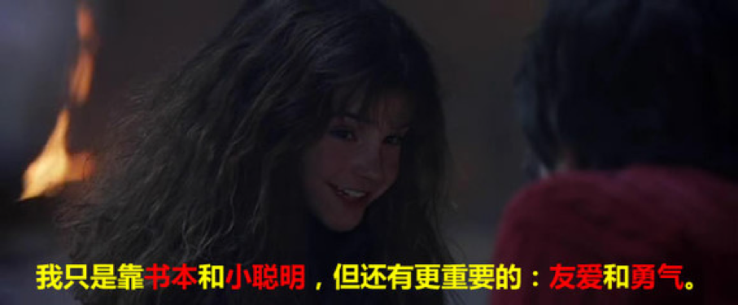

这是哈1魔法石的结尾，罗恩昏倒，哈利进入正殿单独对抗伏地魔之前，赫敏自己总结的三个人的优点，有同学帮忙翻英文原著，也找到了原文：勇气bravery，友爱Friendship（相当于忠诚/义气），聪明cleverness，书本book（相当于勤奋/渊博）。这和大家的投票是一致的。至于哪个品质更重要，赫敏自己已经说出来了。

当然，赫敏最后也学会了友爱和勇气，哈7中，用“一切皆空”咒语抹去家人的记忆就是牺牲精神，寻找魂器的过程中始终追随着哈利就是忠诚。可惜有点晚了，金妮已经穿着睡衣给哈利系鞋带了。（感谢刘晓燕网友的提醒，她的博客中有一篇反驳我的文章，[在这里](http://blog.renren.com/blog/328692914/871726179)。）

再回到我们的高等教育话题，**中国大学教育的最大的问题，就是过分喜欢书本和小聪明，而对友爱、勇气和牺牲精神缺乏培养。**如果我问各位，在中国的大学教育中，你们是否受过忠诚教育，大部分同学可能会感到茫然，这个词好像从来不曾出现在我们的课堂上。如果一个老师问大家“你们是否愿意为祖国牺牲？”很多同学会觉得莫名其妙；如果另一个老师问“你是否愿意为共产主义信仰而牺牲一切？”大概会被认为是在文革中被批斗出了脑残后遗症。

可能有同学会提反对意见，入党宣誓的时候有这句话。不错，这确实是我们现行大学教育中，大概唯一一个笨拙但方向还算正确的努力。问题是，“发展学生党员”和学生会一样，又是一个巨大的口水话题，最重要的一点，能否把第一流的人才吸纳进来，大家自己去体会吧，我不多说了。

今天的两个话题，其实都挺沉重的，无可避免的涉及信仰和政治，肯定又有各种口水。我只能唠唠叨叨的再重复一次：**我不想推销任何意识形态，也不想联系任何时政**，我只是给大家解析一下哈利波特。忠诚会表现为某种信仰，但本质上仍然是一种优秀品质。那些对某种特定意识形态过敏而来质疑我的朋友，请先回答我一个问题：历史上岳飞的“精忠报国”是忠于赵构家族，是不是意味着岳飞不是民族英雄，而非要秦桧才是英雄？或者根本就没有英雄，哈利和伏地魔也没什么区别，才是你们的理想？

世界上没有不需要进行德育教育的学生，美国大学确实没有中国式的党政工团系统，没有占用大量课时的思政课，但如果说美国人的意识形态教育是一片空白、美国人从来不进行洗脑、人家只是天生的道德高尚，我只能说，你真是个纯洁的孩子。问题不是要不要，而是怎么做。

霍格沃茨确实没有思想政治课，但是德育教育是由校长亲自上阵的。每年期末校长都要在全校聚餐上讲话，尤其是“树三观”重点的哈4。大家不妨再聆听一遍火焰杯结尾处邓布利多校长的演讲，最好去看电影本身，因为演讲艺术要配合动作和语气，单纯的台词缺乏效果：

今天，我们蒙受了一个无比巨大的损失，就是大家熟悉的的塞德里克•迪戈里。他生前极其勤奋刻苦，公正善良，最重要的是，他是一个很热心的朋友。

我想你们有权知道他是怎么死的。听着，塞德里克•迪戈里是被伏地魔杀害的。魔法部不希望我告诉你们真相。不过我觉得，如果我不告诉你们，那是对他的一种侮辱。

如今我们所共同感受到的这种悲痛，提醒了我，也提醒了大家。**这就是为什么我们来自不同地方，操着不同的口音，但仍然万众一心的原因。**经过最近发生的事，使得这个学期我们所建立起来的友谊，将比任何时候都重要！

好好记住，塞德里克•迪戈里不会白白牺牲的！

好好记住，**我们要纪念这个男孩**，一个善良的、诚实的、勇敢的、真诚的男孩，直至他生命的终点！

《纪念迪戈里》，《邓布利多选集》第2卷，620-622页，熟悉外国或古代、却对你生活的国家和时代不愿意了解的朋友们，可以重新读一下。

这是邓布利多的最后一次演讲，哈5的结尾，就换成了哈利对小伙伴的演讲了。

霍格沃茨的思政课就这样完成了。

### 10\. 霍格沃茨的女生课

#### 10\.1\.上篇

关于道德标准的判断，每个人都有不同想法，有争论很正常，大家尽可以在留言中发表。好在我帖子中最后一个题目，可以绕开这个争论。赫敏只需要一个理由就不能嫁给哈利，这个理由和道德关系不是很大。

先问一下哈赫党，你们反对金妮嫁给哈利，最主要的理由是什么呢？

**赫敏比金妮漂亮！**

呵呵，我并不赞成这个结论，但赞成这个思路。人在选择配偶的时候，是考虑对方的道德品质多一点，还是考虑生物因素多一点，确实很难说。毕竟，很多人都是外貌协会的。

这个系列从赫敏的头发开始，介绍历史、民族、人类学等的学科，主要是英美国家“关于身体的知识”，后面的哲学、宗教、政治、法学，则主要是“关于精神的知识”，我们在精神的知识世界里已经游览了太久，最后一篇我想回到身体。这一章的主题叫做“英国人的女性观”，顺带讲一点婚姻法。性和婚姻，首先就是一种基于身体的知识。先打个预防针，两性关系话题比政治问题还容易引发口水，我只是蜻蜓点水而已。

照例留点线索给大家。金妮和赫敏的区别，就在这两张照片里：

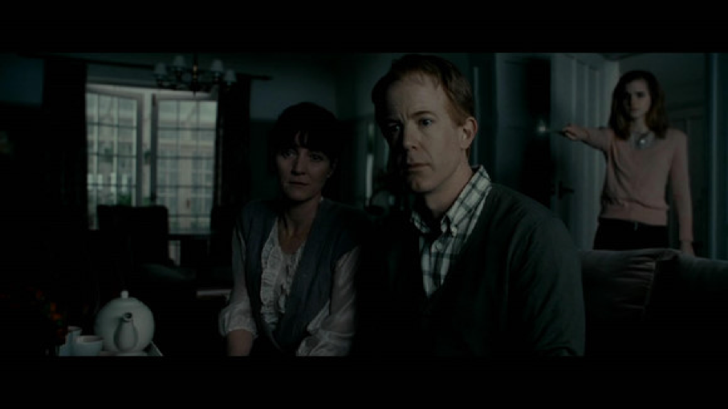

翟按：抱歉各位今天的文章结构不是很完整，主要是因为被自己和谐掉一篇《罗恩家族和魔法部》，写“英国人的政府和公务员”观念的。这一篇并不很难，只是涉及政治，少不了大量的口水，我有些厌倦了，没有完稿，因此把部分写好的内容放到了本篇中，关于魔法部的放到了“社团活动”，关于罗恩的放到了“思政课”。定稿的时候也许会整理一下，把关于高等教育的话题和关于政府的话题分开，会稍微清楚一点。

翟又按：第09章大概从中间部分（文理分科）之后，写作上采用了一点煽情风格，给大家表演了一个小段子《学公知》，学的真的不是很像，勉强有体制问题、历史包袱、美国典范、政府变革几个基本元素，个别关键概念小小违反了一下同一律，结尾的那一段，也是很常见的“民国范儿”。很多网友留言反对，也在我的意料之中。我主要是锻炼自己不同风格的摄魂能力，不过砸碎的锅总还要补回来。我把去年写的一个小品贴出来补救一下，还是采用广大同学喜闻乐见的电影解析形式，会用到另一部电影：《3 idiots/三傻大闹宝莱坞》。

另外，如果你是那种一看到电影名字就能猜到内容的高手，也请试试这个题目：第09章中法理课上我和同学们去教堂参观的照片里，埋藏着一个重要的漏洞，可以颠覆我的观点本身。前面说过，摄魂术就是99%的真相加上1%的谎言，但是1%的谎言比99%的真相更重要，这张照片就是1%。运用你的判断能力，看看漏洞在哪里？

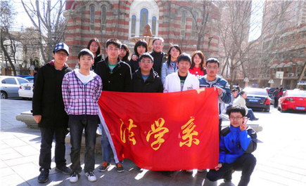

[照片答案在这里](http://blog.renren.com/blog/247533971/871126964)

那龟驮着净瓶，爬上崖边，菩萨教：拿上瓶来。这行者即去拿瓶，唉！好便似蜻蜓撼石柱，怎生摇得半分毫？行者上前跪下道：弟子拿不动也。菩萨道：常时是个空瓶，如今抛下海去，这一时间，转过了三江五湖，八海四渎，溪源潭洞之间，共借了一海水在里面。**你哪里有架海的斤量？**（《西游记》第42回）

翟按：请各位原谅，今天的话题是本系列最大的马蜂窝，我只是一只小猴子，没有架海的斤量。请以娱乐的心态阅读本文，谢谢。

##### 10\.1\.1\. 哈利的婚事

上一篇关于道德标准的判断，每个人都有不同想法，有争论很正常，好在我帖子中最后一个题目，可以绕开这个争论。赫敏只需要一个理由就不能嫁给哈利，这个理由和道德的关系不是很大。

先问一下哈赫党，你们反对金妮嫁给哈利，最主要的理由是什么呢？

**赫敏比金妮漂亮！**

呵呵，我并不赞成这个结论，但赞成这个思路。有些人说“原著中金妮比赫敏漂亮”，那也没什么区别，只要你考虑“漂亮”就行。我的意思是：人在选择配偶的时候，是考虑对方的道德品质多一点，还是考虑生物因素多一点，确实很难说。

这个系列从赫敏的头发开始，介绍历史、民族、体育教育，主要是英美国家“关于身体的知识”，后面的哲学、宗教、政治、法学，则主要是“关于精神的知识”，我们在精神知识的世界里已经游览了太久，最后一篇我想回到身体。今天的主题叫做“英国人的女性观”，顺带讲一点婚姻法。性和婚姻，首先就是一种基于身体的知识。

再确认一下这个系列的总题目：“赫敏为什么不能嫁给哈利”，不是**“赫敏为什么不能爱上哈利”**，单讲爱情，汤姆爱上哈利也没什么不可以。我们讨论的是“婚姻法”，也不是“爱情法”——世界上从来没有“爱情法”，因为法律不能让人爱或者不爱另一个人。

对真心相爱的人来说，“婚姻法”其实没有什么用处。举个例子，2011年最高法院曾经发布过一个文件：“**关于适用《中华人民共和国婚姻法》若干问题的解释（三）”**：

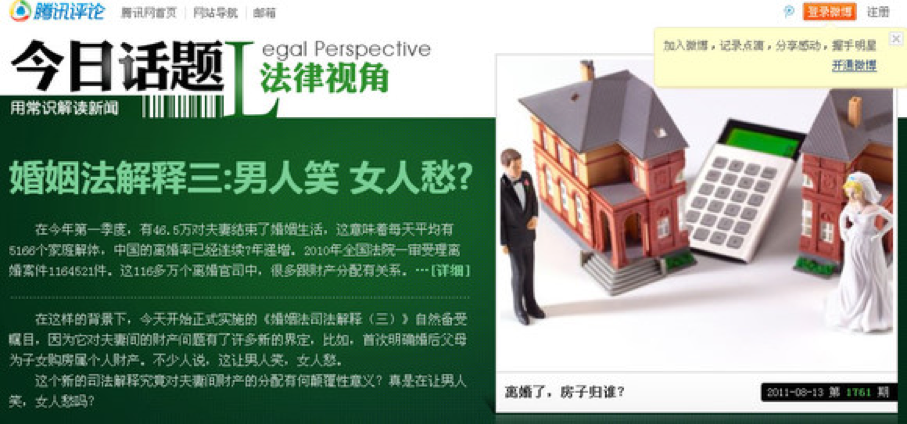

也就是那个“公婆买房、离婚后是否属于儿媳”的文件。这件事引发了全国人民的大讨论，公公婆婆儿子媳妇外加小三小四，纷纷计算自己的得失，反而是不讨论这个问题的才是恩爱夫妻——夫妻一直住在一起，只要不离婚，抽屉里的房本上写谁的名字，对生活毫无影响。两情若是久长时，又何须法律维护？

正因为如此，古往今来歌颂爱情的文字千千万万，诸位人人网友的年龄，大体上也是爱情的敏感阶段。爱情像是个无所不能的魔法，可以随心所欲的安排民族、血统、身份、钱包，正如网上流传的段子：看了《神雕侠侣》，年龄不是问题；看了《断臂山》，性别不是问题；看了《金刚》，物种不是问题；看了《人鬼情未了》，死活都不是问题。不过这个段子还有一层意思：**彻底的爱情，绝对是个见鬼的事儿。**

爱情是纯粹的精神现象，婚姻则不然，涉及性、生育、家庭和财产，首先离不开身体。在两性关系中，精神和身体混杂在一起，什么比例都有，但是完全的爱情并不能称作婚姻，就像完全的“性”属于医学一样。各位法学同学千万注意：**学会区分婚姻和爱情，是学好婚姻法的第一关。**有些东西的第一关非常难过，《葵花宝典》和《婚姻法》都是如此。美国法学院不招年龄较小的本科生是有道理的，人生应该经历火热的爱情，但是法学研究需要一颗冰冷的心。

##### 10\.1\.2\. 麦格的课程

今天这一篇主要是个人工作的一点小体验，写给我自己的学生——尤其是女生们的。本宅在普通学校读的中学，大学是在颇具文艺气息的法学院中度过的，毕业后找工作，才第一次来到外语类院校。在中国的大学里，外语类院校绝对是一株奇葩——高考报志愿，女生选择外语专业的比例一直居高不下，结果就是外语类院校中的男女生比例非常悬殊。中国没有女校，据说全日制普通大学中，女生最多的是大连外国语，我们天津外国语估计也差不多。

在外语大学这个神奇的地方，体育部从来没有组织过班级足球赛，因为建校以来就没有一个班的男生够一只足球队——大部分班的男生只够打篮球，个别运气不好的班，打麻将还要去隔壁班借人。我到外语大学工作第一天，看到教室的墙上贴着一张值日表，当时我就凌乱了。值日表上写着：周一、女生201宿，周二、女生202宿，周三、女生203宿，周四、女生204宿，周五、全体男生。

时间久了，我慢慢适应了这种失常的性别比，也掌握了大课间坐电梯之类的高难度动作。不过作为教师，本宅又感到有点奇怪：在我们这个女生奇多的学校，教学安排上，和我经历过的其他学校并有什么不同，从专业的角度讲，我其实也没有太多的不适应。女生有很多和男生不一样的地方，至少在选择专业的时候，喜欢外语的女生远远多于金属冶炼。作为常和女生打交道的老师，我也能感到女生有她们的特殊话题——有一次行政法课讲行政许可，不小心举了个计划生育的例子，我花了足足二十分钟的时间，才把叽叽喳喳的女生们从生小孩拉回到法学本身。但是，这些女生特别感兴趣的“女性知识”，在我们的课程表里并不存在。**我不知道这门缺席的课程应该叫什么名字，姑且取名叫做“女生课”。**

女性特有的知识很多，比如最简单的吃饭。都知道女生的体型很重要，但是校园附近的小餐馆，总能见到很多大吃大嚼的女生，啤酒烤肉一个都不少。被邀请参加毕业聚餐，我发现一大群女生的餐桌上，最后剩下的居然是蔬菜，这样怎么能保持体型呢？脸是先天的，腰是后天的，男生为什么要重视女生的身材？因为找一个“理性不能控制欲望”的女孩回家，后面的麻烦多得很，不只是“带不出去”的面子问题。

再如穿衣服，里面的学问更多。女生都爱穿漂亮衣服，但能不能穿的得体就不一定了。各位读者不要乱流口水，以为我天天在外语大学就是看美女，先天条件不论，我见到的不会穿衣服的女生和美女一样多。比如说，夏天总有女生穿短裙吧，最热的时候，目测短裙率能达到三分之二，满校园的黑丝美腿。我不是保守的老夫子，好身材的女生穿短裙，也确实给校园增添美丽的风景，可是很多人并不考虑腿的先天条件。偶尔去学生食堂吃饭，穿行在各种穿短裙的短粗腿、汗毛腿、萝卜腿、X型腿和O型腿之间，确实有点影响胃口。穿一件得体的长裙很难吗？

这是我一个已经毕业的学生，在校期间坚持了4年长裙，外加固定的发式和衣着风格，让人感觉是个大学生，而不是社会上的不良少女。偶然听她谈起穿衣服，道理很多，比如长裙不露膝、短衫不露肩，都是她五十年代读过大学的外婆从小教育出来的。会穿衣服的结果，毕业一年后，办公室老师提起她，名字忘了，还记得她的衣着风格。在女生遍地的外语大学，这可不是件容易的事。

不要小看穿衣吃饭、描眉化妆的学问，这是“女生课”的重要组成部分。比如让大家评选电影中赫敏最美的一张剧照，估计大部分人会选择这个：

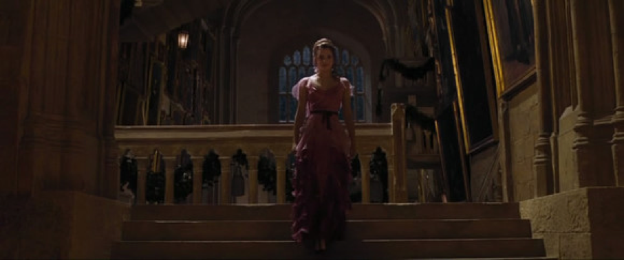

赫敏这身衣服属晚礼服，绛紫色介于小女孩的粉红色和妖艳性感的大红色之间，对应她的年龄和身份，也和她浅棕色的头发搭配。轻纱的袖子是“荷叶袖”，是一种开口的公主袖，意在展示赫敏的肩。领口是小v字领，区别于女童的娃娃领，但开口不深，又不同于成熟女性的深v。波浪式立体造型的裙摆，象征女孩的青春活力，又和袖口的荷叶造型相呼应。发型是简单的盘发外加一个代表少女的小马尾，同样搭配她的年龄和身份。哈4演赫敏的演员艾玛•沃特森15岁，身体刚刚发育，有一点成年女性的妩媚，又有小女孩的青涩，这身衣服很好的表达了赫敏的少女魅力。**身体是女生的天然魔杖，魅力是无需咒语的摄魂术，一旦男生的理性控制不住欲望，就会乖乖听从女生的安排。**不知道全世界有多少小男生被这张剧照摄魂。

等到剧中第二次舞会，也就是比尔和芙蓉的婚礼上，赫敏就穿的比较成熟了，颜色更红了，肩膀露出来，领口也开的低了，发型也成了披肩发。

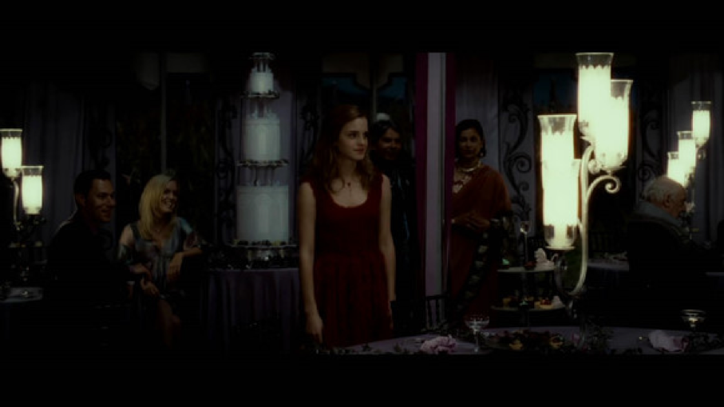

罗恩的表情也就这样了：

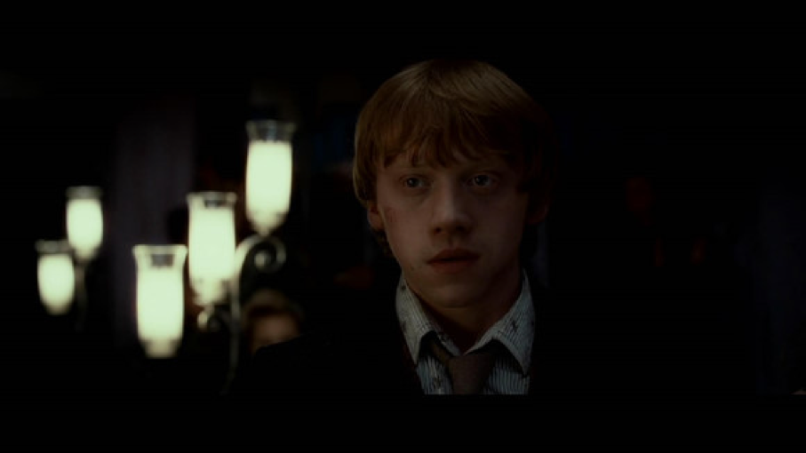

如何用衣着和发饰表达女性的魅力，是一门很专业的学问，没有老师的指导是不行的。霍格沃茨课表里就有这门课。哈利四年级相当于高一的时候，为了配合三强争霸赛中的圣诞晚会，学校开了一门特别的课程——舞会课，赫敏的晚礼服就是舞会的一部分。这是全剧中唯一的男女生座位分开的课堂，**也就是本文的标题“霍格沃茨的女生课”——让同学们正确认识两性关系的课程。**

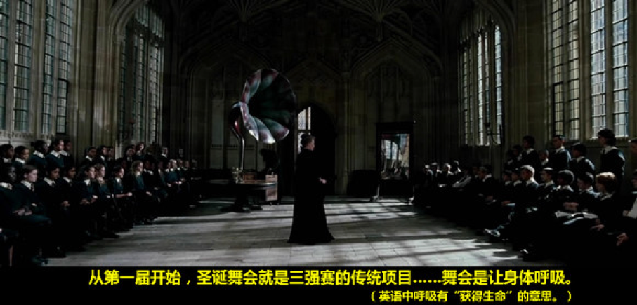

交谊舞一直是西方文化的传统项目。古典的贵族时代，比如路易十四时代的法国，凡尔赛宫廷就以奢侈华丽的舞会文化著称，路易十四外号“太阳王”，也是因为他善于跳芭蕾舞中的太阳神阿波罗而来的。现在英国私立中学还有这类课程，大学就更不用说了，舞会是社交礼仪的中心。

四年级的哈利和赫敏们，还是些羞涩的小男生和小女生，要培养成为男人和女人，是需要学习的，交谊舞会就是训练两种性别交往的课程。这门课十分重要，教务长兼格莱芬多院长麦格教授亲自上阵，手把手的教学：

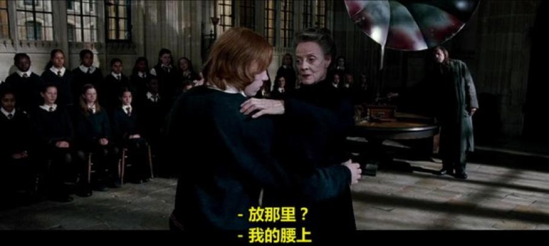

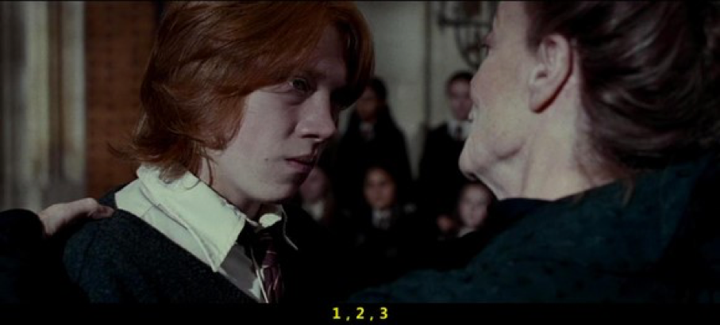

课下要反复实践：

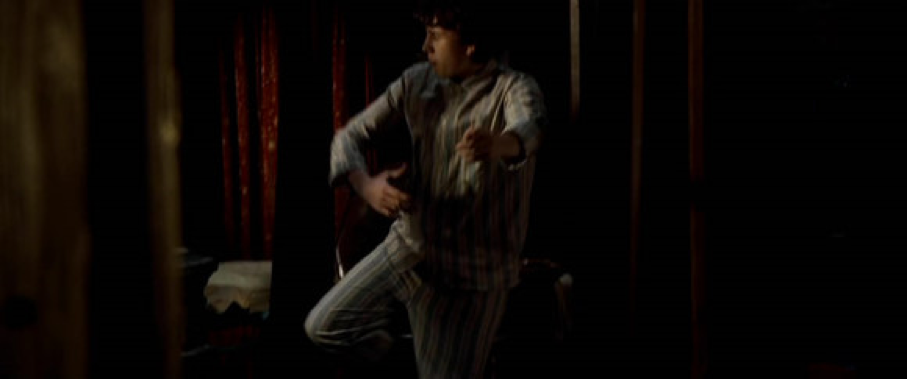

邀请舞伴是必须完成的作业：

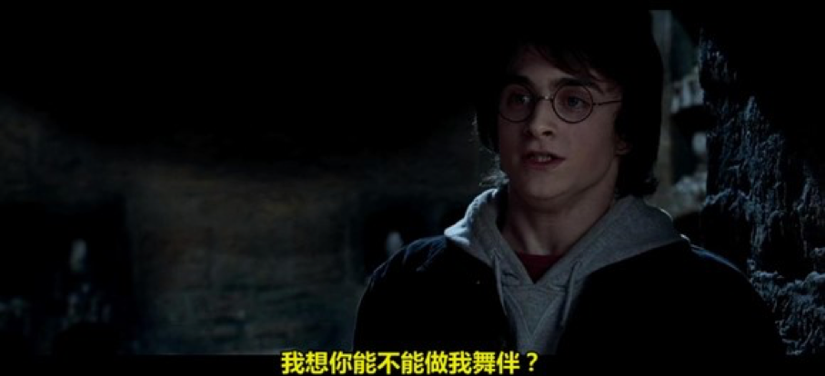

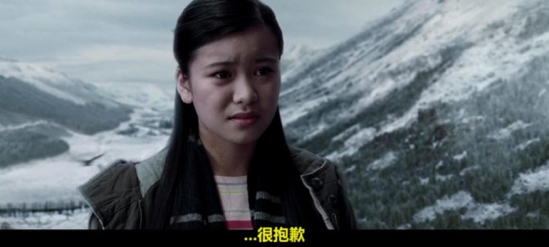

校长要亲自检验：

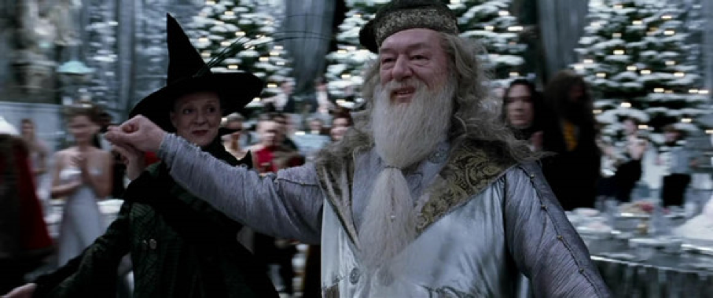

“女生课”不是只有女生才上的课，男生也要学习两性关系的知识，舞池就是最好的实验台。舞会上，男生要得体的邀请心仪的女生，女生要展示自己的魅力，吸引男生的目光，接受/拒绝男生的邀请，其实就是学习两性关系的基本规则。谈恋爱是个综合交叉学科，涉及心理学、逻辑学、农学、经济学、管理学、法学、文学诸多知识，要有充分的身体条件和道德素质，还要有丰富的实践经验，绝不是随随便便就能成功。

同理，交谊舞是一种非常复杂的交际活动，可以承载很多微妙的感情，并不限于恋爱关系，比如哈7逃亡路上，哈利和赫敏在帐篷里跳舞这段戏：

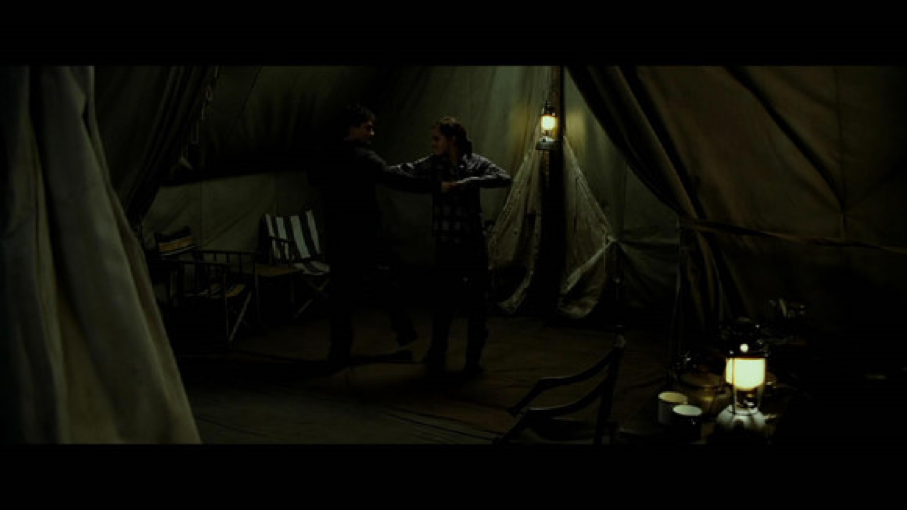

罗恩吃醋出走，赫敏黯然伤神，哈利用交谊舞激励沮丧的赫敏重新恢复斗志，整个桥段没有语言，完全靠肢体动作，让很多观众印象深刻。有网友说感到两个人有点暧昧，其实这应该算是异性之间的友情，西方人的两性关系比中国人复杂，在夫妻与路人之间有很多中间态，这都是“女生课”上应该学的内容。

回到我们自己。

各位同学，你们有没有接受过正式的性别教育呢？高一的时候，老师有没有布置过追女生的课后作业呢？在元旦联欢会上，有没有见过校长和女教务长翩翩起舞呢？

我反正从来没看见过。

即使校长本人喜欢交谊舞，在任何公开场合也要自我限制。高中男生追女生，更是属于地下活动，老师不棒打鸳鸯就不错了。**中国“性别教育”的核心理念，就是“没有性别”——尽量抹掉任何两性之间的差别。**在一切正式场合，我们都尽可能的强调男女平等，中国没有女校，没有“女生课”，都是围绕着这一理念安排的。

男女平等有什么不对吗？男生能做的事情，谁说女生不能做？

作为常和女生打交道的教师，我觉得下面的观点没有任何问题：男生和女生没有不可逾越的智力差别，只要经过足够的训练，女生能做任何男生能做的事。学习成绩就不用说了，领导能力方面，外语大学的男生太少，女学生会主席，女班长、女团支书、女班委比比皆是，也和男学生干部没什么不一样。

各位同学找女朋友，多支持一下我们外大的女生吧。外大的妹子们一贯自强自立，具有极强的实践精神，修电脑搬行李这些力气活，向来是自己动手，碰到大型活动，挂气球扯电线的高空作业，也是挽起裙子就上，从不依靠比大熊猫还少的男生，哪像某些男多女少类院校的女生，打个开水都有十几个男生排队，都宠坏了。

**（外大的女生们，加油吧，老师只能帮你们到这里了。）**

既然如此，让我们从教育平等开始，大家共同生活在一个由男教师和女教师、男工程师和女工程师、男律师和女律师、男医生和女医生组成的世界中吧！有什么问题吗？

只有一点小小的问题，这个美丽新世界的寿命不会太久，最多一代人之后，这个两性完全一样的世界就消失了。历史上也许有人尝试过，他们都消失了，我们都是作出相反选择的人的后代。

因为各种职业都是为人服务的，但前提必须要有“人”存在。前面的理念有个巨大的缺陷：这个男女完全一样的世界缺乏一个职业：生产“人”的职业。没有“人”，哪里来的社会呢。

人从哪里来呢？

##### 10\.1\.3\. 金妮的优势

人是人他妈生的，妖是妖它妈生的，虽然人他爸和妖它爸也做出了部分贡献，但是和妈妈们相比，是次要的。

**这就是男女两性最基本的差别：女人要生孩子。**“只要经过足够的训练，女生能做任何男生能做的事”，反命题并不成立：无论如何训练，男人也学不会生孩子。

爱情是纯粹的精神现象，但婚姻不是，婚姻需要身体，要以生育为目的。哈利波特的粉丝们，现在也该到了结婚生孩子的年龄，你们认真思考过这个问题了吗？

上一张的结尾，给大家留了两张照片，希望大家对比一下，赫敏和金妮的差别。

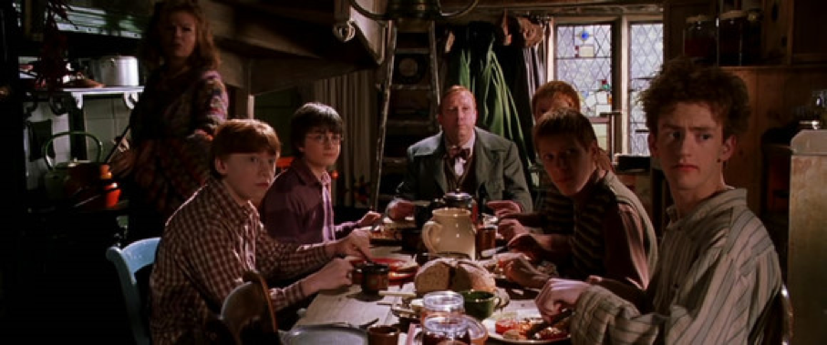

感谢各位的讨论。答案并不难，大部分留言都或多或少猜到一些，只有一点需要说明一下，有人留言“照片色调阴冷，说明赫敏家庭关系冷漠”，我没有这个意思。除了大决战之前的特殊情况，赫敏家大部分时间应该也是温馨快乐的，选这张剧照是因为这是电影里唯一一张赫敏全家福。其他回答，大体上都属于我分析的范围之内。

本宅对照片的第一个分析是：赫敏和金妮，在生小孩方面，是有差别的。很多英国人都不太严谨的相信下面的观点：想知道女孩的生育能力，看她的妈妈——金妮家男丁兴旺，莫莉一共生了7个孩子，其中有6个是男孩，而赫敏的妈妈只生了1个女孩。我相信剧组在选演员方面，是有一定考虑的，金妮家三代女性都比较胖，骨盆宽，方下巴，面色红润，这是适合生育的身体特征，赫敏家则相反，身材较瘦、瓜子脸、面色苍白。

各位别和我争论这种说法有没有遗传学依据，这是我从农村老太太那里学到的“女性知识”。在没有遗传学的年代，从刘姥姥到贾母的各种识字不识字的老太太，都相信这个道理。薛宝钗是多子女家庭的小女儿，林黛玉是独生女，连“钗肥黛瘦”都和金妮和赫敏类似。身体条件是贾母放弃嫡亲外孙女黛玉、选择旁系姻亲宝钗的重要因素——林黛玉能否生的动孩子，明显是个问题。对贾府来说，个人感情总是小事，家族延续才是大事。

关于生小孩的问题，罗琳本人在剧本里也有呼应。

全剧的结尾“十九年后”，三人组在站台重逢的时候，赫敏和罗恩带着两个孩子，而哈利和金妮则有三个，而且金妮的孩子是男、男、女，和莫莉类似，赫敏的孩子是女、男，头一胎又是女孩，假如在中国这样计划生育的国家，罗恩•卫斯理家就要绝后了，这是讲究血统的贵族家庭最不能接受的事。

这是我对“赫敏为什么不能嫁给哈利”问题的基本回答：**在生孩子方面，赫敏不如金妮。**这个答案在写首贴之前就想好了。

抱歉我词汇贫乏，不太好找到词语形容原著党的愤怒。

这里特别向罗琳阿姨和原著党们道声歉，儿童文学被毁成这样，确实有些过意不去。为了表示歉意，我决定在全文的结尾安排了一个光明的结局，给赫敏一点补偿。各位少安毋躁，我们还是先讨论英国人的女性观和婚姻法。

世界各国的家庭观念，正常情况下都是以人丁兴旺的大家庭为美，道理很简单：凡是不鼓励女人生孩子的文明，早就在历史中消失了。中国现行的计划生育政策，不论短期内是否调整，长期来说都是不可持续的，计算一下并不难：如果每一代人都只繁衍上一代人的一半，以20年为一代，200年后中国还有多少人？

1/2^10=1/1024，2212年的新生人口只有现在的千分之一，也就是130万，加上存量人口，超不过1000万人。那时候天津大约还有12万人，差不多是一个县城的规模，小学和中学还有几所，大学肯定要搬到北京去了，毕竟北京也只有14万人。那时候钓鱼岛肯定不是问题了，问题是朝鲜会入侵中国，人家还有2000万人呢！“一对夫妻一个孩”的政策，长期而言，是亡国灭种的政策（短期是否合理另论）。

要维持国家的昌盛，最基本的条件就是有足够的人口。从大航海时代开始，英国就处于扩张状态，英国的人口文化如何呢？

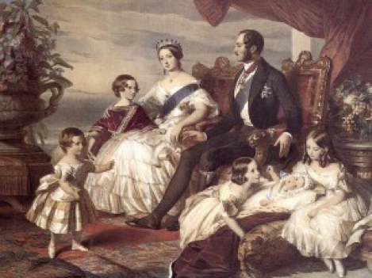

维多利亚女王一家。

维多利亚是英国历史上最受尊敬的国王之一，她在位64年，期间的大英帝国达到鼎盛，包括打了两场鸦片战争，史称“维多利亚时代”。作为一位女性，维多利亚的施政方针就是垂拱而治，一切交给内阁打理，本人几乎什么都不做，唯一被国民称道的“政绩”，就是她养育了四女五子共九个孩子，并让这些王子公主娶嫁遍及欧洲王室，然后得了一个“欧洲的祖母”的外号。大家看这张女王家庭的油画，是否和卫斯理家有近似的地方？

美国方面呢？这是最近在竞选美国总统的共和党候选人罗姆尼的全家福，罗姆尼夫妇共有5个子女，共生了18个孙辈。这张照片是他竞选广告的一部分，秀家庭温馨，以表明罗姆尼“重视家庭价值观念”。

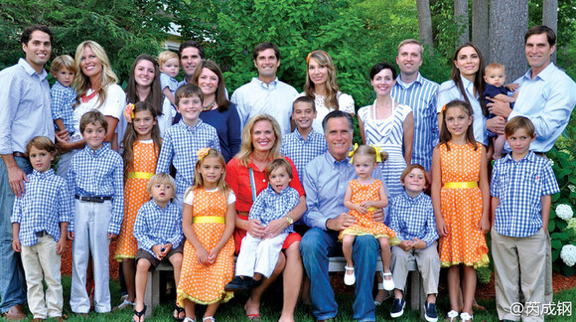

虽然现在英美国家已经不多见这样的大家庭了（罗姆尼是摩门教），但是仍然是以2-3个孩子为主。像赫敏这样的独生子女家庭，在英美家庭观念中可不是什么好事情。在电影里，小演员中一共有三个确定的独生子女：赫敏、马尔福和哈利的表弟达利（哈利、纳威和卢娜是烈士孤儿，不是独生子女），独生子女的缺陷，比如任性、霸道、缺乏与人相处的能力，在两个男孩身上都表现的很明显，赫敏多少也有些“性格强势”，确实和孤儿出身的哈利有些性格不合，而比较适合多子女家庭背景的罗恩。

英美国家至今仍然有浓厚的“家庭观念”，文艺作品中对人口众多、气氛温馨的大家庭持正面态度。有朋友问同样是麻瓜嫁给纯血，赫敏和莉莉有什么区别？莉莉的信息太少不好展开分析，不过在有限的资料中，赫敏是独生女，而莉莉则有个姐妹，佩妮姨妈也确实对哈利的成长起到了很大的作用。

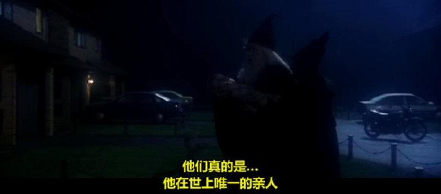

邓布利多明明知道弗农和佩妮的各种毛病，也坚持让哈利有家庭感的环境中长大，这样的孩子才有正常的人际交往意识。传统观念上，娶嫁宜避独子，因此德赫党根本不现实，那是比独生子女更糟的双独家庭（在中国讨论独生子女的缺点，打击面有点太大，好在这事儿的原委大家都知道，中国的双独家庭实在是没办法，我自己也是独生子，大家就都不要对号入座了）。

人口学的基本定律，一对夫妻至少要生育一对子女，才能维持人口平衡，考虑到各种意外，正常的世代更替应该有2.2个子女。经过近30年的独生子女政策，中国读者已经对这种“正常的家庭结构”感到很不适应了，很少有人想过，真按照这个数字生小孩，很多大家习以为常的婚姻家庭观念，就要发生重大变化。

女人生两个孩子，有什么大不了的？

##### 10\.1\.4\. 莫莉的职业

前面讨论过理性和欲望、规则和权力的话题，不过凡事都有特例。**世界上有一种人，拥有无比强大的欲望，却完全没有任何理性，总在挑战一切既定的规则，却让所有人都不得不服从**，这是一种什么人？

各位带过小孩的，就知道我这句话的意思了。婴幼儿状态下的“人”不仅生理上完全不能自理，而且总是做各种毫无理性的事情，无时无刻不需要大人的照顾，带小孩是世界上最辛苦的工作。孟子曰，天将降大任于斯人也，必先苦其心志，劳其筋骨，饿其体肤，空乏其身，娶个老婆，生个娃娃，所以动心忍性，增益其所不能也。

对于带小孩的妈妈来说，生育子女对她的生活轨迹有重大的影响，即使以维多利亚女王之尊也不能避免。女王在写给长女维多利亚公主的信中，曾经透露过很多苦衷：

“亲爱的女儿，你说给予一个不朽的灵魂以生命，是一件非常值得骄傲的事，但我自己却难以有这种想法。整天哺育婴儿和换尿布，让很多优雅而聪明的淑女走上毁灭之路……我有九次怀胎十月，担负真正的痛苦（还要处理很多公务），像折断翅膀般……要让一个无知的幼儿长大成人，女人需度过多少难关！我说不出我的痛苦、我的感觉、我的奋斗。当我们带你回你自己的房间，而你却哭闹得很厉害的情景，彷佛还是昨夜的事。”

假如不考虑保姆和老人帮忙，完全带孩子的妈妈是不能工作的。就算按照现代中国的生活节奏，带一个小孩，从受孕算到幼儿园最低也需要4年。妈妈生育2.2个小孩，意味着8.8年不能工作。假设一个女生18岁上大学，25岁硕士毕业，26岁结婚，27岁怀孕（够快吧），她第一次工作的时间是：36岁。

36岁第一次参加工作的、2-3个孩子的妈妈，哪个单位要呢？反过来说，不能就业，又何必读到硕士呢？如果只考虑生育的话，16岁也是可以的。我这里还没有讨论更高学历、比如女博士的情况。大学女教师的学历高，平均生育年龄将近30岁，我在身边见过太多事业家庭两面操劳的妈妈，实在是替她们感到辛苦。这还是政府鼓励独生子女的中国，如果再生2-3个孩子，怎么办？

现代意义的男女平等，主要是人格上的平等，并不是简单的“男女都一样”，更不“男生能做的，女生也一定能做”。这就是“女生课”的基础知识：**因为有生育方面的差别，因此在教育、工作、财产、婚姻等等问题上，男女两性需要有差别的对待**。前面提到英美文化中对身体的态度：discrimination，其实最主要的discrimination有三个：民族、阶级和性别。民族和阶级都分析过了，最后这个性别的差异，就在于女性要负责生育，无法和男性一样参加生产活动。如果说英美文化有某种二元论，男女两个性别本身就是最大的二元论，大家可能已经熟悉了这种思维方式：凡是有“差别对待”的地方，必然意味着有“歧视”，又会引发身体和精神的争论。

因为女性要生育，必然带来的结果是：生育期间母子的生活费用，都要由父亲提供，这也是婚姻制度本身存在的最主要的理由。一男一女一起吃饭，可以下馆子；一起赚钱，可以办公司；一起讨论文学艺术，可以建学校；唯有组织家庭，必须与性和生育有关。**结婚这件事，简单的说，就是男人出钱，女人出力，合作生小孩。**

如果女生接受了这笔钱，那妻子和丈夫的关系，就不仅是简单的爱情问题了，而是一种财产的单向转移。为什么谈恋爱的时候吃饭总是男生请客？因为对追女生的男生来说，如果你有诚意在今后的几十年内给她几十万元，就不会在意开始这区区几百元饭钱。说的再直白一点，对女性来说，结婚和上班在赚钱方面是等价的。“妻子”是一种职业——“全职主妇”。

（在中国这个绝大多数女性都就业的国家里，写出下面这段文字，我个人感到极大地危险，在我工作的外语大学尤其如此，请各位娘子军的平底锅拍的不要太狠，至少看完我的全文再拍，婚姻法极为复杂，稍一不慎就是危险。）

经过几十年“没有性别”的教育，大部分中国观众对“全职主妇”已经很隔膜，有时候甚至会闹笑话。比如电影《钱学森》，蒋英出场亮相的桥段：蒋英成功的举办了个人演唱会，下台后遇到久别的钱学森，台词是这样的：

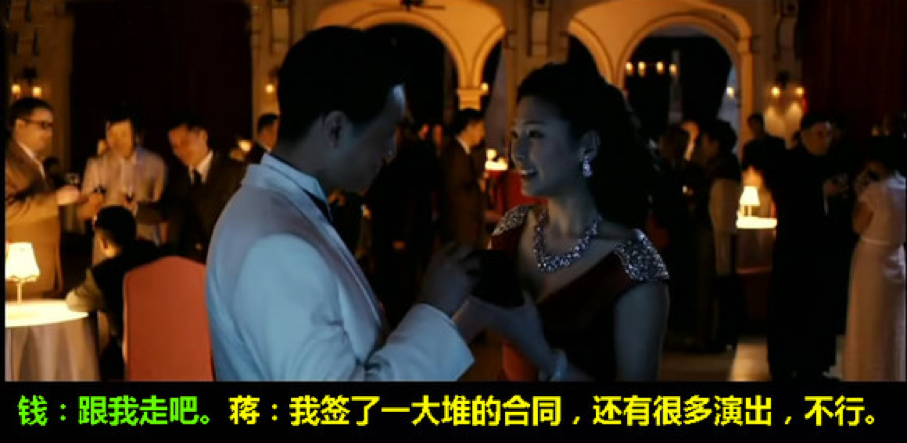

不知各位什么感觉，我是一口水喷到了屏幕上。

编剧的意思，当然是想表现蒋英的优秀，可惜他的词典里没有“贵妇人”这个概念，配了一段伦敦东区纺织女工的台词。蒋英这样的家庭，女孩子学习音乐和艺术，绝不可能是为了走穴挣钱，你拿蒋英当张钰吗？挣钱是钱学森们的事，贵妇人在公开场合只是讨论花钱，比如英国王妃戴安娜，主要的社会活动就是“做慈善”，说白了就是花钱购买社会声望。蒋英的这句台词应该是这样的：“我刚参加某某夫人的沙龙，还要给印度的水灾孤儿进行了募捐，不行。”电影中蒋英的错误设定比比皆是，挑不胜挑，聊举一例而已。

相反，十七世纪以后，英国再也没有经历过剧烈的社会革命，他们的家庭观念——**抱歉很多中国读者肯定很不喜欢**——比较保守，直接的说比较“封建”，和中国传统社会倒是有些类似：女人不应该外出工作，而应该在家做饭带孩子。即使经过一轮妇女解放风潮，今天英美国家已婚女性，第一职业仍然是全职主妇，而且越是上层家庭越是如此。比如金妮的妈妈：莫莉•卫斯理。

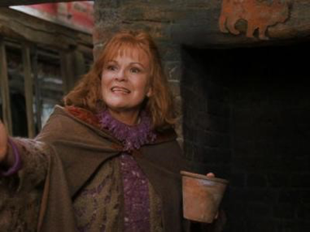

莫莉本人是巫师，毫无疑问也在霍格沃茨学习过魔法，但莫莉根本不“上班”，她一共生了7个孩子，一直在打理卫斯理家的家务。莫莉凡是出场亮相，手里都离不开餐具，男人们坐下吃饭的时候，她总是站在灶台边忙碌。前面一张剧照不是特例：

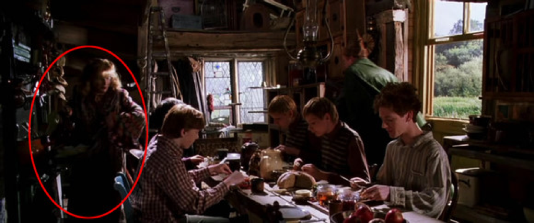

哈2。

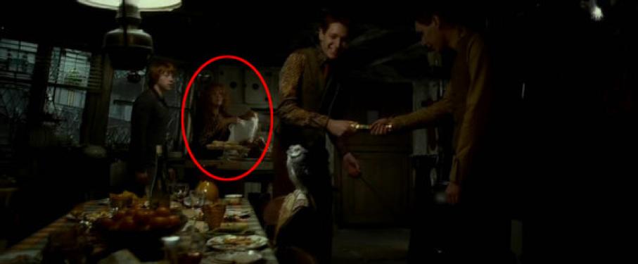

哈3。

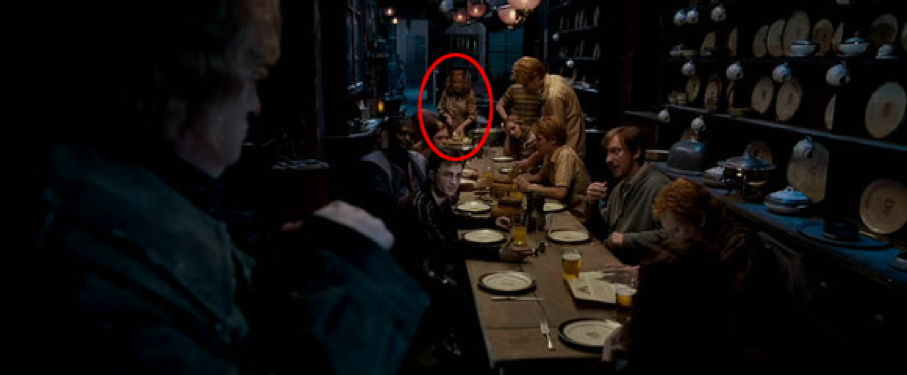

哈5。

相反，她的丈夫亚瑟下班之后，一向是直接上饭桌的。

别以为莫莉的社会地位低，在英美国家，全职主妇不是“没文化的家庭妇女”，而是一个很高端的职业，在某种意义上是上层社会的标志。戴安娜、凯特这些“王妃”们就不用说了，四代布什夫人：芙罗拉、多萝西、芭芭拉和劳拉，都是几十年在家相夫教子，从不外出“工作”。布什家的孩子多，布什总统的曾祖父塞缪尔和祖父普雷斯科特夫妇，都是3子2女，老布什夫妇共有2女4子，除1女夭折之外，剩下的小布什兄妹五人，也都分别生育了2-4个子女，从而构成庞大的布什家族。全职主妇的职业荣誉感可一点都不差，有比把孩子带成总统更重要的工作吗？

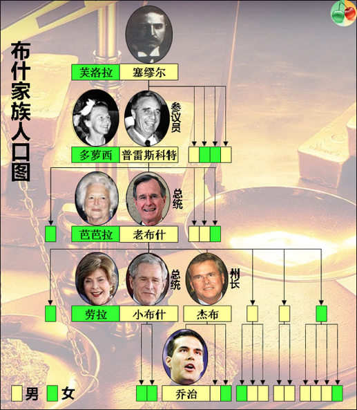

即使是女性政治家，从政的前提也是先做一个合格的母亲，共和党方面一贯比较保守，2008年副总统候选人莎拉•佩林，是5个孩子的母亲，她竞选公职的重要资本，就是怀孕后检查出婴儿有唐氏症，却拒绝堕胎，从而被选民认为“符合美国价值观念”。

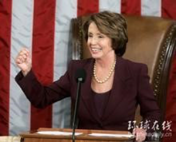

佩洛西和佩林。

民主党方面也有例子，比如现任众议院女议长佩洛西。她出生在政治世家，父亲是五届联邦参议员，哥哥是市长，年轻的时候就积极从事政治活动，可是结婚之后，佩洛西用6年时间内连生了5个孩子，然后就一直做全职主妇，直到最小的孩子上了中学，才开始竞选，最后成为美国首位女议长。她缺乏政治才能和野心吗？只是把孩子扔到家里出来选举，根本选不上而已（有人也许会想到希拉里，后面我也会分析一下）。

跟大家的印象相反，贵族家庭不反对女性接受教育，看看林黛玉和薛宝钗读过多少书就知道了，但她们上学的目的，不是去学习挣钱的技能，而是提高自身的文化修养，以便做下面三件事：第一，找到有同等修养的丈夫，把自己嫁出去；第二，婚后举办沙龙、出席舞会、帮丈夫打理社交圈子；第三也是最重要的，为家族培养下一代——琴棋书画这些提高美感和灵性的课程，必须在幼儿时代就打好基础，从妈妈的怀里就要开始，比如《哈利波特》中，罗恩的国际象棋就下得很好，而麻瓜家庭长大的哈利和赫敏都一般般。现实生活中，家境较好的同学往往才艺较好，经济条件是一个原因，更重要的是，很多家长本身就玩的不错，这方面甚至需要好几代人的积累。

莫莉并不是弱者，她身体强壮、性格热烈、亚瑟反而是个脾气比较和善的男人。但是，莫莉的言行一直恪守妻子的身份，他们家也一直强调男性和女性的差别。比如哈2，罗恩偷开亚瑟的老爷车接亚瑟，莫莉很不满，但教育子女的工作必须由爸爸进行。

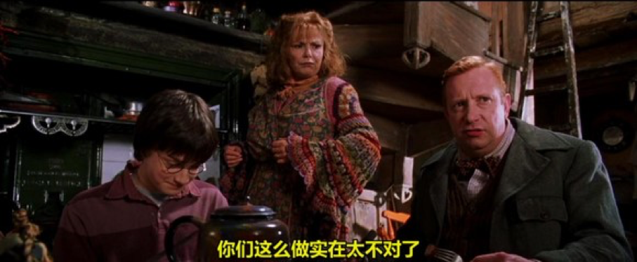

哈2。

莫莉不是不会训人，哈2中一封咆哮信就训的罗恩心惊肉跳，但是丈夫在场的时候，妻子要树立丈夫在家庭中的权威，自己还是恪守做饭的职责。她也把这些教给了女儿。电影里，金妮和哈利波特谈恋爱，靠什么手段抓住哈利的心？

哈6，圣诞节。

金妮烤的馅饼，看样子味道还不错，哈利直说“真好吃”。刚才分析过，女孩的缝纫、刺绣、厨艺这些手艺活，都是需要妈妈亲自教的，做饭方面，看来莫莉没少给金妮开小灶。其实味道还在其次，关键是通过这一做法，表达金妮对未来丈夫哈利的态度。从哈利的角度来看，从小失去父母，金妮能给他大家庭的温暖，还能帮他培养下一代小哈利，这才是哈利最需要的，远比擅长背书和冒险的赫敏合适。

#### 10\.2\. 中篇

##### 10\.2\.1\. 迪安的沉默

人分男女，男女有别，这是婚姻法的第一个问题。不过婚姻法很复杂，讲到这里仅仅是个开始。仍然有人表示反对，为什么女人一定要生孩子做饭？为什么女人要低男人一等？我就是喜欢独自自强的赫敏，因为我主张男女平等，男人应该为妻子做出牺牲，就像女人也为丈夫作出牺牲一样。

这种观点没什么奇怪的——在这个几十年没有上“女生课”的国家里，没有点反对的声音才不正常呢。我当然也不反对男女平等，只是想问各位一个问题：**是男性还是女性，对“男女平等”兴趣强烈呢？**

还是说点个人体验。作为一个中国法制史老师，每年秋天都要给同学们讲中国古代的婚姻法，一般是从周礼中的“婚姻六礼”讲起。大家知道，西周是中国的贵族时代，周礼是贵族们的意识形态，也是儒家思想的源头，说到当时的婚姻观念，不妨听听孔夫子的意见。孔子给三千弟子上课，第一节课讲什么呢？

**“大家一起去追女孩吧。”**

“关关雎鸠，在河之洲，窈窕淑女，君子好逑”。这是《诗经》的第一篇第一句，诗经又是儒家“五经”之首，也是孔门弟子的第一堂课。这和很多人对儒家的印象大相径庭，好像儒家都是些保守的老夫子，提到女生就会脸红。其实儒家的发展史很漫长，早期的儒家，还是很有活力的。全部儒家学说都是建筑在家庭伦理之上的，而家庭的起点就是两性关系，因此孔子将《关雎》置于诗经之首。不过孔子到底是什么意思呢？

我在霍格沃茨的“女生课”上，也听到过这句：

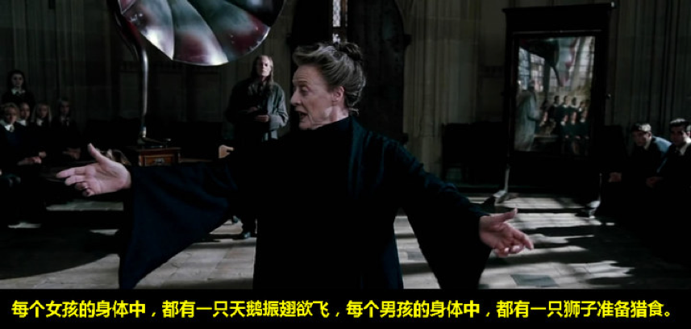

和我们大多数人受到的教育相反，贵族们的两性关系的教育，在婚姻与性方面是较为主动的，尤其是对“男追女”持积极态度，舞会课的核心任务就是追女生嘛。作为战场上的胜利者，贵族们一贯对征服感兴趣，征服要从身边做起，两性关系就是第一个战场。

说实话，这可绝不是一件什么开心的事儿，从此人类历史上最大规模的流血事件开始了。

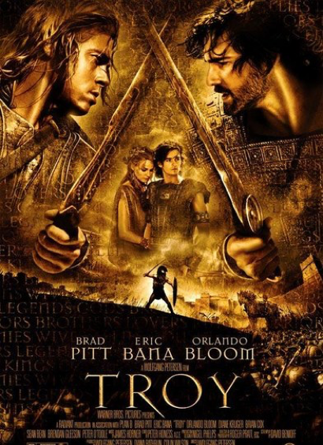

欧洲史始于希腊，希腊史始于荷马史诗，《伊利亚特》中的特洛伊战争，简单的说就是两群男人抢一个漂亮女人的故事。希腊人抢女人的积极性之高，围城居然坚持了10年之久，直到特洛伊城破之后，联军战士看到“世界上最美的女人海伦”，还忍不住高呼“为了这个女人，我们愿意再打十年”！

无独有偶，罗马建城之后的第一件大事，也是从附近的萨宾部落抢女人。这件事在西方历史上如此的著名，以至于题为“掠夺萨宾妇女”的艺术杰作都不止一件：

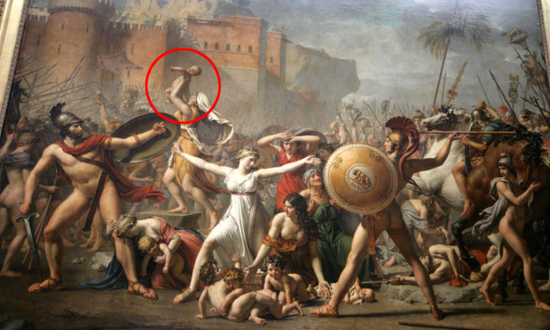

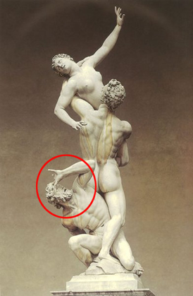

对于被抢这件事，女人们是什么态度呢？她们好像也不是很反感。女人是振翅欲飞的天鹅，一直在等着强壮的狮子的出现。希腊神话中好像没有“红颜薄命”这个概念，男人们打的死去活来，女人们在一旁乐见其成——海伦的丈夫换来换去，特洛伊全城毁灭之后，她却毫毛未损的和斯巴达国王重归于好了。油画中萨宾妇女虽然挡在罗马男人和萨宾男人之间，表面上不偏不倚，其实还是有偏向的，她们真正关心的，是孩子——她们和罗马男人的后代，被画家画到了全图的最高处。

因为无论如何较量，两种性别最终一定要结合，才能有后代。强壮的男人抢女人，漂亮的女人也一样抢男人，在婚姻这件事上，两种性别有合作的必然性。即使历史上曾经有些人对自己的性别特别骄傲，拒绝与另一个性别合作，他们也都因为没有后代而被淘汰了，这也是我不相信有“同性恋基因”的原因——同性恋没有后代，所谓的“同性恋基因”无法遗传。

真正意见很大的，是乔维尼•波隆纳的那尊雕塑中，在最下面的人——那些跑的不够快、跳的不够远、不够聪明、不够勇敢的男性。

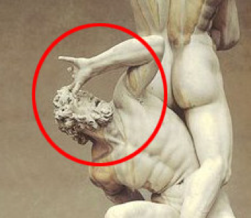

在婚姻中，异性必须合作，但同性（男与男/女与女）却相反，天然有某种相互排斥的属性，因为杀死其他同性，不会减少、反而会扩大自己基因的遗传规模。希腊战士和特洛伊战士，罗马男人和萨宾男人，才真正斗的死去活来呢。法学同学请注意：**婚姻法虽然是两性关系的规则，但婚姻法的基本矛盾，却不是性别矛盾，而是相同性别之间的矛盾——在主要意义上，是男性和男性的矛盾，次要意义上，是女性和女性的矛盾。**

我们先分析男性之间的问题。

为了方便叙述，下文借用《哈利波特》中的概念，把社会地位较高、掌握资源较多、竞争力较强的纯血男巫称为“强男”（为了节省文字下文不区分泥巴种和麻瓜），其它依次称为“弱男”、“强女”、“弱女”。**注意“强弱”不是指性格，而是社会地位，比如性格坚强的赫敏应该归入“弱女”，而好脾气的罗恩应该归入“强男”。**这四个词都是我为了写帖子方便杜撰的，不是婚姻法的术语，也没有什么特别的褒贬意义，只是个符号，大家当作解析几何中的XYZ用就可以了。我们把性别做横轴，身份做纵轴，得到一个平面直角坐标系，四个概念分别对应四个象限：

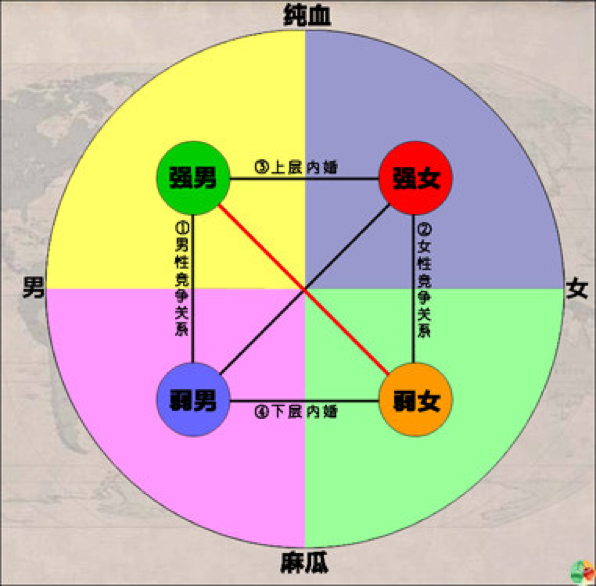

声明一下，本文用《哈利波特》介绍婚姻法，主要是剧中人物身份分明，而且有代际的延续，婚姻法规律表现的比较明显，和孟德尔实验需要两代豌豆证明是一个道理。但是，不讲身份的社会比如延安革命根据地，只要男性之间有差别，婚姻法基本规律同样也存在，和每一代豌豆都遵循遗传学定律也是一个道理。下文并不代表作者推崇或者抨击贵族制度，激烈赞成或反对贵族制度的朋友，请互相喷口水，喷死勿论。

在这个坐标系里，四个概念一共包含6组关系：①②同性之间争夺对婚配权的矛盾，是婚姻法的主要矛盾。③④是同等社会阶层结婚，婚姻法称之为“内婚制”，俗称的“门当户对”。内婚制的道理很好理解：如果每个人都自主选择的话，十分男当然选择十分女，十分女当然也选择十分男，九分男（女）虽然有高攀之心，却难以实现，只好依次类推，直到最后的一分男（女）为止。只要有同性内部的差别，有社会分层，就会有内婚制。

内婚制是建立在财产制基础上的，因此不特别强调爱情，夫妻关系主要靠亲情和子女维持，但这种家庭有共同的经济基础和教育背景，一般比较稳定，比如罗恩的父母亚瑟和莫莉、马尔福的父母卢修斯和纳西莎、赫敏的父母格兰杰夫妇，都比较和谐，连臭味相投的弗农和佩妮也是如此。因此，门当户对婚姻的家庭数量虽多，但却不是婚姻法调整的重点。

因为内婚并不是绝对的，总有人跨越血统和身份组成家庭，婚姻法称之为“外婚制”，也就是图中正方形的两条对角线。“外婚制”家庭的绝对数量并不是很多，但却是婚姻法规则最复杂的地方。

大家知道，哈利波特中“纯血”和“麻瓜”界限分明，三人组中，罗恩是纯血男巫，赫敏是麻瓜女巫，半血的哈利再上溯一代，父亲詹姆波特又是纯血男巫，母亲莉莉又是麻瓜女巫。把他们按照身份标在图中，实际上都在一条斜线上：

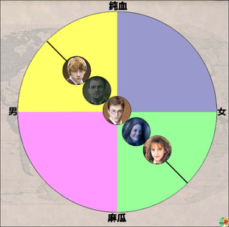

**这条斜线简称“强男弱女联盟”，是外婚制的优势组合。**大家很容易看到，文艺作品中的弱女——尤其是其中的上层优秀分子——总是特别偏好嫁给强势男性。比如麻瓜女巫赫敏准备嫁给谁呢？

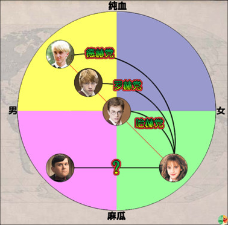

关于赫敏的婚事，网上共有三个党：哈赫、德赫和罗赫，其实这三个党都是强男党，大家只是争论哈利的勇敢、马尔福的高贵还是罗恩的温柔而已，但一定要选择纯血（至少是半血）而非麻瓜，还是在“强男弱女联盟”的斜线上做文章，有没有希望赫敏按照“门当户对”原则的嫁给达利的？

相反，弱男的地位相当糟糕，即使是其中的优秀分子，能像赫敏一样迈入统治阶级的门槛，来到霍格沃茨学习，下一步也面临婚姻的难题。大家能找出霍格沃茨学生中麻瓜家庭出身的男巫师吗？

我发动热心网友帮忙找了半天，除了哈2密室因为剧情需要的几个没有台词的龙套之外，只找到一个有剧情的麻瓜男巫：哈利的室友：迪安•托马斯。

和从哈1到哈7抢尽镜头的麻瓜女巫赫敏对比，迪安在全剧中的戏份非常少，唯一有剧情的哈6，导演也没给他安排台词，只有一张在阴暗角落里露出半张脸的剧照：

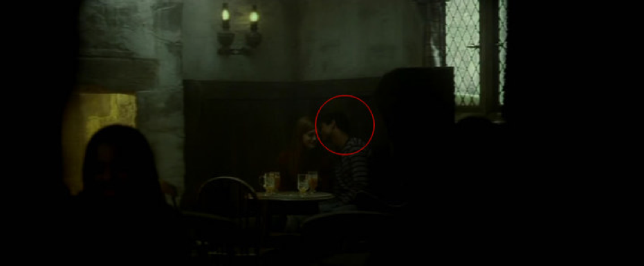

按照原著，迪安其实是父亲纯血母亲麻瓜的混血巫师，不过这个秘密到哈7才暴露，哈6中大家还都以为他是麻瓜。在剧本里，迪安的故事与哈金恋有关，三人关系也是一条斜线，只是倾斜方向相反：

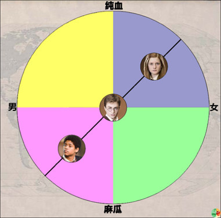

**这条斜线简称“弱男强女联盟”，是外婚制的劣势组合。**弱男当然也想娶强女，但常难如愿。哈6中，迪安和金妮的恋爱完全是哈金恋的副产品——金妮的“女生课”学的很好，恋爱方面是个高手，她想追哈利，特地和迪安谈了一场恋爱，以刺激哈利——迪安是哈利同宿舍的熟人，又是麻瓜血统，和他谈恋爱很能激起哈利的男性征服欲。其实哈4的舞会上，金妮的舞伴是纳威，不过要刺激哈利，他就不合适了，纳威是纯血，比哈利的血统要强，会让哈利产生自卑感。

哈利的反应也不慢，参加斯拉格霍恩圣诞酒会的一场戏，就邀请了铂金色头发的卢娜回敬红头发的金妮——本来是想邀请麻瓜赫敏的，和金妮的招数一模一样。顺便插一句，赫敏就差得多了，她也在酒会上试了试这一招，邀请考麦克•麦克拉根刺激罗恩，结果败的一塌糊涂。因为麦克拉根不仅是纯血，而且是高官的侄子，相对于罗恩是强男，赫敏的做法只能让罗恩怀疑她有二心，结果就是两个人越走越远。

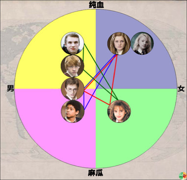

（三组三角关系，哈金迪、哈金赫、赫罗麦）

对迪安来说，在鼻涕虫俱乐部的晚餐会上，金妮的激将法有了效果：

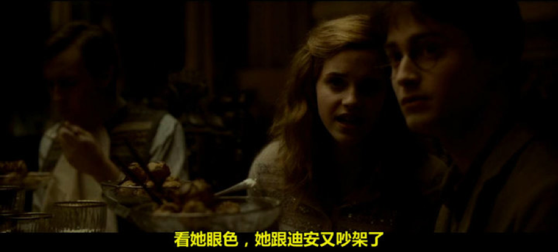

哈利挺身而出，对金妮有所表示：

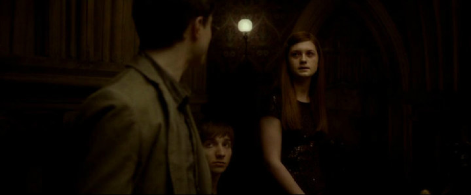

此后哈金恋一路发展，迪安就被金妮丢到脑后了，他的故事到此为止，哈6中也再也没有迪安的剧情了。用网络上的流行概念，迪安纯粹就是一个备胎。这种强女弱男的恋爱，即使能够开始，大多数也是以这种方式结束。

在现实世界里，强男和弱男的竞争也很常见。比如中国计划经济“城乡二元制”的时代，城市/农村构成一组强弱关系，当时有一条法律：子女的户籍随母亲。原因是，子女随父是鼓励强男抢弱女的法律，子女随母是帮助弱男对抗强男的法律。二元制下，农民为工业化建设做出了巨大的牺牲，在家庭问题上必须有所平衡，否则将产生社会问题。这条法律随着城乡经济平衡而被废止，反而是最近这些年因为征地，城郊农村户口很抢手，结果这些地方的村规中，就出现了女村民嫁出迁户，男村民娶入不迁户的规定。又比如说，在涉外婚姻中，欧美/中国构成一组强弱关系，外嫁欧美男性的中国女性就远多于内娶欧美女性的中国男性，穷国则相反，出现了“越南新娘”、“缅甸新娘”。动态的看，各国/地区经济排名和内娶外嫁有明显的关系，大陆经济实力上升，港台的“大陆新娘”就减少，相反大S就嫁过来了（因此也不太看好郭晶晶的婚姻前景）。

前面分析过，在财产意义上，婚姻意味着男性对女性财产的单向流动，以支撑女性生育活动的消耗。女性的生育能力的差别不大，但是男性的财产可以有巨大的差别。强烈的落差意味着巨大的动力。因此，强女很少嫁给弱男，而弱女总是喜欢以各种理由嫁给强男，说到底，是男性之间的竞争所致。

**赫敏想嫁给哈利或罗恩，而金妮不想嫁给迪安，这可是个大问题！**

全社会男女性别总数是相等的，强女对弱男无动于衷，如果强男再对弱女主动出击，结果会怎样？

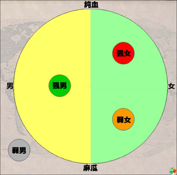

很糟糕，弱男出局后，一夫一妻制就被突破了。在最极端的状态下，比如特洛伊战争这种情况，强男部落和弱男部落对决，失败者的男性全部被消灭，两个部落的女性只有胜利者的男性可嫁，这就是人类早期的婚姻法，总是有某种“多妻制”的原因。不论中国古代婚姻法的“妾媵制”、希伯来人的“妾制”、伊斯兰婚姻法的“一夫四妻制”，以及希腊罗马时代的“女奴制”，差不多都是这个道理——战争过后，男人死掉一部分，性别比例失衡了。

好在“极端的多妻制”并不稳定，一代人之后，性别比会恢复正常，同父异母的后代中，又会分为相对较强的一方和相对较弱的一方，进行新一轮的男性内斗，强男偏好的多妻制和弱男偏好的一夫一妻制会交替出现，并波及继承法甚至政治制度，最后的平衡点，往往是“轻度的多妻制”。

中国早期历史中，上古五帝的“禅让制”是偏向弱男的，夏的“家天下”是偏向强男的，商的“兄终弟及”是偏向弱男的，周的“父死子继”又是偏向强男的，春秋之后，婚姻法就稳定下来，定格在“一夫一妻多妾制”，简单的说，就是上层男性适度出轨。顺便说一句，上层“轻度多妻制”，必然带来下层的“轻度多夫制”，就是古代一直合法的娼妓，也是当代中国反复争论不休的“卖淫合法化”问题，这个问题更加重口味，离哈利波特也比较远，不展开。

欧美国家漫长的婚姻法发展史也类似，略过大家都不熟悉的古代，直接跳到近代：“轻度的多妻制”表现为欧美国家上层社会的“情人文化”。作为儿童剧，哈利波特关于“情人”的情节不多，英美文化对待情人的立场，随便找个大人剧，看看里面有多少玫瑰色的情人角色就知道了。其实哈利波特的最后一部也有这方面的苗头，就是罗恩嫉妒、出走和那段炒得很热的赫敏半裸戏：

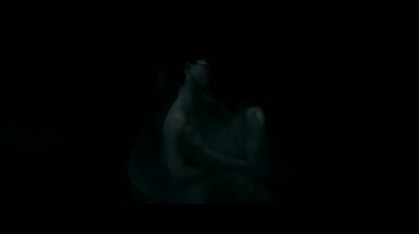

这是哈7上的核心剧情之一。罗琳如果续书三人组的成年故事，恐怕也是从这方面入手可能性比较大。

从一男多女的角度来说，“情人”也是一种婚姻制度。如果你觉得中国古代的纳妾是一种陋习，伊斯兰国家的四妻制是野蛮落后，西方国家的“情人”意味着浪漫，那你肯定是中了西方人的摄魂术。非要说哪个对女性更好一点，在中古时期，凡是发生性关系必须要负责养老的“妾媵制”，反而比“情人制”更接近人道主义。这话不是我说的，是法国人伏尔泰说的。

关键是，男性出轨的概率，个人而言是个道德问题，从社会的角度观察，是由“适婚男女比例”决定的——在男性有明显差距的社会，“可嫁男”会比“可婚女”人数少。在社会的最上层，一名男性“和多名女性发生或保持关系”，绝不是什么偶然的特例。找个比较知名的八卦一下：

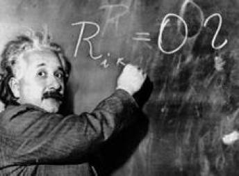

爱因斯坦的科学成就和社会声望不用赘述，但在私生活方面，爱因斯坦有据可查的情人至少有10个以上，为此和原配、女物理学家米列娃离了婚，换了一个只管衣食住行、对婚外恋睁一只眼闭一只眼的全职主妇做妻子。爱因斯坦谈不上“有权有势”，也没有资料表明他“道德败坏”，无非是拥有较多的社会资源而已。关键是，他的情人都是自愿的——爱因斯坦成名很早（26岁），此后的二三十年里，追求他的女性只怕数以千计，拒绝99%，剩下1%也还有10个。大家千万不要低估英美国家女生追男生的积极性，爱因斯坦收到的迷情剂巧克力可不只一盒。

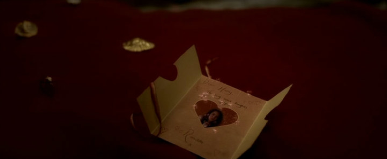

前几天发了一条状态测试大家的心理承受能力：**给定条件下，强奸妇女的行为，该妇女应该承担法律责任。**这是英美刑法中一种比较极端的观点（不主流，但偶尔有判例），其理由是，被强奸的妇女都是“不正经的女人”，是她们对男性的勾引才导致强奸行为的发生。这种法律在中国社会是匪夷所思的，但在英美这种性别界限分明的地方，并非毫无道理，主要就是有些女追男做的太过分。举个例子，如果罗恩吃了含有迷情剂的巧克力，在和罗米达•万妮约会时强行与其发生关系，其行为符合强奸罪的定义（违反妇女意志发生性关系，罗米达要的是哈利），但很难说罗恩有责任。如果邓布利多校长为了制止类似事件的发生，非要惩罚一个人，更应该开除的是罗米达而非罗恩。这种奇怪的法律现象之所以发生，就是在局部领域，男女性别比失衡达到严重程度造成的。

我当然不是在这里鼓吹“多妻制”或者“出轨有理”，但是非常不幸的是，英国的上层社会，对男性出轨的看法和我不一样，他们不觉得男性出轨是什么大事，反倒是发愁怎么打发太多的主动送上门来的情人。这些人的观点就是英美主流价值观念——《哈利波特》其实是典型的强男视角：“强男弱女联盟”的哈利、罗恩和赫敏被强化，“强女弱男联盟”的金妮和迪安被弱化。

看了前面的留言，我发现经过长期“男女平等”的教育，大部分读者对什么是“男女不平等”也严重缺乏理解，有个别朋友提到“万一丈夫出轨”对全职太太的伤害，也只当作一种潜在的可能性，大部分人还在讨论看孩子做饭的问题。其实男耕女织只是分工不同，女人打理家务确实辛苦，男人外出工作也不是度假。男女不平等的真正问题在于，在某些情况下，一夫一妻制并不总是确定的，金妮要遭遇出轨，顺带的，迪安要忍受独身。

金妮的问题一会儿再说，我们还是先看看沉默的迪安。从迪安的角度分析，他该怎么做才能捍卫一夫一妻制？

最根本的办法，还是尽量拉低社会财产分化的程度。凡是男性财产差距较小的社会，一夫一妻制就遵循的较好。建国前三十年，中国消灭了娼妓、消灭了婚外情，甚至基本消灭了离婚，就是因为男性通过婚姻转移的财产都差不多，女性更换的余地不大。反之，改革开放之后，越是财富拉开差距的地方，男性出轨现象越频繁，“包二奶”这个词就是从广东先叫起来的。这就是空想社会主义者傅立叶的名言“妇女解放是社会解放的天然尺度”的原因——“**男女平等”的尺度，和“男男平等”是高度相关的。**文化大革命是中国男性财产差距最小的时期，也是男女之间差距最小的时期，女性的服装都男性化了。

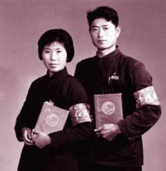

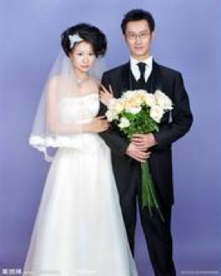

文革结婚照和现代婚纱照，前者抹掉性别差异，后者强化性别差异。

不过，财富分配自有其规律，过于平均的社会也并不一定很理想。如果不能改变这一前提，只好靠巫师们上场，出现了各种婚姻意识形态——在精神领域，所有人总是平等的。**上文留了一个问题，谁更喜欢男女平等？答案是：弱势男性和强势女性。**

不过，强男弱女联盟也有巫师，从人类进入文明史以来，两个联盟的大巫师们在婚姻家庭领域互施恶咒，实在是一个蔚为壮观的文化现象，这也是研究婚姻法最艰难的地方，你必须穿透这些千奇百怪的魔法幻象。所过之处，步步惊心。（因此我一直在怀疑，自己用真名在毫无防护的网络世界里写这些东西，是不是在自掘坟墓？）

如前所述，在婚姻领域，强男和弱男是对手，争夺的重点是弱女中的优秀分子，俗称“七分女”。“七分女”在身体上偏向和强男，但精神领域则未必，没有人喜欢和别人分享丈夫，这就是弱男派魔法师的机会。因此，英美文学中有一种“弱女励志”型故事，主题就是“女性自强、男女平等”，鼓励弱女脱离强男阵营——多一个弱女变成强女，“强男弱女联盟”就少一分力量。典型的作品，比如《简爱》：

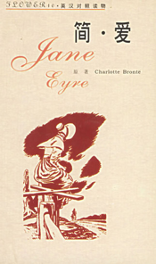

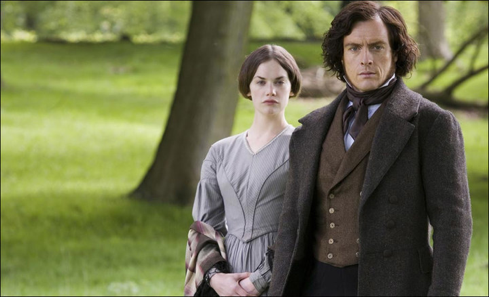

那个面色苍白、性格坚强的职业女性大声喊出“我贫穷，卑微，不美丽，但当我的灵魂穿过坟墓，和你一起站在上帝面前的时候，我们是平等的”，实在是说出了弱男们的心里话，这也是建国后差不多所有英美文学都被封杀，《简爱》却毫无障碍的在中国大陆地区出版和发行的原因。《简爱》的结局里，简在破败的庄园里和罗切斯特结了婚，庄园必须破败，不破败就不能自圆其说了。

如果各位中国读者没有能力读简爱，我也可以举一些大家身边的例子（不过要请各位轻喷），就是“野蛮女友”，这种类型的剧情在东亚各地都很流行。抱歉我对电视剧很不熟悉，评论就不写了，勉强做几张截图。

《流星花园》中的杉菜、《武林外传》中的郭芙蓉，《我的野蛮女友》中的全智贤，共同特点是爱打男生。男生为什么喜欢爱打自己的女生呢？因为这种女生的存在意味着平等。大家看这几个人的脸型和发式，是不是和赫敏很类似？

“弱女励志记”还只是弱男派巫师的小法术，打铁还须自身硬，更好的办法是提升自身素质，鼓励弱男变强男。因此，文学作品中还有一种“弱男励志记”，也就是“穷小子娶公主”的故事。这种故事的男主角是弱男，女主角是强女，故事的主要内容，是穷小子如何通过个人奋斗获得了财富、权势和公主们的爱情。这个类型的故事倾向于将爱情放在婚姻的首位，从而弱化财产和身体。在欧洲文学中，最典型的作品就是卢梭的《忏悔录》：

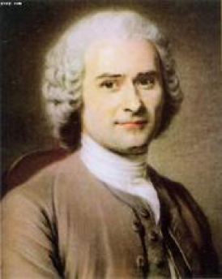

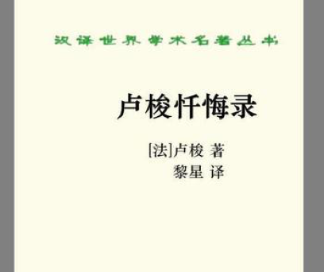

卢梭确实是个才华横溢的思想家，不过他的作品风格和学院派不一样，各位读卢梭，一定不要把他想象的太学术，有些人的作品宜仰视，读卢梭最好采用平视甚至俯视的视角，也就是说不宜字斟句酌，尤其是《论人类不平等的起源》和《社会契约论》，认真你就上当了。卢梭的精华也不在这些政治法律著作，而是文学方面，特别是《忏悔录》，才是卢梭大法师最强大的魔咒。

《忏悔录》的内容很复杂，最核心情节是卢梭和华伦夫人的恋爱，全书用了一章（第六章）的篇幅，细致入微的描绘卢梭和华伦夫人在郊外隐居、读书、听音乐、恋爱的日子，文字极为优美动人，是无神论时代的伊甸园。这段文字最大的魔力，在于让读者相信，通过爱情，日内瓦钟表匠之子也能征服了国王的情妇，从而产生一种上升感。具体的途径，则是教育篇反复讨论的“知识改变命运”。

如果各位中国读者没有能力读卢梭，我也可以举一个大家身边的例子（不过要请各位轻喷），就是金庸小说。金庸小说是典型的“弱男视角”，男主角清一色的孤儿，从陈家洛到胡斐、狄云、石中玉、郭靖、杨过、张无忌、萧峰、虚竹、令狐冲和韦小宝，无一例外，女主角则基本上是公主或者准公主，从香香公主到华筝公主、阿朱（大理公主），赵敏（蒙古公主）、小昭（波斯明教公主）、任盈盈（魔教公主）到建宁公主，都有一个有权有势有钱有武功的父亲。

金庸小说中人物没有不可逾越的血统身份界限，出身越高的越是反面人物，勤学苦练的才有大成就。虽然写了14部作品，核心情节都差不多，基本上是孤儿落难、巧遇秘籍、苦练武功、娶得公主、归隐山林的套路，和卢梭故事是类似的，只是把“音乐和文学”换成“武功秘籍”而已。唯一的例外是《天龙八部》中的段誉，段誉明显是仿照贾宝玉设定的，但这个人物很失败，他和王语嫣的爱情空洞，只靠王语嫣的容貌维系，没有让读者感到心动的真感情。原因就在于，按照金庸小说的模式，落难、秘籍、武功、归隐都是为弱男设计的，套在大理王子段誉身上，实在不知道该爱比他还弱的王语嫣什么好（据说新版天龙有所改动，我说的是旧版）。

不过“爱情”这个咒语，巫师们都会念，只是念法不同而已。对应弱男的“穷小子娶公主”，强男派魔法师也发明了一种文学模式：“灰姑娘嫁王子”：

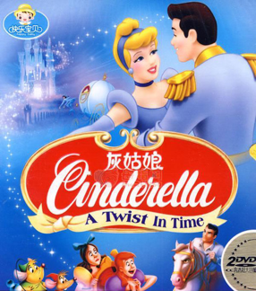

这种故事里，男主角是强男，女主角是弱女，主要内容是灰姑娘们如何经过各种努力嫁入豪门，哈利波特总体上就属于这种故事，《简爱》则可以视为两种故事的混合，这也是英美左派文学的极限。罗琳可以在细节上可以搞搞“爱与平等”，或者打打希特勒这只死老虎，但是在大问题上，一定要遵守英美国家的主流价值观念。

弱男们怎么办呢？他们准备使用终极魔咒。

**弱男最大的武器是破坏。**如果不能在创造财富上有所成就，拉平财产差距的最佳途径就是毁灭财富。这方面法俄文学是代表，各种五花八门的暴力美学就不分析了，还是举个大家身边的例子（这次不请各位轻喷了，没什么用）：近些年来网络普及，互联网用户的平均文化程度在下降，公共论坛上也就开始流行一个新的故事模式：“高帅富和某丝”。

抱歉这里使用代称，因为不愿意见到满屏幕飞舞的脏字。不过我们可以分析一下其中的原因——在婚姻法上，强男偏向适度出轨，对应到文学上，就是适度色情。弱男则相反：或者极度禁欲，或者极度纵欲。极度禁欲是因为面对强男的巨大压力，希望能在婚姻领域取消竞争，改成平均分配，对应到文学领域中，就是取消性别差异、女生最好“不爱红妆爱武装”的文字，也是很多人对《关雎》理解出现偏差的原因。

极度纵欲则是因为太多无法最终达成婚姻的性，总要有一个宣泄的出口。比如上个世纪九十年代到现在，日本经济停滞了20年，一代青年男性找不到合适的工作，结果就产生了“宅男腐女”系列的概念，外加不正常繁荣的AV产业。“某丝”文学也属于这一类：极度爱说脏话，核心概念都和性有关。这种帖子网上很多，有个《在黑木耳的世界，穷丑矮再怎么努力，也比不上高富帅什么都不做》，勉强可以做代表，核心观点也就是这个标题。这类文字看多了，大家就能理解麦格教授在女生课上台词中的红色部分了。

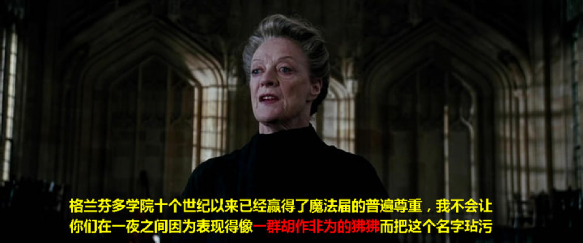

必须说明一点，只有巫师才会使用魔法，迪安再沉默，也是霍格沃茨的学生。能发明“某丝”系列概念的，绝不是什么社会底层，大部分属于“七分男”甚至更高。根据2010年人口统计数据，中国有大学文凭的人只有8%，包括大专、自考、电大和夜大，自称自己只能窝在宿舍打dota的“某丝”，教育程度也在全国92%的人之上，财产状况也不会差太远。“某丝”并不是一种身份，而是一种心态，文字中展示语言暴力，意在重新分配财富。

不要小看了“某丝”故事中这些乱七八糟的文字，“高帅富”本身就是一道极富煽动性的咒语，里面有一股尸体的味道，关键词是绝望，因为绝望而产生破坏力，就可以抵消强男的财富优势。其实这种魔咒卢梭也用过，他在《忏悔录》中就声称，自己养不活和女仆生的5个孩子，都送到了孤儿院，和“某丝”文学喜欢用“喜当爹”结尾差不多。这件事在伦理学中争论很大，主要是因为卢梭被供上了“思想家”的香案之后，读者的视角有变化，但是在当年卢梭的读者心中，震撼作用绝对不亚于耶稣上十字架。卢梭是罗伯斯庇尔的精神导师，熟悉历史的人都知道，在随后的法国大革命中，巴黎的“某丝”们是如何修理法国的高帅富的。

在这些魔咒的强大法力下，强男一般都会选择后退一步，将“一夫一妻”列为婚姻法的基本原则，最多以情人作为补充而已。不过这对女性也未必是好事——分析完男性，下面我们**从女性的角度看看，彻底的“一夫一妻制”到底意味着什么？**

#### 10\.3\. 下篇

##### 10\.3\.1\. 纳西莎的忍耐

如前所述，如果有社会分层，上层男性总是对女性有优势，和采取什么婚姻规则无关。如果规则允许男性拥有多个妻子，倒是比较容易做到“平等的对待每个妻子”，因为财产被摊薄了之后，强男和弱男就差不多了，男女反而也就平等了。伊斯兰国家的“一夫四妻制”运行了上千年，社会也没有崩溃，就是这个原因。

相反，坚持一夫一妻制，也就是规则只允许强男选择一个妻子，会出现很多复杂的后果。首先，社会分层固定化了。前几天发起一个投票，哪个文化圈坚持一夫一妻制较好，选项设置的不太严格，只是个参考而已，但我其实是有答案的：印度。

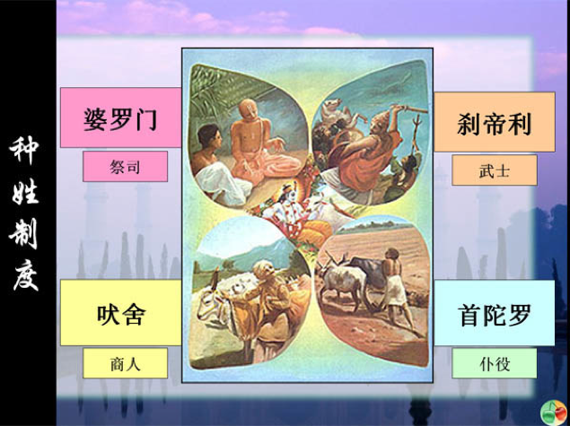

大家知道，印度有世界上最顽强的“种姓制度”，各种职业界限森严，低种姓绝无通过努力改变社会地位的机会，这当然让很多人愤愤不平，但在婚姻方面，完全内婚的种姓制度中，“可嫁男”和“可娶女”却是大体相等的。或者说，**如果财产差别无法避免，只有彻底的“内婚制”才能实现彻底的“一夫一妻制”**——凡是有外婚制的婚姻法，都无法避免“弱女嫁强男”的现象，也就无法避免上层的一夫多妻和下层的一妻多夫，这就是印度的低种姓男子也支持种姓制度的原因——至少能找到一个同阶层的妻子。

类似的，中国建国前30年里，一夫一妻制贯彻较好，但这30年也是中国历史上身份制度最发达的一段时间。所有人都划分了“阶级成分”，社会生活的各方面基本由“家庭出身”决定，城乡二元制的隔绝也非常牢固，全社会的流动性极差，这才是每个局部领域都能感觉到“人人差别不大”的制度性保证。

进而言之，长期坚持种姓制度的印度婚姻习惯中，又产生了一种非常特别的现象：“嫁妆制”，也就是印度女性出嫁，女方家长要给男方提供一笔巨额财产，否则就嫁不出去。在弱男派大巫师的各种法术下，“嫁妆”也成了男女不平等的又一个血淋淋的证据，比如每年烧死多少新娘之类，铺天盖地，大家自己百度。

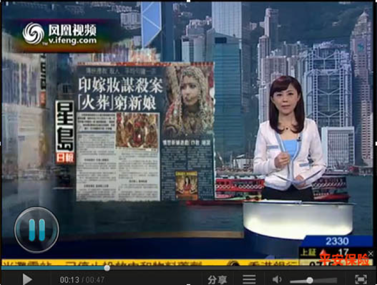

世界各国包括中国，都是男方向女方提供“彩礼”，理由如前所述，属于男性向女性财产转移的一部分，“嫁妆”多是新娘的随身物品，价值一定少于“彩礼”。但印度为什么是个例外？法学的关键是判断力，不知道各位读者是否思考过这种不合常理的事件为何总是发生——印度生了女孩的人家，难道爹娘都是缺心眼儿吗？

下层社会中，也总有些特别优秀的分子，需要一个向上的出口，否则会危及制度本身。比如在城乡二元制下的中国，“考大学”就是农民改变身份的独木桥。其结果，就是农村的有志青年疯狂的准备高考，出现了很多非常夸张的高龄复读考生和寄宿制、军事化管理的高中，连带着城市考生也承受了巨大的考试压力，直到99年高校大扩招才有所改变，虽然扩招之后，大学文凭变得不值钱了。

如果把结婚当作女性的竞争领域，多妻制相当于大锅饭，或者扩招后的大学，混进去容易，但文凭含金量不大。相反，一夫一妻制就相当于竞争上岗，或者扩招之前的大学，文凭含金量高，但不容易考上，绝对的一夫一妻则是“胜者通吃”的高强度竞争，第二名以下完全失去意义，其结果，就是引发了女性之间的激烈竞争。

在印度，偶尔也有高种姓男孩找不到适龄配偶、娶低种姓女孩的情况，印度人称之为“顺婚”，这是严格的种姓制中，低种姓改变身份的唯一途径。结果就是，人数很少的祭司（婆罗门）和武士（刹帝利）种姓家的男孩，被人数较多的商人（吠舍）种姓家的女孩挤破了门，商人种姓唯有倒贴大量的金钱，才能争取到这种改换门庭的机会，这和扩招前农村考生疯狂高考是一个道理；压力传导至上层，连带着高种姓的内婚也要带陪嫁了，这和城市学生跟着一起承受高考压力也是一个道理。

事实上，被烧死的嫁妆新娘大部分是高攀门第心切，婚前用高额金钱作出许诺，婚后又因为各种原因不能兑现，走投无路才被烧死的，约等于自杀，因此政府也没有办法彻底追究，否则女方的家人也不会安静。印度也是个古老文明，杀人总要偿命吧（法学的同学也可以领教一下，婚姻法中的各种幻觉肥皂泡有多么具有迷惑力，只要你心有所欲，摄魂术就能让人丧失最基本的常识和判断）。

因此，**坚持一夫一妻原则的进一步结果，就是女性之间的竞争加剧了，背负了沉重的“嫁妆”。**

回到哈利波特。

在英国，资产阶级新贵族是强男，没有形成嫁妆的习俗，但是英国女性嫁的也并不轻松。当上层的“可婚男”数量少于“可嫁女”的时候，如果规则只许选择一个，贵族男性就会变得挑剔起来，对女性提出更多的服从方面的要求，而把动辄对丈夫指手画脚的女性拒之门外。尤其是对于门第较高的女性来说，就是要在两性关系上向弱女看齐，把“男女平等”的标准降低到“男尊女卑”的水平，否则，强男就会选择弱女。

哈利波特中这方面的典型例子，是马尔福的妈妈：纳西莎。

纳西莎•布莱克•马尔福（Narcissa Black Malfoy），纯血女巫，娘家是古老的布莱克家族，是小天狼星布莱克的堂姐，嫁给了同样古老的马尔福家族的卢修斯，也就是马尔福的爸爸。这是一桩门当户对的婚姻，也看不出两个人有什么高尚的爱情，剧中的卢修斯不是什么好人，他卑鄙阴险、仗势欺人，干的坏事多的在老警察假穆迪教授那里都挂了号：

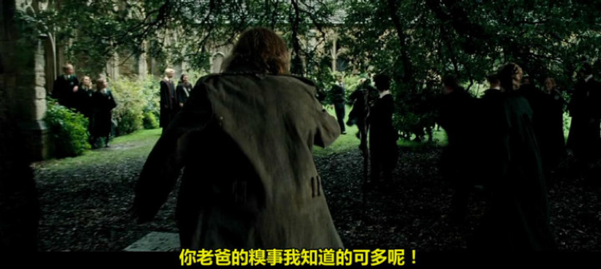

连带着儿子德拉科•马尔福也骄纵放荡，一身公子哥儿的毛病。可是，剧中的纳西莎一直乖乖的跟在丈夫和儿子的后面，直到加入食死徒的队伍，作为反方的一员参加了霍格沃茨的大决战。用一句俗话表示，就是“嫁鸡随鸡，嫁狗随狗”。

纳西莎是个全职主妇，对权力斗争并不感兴趣，身上也没有黑魔标记，大决战中还搭救过哈利波特，性格还算善良（至少不算特别邪恶），和混蛋丈夫卢修斯并不是一路人。如果要放在我们熟悉的革命文学里，早就安排纳西莎起来打碎封建枷锁、追求妇女解放了；在现代中国文学中，也是坚持男女平等，追求个人幸福，最不济也是离婚独自抚养马尔福。但是在英国的主流文学里，罗琳却让纳西莎选择了忍耐——为了丈夫的家族忠诚和奉献。

哈5卢修斯暴露身份而入狱，纳西莎挺身而出，独力支撑起马尔福家的门户，这是纳西莎的出场亮相。哈6的开始，就是哈利波特从报纸上看到卢修斯入狱的消息旁边，纳西莎保护儿子德拉科而放弃上诉的报道：

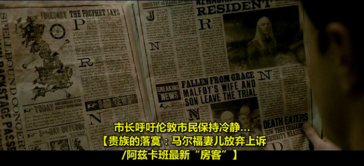

紧接着是纳西莎最重的一场戏，和贝拉一起找到斯内普，逼他发下“牢不可破的誓言”：

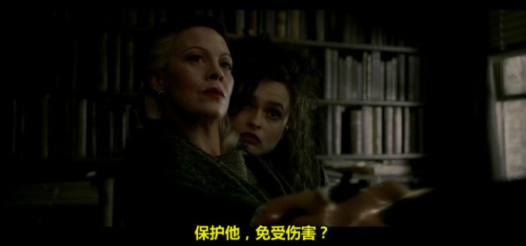

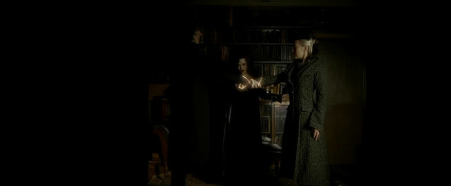

为了马尔福家族的唯一继承人德拉科的安全，她不惜低下自己高傲的头颅，低三下四的向斯内普请求庇护。如果说这个桥段中，贝拉表现的像一条狡猾的蛇，纳西莎就像一只保护小鸡的老母鸡，导演把纳西莎处理的完全不像坏人，而是个坚毅大爱的母亲形象。

纳西莎的忍耐终于有了回报，最后的大决战中，德拉科•马尔福虽然站在食死徒一方阵营，却最终和阿兹卡班无缘。“十九年后”，九又四分之三站台上，也出现了小小马尔福的身影。纳西莎也该当上了奶奶了：

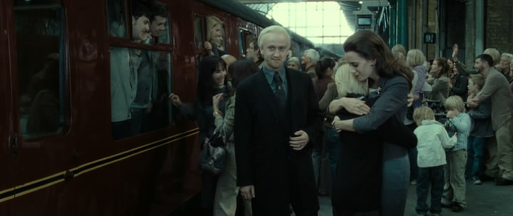

贵族家系长远，时间久了难免出败家子，必须靠纳西莎这样具有自我牺牲精神的女性，才能帮助家族度过危机。也**只有这样性格的女性，才是纯血巫师家族欣赏和接受的婚姻对象。**很多试图嫁入豪门的女性的婚恋，比如章子怡和vivi，梁洛施和李泽楷，最后以分手告终，问题十之八九出在这个方面。很多和外国男生谈恋爱的中国女生，没有成功的走进婚姻的殿堂，原因也是如此。

同样的原理，也适用于哈利的妻子金妮。

很多人觉得金妮和哈利最后定情的剧情比较突兀，没有铺垫，还是用中国观众的视角看问题。哈2整整一集都在给金妮做铺垫。金妮出场第一个镜头，就是对哈利的崇拜：

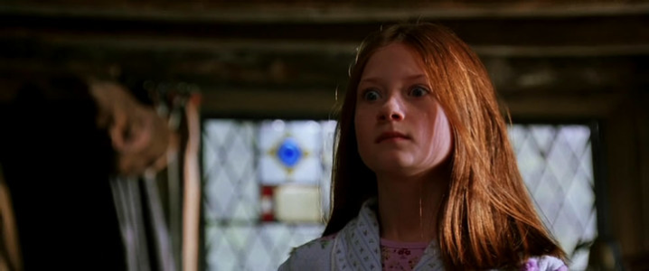

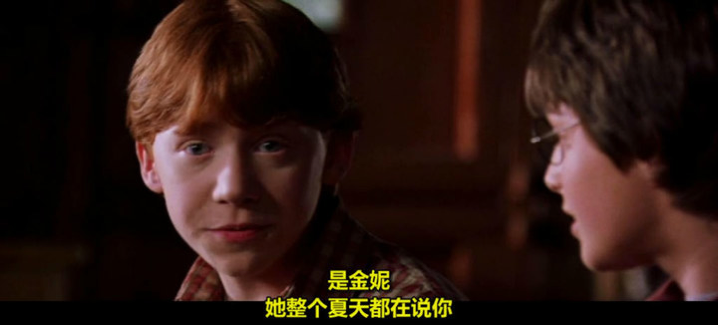

哈2的结尾，金妮醒来的第一件事，还是关心哈利：

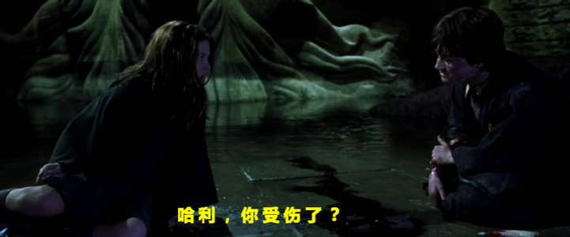

金妮对哈利的崇拜，几乎是整个哈2的主题，只是中国观众并不觉得这种女性对男性的崇拜，和哈利的婚事有什么关系而已。相反，在英国上层社会看来，金妮这种女孩比四处冒险的赫敏更值得娶回家。

按照强女沉默的原则，后面没有安排金妮太多的剧情，但是到了哈6金妮和哈利定情的关键时刻，罗琳却安排了一个呼应情节，不知道大家是否注意过：

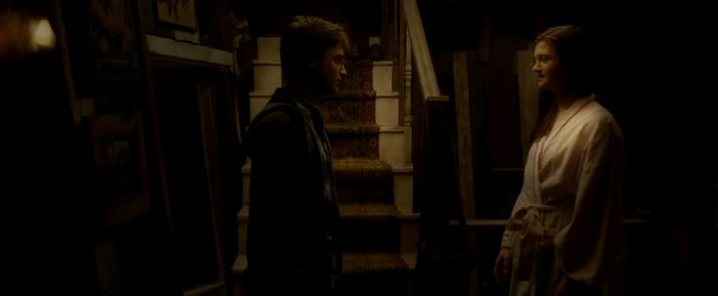

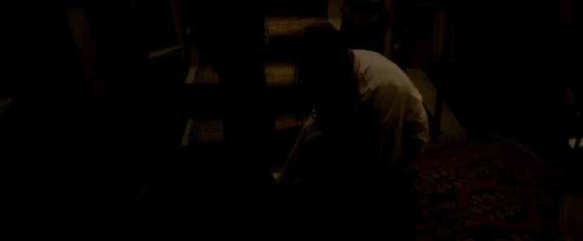

电影截图效果有点不好，剧情中，是金妮蹲下身去，给哈利系鞋带。这在旧式小说中不算什么新花样，但是在建国后的文学中已经基本绝迹了，意思很明显，金妮在向未来的丈夫哈利表示服从。顺便说一句，系鞋带其实是“女生课”的一项实用技能，追男生的女孩适当的使用这项技巧，会有特殊的效果，有时候会一击成功。

赫敏呢，她怎么对待男朋友？

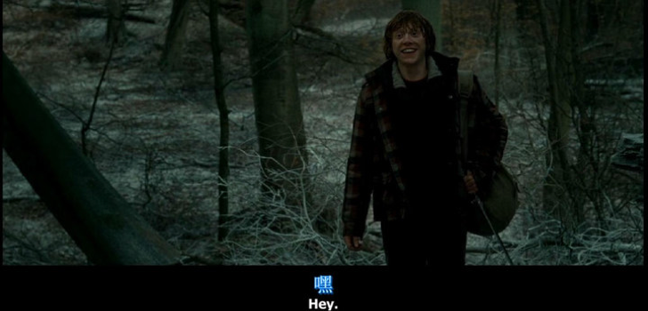

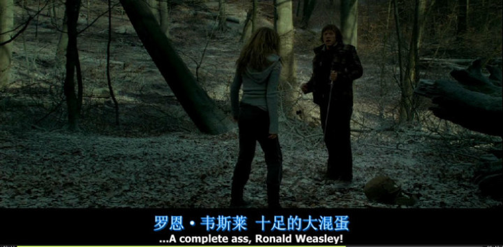

这是哈7中，罗恩和赫敏重逢，罗恩很温柔的打招呼，赫敏又差点把他打了一顿，和野蛮女友剧情差不多，很多中国观众喜欢，突出赫敏“性格独立坚强”，只是在英国观众心目中，这种动辄对丈夫动手的姑娘是不是能嫁给哈利，就不太好说了。

##### 10\.3\.2\. 贝拉的愤怒

上篇研究生育问题，重新定义“男女平等”，中篇把社会分层引进婚姻法，“一夫一妻”成了问题，下篇进行了不到一半，连“三从四德”都回来了。估计已经有朋友坐不住了，我们表示强烈的愤怒！

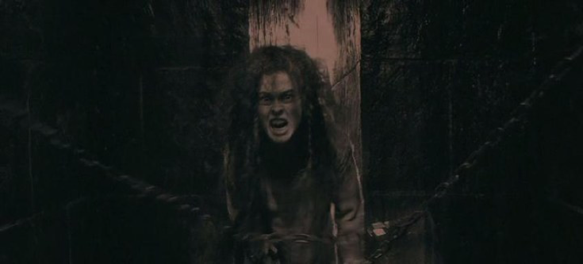

呵呵，学法学的同学一定要冷静，不要轻易愤怒，否则就容易进入食死徒的队伍。在罗琳阿姨的安排下，如果你受不了纳西莎的忍耐，还有另一条出路可供选择：“愤怒的强女”——贝拉。

贝拉是纳西莎的亲姐姐，或者说是纳西莎的参照系。她全名贝拉特里克斯•布莱克•莱斯特兰奇Bellatrix Black Lestrange，也是纯血巫师，布莱克家族成员。片中贝拉是食死徒，属于伏地魔手下的几个忠诚爪牙之一，但中国观众中，喜欢贝拉的可不在少数，有个网友帮我总结了八个字：“华丽冷艳、孤独癫狂”，很是到位。这和马尔福受中国观众喜欢道理差不多：出身高贵的人即使去干坏事，也放不下身段，总有一股“贵族范儿”，和小矮星彼得那样的下三滥不可同日而语。

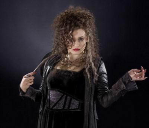

在食死徒里，贝拉也是个很抢眼的角色，她的举动近似于疯狂，偏好使用不可饶恕咒，连自己的堂弟布莱克都死在她手下。最能表现贝拉疯狂性格的，莫过于哈6结尾部分的一段戏：

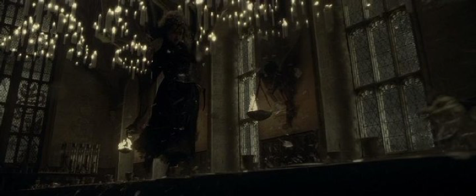

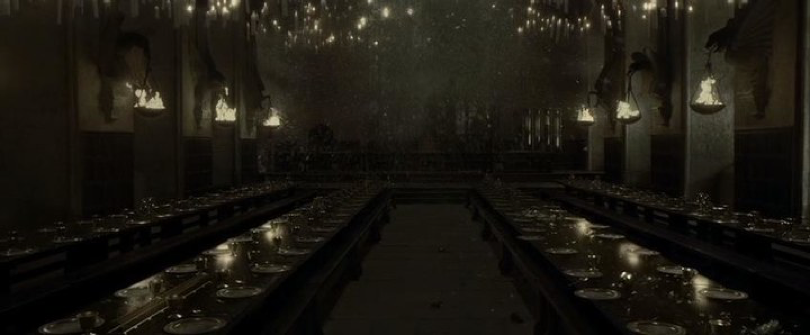

食死徒小队潜入霍格沃茨，杀死邓布利多，在撤退的路上，斯内普领着其他人走通道，只有贝拉一个人跳上桌子，施展魔法大肆破坏，美丽的大厅一地玻璃碎片，连马尔福都为之落泪，出门后又把海格小屋焚之一炬。杀死邓布利多是执行伏地魔的任务，打砸抢烧绝对是贝拉的自选动作，她到底跟谁有这么大的仇呢？

最近这几年，和“某丝”的概念几乎同步，网络上也出现了一个关于女性的词汇——“剩女”，特指一群受过高等教育、有独立的经济来源、男性的追求者也不少，却过了正常婚龄总是无法成婚的女性：

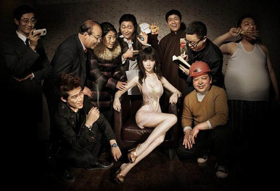

腾讯网静像电影《美丽的梦》之“凤姐猎夫历险记”剧照。

剩女又称“三高女”：高学历、高收入和高个子（泛指相貌出众），如果近距离接触一下，作为三高的原因，她们往往还有个相对不错的家庭背景，和贝拉类似。剩女也经常处于某种莫名的焦虑状态：既然有这么好的条件，为什么总是嫁不出去呢？

说贝拉是剩女有点不严谨，原著中贝拉有丈夫，罗道夫斯•莱斯特兰奇Rodolphus Lestrange，不过贝拉没有和他生孩子，婚姻没有实质意义，原著也没给罗道夫斯安排什么剧情，到电影中更是没有了丝毫痕迹。单看电影，贝拉更像是个未婚姑娘，尤其是心态方面。哈7（上）中，三人组被抓到马尔福庄园，贝拉把哈利和罗恩关进地牢，专门把赫敏挑出来：

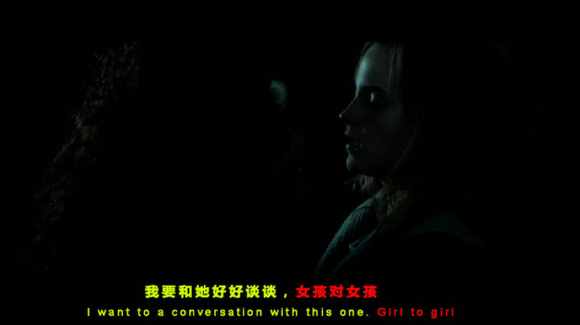

外甥马尔福都20岁了，自己还一心跟着伏地魔满世界疯跑，开口闭口“本姑娘”，确实不像是个已婚女性。

在事业方面，这种强女自强自立，对男性没有依赖，也能创造相当的物质财富，有事业的女性甚至往往显得更年轻一些。看电影的时候我一直以为贝拉是纳西莎的妹妹，曾经发起过一个投票，也证实了这一点。前面提到的《简爱》，更准确的说就是这类强女与弱男巫师的联合作品，简爱的“家庭女教师”身份，也是当时唯一的“女性职业”。下图是四个象限中，各自的婚姻意识形态：

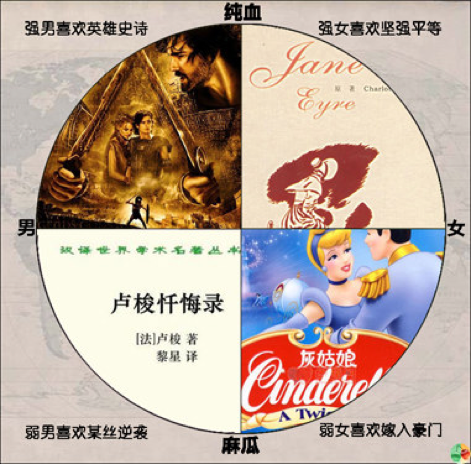

但是在婚姻方面，事情就不一样了。前面分析过，在主要的意义上，婚姻法是男性之间抢女人的战争规则，但在次要的意义上，女性之间也有一场战争，强女和弱女之间也会抢男人。**未婚的贵族男性和女性一样多，赫敏这样的平民优秀分子一定要挤进来，在一夫一妻的规则下，也就意味着贝拉这样的贵族女性，一定有人要被挤出去。**因此电影里贝拉疯狂痛恨麻瓜赫敏，在马尔福庄园里，在赫敏手臂上留下了一道烙痕：

“Mudblood”就是强女对弱女的诅咒。有时候，**女人最大的压力反而来自女人**。

问题是，婚姻意味着性别分工，男性要单方面的向女性转移财产，因此男性之间的竞争，主要体现在掌握的资源上，拥有更多财富的男性有优势，女性相反，主要负责人口再生产，结果就是，强女的财产和教育优势，不一定竞争的过优秀弱女的身体。“三高女”总希望通过事业获得独立的财产来源，好保持家庭内对丈夫的均衡，结果往往会两面为难：

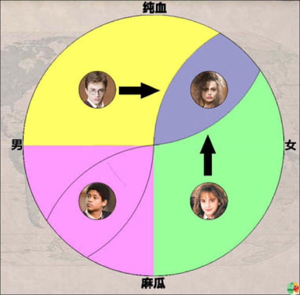

从贝拉的角度来看，比事业，需要和哈利这样完全不需要顾虑家庭的男性竞争，比婚姻，需要和赫敏这样的出身较低的漂亮女孩竞争，她又不愿意向妹妹纳西莎一样，放低身段嫁个丈夫，**非要两面出击，结果就像一个夹子里的核桃，两面受力，却找不到一个支点。**贝拉的一腔怒火，就只好送给霍格沃茨的玻璃天花板了。

前面提到的希拉里阿姨，也是这个处境。

如前所述，两性之间的差别，是由生育造成的财产差别造成的，这也是现代社会女性地位普遍提高的根本原因——发明了家用电器和妇产科学，前者减少了家务劳动的时间，后者降低了婴儿死亡率，从而减少了女性的生育率。凡是没有实现工业化的社会，比如五四运动前后的中国、或者今天的印度、伊斯兰国家，对比同一时期的欧美国家，女性地位总是比较低，这与儒家、印度教或者伊斯兰教这些古老文明没什么关系，而是因为其整体社会生产力较低、生育消耗的资源比重较大所致。相反，完成了工业化的社会，女性的自由度就大得多，现代的单亲妈妈虽然压力较大，至少不会像古代无法生存，**我也见过先天条件特别优秀、生孩子完全不耽误事业的“极强女”，也是什么婚姻规则都无所谓的。**也许在遥远的未来，机器生育技术取得突破后，绝对意义上的男女平等就能实现了。

伴随着急速的现代化，欧美国家也都出现了一次大规模的妇女解放运动，形成了一个受过高等教育、主要靠自己的劳动维生的职业女性群体，希拉里就是她们在政治上代表。希拉里全名希拉里•罗德曼•克林顿Hillary Rodham Clinton，美国人更熟悉她的娘家姓“罗德曼”，因为她婚后长期坚持不改夫姓。她是芝加哥富商家庭的女儿，读常青藤名校，在耶鲁法学院拿的博士学位，常年带着一副黑框眼镜，年纪轻轻就是全国知名的女律师。相反，比尔•克林顿是店员的遗腹子，长期在南方偏远落后的阿肯色大学教书，是典型的弱男配强女。

美国舆论一般认为，家庭方面希拉里不太像个女人，倒像是克林顿的政治盟友，克林顿的第一任期，希拉里就曾经以第一夫人的身份负责医疗改革，是奥巴马医改的先声，只是碰了个大钉子没有成功而已，然后就发生了“莱温斯基案”性丑闻，大多数美国人反而比较同情克林顿。如此忙碌的希拉里当然只有时间生一个女儿，港台地区天才的翻译成“雀儿喜”，和布什家多子多孙的大家庭也是个鲜明的对比。

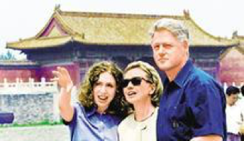

克林顿一家在北京。

希拉里是否符合美国社会的主流女性观，看2008年民主党总统预选就知道了——当华尔街的强男出现危机的时候，还是倾向于动员弱男的力量，让黑白混血的奥巴马上位，而让职业女性希拉里靠边。说实话，在一人一票的美国大选中，希拉里生孩子太少，和那些一窝一窝的“福音派基督徒”布什们比明显吃亏。小布什和克林顿、劳拉和希拉里都基本同岁，劳拉几十年专心相夫教子，布什家族到第五代都几十口人了，孩子们长大就有投票权，哪个妈妈有优势，是道很简单的算术题。家庭问题一直是希拉里的死结，据说这几天希拉里正准备辞去国务卿的职务，总统奥巴马的公开说法，仍然是“她想更多的陪陪家人和孩子”。

回到赫敏，她的家庭，恰恰属于希拉里这个类型的人群，赫敏虽然是麻瓜，但麻瓜世界也有不同的分层。赫敏的父母是做什么的呢？

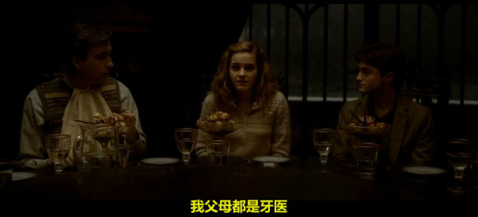

赫敏的妈妈是职业女性，有独立的经济来源，也受过高等教育，剧照中和赫敏的爸爸并排而坐，穿的也是休闲装，不是莫莉的围裙或者纳西莎的裘皮大衣：

罗琳安排她只生了赫敏这一个孩子是符合逻辑的，因为职业女性要忙着工作。这样的知识女性培养出来的孩子，读书确实很好，但是在操持家务方面，就比较成问题了。赫敏连个袜子都缝不好，更不要说像金妮那样给哈利烤蛋糕了。

赫敏和金妮，完全是两种风格的家庭，赫敏家是典型的平民上层/中产阶级，夫妻都工作，子女教育以学业为主，崇尚个人奋斗。金妮家庭则是小贵族，讲究血统、重视家族、妻子以相夫教子为职业，女儿也接受的这种教育。就个人而言，赫敏是女权主义者，金妮是全职主妇，赫敏是民主党/工党，金妮是共和党/保守党，赫敏是希拉里，金妮是劳拉。**赫敏嫁给哈利，纯粹是乱点鸳鸯谱，**相当于希拉里嫁给小布什，扛着几麻袋《哈佛法学评论》当嫁妆进门，芭芭拉老太太第一句话就是“准备要几个孩子”，那就可真的很热闹了。

第10章中对道德的讨论，认为最高的道德是忠诚，或者说是服从和牺牲奉献，其实这种道德品质也细分为不同性别。对男性的而言，忠诚就是哈利的好助手罗恩，牺牲自己，掩护战友前进；对女性的而言，忠诚则是哈利的贤内助的金妮，牺牲事业，奉献家庭，让丈夫在勇斗伏地魔的时候没有后顾之忧。其实，真正出身较高的强女二代，往往从妈妈那里上过“女生课”，懂得这个道理，反而是赫敏这种完全靠个人努力才进入上层的女生，才喜欢把勇敢奋斗的风格带入婚姻关系，从而带来一系列麻烦。

至于罗琳本人或者《哈利波特》中的女性观，在电影中，她给贝拉安排的结局是这样的：

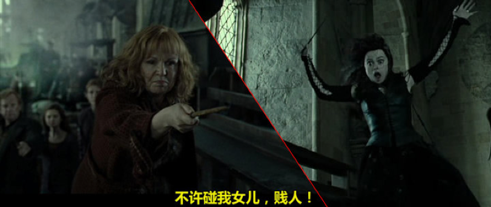

被家庭主妇莫莉杀死，对照有儿有孙的纳西莎，作者的意思很明显，对这种不珍惜家庭的强女，评价并不是很高。

#### 10\.4\. 大结局

有些女生若有所思，有些女生失望之极。

各位同学，这个帖子的基本思路并不复杂，从身体出发，首先研究婚姻关系的物质层面，因为人首先是一种灵长类动物，千百万年进化形成的生物基因，是婚姻制度的最底层。其实我的思路仍然是受康德老先生的启发，各位如果有胆量，自行百度康德对婚姻关系的定义，他要比我彻底的多。

抱歉我撕碎了各位法学同学的教科书，如果不摧毁大家对婚姻制度的幻觉，就无法明白法律条文的真正意义。现在我们可以开始学习《中华人民共和国婚姻法》最前面的条文了：“（我国）实行婚姻自由、一夫一妻、男女平等的婚姻制度”。这个法条确立了我国婚姻法的三项基本原则，依次是本章下中上三部分的内容，帖子里也给出了三个相反的概念：男女有别、轻度多偶、女性对男性的服从。法律禁止的，恰恰是合乎人类生物本性的行为。

**但这并不是婚姻法的结束，只是婚姻法的开始。**

因为我们不仅仅是动物，我们是人类，有高于动物世界的精神属性。如果各位以为我的“女生课”就是教女生如何做物质女、研究怎么嫁入豪门，请直接去看各种八卦相亲节目，我总要提供一点精神的东西。如果我前面的文字，让各位产生一种对婚姻制度的绝望感，就印证了我在很久之前提出的观点——**只有深刻的直面邪恶，才能彻底的理解正义。**

因为希望产生于绝望，就像信仰必须穿越死亡。

我曾经参观过某宗教的晨祈：祈祷开始的时候，太阳尚未升起，那是一天最黑暗的一段时候，经过半个小时的祈祷，一缕阳光透过玻璃，照在每个人的脸上，让人有一种获得新生命的感觉。光明只出现在一个地方：黑暗的尽头。

在本帖的尽头，我准备给各位最后一个论点，把撕碎的教科书重新拼起来。这个论点据说是世界上最大的笑话：

1

2

3

**我相信爱情。**

有人笑吗？

我是认真的，下面这件事也是我的亲身经历：

我曾经对一个女孩说：你是我的初恋女友，现在我没房没车、各种糟糕，虽然我愿意永远做你的家养小精灵，**但我们还是分手吧。**

**女孩十分感动，然后拒绝了我。**

于是我们就结婚了。这是我仅有的一次婚恋经历。

前面说过，学会区分爱情和婚姻，是学习婚姻法的第一关，第一关通过之后，现在我们又要把爱情放回婚姻里面去。在最后的一点点文字里，我还要请一位重量级人物登场，帮忙解释一下“什么是爱情”，这也是我全系列帖子中最大的卧底。

##### 10\.4\.1\. 斯内普的归程

呵呵，事实上我准备了整整一队卧底。根据大部分网友的提名，先由一号卧底上场：

斯内普教授，罗琳的钦定卧底。

从第一集起，斯内普就是个重要角色，每一集里都有他的精彩故事。这位斯莱特林的院长心智沉着、意志过人、说话虽然有些古怪，但往往是暗藏深意，在专业领域，他差不多是霍格沃茨学校里天赋最高的巫师，已经达到能够发明新咒语的水平。

当然，斯内普最让读者感动的，还是对莉莉的一往情深。哈7下中冥想盆中一段回忆，不知赢得了多少眼泪。前几天发起了一次投票，斯内普对莉莉的爱情毫无悬念的摘取了第一名，第二名才是亚瑟和莫莉这对儿夫唱妇随的模范温馨夫妇。

不过各位有没有想过，斯内普最终失去莉莉的原因是什么？他和莉莉青梅竹马，被詹姆斯•波特横刀夺爱，为什么拥有如此强大的魔法力的他，却丝毫没有反抗，而只会哀叹：

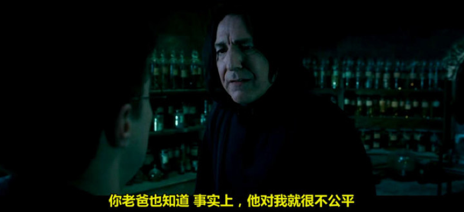

罗琳阿姨其实是有答案的，就写在了第六部的封面：“混血王子”。

斯内普是混血，而詹姆斯•波特是纯血，他也是输在起跑线上。

有人表示严重质疑：哈利也是混血，又是张秋，又是金妮，都是纯血女巫，爱的风风火火。为什么斯内普连个麻瓜莉莉都不敢追？

判断力！

判断力！

判断力！

非常抱歉，同样是混血，斯内普和哈利是不一样的。哈利的父亲是纯血，母亲是麻瓜，用本篇的概念，是强男和弱女的爱情结晶，斯内普则相反，他父亲托比亚•斯内普Tobias Snape，是一名破产的麻瓜，而母亲是艾琳•普林斯EileenPrince，则是一个纯血女巫、萨拉查•斯莱特林的纯正后代，也就是说，斯内普是强女和弱男结合的产物。前面分析过，两大联盟是婚姻法的两个基本阵营，在强男弱女主导的霍格沃茨，斯内普这种弱男强女联盟的后代可谓糟糕至极。

贵族男性的婚姻观念，大体上包括三句话：①以门当户对为主流；②对贵族男性娶平民女性有一定宽容度，包括出轨；③对贵族女性嫁给平民男性持强烈否定态度。亚瑟和莫莉、哈利和金妮的组合是①，詹姆斯和莉莉、罗恩和赫敏的组合是②。斯内普父母的组合不幸的是③。强男对敢和他们抢强女的弱男，一向持有有非常敌视的态度。**强女嫁弱男是一种遭到诅咒的婚姻，别以为强男派巫师就不会使用诅咒。**

为了说明这一点，我可以举个大家熟悉的例子：在古代中国比如清朝，王府四阿哥微服私访，在府外风流一夜，结果大明湖畔的夏雨荷带着孩子找上门来，四阿哥认亲也罢，不认亲也罢，都不是什么了不起的大事，也不会影响他的前程，夏雨荷承受的舆论压力也不大，因为这是强男弱女组合的结果。

问题是，如果四格格也深夜出奔，同样风流一夜，大着肚子回家，这就是王府中非常骇人听闻的丑闻了，要千方百计的遮掩，孩子的父亲敢来王府认亲，绝对是自寻死路。如果堕胎技术不过关，孩子最后生了下来，即使不抛弃，也没有任何社会地位，要隐姓埋名过一辈子，因为他是个不该出生的人。这就是强女弱男组合的下场。

如果大家熟悉印度的话，也可以找到类似的现象。印度传统婚姻法也共有三条：①主流是等级森严的种姓制度，婚姻要门当户对；②允许低种姓女性嫁给高种姓男性，称为“顺婚”，但需要特别丰厚的嫁妆；③严禁低种姓男性和高种姓女性通婚，称为“逆婚”。如果万一发生这种情况，生下来的孩子，就叫做“不可接触者”或者“贱民”，这是比四大种姓还要低贱的出身。贱民是没有姓氏的人，他们必须住在村外，从事最低贱和肮脏的工作，没有任何人和他们通婚，是整个社会的最底层。

《哈利波特》中，斯内普的出身也不是特例，全剧中还有4个逆婚的后代：

第二个卧底：哈利的室友西莫•斐尼甘Seamus Finnigan。

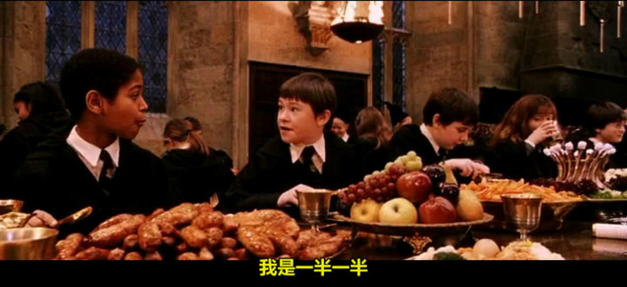

西莫的妈妈是个巫师，爸爸是个麻瓜，不过他爸爸结婚之后才知道这件事，被吓坏了，看来也是属于女追男的婚姻。在哈利的室友里，西莫也是垫底的一个：

魔法不行，从1到6：

哈1。

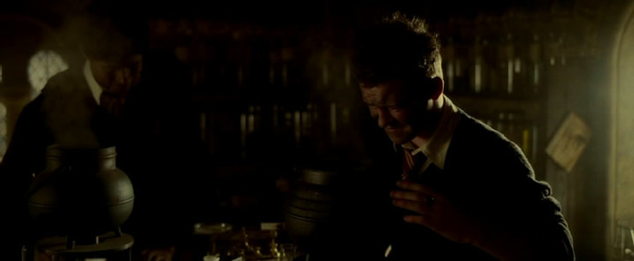

哈6。

人缘不好：

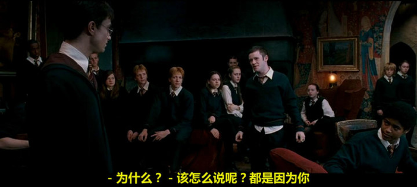

哈5。

全宿舍连“麻瓜”出身的迪安都加入了邓布利多军团，他也被排斥在外，甚至金妮找备胎都不找他，真有点斯内普当年的影子。剧中没有提到西莫的婚姻，估计也好不到那里去。

第三个卧底：凤凰社成员唐克斯。

唐克斯是纯血的安多米达•布莱克和麻瓜泰德•唐克斯的女儿，也是纳西莎、贝拉和小天狼星的外甥女。她同样承受了巨大的压力，从自己的名字开始。剧中，唐克斯从来不喜欢别人称她的名字，非要称姓，比如哈5：

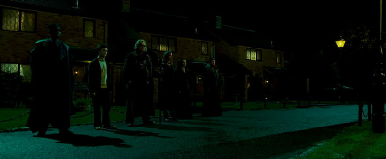

唐克斯全名尼法多拉•唐克斯，Nymphadora Tonks，唐克斯来自她麻瓜父亲的姓氏，但她的名字实在不太好启齿。Nymphadora是新造词，词根Nymph是希腊神话中住在山林水泽的裸体长翅膀的女妖精，派生词大多和色情有关，比如Nymphomaniac，慕男狂/沉迷于性爱如同有瘾的女人；nympha，妇产科使用的生理名词，都会令女孩子感到不堪。有的字幕把Nymphadora翻译成“小仙女”，或者直接音译，都不能表达原文的糟糕含义，其实意译的话，如果把她的姓氏简化为“唐”，倒是可以翻译成“唐姬”，刚才的对话就变成了：

穆迪：别说话，姬。

唐姬：别叫我“姬”。

一个女孩子，天天被人叫做“鸡”，确实挺难堪的。问题是，哪里来的不靠谱父母，这样给小孩起名字呢？

安多米达是布莱克三姐妹中一员。贝拉和纳西莎前面已经分析过，两个都是门当户对的婚姻，只有安多米达下嫁麻瓜，结果被家族除名，连详细资料都没有，布莱克家的家族树上，安多米达的头像只是贝拉旁边的一个黑洞。

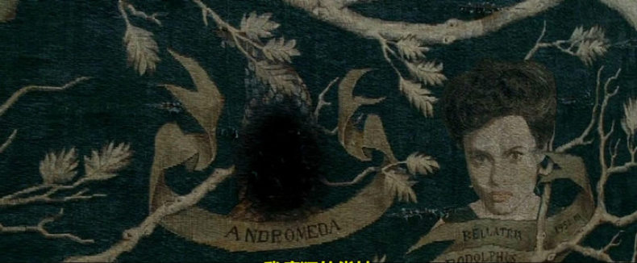

贵族对下嫁的女性，最大的看法是她们“好色”。前面分析过，婚姻意味着男性提供财产，女性提供身体，一般情况下强男有优势，但如果输给弱男，强男的理解就是弱男的身体优势——性功能强大。安多米达婚后的生活不详，她只有唐克斯一个女儿，可能是先怀孕后结婚，此后就再也不愿意给麻瓜丈夫生小孩了，因为没有资源抚养。如果说这是推测，至少从她给女儿起这么个不三不四的名字来看，心中肯定有些懊悔。布莱克三姐妹实际上是一组强女选择路线图，分别意味着三个可能的方向：家庭、权势和性欲，只有选择家庭的最后才有好的结果。

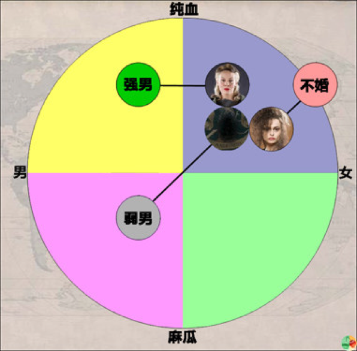

安多米达的选择也影响了唐克斯本人的婚姻。唐克斯的丈夫卢平其实也是半血，只是属于顺婚，但他是“活点四人组”之一，和唐克斯的堂舅小天狼星布莱克是同学，虽然西方人结婚不讲究辈份，但显然比唐克斯的年龄大很多，而且卢平身体有病，月圆之夜会变成狼人，婚姻这种事，身体是不能回避的。唐克斯好好的一个年轻女孩，嫁给了比自己大一倍、患有慢性疾病的中年人，其实也不一定很开心。卢平是意外事故，唐克斯呢？无非是出身不太好、找不到更合适的而已。

第四个卧底：米勒娃•麦格Minerva McGonagall教授。

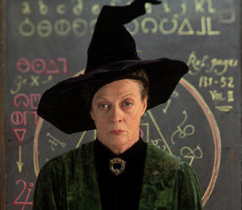

在电影里，麦格教授一直是以公正严格的教务长的形象出现的，没有什么表现她家庭生活的情节，原著中也没有关于她婚恋的记载。在后来发表的Potter more网站中，罗琳阿姨补充了一段麦格的身世，原来麦格也是逆婚的产物，并终身受到这种出身的影响。

根据罗琳的补充，米勒娃•麦格教授是苏格兰人，父亲是麻瓜、苏格兰长老派教会的牧师罗伯特•麦格，母亲是纯血女巫伊莎贝尔•罗斯。伊莎贝尔在隐瞒身份的情况下和罗伯特结婚，直到麦格出生后才坦白。此后，两个人的生活承受了很大压力，“爱情仍在持续，但是信任土崩瓦解”（资料转引自百度百科）。

逆婚霉三代，剩女悔半生。父母失败的婚姻，会对子女产生心理阴影，影响他们日后的婚姻道路。麦格长大后进了霍格沃茨，以优异的成绩毕业，但是婚姻方面一直不顺利。一个年轻的优秀麻瓜——道格拉斯曾经向麦格求婚，麦格感觉自己坠入情网，但几经犹豫，最后还是拒绝了他，因为不愿意重复父母当年的悲剧。麦格后来到霍格沃茨任教，和一位魔法部官员埃尔芬•斯通缔结了门当户对的婚姻，不久斯通因意外事件身亡，没有孩子，麦格从此不再考虑婚姻和家庭问题，而把全部精力放在了教学工作上，就成了大家熟悉的坚毅刚强的麦格教授。说实话，这段补充情节挺写实的，在高校女教师这个人群中，离婚、丁克、终身不嫁等有相当高的比例。

唐克斯和麦格都是女性，只要在婚姻问题上做出牺牲（不婚、下嫁），相对来说，压力还不算大。斯内普作为男性，要追求事业，这使得他面临极大的压力，重压之下性格有些变形，也可以理解。逆婚混血本身是错误选择的结果，唯有加倍正确的选择才能清洗自己，如果斯内普做出了错误的选择，会怎样呢？

我们的终极卧底：汤姆•里德尔——伏地魔。

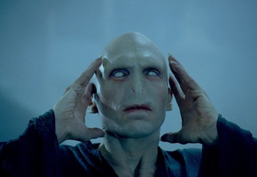

伏地魔的母亲梅洛普•冈特是一位古老的冈特家族的女巫，也是萨拉查•斯莱特林的纯血统后裔，而伏地魔的父亲老汤姆•里德尔，则是一个麻瓜乡绅。梅洛普用迷情剂使老汤姆•里德尔爱上了她，并和他私奔，一年后，梅洛普被老汤姆•里德尔抛弃，生活潦倒，在一家孤儿院门前生下了伏地魔然后死去。伏地魔和斯内普一样也是逆婚的产物，这就是斯内普两次混进食死徒队伍的关键——伏地魔相信他是同类。哈1中，伏地魔和斯内普是在同一个镜头中出场亮相，两人其实只是相差一线而已：

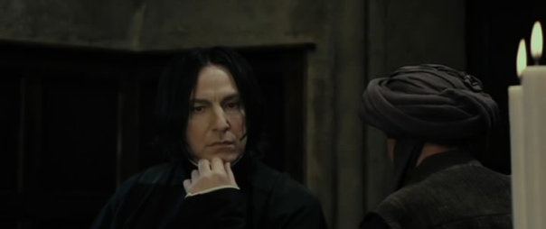

伏地魔同样有天赋和意志，但他更执着与事业的成功，希望获得权势和永生，为此不择手段，最后成为一个完全的恶人。前面说过，在整个霍格沃茨故事里，哈利发现了自己的“善的天赋”，最后经邓布利多点播，成为王者；伏地魔则发现了自己“恶的天赋”，霍格沃茨故事就是他的堕落史。这个“恶的天赋”，就来自于伏地魔邪恶的出身。

下图是全剧中所有混血人物：

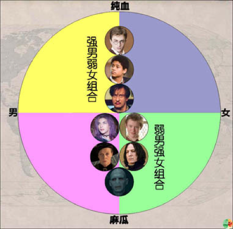

现在大家明白斯内普老师的身份了吗？在霍格沃茨，这种逆婚混血身份甚至比赫敏的纯粹麻瓜血统还要糟糕。斯内普顶着一头罗马王子的黑发，拥有一身高超的魔咒本领，却有一段无法启齿的身世，一个不名誉的麻瓜姓氏，只好偷偷的在课本上使用母亲的姓氏“Half-blood Prince”，这就是斯内普既自卑又狂傲双重性格的根源。

作为一个不该出生的人，除了追随伏地魔搞颠覆整个魔法世界秩序的活动，斯内普该如何才能洗刷自己？

斯内普选择了爱情，或者说，选择了为自己爱的人牺牲。

斯内普的爱情故事大家都很熟悉，但大家不一定知道什么是爱情。

因为漫天飞舞的各种廉价的爱情文字，很多人错误的认为，爱情是快乐、是幸福，事实并非如此。**爱情的本质是一种自我折磨，**或者说，爱情同样是本章中提到的牺牲精神，因为在历史上，爱情就是从弱者的牺牲中发展出来的一种特殊的人类情感。

中国古代是否有“爱情”，是个很难回答的问题，因为中国自秦以后就没有严格的身份制度，缺乏爱情产生的条件，红楼梦通篇写家庭关系，却没有“爱情”这个说法，现代汉语中“爱情”一词是“五四”之后才从西方引进的。**但在欧洲，爱情的起源是明确的：来自于欧洲中世纪骑士对贵妇人的性幻想。**

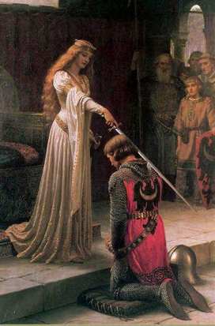

前面说过，“强男”“弱男”只是个分析用的符号，大家不要对号入座，因为强弱是相对的，每个人群都可以继续分下去。比如欧洲中世纪的贵族只是个笼统的称呼，内部也有等级，以英法为例：除了国王之外，有世袭爵位的贵族包括五级：公爵Duke、侯爵Marquis、伯爵Earl、子爵Viscount、男爵Baron，尊称为领主或勋爵Lord，剩下的则是普通骑士，称为sir。领主和骑士之间，也可以构成一组强弱关系。中世纪贵族的内婚制仅仅指不与农奴通婚，但贵族内部却有一定的流动性，领主的儿子以娶骑士的女儿，结果就是，最下层的普通骑士成了找不到妻子的弱男，而领主的女儿们则是不太好嫁的强女。

当时的日耳曼人刚刚脱离原始社会不久，文化非常落后，国王和公爵也只是些目不识丁的武夫，以四处征战抢劫为职业。抢来的财物交给夫人保管，这些居住在城堡里的女性勉强还算有点“文化”。出征在外的普通骑士，就把自己对贵妇人的爱慕之情，当作战场上的精神支撑，进而发展出一种对女性的特殊崇拜。骑士们在想象中极力提升女性的精神性，而淡化其身体和肉欲的一面，赋予贵妇人圣洁、优雅、慈爱、善良、诚实等各种高尚的品质，简单的说，就是把女性当作女神——这个词已经被某丝文学污染的失去了原有的含义，这也是我为什么不喜欢某丝文学的原因：某丝缺乏对女性的尊重，因此也不可能相信爱情。

同理，忍受寂寞的领主妻子们，也在各种社交场合中，极力表现出骑士们所希望高贵优雅，和骑士们的幻想遥相呼应。原始野蛮的日耳曼文化，就这样被一点点改造成高雅的贵族风范，这也是大多数现代欧洲文化和礼仪的起源。比如骑士对贵夫人的基本礼节——吻手礼，今天在欧美上层社交场合还能遇到：

萨克奇对劳拉•布什。

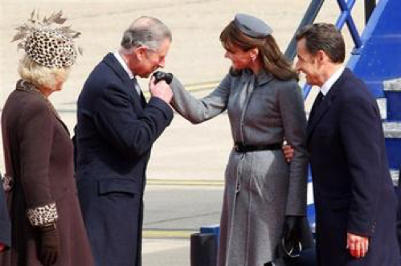

查尔斯王子对布吕尼•萨克奇。

行礼者是男士，受礼者是已婚女士，男士首先垂首立正致意，然后以右手或双手捧起女士的右手，俯首轻吻其指背，不得接触手腕及以上的的部分。**吻手礼的要点在于“女尊男卑”**，其原始意思就是弱男向强女表示“爱情”。与之同出一源的，还有西方式的求婚仪式。

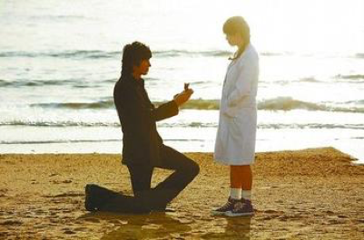

这也是西方特有的、深入到社会生活每个细节的“女士优先”lady first文化的起源。比如著名的泰坦尼克号沉船事件中，男人们坚持让女性先上救生艇，结果罗斯们的生还率高达69%，而杰克的生还率仅有17%。顺便说一句，也有人提出，“女士优先”规则仅对头等舱的女士有效，全船总的来说还是按照舱室等级分配获救率，头等舱为60%，而三等舱仅为26%，头等舱的男乘客比三等舱的妇女儿童获救率还高。这是实情，但怎么理解就是各人的事了。lady这个词的本意就是女领主（lord的阴性），骑士们从一开始就没有考虑过平民女儿的优先权问题。

仅靠礼仪是远远不够的，为了赢得贵妇人的青睐，骑士阶层还要外出冒险，好给lady带回丰富的战利品。早期的骑士勇斗恶龙、挑战巨人，留下各种传奇的文字，中期以后，冒险范围扩展到海外，出现了影响世界历史发展的十字军东征和大航海运动。实际上，十字军运动的参加者，绝大多数都死在途中或者圣地，真正衣锦还乡获得贵妇人的芳心的，百中无一。浩浩荡荡的麦哲伦环球航行船队，也只有18个水手和一条破船回到欧洲海岸（麦哲伦本人死在菲律宾）。前面分析过，强女弱男的婚姻是遭到诅咒的，最终圆满的可能性很小，遥远异域冒险成功的几率与之大体相当。

但是人类的精神领域就是这样奇怪：越是不可能的，越是值得信仰的，**信仰就是逆天，“知其不可而为之”，爱情也是如此。**面临艰巨的挑战，才更要坚持到底，以能证明自己的选择是正确的。因此，一代又一代骑士前赴后继，视死如归，为了爱情，向着那些毫无希望的任务发起冲击。

然后上帝被感动了！

僻处欧亚大陆西北一角的西欧文明成功了，他们发现了新大陆，开辟了新航线，从各种古老文明中脱颖而出，开创了人类历史的新篇章，也把欧洲式的一夫一妻制婚姻规则，传遍了全世界。后面的故事，大家都知道了。

各位朋友，天赋无法改变，意志永远自由，性别在受孕瞬间就确定了，但强弱却可以由你自行选择。如果你喜欢过平稳安静的日子，还是建议你考虑门当户对的婚姻，一个人出生、成长和死亡在同一个城市，所有的亲人朋友都在身边，是世界上最幸福的生活。

如果你想通过婚姻过得更惬意一点，男性可以考虑起点低一点的女性，在家里享受国王般的待遇，条件是挣到足够妻子和孩子花的钱；女性可以考虑放低姿态嫁入豪门，直接给自己和孩子一个优越的物质基础，条件是要在家里给丈夫国王般的待遇。

如果希望通过婚姻挑战自己的极限，男生要离开家庭、去探险、去漂流，靠自己的努力赢得高阶女性的注目，女生要有深入的洞察力，在低阶男生中选择潜力股，用自己的资源和爱心帮他事业起步、淘到人生的第一桶金。这种选择男生十九被拒，女生十九遇到凤凰男，此时就一定要相信爱情，越是他或者她毁的你遍体鳞伤，越要坚定的相信只是自己的付出还不够，要以斯内普老师为榜样，继续为他或她作出牺牲，如此坚持到黑暗的尽头，你就可以得到一个完全的奇迹。

演员表——哈利波特中主要人物血统的全图：

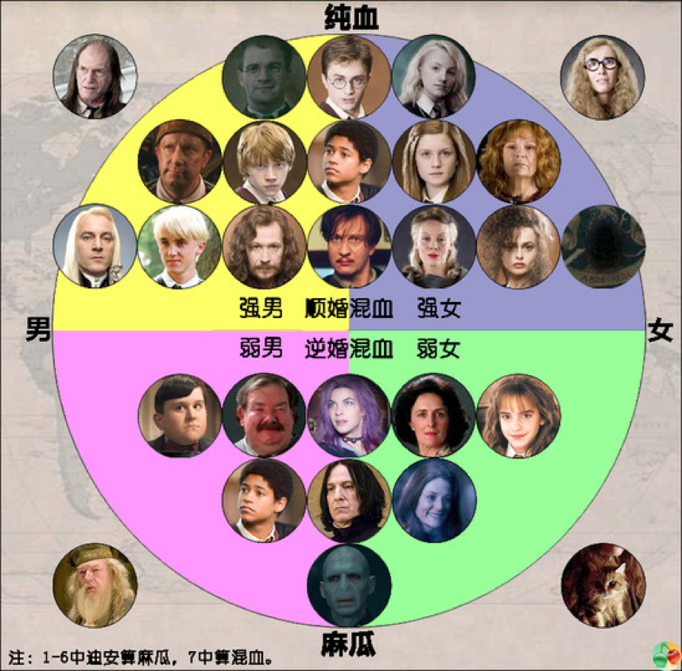

呵呵，还有一点点。

##### 10\.4\.2\. 赫敏的选择

其实本帖已经写完了，在大情圣斯内普的光环下，大家可能也都把赫敏给忘了。不过这个可爱的小女生当了我帖子的靶子这么久，我已经答应给她安排个好点的归宿，再稍微多说几句。和逆天的斯内普比，赫敏的爱情戏并不复杂，但也还有几种可能的选择。

本帖讨论赫敏，凡是关于身体的问题，比如头发、魁地奇和独生子女，争论不大，因为证据比较清楚，一旦涉及精神问题，总有些偏爱赫敏的朋友觉得不能接受。尤其是赫敏的选择，很多人觉得我很不公平——赫敏不来霍格沃茨，不会遇到哈利，来了霍格沃茨，左一个道德性，右一个道德性，非要被金妮比下去为止，你直说歧视赫敏的出身不就完了吗？

很抱歉，选择必须以出身为基础，再伟大的精神力量，没有身体，也无法落到实处。本宅男也很想操心打大前锋或者中后卫哪个更好，可惜没有姚明的身段，因此也只是在拔河和自行车慢骑中挑一个罢了。

但是说赫敏完全受制于出身、没有选择的余地，也是不正确的。这方面大家要有想象力——选择论花样繁多，我只敢写一小半，大部分都还没开头呢。比如说：

她可以选择做哈利的情人，怀上哈利的孩子，除了没有名分，也和婚姻没什么区别，这样选择的，就是大观园里的袭人。

她可以选择给自己使用“万事皆空”魔法，从此忘掉哈利，找个男牙医嫁了，两个人快快乐乐的在麻瓜世界生活，这样选择的，就是银镯女子小清新。

她可以选择一辈子留在霍格沃茨，精研法术、终生不嫁、以事业为婚姻。这样选择的，就是麦格教授和我们敬爱的吴仪副总理。

她可以选择回到麻瓜世界，找个同样麻瓜血统的巫师结婚，然后一起使用摄魂术，让麻瓜们相信麻瓜和巫师一样伟大。这样选择的，就是波伏娃，她的丈夫，就是萨特。

她可以选择嫁给伏地魔，然后发动麻瓜千百万，进军霍格沃茨，打倒邓布利多，让哈利波特天天写检讨学习伏地魔讲话。这样选择的，就是希特勒的情妇瑞娃•布鲁恩女士。

赫敏的选择多的很，干嘛非要在哈利这一棵树上吊死！

嘿嘿，各位还是不满意，什么乱七八糟的，还不如嫁给罗恩呢！宅老师有点正经没有？

好吧，还有一个，赫敏可以选择她：

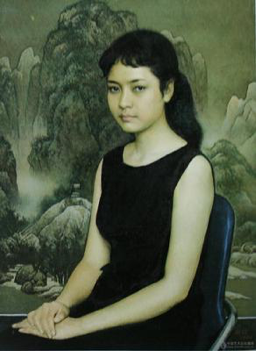

这张《青年女歌手》的油画，是中央美术学院的院长靳尚谊的成名作，被选进了我的初中美术课本，至今记忆犹新。青年女歌手出生在平民家庭，二十几岁就在事业上取得了巨大的成功，专业领域全国数一数二，连客串个模特都能进入中国美术史，婚姻就更不用说了，丈夫贵不可言，首贴结尾处就已经出场了。谁说女性不能兼顾事业和家庭呢？

关键是，能做到这一点，也不完全是靠她个人的努力。制度问题，制度问题啊！希拉里生在万恶的美帝，而我们是社会主义和谐社会，新道德、新风尚，从来不讲究神马腐朽的门第观念，青年女歌手结婚成家的年代，差不多是中国历史上最相信爱情的年代了。**所以说，赫敏还是找个社会主义国家的优秀青年嫁了吧，电影里也早有暗示：**

**欢迎赫敏来中国啊。**

翟按：某位网友留言：“原来是个炫耀贴，自己运气好还是低调点嘛，承认下自己就是运气好而已有那么难么。前面论点不计但论证很赞，结尾了却非要上升到个精神境界决定个人命运的高度，还把自己放到伟光正面来显摆，至于么……”按照这位网友的要求，大结局中没有再写任何关于我本人的文字，我其实只是想试试“十动然拒”造句而已，不想伤害任何人。**这件事我最后再卖萌一次：**提醒各位，该表白属于法师的专业技巧，非魔法人士请勿模仿，否则后果自负。因为本宅当时也和赫敏一样，还偷偷的念了一点混淆咒——到底“永远做家养小精灵”是什么意思，表白中也只有一半真相。

翟又按：关于同性恋问题，本章中擦边写了一点试水，留言也如我所料，一句话的原文，一火车的回复。我对这个问题有自己的看法，但无意说服任何人。